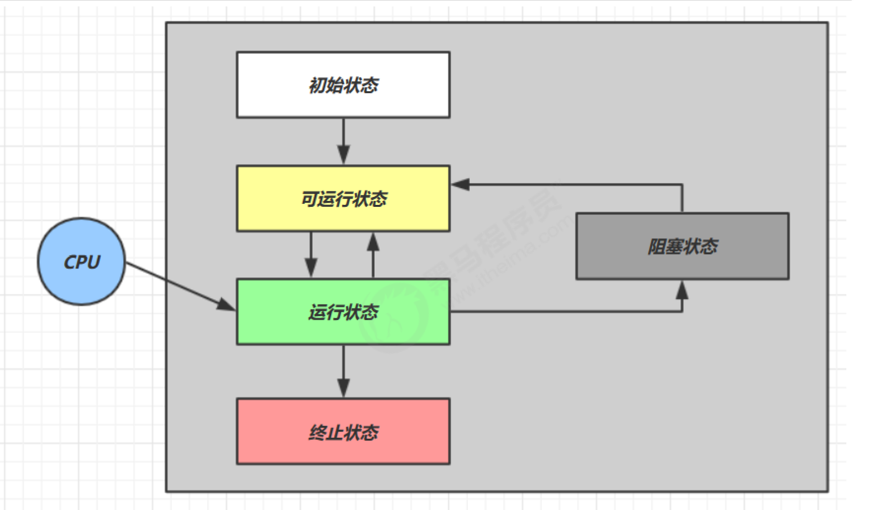
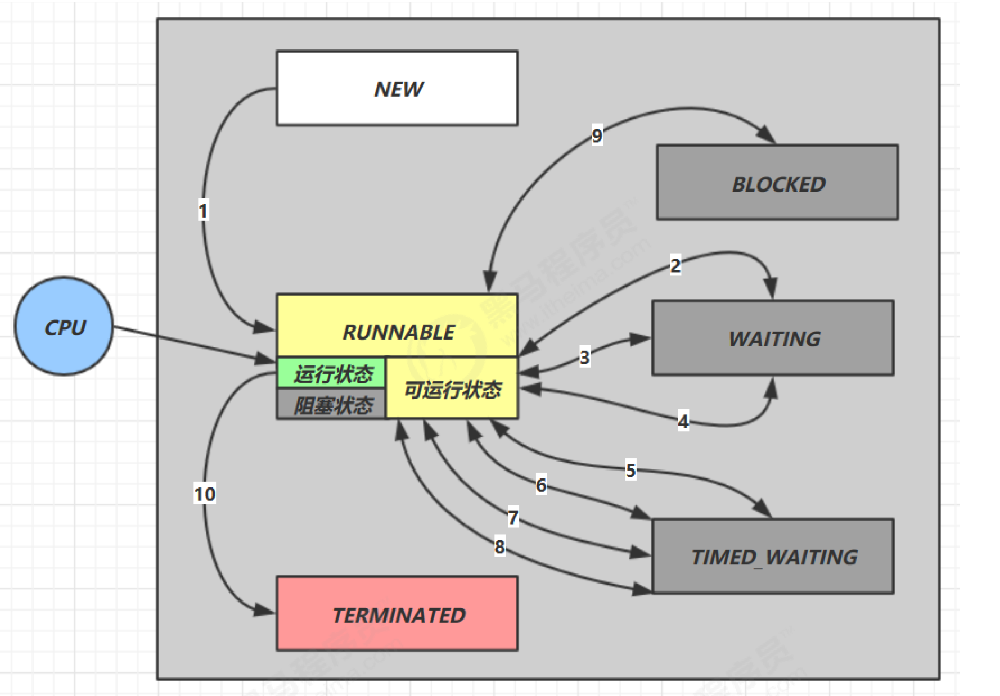

# 1. 线程基础

## 1.1 线程与进程

### 1.1.1 进程

1. 程序由指令和数据组成，但这些指令要运行，数据要读写，就必须将指令加载至 CPU，数据加载至内存。在
   指令运行过程中还需要用到磁盘、网络等设备。进程就是用来加载指令、管理内存、管理 IO 的
2. 当一个程序被运行，从磁盘加载这个程序的代码至内存，这时就开启了一个进程
3. 进程就可以视为程序的一个实例。大部分程序可以同时运行多个实例进程（例如记事本、画图、浏览器
   等），也有的程序只能启动一个实例进程（例如网易云音乐、360 安全卫士等）

### 1.1.2 线程

1. 一个进程之内可以分为一到多个线程
2. 一个线程就是一个指令流，将指令流中的一条条指令以一定的顺序交给 CPU 执行
3. Java 中，线程作为最小调度单位，进程作为资源分配的最小单位。 在 windows 中进程是不活动的，只是作
   为线程的容器

### 1.1.3 区别

1. 进程基本上相互独立的，而线程存在于进程内，是进程的一个子集

2. 进程拥有共享的资源，如内存空间等，供其内部的线程共享

3. 进程间通信较为复杂

   * 同一台计算机的进程通信称为 IPC（Inter-process communication）

   * 不同计算机之间的进程通信，需要通过网络，并遵守共同的协议，例如 HTTP

4. 线程通信相对简单，因为它们共享进程内的内存，典型例子就是多个线程可以访问同一个共享变量

5. 线程更轻量，线程上下文切换成本一般上要比进程上下文切换低

## 1.2 并行与并发

单核CPU下，线程实际还是串行执行的。操作系统中有一个组件叫做**任务调度器**，将CPU的时间片（windows
下时间片最小约为 15 毫秒）分给不同的程序使用，只是由于CPU在线程间（时间片很短）的切换非常快，人类感
觉是同时运行的 。总结为一句话就是： **微观串行，宏观并行**

**一般会将这种线程轮流使用CPU的做法称为并发， concurrent**

多核CPU下，每个核（core）都可以调度运行线程，这时候线程可以是并行的

1. 并发（concurrent）是同一时间应对（dealing with）多件事情的能力
2. 并行（parallel）是同一时间动手做（doing）多件事情的能力

## 1.3 典型应用

### 1.3.1 异步调用

以调用方角度来讲，如果

1. 需要等待结果返回，才能继续运行就是**同步**
2. 不需要等待结果返回，就能继续运行就是**异步**

* 多线程可以让方法执行变为异步的（即不要巴巴干等着）比如说读取磁盘文件时，假设读取操作花费了 5 秒钟，如
  果没有线程调度机制，这 5 秒 CPU什么都做不了，其它代码都得暂停...
* tomcat 的异步 servlet 也是类似的目的，让用户线程处理耗时较长的操作，避免阻塞 tomcat 的工作线程

### 1.3.2 提高效率

**需要在多核CPU才能提高效率，单核仍然时是轮流执行**

# 2. Java线程

## 2.1 创建和运行线程

1. 直接使用Thread

   ```java
   // 创建线程对象
   Thread t = new Thread() {
       @Override
   	public void run() {
   		// 要执行的任务
   	}
   };
   // 启动线程
   t.start();
   ```

   ```java
   // 构造方法的参数是给线程指定名字，推荐
   Thread t1 = new Thread("t1") {
   	@Override
   	// run 方法内实现了要执行的任务
   	public void run() {
   		log.debug("hello");
   	}
   };
   t1.start();
   ```

2. 使用Runnable，配合Thread

   **把线程和任务分开**

   1. Thread表示线程
   2. Runnable表示要运行的任务

   ```java
   Runnable runnable = new Runnable() {
       @Override
   	public void run(){
   		// 要执行的任务
   	}
   };
   // 创建线程对象
   Thread t = new Thread( runnable );
   // 启动线程
   t.start();
   
   //下面是例子
   // 创建任务对象
   Runnable task2 = new Runnable() {
   	@Override
   	public void run() {
   		log.debug("hello");
   	}
   };
   // 参数1 是任务对象; 参数2 是线程名字，推荐
   Thread t2 = new Thread(task2, "t2");
   t2.start();
   
   //Java 8 以后可以使用 lambda 精简代码
   // 创建任务对象
   Runnable task2 = () -> log.debug("hello");
   // 参数1 是任务对象; 参数2 是线程名字，推荐
   Thread t2 = new Thread(task2, "t2");
   t2.start();
   ```

   * Thread和Runnable关系
     * 分析Thread源码即可发现与Runnable的联系和区别
     * 用 Runnable 更容易与线程池等高级 API 配合
     * 用 Runnable 让任务类脱离了 Thread 继承体系，更灵活

3. FutureTask配合Thread

   FutureTask 能够接收 Callable 类型的参数，用来处理有返回结果的情况

   ```java
   // 创建任务对象
   FutureTask<Integer> task3 = new FutureTask<>(() -> {
   	log.debug("hello");
   	return 100;
   });
   // 参数1 是任务对象; 参数2 是线程名字，推荐
   new Thread(task3, "t3").start();
   // 主线程阻塞，同步等待 task 执行完毕的结果
   Integer result = task3.get();
   log.debug("结果是:{}", result);
   ```

## 2.2 查看进程和线程的方法

1. Windows
   * 任务管理器可以查看进程和线程数，也可以用来杀死进程
   * tasklist查看进程
   * taskkill杀死进程
2. Linux
   * ps -ef 或 ps -aux 查看所有进程
   * ps -ef -p <PID> 查看某个进程（PID）的所有线程
   * kill 杀死进程
   * top 按大写 H 切换是否显示线程
   * top -H -p <PID> 查看某个进程（PID）的所有线程

3. Java

   * jps 查看所有Java进程

   * jstack <PID> 查看某个 Java 进程（PID）的所有线程状态

   * jconsole 来查看某个 Java 进程中线程的运行情况（图形界面）

     ```
     jconsole 远程监控配置
     1. 需要以如下的方式启动java程序
     java -Djava.rmi.server.hostname=`ip地址` 
     -Dcom.sun.management.jmxremote 
     -Dcom.sun.management.jmxremote.port=`连接端口` 
     -Dcom.sun.management.jmxremote.ssl=是否安全连接 
     -Dcom.sun.management.jmxremote.authenticate=是否认证 java类名
     
     2. 修改ip映射文件
     修改 /etc/hosts 文件将 127.0.0.1 映射至主机名
     
     3. 如果要认证访问，还需要做如下步骤
     复制 jmxremote.password 文件
     修改 jmxremote.password 和 jmxremote.access 文件的权限为 600 即文件所有者可读写
     连接时填入 controlRole（用户名），R&D（密码）
     ```

## 2.3 线程运行的原理

### 2.3.1 栈与栈帧

Java Virtual Machine Stacks （Java 虚拟机栈），栈内存是给谁用的呢？其实就是线程，每个线程启动后，虚拟
机就会为其分配一块栈内存。

* 每个栈由多个栈帧（Frame）组成，对应着每次方法调用时所占用的内存
* 每个线程只能有一个活动栈帧，对应着当前正在执行的那个方法

### 2.3.2 线程上下文切换

线程上下文切换（Thread Context Switch）就是因为以下一些原因导致 cpu 不再执行当前的线程，转而执行另一个线程的代码

**Java中造成线程切换的主要原因**：

1. 线程的 cpu 时间片用完
2. 垃圾回收
3. 有更高优先级的线程需要运行
4. 线程自己调用了 sleep、yield、wait、join、park、synchronized、lock 等方法

**当 Thread Context Switch 发生时，需要由操作系统保存当前线程的状态，并恢复另一个线程的状态，Java 中对应的概念**
**就是程序计数器（Program Counter Register），它的作用是记住下一条 jvm 指令的执行地址，是线程私有的**

* 状态包括程序计数器、虚拟机栈中每个栈帧的信息，如局部变量、操作数栈、返回地址等
* Context Switch 频繁发生会影响性能

## 2.4 Java线程常用方法

|      方法名      | static |                      功能                       |                             注意                             |
| :--------------: | :----: | :---------------------------------------------: | :----------------------------------------------------------: |
|     start()      |   F    | 启动一个新线程，在新的线程运行 run 方法中的代码 | start 方法只是让线程进入就绪，里面代码不一定立刻运行（CPU 的时间片还没分给它）。每个线程对象的start方法只能调用一次，如果调用了多次会出现IllegalThreadStateException |
|      run()       |   F    |            新线程启动后会调用的方法             | 如果在构造 Thread 对象时传递了 Runnable 参数，则线程启动后会调用 Runnable 中的 run 方法，否则默认不执行任何操作。但可以创建 Thread 的子类对象，来覆盖默认行为 |
|      join()      |   F    |                等待线程运行结束                 |                                                              |
|   join(long n)   |   F    |         等待线程运行结束,最多等待 n毫秒         |                                                              |
|     getId()      |   F    |               获取线程长整型的 id               |                           id 唯一                            |
|    getName()     |   F    |                   获取线程名                    |                                                              |
| setName(String)  |   F    |                   修改线程名                    |                                                              |
|  getPriority()   |        |                 获取线程优先级                  |                                                              |
| setPriority(int) |   F    |                 修改线程优先级                  | java中规定线程优先级是1~10 的整数，较大的优先级能提高该线程被 CPU 调度的机率 |
|    getState()    |   F    |                  获取线程状态                   | Java 中线程状态是用 6 个 enum 表示，分别为：NEW, RUNNABLE, BLOCKED, WAITING,TIMED_WAITING, TERMINATED |
| isInterrupted()  |   F    |                 判断是否被打断                  |                     **不会清除打断标记**                     |
|    isAlive()     |   F    |         线程是否存活（还没有运行完毕）          |                                                              |
|   interrupt()    |   F    |                    打断线程                     | 如果被打断线程正在 sleep，wait，join 会导致被打断的线程抛出 InterruptedException，并清除打断标记；如果打断正在运行的线程，则会设置打断标记；park 的线程被打断，也会设置打断标记 |
|  interrupted()   |   T    |             判断当前线程是否被打断              |                        会清除打断标记                        |
| currentThread()  |   T    |             获取当前正在执行的线程              |                                                              |
|  sleep(long n)   |   T    |            让当前执行的线程休眠n毫秒            |               休眠时让出 cpu的时间片给其它线程               |
|     yield()      |   T    |      提示线程调度器让出当前线程对CPU的使用      |                     主要是为了测试和调试                     |

### 2.4.1 start与run的区别

1. 调用run

   ```java
   public static void main(String[] args) {
       Thread t1 = new Thread("t1") {
           @Override
           public void run() {
               log.debug(Thread.currentThread().getName());
               FileReader.read(Constants.MP4_FULL_PATH);
           }
       };
       t1.run();
       log.debug("do other things ...");
   }
   ```

   **程序仍在 main 线程运行， FileReader.read() 方法调用还是同步的**

2. 调用start

   ```java
   public static void main(String[] args) {
       Thread t1 = new Thread("t1") {
           @Override
           public void run() {
               log.debug(Thread.currentThread().getName());
               FileReader.read(Constants.MP4_FULL_PATH);
           }
       };
       t1.start();
       log.debug("do other things ...");
   }
   ```

   **程序在 t1 线程运行， FileReader.read() 方法调用是异步的**

3. 总结

   * 直接调用 run 是在主线程中执行了 run，没有启动新的线程
   * 使用 start 是启动新的线程，通过新的线程间接执行 run 中的代码

### 2.4.2 sleep与yield

**sleep**

1. 调用 sleep 会让当前线程从 Running 进入 Timed Waiting 状态（阻塞）
2. 其它线程可以使用 interrupt 方法打断正在睡眠的线程，这时 sleep 方法会抛出 InterruptedException
3. 睡眠结束后的线程未必会立刻得到执行
4. 建议用 TimeUnit 的 sleep 代替 Thread 的 sleep 来获得更好的可读性

**yield**

1. 调用 yield 会让当前线程从 Running 进入 Runnable 就绪状态，然后调度执行其它线程
2. 具体的实现依赖于操作系统的任务调度器

**线程优先级**

1. 线程优先级会提示（hint）调度器优先调度该线程，但**它仅仅是一个提示，调度器可以忽略它**
2. 如果 cpu 比较忙，那么优先级高的线程会获得更多的时间片，但 cpu 闲时，优先级几乎没作用

```java
Runnable task1 = () -> {
    int count = 0;
    for (;;) {
    	System.out.println("---->1 " + count++);
    }
};
Runnable task2 = () -> {
    int count = 0;
    for (;;) {
        // Thread.yield();
        System.out.println(" ---->2 " + count++);
	}
};
Thread t1 = new Thread(task1, "t1");
Thread t2 = new Thread(task2, "t2");
// t1.setPriority(Thread.MIN_PRIORITY);
// t2.setPriority(Thread.MAX_PRIORITY);
t1.start();
t2.start();
```

### 2.4.3 join方法

下面的方法会打印什么

```java
static int r = 0;
public static void main(String[] args) throws InterruptedException {
	test1();
}
private static void test1() throws InterruptedException {
    log.debug("开始");
    Thread t1 = new Thread(() -> {
        log.debug("开始");
        sleep(1);
        log.debug("结束");
        r = 10;
    });
    t1.start();
    log.debug("结果为:{}", r);
    log.debug("结束");
}
```

* 因为主线程和线程 t1 是并行执行的，t1 线程需要 1 秒之后才能算出 r=10
* 而主线程一开始就要打印 r 的结果，所以只能打印出 r=0

**解决办法：**

1. 用 join，加在 t1.start() 之后即可
2. 使用sleep()行吗，为什么

#### 2.4.3.1 等待多个结果

下面代码 cost 大约多少秒

```java
static int r1 = 0;
static int r2 = 0;
public static void main(String[] args) throws InterruptedException {
	test2();
}
private static void test2() throws InterruptedException {
    Thread t1 = new Thread(() -> {
        sleep(1);
        r1 = 10;
    });
    Thread t2 = new Thread(() -> {
        sleep(2);
        r2 = 20;
    });
    long start = System.currentTimeMillis();
    t1.start();
    t2.start();
    t1.join();
    t2.join();
    long end = System.currentTimeMillis();
    log.debug("r1: {} r2: {} cost: {}", r1, r2, end - start);
}
```

1. 第一个 join：等待 t1 时, t2 并没有停止, 而在运行
2. 第二个 join：1s 后, 执行到此, t2 也运行了 1s, 因此也只需再等待 1s

**如果调换t1.join()和t2.join()位置，又是什么结果呢**

1. 如果先执行t1.join()，那么t2.join()会等待一秒
2. 如果先执行t2.join()，那么t1.join()无需等待

#### 2.4.3.2 有时效的join

```java
// 等够时间
static int r1 = 0;
static int r2 = 0;
public static void main(String[] args) throws InterruptedException {
    test3();
}
public static void test3() throws InterruptedException {
    Thread t1 = new Thread(() -> {
        sleep(1);
        r1 = 10;
    });
    long start = System.currentTimeMillis();
    t1.start();
    // 线程执行结束会导致 join 结束
    t1.join(1500);
    long end = System.currentTimeMillis();
    log.debug("r1: {} r2: {} cost: {}", r1, r2, end - start);
}

//没等够时间
static int r1 = 0;
static int r2 = 0;
public static void main(String[] args) throws InterruptedException {
	test3();
}
public static void test3() throws InterruptedException {
    Thread t1 = new Thread(() -> {
        sleep(2);
        r1 = 10;
    });
    long start = System.currentTimeMillis();
    t1.start();
    // join结束导致线程执行结束
    t1.join(1500);
    long end = System.currentTimeMillis();
    log.debug("r1: {} r2: {} cost: {}", r1, r2, end - start);
}
```

### 2.4.4 interrupt 方法

**可以使用 Thread.interrupted() 清除打断状态**

#### 2.4.4.1 打断 sleep，wait，join 的线程

这几个方法都会让线程进入阻塞状态

打断sleep，wait，join 的线程, **会清空打断状态**，以 sleep 为例

```java
private static void test1() throws InterruptedException {
    Thread t1 = new Thread(()->{
    	sleep(1);
    }, "t1");
    t1.start();
    sleep(0.5);
    t1.interrupt();
    log.debug(" 打断状态: {}", t1.isInterrupted());
}
```

#### 2.4.4.2 打断正常运行的线程

打断正常运行的线程, **不会清空打断状态**

```java
private static void test2() throws InterruptedException {
    Thread t2 = new Thread(()->{
        while(true) {
            Thread current = Thread.currentThread();
            boolean interrupted = current.isInterrupted();
            if(interrupted) {
                log.debug(" 打断状态: {}", interrupted);
                break;
            }
        }
    }, "t2");
    t2.start();
    sleep(0.5);
    t2.interrupt();
}
```

#### 2.4.4.3 打断park线程

打断 park 线程, **不会清空打断状态**

```java
private static void test3() throws InterruptedException {
    Thread t1 = new Thread(() -> {
        log.debug("park...");
        LockSupport.park();
        log.debug("unpark...");
        log.debug("打断状态：{}", Thread.currentThread().isInterrupted());
    }, "t1");
    t1.start();
    sleep(0.5);
    t1.interrupt();
}
```

如果打断标记已经是 true, 则 park 会失效

```java
private static void test4() {
    Thread t1 = new Thread(() -> {
        for (int i = 0; i < 5; i++) {
            log.debug("park...");
            LockSupport.park();
            log.debug("打断状态：{}", Thread.currentThread().isInterrupted());
        }
    });
    t1.start();
    sleep(1);
    t1.interrupt();
}
```

### 2.4.5 不推荐的方法

这些方法已过时，容易**破坏同步代码块，造成线程死锁**

|  方法名   | static |         功能         |
| :-------: | :----: | :------------------: |
|   stop    |   F    |     停止线程运行     |
| suspend() |   F    | 挂起（暂停）线程运行 |
| resume()  |   F    |     恢复线程运行     |

## 2.5 同步和异步

从调用角度来讲

1. 需要等待结果返回，才能继续运行就是同步
2. 不需要等待结果返回，就能继续运行就是异步

## 2.6 主线程与守护线程

默认情况下，**Java 进程需要等待所有线程都运行结束，才会结束**。有一种特殊的线程叫做守护线程，只要其它非守
护线程运行结束了，即使守护线程的代码没有执行完，也会强制结束。

```java
log.debug("开始运行...");
Thread t1 = new Thread(() -> {
    log.debug("开始运行...");
    sleep(2);
    log.debug("运行结束...");
}, "daemon");
// 设置该线程为守护线程
t1.setDaemon(true);
t1.start();
sleep(1);
log.debug("运行结束...");
```

1. 垃圾回收器线程就是一种守护线程
2. Tomcat 中的 Acceptor 和 Poller 线程都是守护线程，所以 Tomcat 接收到 shutdown 命令后，不会等
   待它们处理完当前请求

## 2.7 线程五种状态和六种状态

### 2.7.1 五种状态

**这是从操作系统层面来描述的**



* 【初始状态】仅是在语言层面创建了线程对象，还未与操作系统线程关联
* 【可运行状态】（就绪状态）指该线程已经被创建（与操作系统线程关联），可以由 CPU 调度执行
* 【运行状态】指获取了 CPU 时间片运行中的状态
  * 当 CPU 时间片用完，会从【运行状态】转换至【可运行状态】，会导致线程的上下文切换
* 【阻塞状态】
  * 如果调用了阻塞 API，如 BIO 读写文件，这时该线程实际不会用到 CPU，会导致线程上下文切换，进入
    【阻塞状态】
  * 等 BIO 操作完毕，会由操作系统唤醒阻塞的线程，转换至【可运行状态】
  * 与【可运行状态】的区别是，对【阻塞状态】的线程来说只要它们一直不唤醒，调度器就一直不会考虑
    调度它们
* 【终止状态】表示线程已经执行完毕，生命周期已经结束，不会再转换为其它状态

### 2.7.2 六种状态

**这是从 Java API 层面来描述的**

根据 **Thread.State** 枚举，分为六种状态



* NEW 线程刚被创建，但是还没有调用 start() 方法
* RUNNABLE 当调用了 start() 方法之后，注意，Java API 层面的 RUNNABLE 状态涵盖了 操作系统 层面的
  【可运行状态】、【运行状态】和【阻塞状态】（由于 BIO 导致的线程阻塞，在 Java 里无法区分，仍然认为
  是可运行）
* BLOCKED ， WAITING ， TIMED_WAITING 都是 Java API 层面对【阻塞状态】的细分，后面会在状态转换一节
  详述
* TERMINATED 当线程代码运行结束

## 2.8 本章小结

1. 线程创建
2. 线程重要 api，如 start，run，sleep，join，interrupt 等
3. 线程状态
4. 应用方面
   * 异步调用：主线程执行期间，其它线程异步执行耗时操作
   * 提高效率：并行计算，缩短运算时间
   * 同步等待：join
   * 统筹规划：合理使用线程，得到最优效果
5. 原理方面
   * 线程运行流程：栈、栈帧、上下文切换、程序计数器
   * Thread 两种创建方式 的源码
6. 模式方面
   * 终止模式之两阶段终止

# 3. 共享模型之管程

