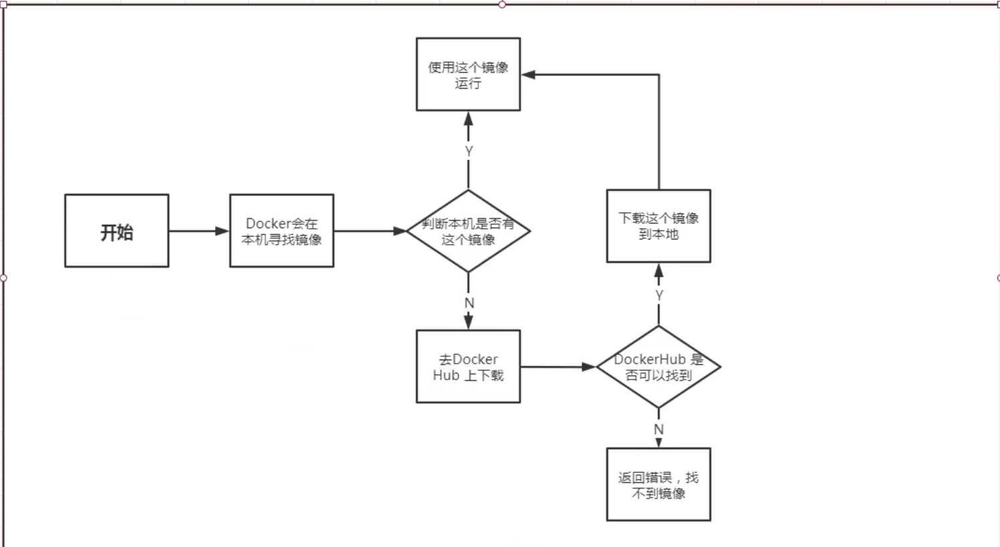
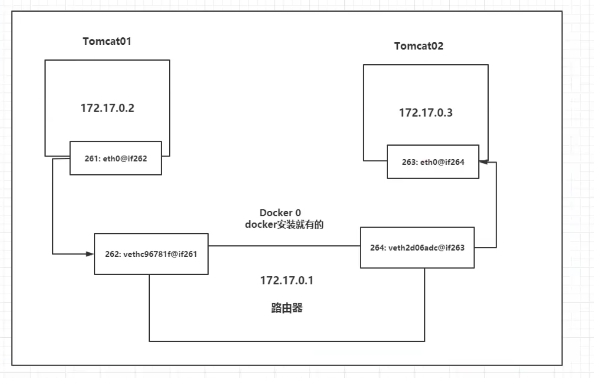

## 1. Docker安装

[官方文档](https://docs.docker.com/engine/install/ubuntu/)

[配置国内源](https://yeasy.gitbook.io/docker_practice/install/ubuntu)

**docker的工作目录是/var/lib/docker**

## 2. Docker run执行流程



## 3. Docker执行底层原理

1. docker是一个**Client-Server结构**的系统，docker的守护进程运行在主机上，通过**socket**从客户端访问

### Docker为什么比VM快

1. docker有比虚拟机更少的抽象层
2. docker利用的是宿主机的内核，所以新建一个容器的时候，还是利用的是宿主机的内核。而VM需要的是GUEST OS，所以新建一个虚拟机的时候，总是要重新加载一个操作系统内核。

## 4. Docker常用命令

### 4.1 帮助命令

1. docker version 显示docker版本信息
2. docker info 显示docker的详细系统信息
3. docker 具体命令 --help 查看某个命令的帮助文档
4. docker login 在终端登陆docker
5. docker logout 退出登陆
6. docker network 查看docker网络信息

### 4.2 镜像命令

**以下这些命令都可以加一些具体的参数，可以配合--help来查看**

1. docker images 查看所有本地主机上的镜像

   ```shell
   docker images
   	-a(--all)列出所有镜像
   	-q(--quiet)只列出镜像id	
   ```

2. docker search 搜索镜像

   ```shell
   docker search
   	--filter=STAR==具体数字 搜索镜像stars数大于3000的
   ```

3. docker pull 下载镜像

   ```shell
   docker pull 镜像名:版本 版本可选，默认为latest 支持的版本信息见官网
   ```

4. docker rmi 删除镜像

   ```shell
   docker rmi -f 镜像id(可以接多个，以空格分隔)
   docker rmi -f $(docker images -aq)  删除全部镜像(快捷方式)
   ```

5. 提交镜像到远程仓库

   ```shell
   # 前提必须登陆docker
   docker push
   # docker push wdy/tomcat:1.o
   # 提交的时候也是和下载一样，都是按照层级进行的
   ```

6. 提交镜像到本地

   ```shell
   docker commit
   # docker commit -m="提交的描述信息" -a="作者" 容器id 新的镜像的名字:[TAG版本]
   ```

7. 给镜像增加一个TAG标签，效果是增加一个镜像

   ```shell
   docker tag 镜像id 新的镜像TAG
   # docker tag id wdy/tomcat:1.0
   ```

8. 镜像的备份和加载（tar files）

   ```shell
   docker save
   docker load
   ```

### 4.3 容器命令

**我们有了镜像，就可以创建容器了,可以把容器看成是一个微型的linux系统**

1. 新建容器并启动

   ```shell
   docker run [可选参数] image
   	--name 指定容器名字
   	-d 后台方式运行
   	-e 设置容器运行时某些环境变量的值，例如运行mysql容器需要指定密码-e MYSQL_ROOT_PASSWORD=
   	-it 进入容器并以交互方式运行
   	-p 指定容器端口
   	-P 随机端口
   	--rm 用完就删除，一般在测试的时候使用
   	
   例子：
   docker run -it centos /bin/bash   以交互的方式运行centos并在执行/bin/bash
   docker run -it centos ip addr 以交互的方式运行centos并显示容器ip信息
   exit 退出容器
   ctrl+p+q 容器不停止运行退出
   docker ps 列出所有正在运行的容器
   	-a 列出所有正在运行的容器和之前运行过的容器
   	-n= 指定输出的数目
   	-q 只显示容器的编号
   docker rm 容器id 删除容器
   	-f $(docker ps -aq) 删除所有容器
   docker start 容器id
   docker restart
   docker stop
   docker kill
   ```
### 4.4 常用其它命令

#### 4.4.1 后台启动容器

```shell
docker run -d
注意：docker容器在后台运行，就必须要有一个前台的进程。如果在后台运行，没有前台进程，docker会认为这个容器启动没有作用，就会自动将容器关闭。
```

#### 4.4.2 查看日志

```shell
docker logs -t -f(-tf) --tail 数目 容器id
```

#### 4.4.3 查看容器中的进程信息

```shell
docker top 容器id
```

#### 4.4.4 查看容器的元数据

```shell
docker inspect 容器id
```

#### 4.4.5 进入当前正在运行的容器

```shell
docker exec [-it] 容器id shell命令(/bin/bash,/bin/zsh,cat , echo.....)
docker attach 容器id

两种方式的区别：
	docker exec 进入容器之后打开一个新的终端
	docker attach 进入容器之后打开的是正在执行任务的终端，不会启动新的进程
```

#### 4.4.6 从容器内拷贝文件到主机上

```shell
docker cp 容器id:文件路径 目的主机路径
```

#### 4.4.7 查看容器的状态

```shell
docker stats
```

## 5. docker可视化

### 5.1 portainer

```shell
docker pull portainer/portainer
docker run -d --name portainer -p 9000:9000 --restart=always -v /var/run/docker.sock:/var/
run/docker.sock --privileged=true portainer/portainer
```

## 6. 镜像的原理

### 6.1 什么是镜像

镜像是一种轻量级，可执行的独立软件包，用来打包软件运行环境和基于运行环境开发的软件。

镜像可以从[官网](https://hub.docker.com/search?q=portainer&type=image)获取得到，也可以自己制作一个镜像DockerFile,，还可以从别人那里获得

### 6.2 Docker镜像加载原理

#### 6.2.1 Union FS(联合文件系统)

Union FS是一种分层，轻量级并且高性能的文件系统。它支持对文件系统的修改作为一次提交来一层层地叠加，同时可以将不同目录挂载到同一个虚拟文件系统下。Union FS是docker镜像的基础，镜像可以通过分层来实现继承，基于基础镜像，可以制作各种具体的应用镜像。

#### 6.2.2 加载原理

docker的镜像其实是由一层层的文件系统组成，这种文件系统就是联合文件系统

bootFS(boot file system)主要包含bootloader和kernel。bootloader主要负责引导加载kernal，Linux刚启动的时候会加载bootfs文件系统，在docker镜像的最底层就是bootFS。这一层与我们典型的Linux系统是一样的，包含boot加载器和内核。当boot加载完成之后整个内核就都在内存中了，此时内存的使用权已由bootFS转交给内核，此时系统也会卸载bootFS

rootFS(root file system)，在bootFS之上，包含的就是典型的Linux系统中的/目录下的文件，例如/etc,/bin,/usr/等。其实可以将rootFS理解为不同的操作系统发行版

对于一个精简的OS，rootFS可以很小，只需要包含最基本的命令，工具和程序库就可以了。因为底层直接使用Host的kernel，自己只需要提供rootFS就可以了。

### 6.3 分层理解

docker镜像采用分层的目的是资源共享。比如有多个镜像都是从相同的Base镜像构建而来，那么宿主机只需要在本地保存一份Base镜像，同时内存中也只需要加载这一份Base镜像，虽然只加载了一份，但是这份可以为所有的容器服务。

查看镜像分层的方式可以通过**docker image inspect** 命令
所有的docker镜像都起源于一个基础镜像层，当进行修改或增加新的内容时，就会在当前镜像层之上，创建新的镜像层。例如，现在创建一个Ubuntu镜像，这是基础镜像，也就是第一层，如果这时候需要给Ubuntu镜像里面打一个补丁，这时就需要在第一层镜像之上再创建一层，以此类推，每进行一次修改就会又加一层。

1. 在添加额外的镜像层的同时，镜像始终保持是当前所有镜像层的组合。例如一个镜像有两层，每层里面都有三个文件，所以这个镜像就由这两层的六个文件组成，最后所有的镜像层都会堆叠合并到一起。
2. 另一种情况就是版本的更新升级，当新的镜像层里的文件要覆盖之前的镜像层里面的文件，这时在最后镜像层的堆叠合并过程中就会替换掉之前旧版本的文件。

docker采用存储引擎(新版本采用快照的机制)的方式来实现镜像层的堆栈，并保证多镜像层对外展示为统一的文件系统。Linux上可用的存储引擎有AUFS,Overlay2,Device Mapper,Btrfs,ZFS。每种存储引擎技术都对应了Linux文件系统或者是块设备技术。但是docker在Windows上只支持Windowsfilter存储引擎，该引擎基于NTFS文件系统之上实现分层和CoW

**镜像都是只读的，当容器启动的时候，一个新的可写层就会被加载到镜像的顶层，这一层就是常说的容器层，这一层之下的就叫镜像层**

## 7. 提交镜像

```shell
docker commit
原理和git的提交类似
docker commit -m="提交的描述信息" -a="作者" 容器id 新的镜像的名字:[TAG版本]
```

## 8. 容器数据卷

### 8.1 什么是容器数据卷

问题：容器一删除，容器中的数据也会丢失，为了避免这一情况，如果容器中的数据可以同步到本地就可以解决这个问题。

这就是容器数据卷技术，这个**技术的本质就是挂载**，就是将容器中的某个目录挂载到本地主机的某个目录上，从而实现**数据的同步**。

### 8.2 使用数据卷技术

```shell
# 指定路径挂载，实质上还是匿名挂载
docker run -v 主机目录:容器目录
可以挂载多个目录docker run -v 主机目录:容器目录 -v 主机目录:容器目录，在后面直接加上-v即可
```

### 8.3 具名挂载和匿名挂载

```shell
# 匿名挂载,只设置了容器内的目录     卷名没有指定系统会随机生成一个
docker run -v 容器目录

# 查看所有的volume(卷)的情况
docker volume ls

# 具名挂载，但是这里只是指定了卷的名字，并没有指定挂载到主机的哪个目录
docker run -v 卷名:容器目录

# 查看某个卷的具体情况,主要是查看挂载信息
docker volume inspect 卷名
```

**所有docker容器中的卷，没有指定目的主机挂载路径的，都自动挂载到/var/lib/docker/volumes/卷名/_data**

因为具名挂载很容易识别某个卷，所以**一般都使用具名挂载**

**拓展**

```shell
ro readonly 只读
rw readwrite 可读可写

docker run -v 卷名:容器内目录:ro
docker run -v 卷名:容器内目录:rw

ro代表这个路径只能通过宿主机来操作，在容器内没有操作权限
```

### 8.4 数据卷容器

**这个技术可以实现多个容器之间数据共享**

```dockerfile
docker run --volumns-from

# 示例,假设这个centos镜像本身里面存在两个卷volumn1和volumn2，具体见dockerfile文件示例
docker run  -it --name centos1 镜像名:[TAG]
docker run -it --name centos2 --volumns-from centos1 镜像名:[TAG]

# 到这一步，数据卷容器就创建完成了，两个容器的卷volumn1和volumn2数据就会同步,同时如果这时把容器centos1停止并删除，会发现容器centos2中的文件还是存在的，所以数据卷容器技术数据同步是一个拷贝的概念。

```

注意：

1. 数据卷容器的生命周期一直持续到没有容器使用为止
2. 如果数据卷中的数据持久化到了本地，即使数据卷容器的生命周期结束了，本地的数据文件是不会删除的

## 9. docker file

**dockerfile就是用来构建docker镜像的文件**

dockerfile脚本可以生成镜像，每一个镜像都是一层一层的，在dockerfile文件里面**每一行命令都是镜像的一层**.

```dockerfile
# dockerfile文件名随意
# 文件里面的命令大写

# 设置基础镜像
FROM centos 
# 指定卷挂载,后面的volumn1和volumn2是容器里面的目录，通过下面这种方式挂载生成的卷名和宿主机挂载目录符合匿名挂载的规则
VOLUME ["volumn1","volumn2"]
CMD echo "hello centos"
CMD /bin/bash

# 上面只是dockerfile文件的一个例子，但是一定要切记每一行就是镜像的一层
```

```dockerfile
docker build -f dockerfile文件路径 -t 镜像名:[TAG] 镜像生成的地址
```

### 9.1 DockerFile命令

1. FROM

   基础镜像,一切从这里开始构建

2. MAINTAINER

   镜像作者

3. RUN

   镜像构建的时候需要运行的命令

4. ADD

   添加文件，例如添加tomcat，只需要tomcat压缩包，会自动解压

5. WORKDIR

   设置当前工作目录

6. VOLUME

   设置容器卷，也就是挂载目录

7. EXPOSE

   暴露哪个端口

8. CMD

   指定容器启动的时候要运行的命令，只有最后一个会生效，可被替代

9. ENTRYPOINT

   指定容器启动的时候要运行的命令，可以追加命令

10. ONBUILD

    当构建一个被继承的dockerfile就会触发这个指令

11. COPY

    类似ADD，将文件拷贝到镜像里面

12. ENV

    构建镜像的时候设置环境变量

**创建一个Centos镜像安装vim和net-tools**

```dockerfile
FROM centos
MAINTAINER HotRockit<2124637043@qq.com>
ENV MYPAYH /usr/local
WORKDIR $MYPATH
RUN yum -y install net-tools
RUN yum -y install vim
EXPOSE 80
CMD echo "----the end------"
CMD /bin/bash
```

```dockerfile
docker history 镜像id  可以查看一个镜像是怎么一步步构建起来的
```

### 9.2 CMD和ENTRYPOINT区别

```dockerfile
# 这两个命令在使用上一样，将具体的命令拆成数组传递进去，例如CMD ["ls","-al"],就等价于在Linux终端里面执行ls -al

# 使用CMD
FROM centos
CMD ["ls","-a"]
# 使用CMD构建的镜像
# docker run 镜像名 这种方式不会报错，执行过程中会执行ls -a命令
# docker run 镜像名 -l  后面加上一个-l参数，这个参数会替代CMD中写的ls -a，相当于直接执行-l命令,肯定是找不到命令报错

# 使用ENTRYPOINT
FROM centos
ENTRYPOINT ["ls","-a"]
# 使用ENTRYPOINT构建的镜像
# docker run 镜像名 这种方式不会报错，执行过程中会执行ls -a命令
# docker run 镜像名 -l  后面加上一个-l参数，这个参数会追加到ENTRYPOINT中写的ls -a，相当于直接执行ls -al命令，运行正常
```

### 9.3 构建jdk和tomcat镜像

```dockerfile
FROM centos
MAINTAINER HotRockit<2124637043@qq.com>
COPY README.md /usr/local/README.md
ADD jdk压缩包文件 /usr/local
ADD tomcat压缩包文件 /usr/local
RUN yum -y install vim
ENV MYPATH /usr/local
WORKDIR $MYPATH
ENV JAVA_HOME 路径
ENV CLASSPATH $JAVA_HOME/lib/dt.jar:$JAVA_HOME/lib/tools.jar
ENV CATALINA_HOME tomcat路径
ENV CATALINA_BASE tomcat路径
ENV PATH $PATH:$JAVA_HOME/bin:$CATALINA_HOME/bin:$CATALINA_HOME/lib
EXPOSE 8080
CMD TOMCAT路径/bin/startup.sh && tail -F tomcat路径/bin/logs/catalina.out
```

## 10. docker  网络

### 10.1 理解docker0

**docker0就是docker宿主机上的一块网卡，只要安装了docker就会有这块网卡**

**这块网卡使用的是桥接模式，使用的技术是evth-pair技术**

**每启动一个容器，会发现就多了一对网卡，evth-pair就是一对的虚拟设备接口**



* 通过图中可以发现，一个容器和另一个容器通信，并不是直接去连接那个容器，而是通过docker0网卡去转发。例如图中的tomcat1去ping tomcat2，这时tomcat1容器会先把数据发到docker0上，再通过docker0转发到tomcat2容器，会发现docker0网卡，相当于一个路由器的作用。
* 所有的容器不指定网络的情况下，都是docker0路由的，docker会给容器分配一个默认的ip
* docker0和物理网卡是直连NAT的方式
* docker中的所有网络接口都是虚拟的，虚拟的转发效率高
* 只要容器删除，对应的一对网卡就没了

### 10.2 容器互联

在前一节里面，我们在一个容器里面ping另一个容器的时候是利用的ip地址去Ping,这样比较麻烦，因为每次启动这个Ip地址都是随机分配的，是可变的，所以想通过容器名字去ping通另一个容器，默认的方式是不支持的，只能通过ip地址去ping。

```shell
docker run -d -P --name tomcato1 tomcat
docker run -d -P --name tomcat02 --link tomcat01 tomcat
# 通过上面这种方式只能实现tomcat02连接tomcat01,并不能实现tomcat01连接tomcat02，这个--link操作的本质是在容器的/etc/hosts文件里面配置映射关系,由于只在tomcat02里面配置了tomcat01的ip地址，并没有在tomcat01里面配置tomcat02的ip地址，所以只能实现单向连接
```

**我们一般不使用--link这种方式(也就是docker0的默认网络)，不太灵活，我们一般使用自定义网络**

## 11. 自定义网络

docker中的网络模式:

1. bridge 桥接 默认 自定义网络也用这个
2. none 不配置网络
3. host 和宿主机共享网络
4. container 容器网络联通(基本不用)

```shell
# 以往我们启动docker容器的时候都没有加上网络参数，其实docker是有一个默认网络参数的
docker run -d -P --name tomcat01 tomcat
# 上面命令等价于下面这个
docker run -d -P --name tomcat01 --net bridge tomcat 
# --net bridge其实就是指定了使用docker0,docker0默认不能使用域名访问，但可以使用--link

# 自定义网络
docker network create --driver bridge --subnet 192.168.0.0/16 --gateway 192.168.0.1 mynet
# 展示docker内部所有网络
docker network ls
# 查看自己定义的网络的详细信息
docker network inspect mynet
```

**默认使用docker0网络，是不能直接使用容器名互联的，但是自定义的网络很完善，既可以使用ip来互联，也可以使用容器名来互联**

### 11.1 网络连通

```shell
# 两个容器分别在两个网络里面，那么怎么让在两个不同网络里面的容器连通呢？
# 方法就是将一个容器加到另一个网络里面，效果就是一个容器在两个网络里面，也就是一个容器有两个ip地址。可以把这个想象成一台服务器有一个公网ip，也有一个私网ip
# 两个网络之间(也就是两块网卡)是不能打通的，也就是不能连接的,但是容器和网络是可以的
docker network connect 网络名 容器名
```

