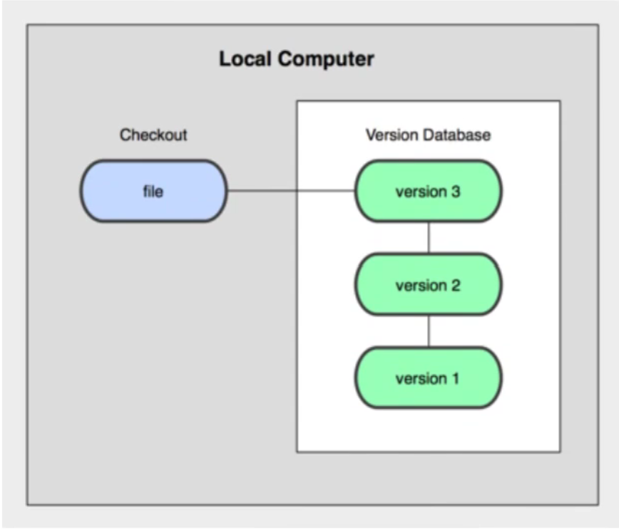
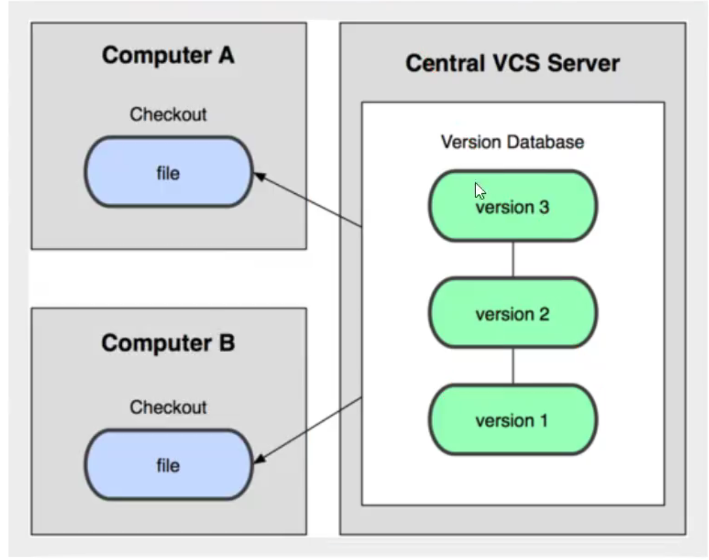
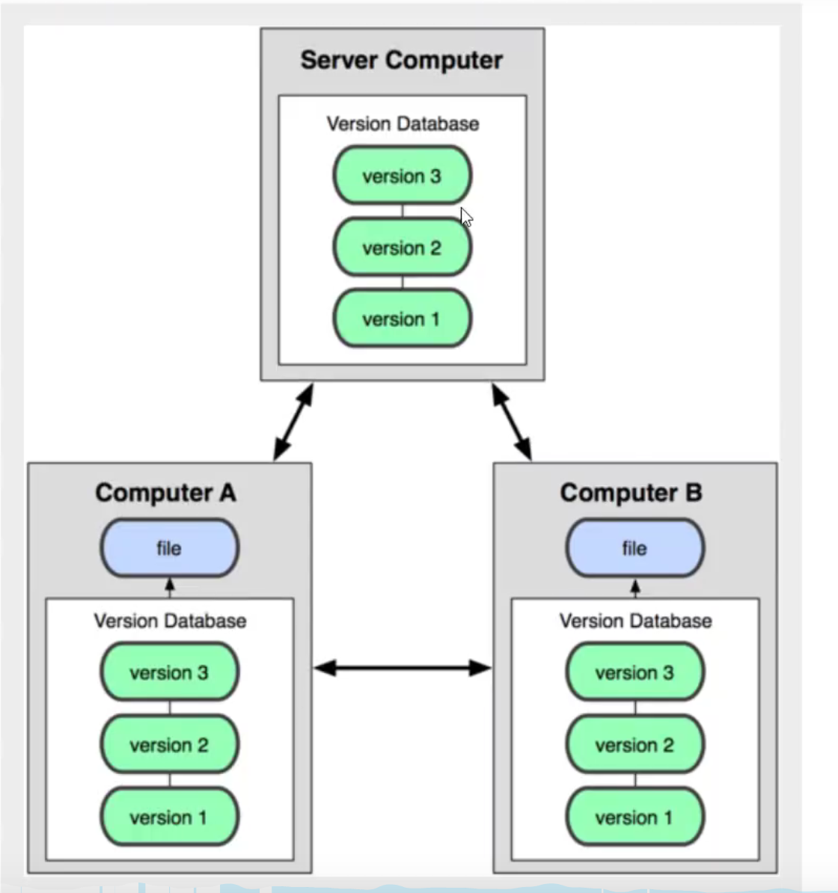
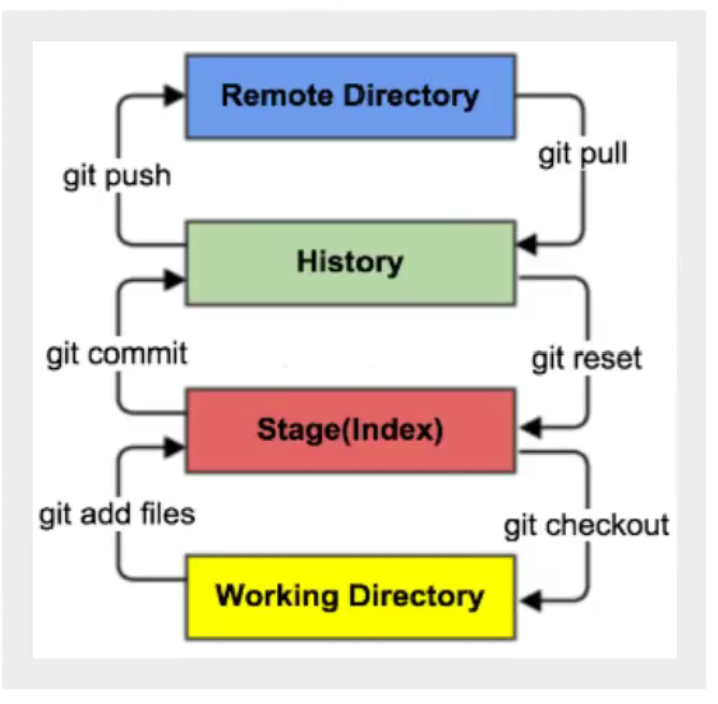
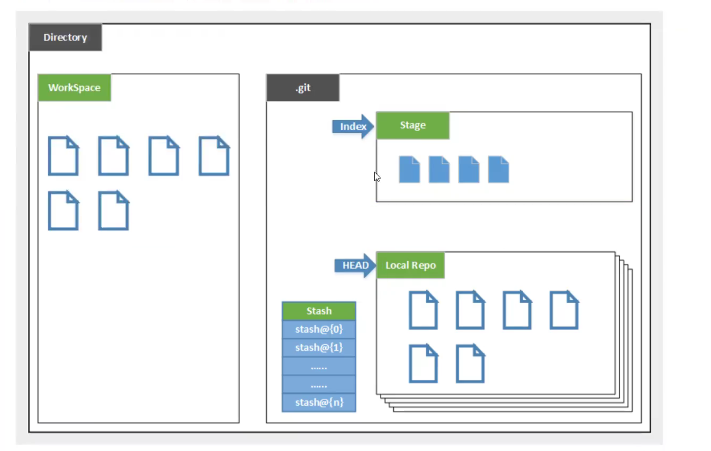
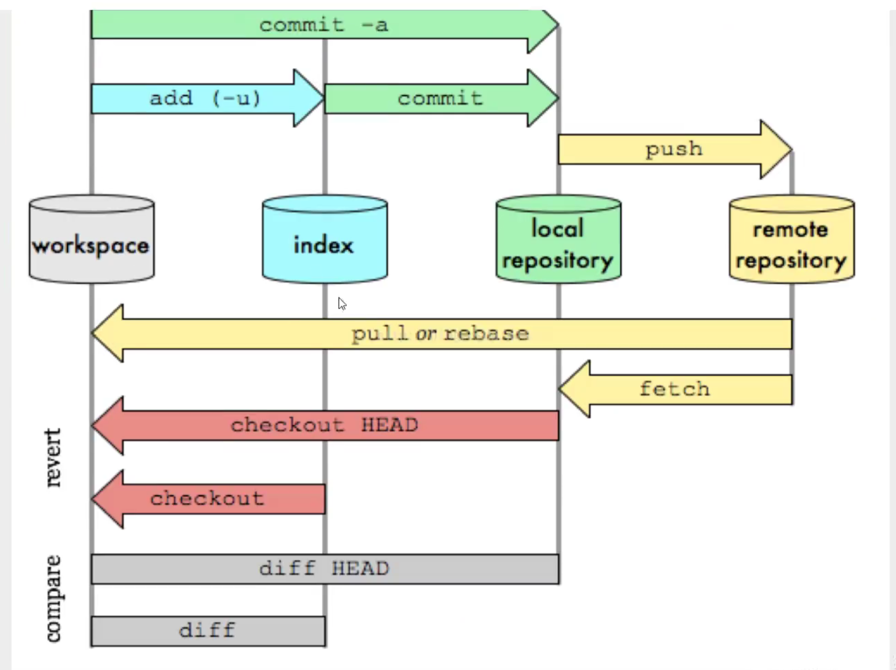
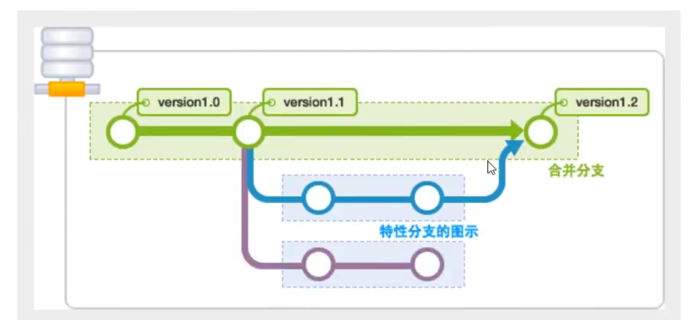

## 1. 版本控制分类

### 1.1 本地版本控制

记录文件每次的更新，可以对每个版本做一个快照，适合个人使用



### 1.2 集中版本控制

所有的版本数据都放在服务器上，协同开发者从服务器上同步更新或者上传自己的修改，**典型代表SVN**



用户本地只有以前同步的数据，**如果不联网的话，是看不到以往的版本数据的**。而且所有的版本数据都在同一个服务器上，如果服务器坏掉了，那么之前的数据都没了，当然可以通过数据备份来解决这个问题。

### 1.3 分布式版本控制

所有的版本信息都同步到每一个用户手里，所以可以在本地查看历史版本记录，可以离线在本地提交，只需要在联网的时候push到服务器上，由于每个用户那里都拥有所有的版本数据，所以在服务器坏掉之后，都可以利用任何一个用户的数据来恢复服务器。但增加了本地存储空间的占用。**典型代表Git**



> 拓展

两个用户都修改了代码库里面的文件A，这时如果两个人都把修改push到服务端上，两个人都会看到对方的修改的。

## 2. Git配置

```bash
git config -l 查看git所有配置
git config --system --list 查看git系统配置  文件路径：git安装目录/etc/gitconfig
git config --global --list 查看git本地配置  文件路径：本机用户目录/.gitconfig
git config --global user.name 用户名   设置用户名
git config --global user.email 邮箱    设置邮箱
```

**有时希望项目提交的时候使用别的用户名和邮箱，而且只使用一次，这时候在设置的时候就不需要--global选项，这个选项设置是以后每一次提交都使用这个配置。**

## 3. Git工作原理

Git本地有三个工作区域：**工作区**(Work Directory)，就是平时存放代码的位置，**暂存区**(State/Index)，用于临时存放改动，事实上，它只是一个文件，保存即将提交的文件列表信息，**本地仓库**(Repository或Git Directory)，就是安全存放数据的位置，这里有你所提交的所有版本的数据，其中Head指向最新放入仓库的版本。还有一个**远程仓库**(Remote Directory)，就是托管代码的服务器。





git管理的文件有三种状态

1. 已修改(Modified)
2. 已暂存(Staged)
3. 已提交(Committed)



## 4. Git项目创建

1. 创建全新的仓库

   ```bash
   # 在当前目录新建一个仓库
   git init
   ```

2. 克隆远程仓库

   ```bash
   # 克隆远程仓库
   git clone 仓库地址
   ```

## 5. Git 文件操作

1. Untracked：未跟踪，此文件在目录里，但是没有加入到git仓库里面，所以不参与版本控制，通过git add将状态变为Staged
2. Unmodified：文件已经入库，但是未修改，也就是版本库里面的文件快照和本地文件内容一致，这种文件有两种去处，如果修改了，状态变为Modified，如果使用git rm 移出版本库，就成为Untracked文件
3. Modified：文件已修改，但是仅仅是修改，没有其它操作。这样的文件有两个去处，通过git add加入到staged状态，使用git checkout 则丢弃修改，返回到Unmodified状态
4. Staged：暂存状态，执行git commit 则将修改同步到库中，这时仓库里的文件和本地文件又变为一致，所以本地1文件状态又变为Unmodified状态，执行git reset HEAD filename 取消暂存，状态变为Modified

```bash
# 查看指定文件状态，如果不加文件名，表示查看所有文件状态
git status filename
# 添加指定文件到暂存区，如果使用.表示提交所有文件
git add filename 
# 提交暂存区的内容到本地仓库
git commit -m "描述内容"
```

> 忽略文件

**把不需要提交的文件排除在外**

在主目录创建".gitignore"文件，文件规则如下

1. 忽略文件中的空行以及以#开头的行
2. 可以使用linux通配符
3. 如果名称的最前面有一个！，表示例外规则，将不被忽略
4. 如果名称的最前面是一个/，表示要忽略的文件在此目录下，而子目录中的文件不忽略
5. 如果名称的最后面是一个/，表示要忽略的是此目录下该名称的子目录，而非文件（默认文件和目录都忽略）

```bash
*.txt 所有以.txt结尾的文件全部忽略
!lib.txt   把lib.txt文件除外
/tmp  表示忽略temp的上级目录，但是temp目录不会被忽略
build/ 忽略build目录下的所有文件
doc/*.txt 会忽略doc目录下的.txt文件，但是不会忽略doc子目录下的.txt文件
```

## 6. Git分支



```bash
# 列出本地所有分支
git branch
# 列出所有远程分支
git branch -r
# 新建一个分支，但依然停留在当前分支
git branch 分支名字
# 新建一个分支，并切换到该分支
git checkout -b 分支名
# 合并指定分支到当前分支
git merge 分支名
# 删除分支
git branch -d 分支名
# 删除远程分支
git push origin --delete 分支名
git branch -dr 分支名 
```

如果一个文件在两个分支里面都被修改了，这个时候要合并两个分支就会发生冲突。

**master主分支应该很稳定，主要用来发布新版本，一般不在这个分支上工作，工作一般在dev分支上，工作完之后，可以把dev分支上的代码merge到master分支上来**

## 7. Git常用命令

> 新建代码库

```bash
# 在当前目录新建一个Git代码库
$ git init

# 新建一个目录，将其初始化为Git代码库
$ git init [project-name]

# 下载一个项目和它的整个代码历史
$ git clone [url]
```

> 配置

```bash
# 显示当前的Git配置
$ git config --list

# 编辑Git配置文件
$ git config -e [--global]

# 设置提交代码时的用户信息
$ git config [--global] user.name "[name]"
$ git config [--global] user.email "[email address]"
```

> 增加删除文件

```bash
# 添加指定文件到暂存区
$ git add [file1] [file2] ...

# 添加指定目录到暂存区，包括子目录
$ git add [dir]

# 添加当前目录的所有文件到暂存区
$ git add .

# 添加每个变化前，都会要求确认
# 对于同一个文件的多处变化，可以实现分次提交
$ git add -p

# 删除工作区文件，并且将这次删除放入暂存区
$ git rm [file1] [file2] ...

# 停止追踪指定文件，但该文件会保留在工作区
$ git rm --cached [file]

# 改名文件，并且将这个改名放入暂存区
$ git mv [file-original] [file-renamed]
```

> 代码提交

```bash
# 提交暂存区到仓库区
$ git commit -m [message]

# 提交暂存区的指定文件到仓库区
$ git commit [file1] [file2] ... -m [message]

# 提交工作区自上次commit之后的变化，直接到仓库区
$ git commit -a

# 提交时显示所有diff信息
$ git commit -v

# 使用一次新的commit，替代上一次提交
# 如果代码没有任何新变化，则用来改写上一次commit的提交信息
$ git commit --amend -m [message]

# 重做上一次commit，并包括指定文件的新变化
$ git commit --amend [file1] [file2] ...
```

> 分支

```bash
# 列出所有本地分支
$ git branch

# 列出所有远程分支
$ git branch -r

# 列出所有本地分支和远程分支
$ git branch -a

# 新建一个分支，但依然停留在当前分支
$ git branch [branch-name]

# 新建一个分支，并切换到该分支
$ git checkout -b [branch]

# 新建一个分支，指向指定commit
$ git branch [branch] [commit]

# 新建一个分支，与指定的远程分支建立追踪关系
$ git branch --track [branch] [remote-branch]

# 切换到指定分支，并更新工作区
$ git checkout [branch-name]

# 切换到上一个分支
$ git checkout -

# 建立追踪关系，在现有分支与指定的远程分支之间
$ git branch --set-upstream [branch] [remote-branch]

# 合并指定分支到当前分支
$ git merge [branch]

# 选择一个commit，合并进当前分支
$ git cherry-pick [commit]

# 删除分支
$ git branch -d [branch-name]

# 删除远程分支
$ git push origin --delete [branch-name]
$ git branch -dr [remote/branch]
```

> 标签

```bash
# 列出所有tag
$ git tag

# 新建一个tag在当前commit
$ git tag [tag]

# 新建一个tag在指定commit
$ git tag [tag] [commit]

# 删除本地tag
$ git tag -d [tag]

# 删除远程tag
$ git push origin :refs/tags/[tagName]

# 查看tag信息
$ git show [tag]

# 提交指定tag
$ git push [remote] [tag]

# 提交所有tag
$ git push [remote] --tags

# 新建一个分支，指向某个tag
$ git checkout -b [branch] [tag]
```

> 查看信息

```bash
# 显示有变更的文件
$ git status

# 显示当前分支的版本历史
$ git log

# 显示commit历史，以及每次commit发生变更的文件
$ git log --stat

# 搜索提交历史，根据关键词
$ git log -S [keyword]

# 显示某个commit之后的所有变动，每个commit占据一行
$ git log [tag] HEAD --pretty=format:%s

# 显示某个commit之后的所有变动，其"提交说明"必须符合搜索条件
$ git log [tag] HEAD --grep feature

# 显示某个文件的版本历史，包括文件改名
$ git log --follow [file]
$ git whatchanged [file]

# 显示指定文件相关的每一次diff
$ git log -p [file]

# 显示过去5次提交
$ git log -5 --pretty --oneline

# 显示所有提交过的用户，按提交次数排序
$ git shortlog -sn

# 显示指定文件是什么人在什么时间修改过
$ git blame [file]

# 显示暂存区和工作区的差异
$ git diff

# 显示暂存区和上一个commit的差异
$ git diff --cached [file]

# 显示工作区与当前分支最新commit之间的差异
$ git diff HEAD

# 显示两次提交之间的差异
$ git diff [first-branch]...[second-branch]

# 显示今天你写了多少行代码
$ git diff --shortstat "@{0 day ago}"

# 显示某次提交的元数据和内容变化
$ git show [commit]

# 显示某次提交发生变化的文件
$ git show --name-only [commit]

# 显示某次提交时，某个文件的内容
$ git show [commit]:[filename]

# 显示当前分支的最近几次提交
$ git reflog
```

> 远程同步

```bash
# 下载远程仓库的所有变动
$ git fetch [remote]

# 显示所有远程仓库
$ git remote -v

# 显示某个远程仓库的信息
$ git remote show [remote]

# 增加一个新的远程仓库，并命名
$ git remote add [shortname] [url]

# 取回远程仓库的变化，并与本地分支合并
$ git pull [remote] [branch]

# 上传本地指定分支到远程仓库
$ git push [remote] [branch]

# 强行推送当前分支到远程仓库，即使有冲突
$ git push [remote] --force

# 推送所有分支到远程仓库
$ git push [remote] --all
```

> 撤销

```bash
# 恢复暂存区的指定文件到工作区
$ git checkout [file]

# 恢复某个commit的指定文件到暂存区和工作区
$ git checkout [commit] [file]

# 恢复暂存区的所有文件到工作区
$ git checkout .

# 重置暂存区的指定文件，与上一次commit保持一致，但工作区不变
$ git reset [file]

# 重置暂存区与工作区，与上一次commit保持一致
$ git reset --hard

# 重置当前分支的指针为指定commit，同时重置暂存区，但工作区不变
$ git reset [commit]

# 重置当前分支的HEAD为指定commit，同时重置暂存区和工作区，与指定commit一致
$ git reset --hard [commit]

# 重置当前HEAD为指定commit，但保持暂存区和工作区不变
$ git reset --keep [commit]

# 新建一个commit，用来撤销指定commit
# 后者的所有变化都将被前者抵消，并且应用到当前分支
$ git revert [commit]

# 暂时将未提交的变化移除，稍后再移入
$ git stash
$ git stash pop
```

> 其它

```bash
# 生成一个可供发布的压缩包
$ git archive
```

## 8. 可能遇见的错误

1. 在使用git更新或提交项目时候出现 "fatal: The remote end hung up unexpectedly " 原因是推送的文件太大

   ```bash
   # 修改提交缓存大小为500M，或者更大的数字
   # --global对当前用户生效，--system对所有用户生效，--local对当前项目生效
   git config --global http.postBuffer 524288000
   ```

   