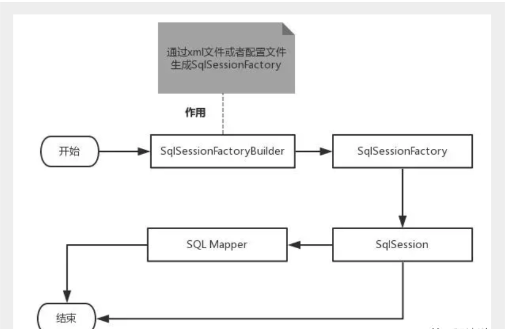
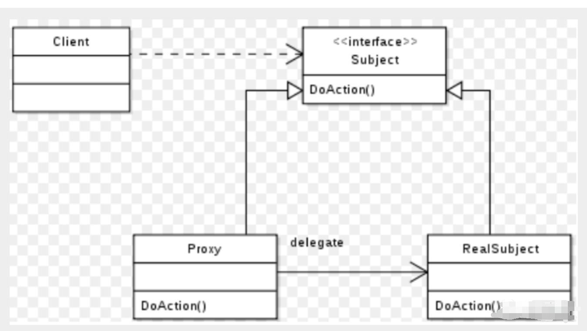
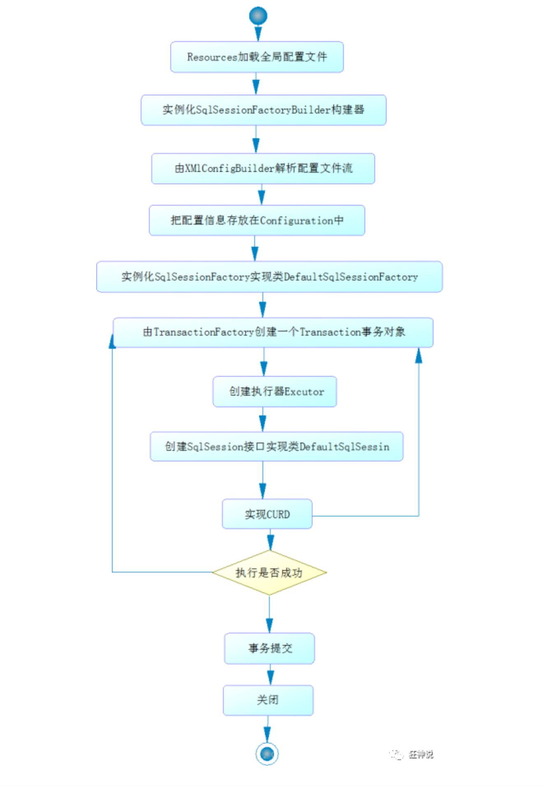
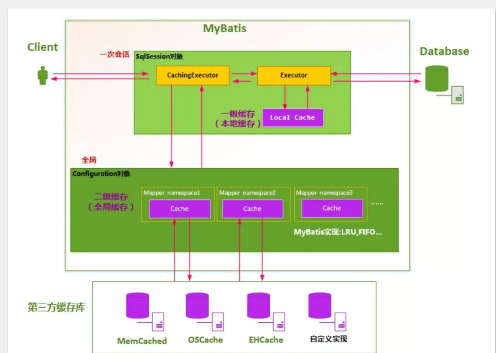

## 1. Mybatis概述

### 1.1 介绍

* MyBatis 是一个半自动化的**ORM框架 (Object Relationship Mapping) -->对象关系映射**
* MyBatis 可以使用简单的 XML 或注解来配置和映射原生信息，将接口和 Java 的 实体类 【Plain Old Java Objects,普通的 Java对象】映射成数据库中的记录
* 提供xml标签，支持编写动态sql
* **每个基于 MyBatis 的应用都是以一个 SqlSessionFactory 的实例为核心的。SqlSessionFactory 的实例可以通过 SqlSessionFactoryBuilder 获得。而 SqlSessionFactoryBuilder 则可以从 XML 配置文件或一个预先配置的 Configuration 实例来构建出 SqlSessionFactory 实例。**
* **既然有了 SqlSessionFactory，顾名思义，我们可以从中获得 SqlSession 的实例。SqlSession 提供了在数据库执行 SQL 命令所需的所有方法。你可以通过 SqlSession 实例来直接执行已映射的 SQL 语句**
* **每个线程都应该有它自己的 SqlSession 实例。SqlSession 的实例不是线程安全的，因此是不能被共享的，所以它的最佳的作用域是请求或方法作用域**
* **映射器是一些绑定映射语句的接口。映射器接口的实例是从 SqlSession 中获得的**
* 从 XML 文件中构建 SqlSessionFactory 的实例非常简单，建议使用类路径下的资源文件进行配置。 但也可以使用任意的输入流（InputStream）实例，比如用文件路径字符串或 file:// URL 构造的输入流。MyBatis 包含一个名叫 Resources 的工具类，它包含一些实用方法，使得从类路径或其它位置加载资源文件更加容易

### 1.2 简单使用

1. 导入maven依赖

   ```xml
   <dependency>
       <groupId>org.projectlombok</groupId>
       <artifactId>lombok</artifactId>
       <version>1.18.12</version>
       <scope>provided</scope>
   </dependency>
   <dependency>
       <groupId>mysql</groupId>
       <artifactId>mysql-connector-java</artifactId>
       <version>8.0.20</version>
   </dependency>
   <dependency>
       <groupId>org.mybatis</groupId>
       <artifactId>mybatis</artifactId>
       <version>3.5.6</version>
   </dependency>
   ```

2. mybatis配置文件

   ```xml
   <?xml version="1.0" encoding="UTF-8" ?>
   <!DOCTYPE configuration
           PUBLIC "-//mybatis.org//DTD Config 3.0//EN"
           "http://mybatis.org/dtd/mybatis-3-config.dtd">
   <configuration>
       <environments default="development">
           <environment id="development">
               <transactionManager type="JDBC"/>
               <dataSource type="POOLED">
                   <property name="driver" value="com.mysql.cj.jdbc.Driver"/>
   <!--                GMT%2B8表示东八区,也就是北京时间-->
                   <property name="url" value="jdbc:mysql://127.0.0.1:3306/mybatis?useSSL=true&amp;useUnicode=true&amp;characterEncoding=utf8&amp;serverTimezone=GMT%2B8"/>
                   <property name="username" value="root"/>
                   <property name="password" value="wdy970603"/>
               </dataSource>
           </environment>
       </environments>
       <mappers>
   <!--        每一个mapper文件都要在这里配置-->
           <mapper resource="com/wdy/dao/UserMapper.xml"/>
       </mappers>
   </configuration>
   ```

3. 接口

   ```java
   public interface UserMapper {
       List<User> getUserList();
   }
   ```

4. mybatis工具类

   ```java
   public class MybatisUtils {
       private static SqlSessionFactory sqlSessionFactory;
       static {
           try {
               String resource = "mybatis-config.xml";
               InputStream inputStream = Resources.getResourceAsStream(resource);
               sqlSessionFactory = new SqlSessionFactoryBuilder().build(inputStream);
           } catch (IOException e) {
               e.printStackTrace();
           }
       }
   
       public static SqlSession getSession(){
           return sqlSessionFactory.openSession();
       }
   }
   ```

   **改造MybatisUtils工具类的getSession( ) 方法，重载实现**

   ```java
   //获取SqlSession连接
   public static SqlSession getSession(){
       return getSession(true); //事务自动提交
   }
   
   public static SqlSession getSession(boolean flag){
       return sqlSessionFactory.openSession(flag);
   }
   ```

   【注意】确保实体类和数据库字段对应

5. 映射文件

   ```xml
   <?xml version="1.0" encoding="UTF-8" ?>
   <!DOCTYPE mapper
           PUBLIC "-//mybatis.org//DTD Mapper 3.0//EN"
           "http://mybatis.org/dtd/mybatis-3-mapper.dtd">
   <!--        namespace绑定一个对应的mapper或者是dao-->
   <mapper namespace="com.wdy.dao.UserMapper">
   <!--    id对应方法的名字-->
       <select id="getUserList" resultType="com.wdy.model.User">
       select * from mybatis.user
     </select>
   </mapper>
   ```

6. 实体类

   ```java
   @Data
   @AllArgsConstructor
   @NoArgsConstructor
   public class User {
       private int id;
       private String name;
       private String pwd;
   }
   ```

7. 测试类

   ```java
   public class MyTest {
       @Test
       public void test(){
           //SqlSession 提供了在数据库执行 SQL 命令所需的所有方法
           //每个线程都应该有它自己的 SqlSession 实例。SqlSession 的实例不是线程安全的，因此是不能被共享的，所以它的最佳的作用域是请求或方法作用域
           //绝对不能将 SqlSession 实例的引用放在一个类的静态域，甚至一个类的实例变量也不行
           //换句话说，每次收到 HTTP 请求，就可以打开一个 SqlSession，返回一个响应后，就关闭它。 这个关闭操作很重要，为了确保每次都能执行关闭操作，你应该把这个关闭操作放到 finally 块中
           try(SqlSession session = MybatisUtils.getSession()) {
               UserMapper userMapper = session.getMapper(UserMapper.class);
               List<User> userList = userMapper.getUserList();
               for( User user:userList){
                   System.out.println(user);
               }
           }
       }
   }
   ```

8. maven只会打包resource目录下的配置文件，我们自定义的mapper文件不在这个目录下面，就会导致maven打包的时候会过滤这些文件，就会导致程序运行时找不到这些文件而报错，所以要在maven的配置文件中配置不过滤这些文件

   ```xml
   <build>
           <resources>
               <resource>
                   <directory>src/main/java</directory>
                   <includes>
                       <include>**/*.properties</include>
                       <include>**/*.xml</include>
                   </includes>
                   <filtering>false</filtering>
               </resource>
               <resource>
                   <directory>src/main/resources</directory>
                   <includes>
                       <include>**/*.properties</include>
                       <include>**/*.xml</include>
                   </includes>
                   <filtering>false</filtering>
               </resource>
           </resources>
       </build>
   ```

## 2. CRUD

### 2.1 普通增删改查

1. mapper

   ```java
   public interface UserMapper {
       List<User> getUserList();
       User getUserById(int id);
       List<User> getUserByNameAndPwd(Map<String,Object> map);
       List<User> getUserByNameAndPwd2(@Param("name") String name,@Param("pwd") String pwd);
       int addUser(User user);
       int updateUser(User user);
       int deleteUser(int id);
       //模糊查询
       List<User> getUserLike(String name);
   }
   ```

2. mapper配置文件

   ```xml
   <?xml version="1.0" encoding="UTF-8" ?>
   <!DOCTYPE mapper
           PUBLIC "-//mybatis.org//DTD Mapper 3.0//EN"
           "http://mybatis.org/dtd/mybatis-3-mapper.dtd">
   <!--        namespace绑定一个对应的mapper或者是dao-->
   <mapper namespace="com.wdy.dao.UserMapper">
   <!--    id对应方法的名字-->
       <select id="getUserList" resultType="com.wdy.model.User">
       select * from mybatis.user
     </select>
       <select id="getUserById" parameterType="int" resultType="com.wdy.model.User">
           select * from mybatis.user where id = #{id}
       </select>
   
   <!--    map方法查询,可以直接通过key取出value-->
       <select id="getUserByNameAndPwd" parameterType="map" resultType="com.wdy.model.User">
           select * from mybatis.user where name=#{name} and pwd=#{pwd}
       </select>
       
           <!--    除了使用map方法,还可以使用注解@Param来指定参数-->
       <select id="getUserByNameAndPwd2" resultType="com.wdy.model.User">
           select * from mybatis.user where name=#{name} and pwd=#{pwd}
       </select>
   
   <!--    模糊查询-->
       <select id="getUserLike" parameterType="string" resultType="com.wdy.model.User">
           select * from mybatis.user where name like #{name}
       </select>
   <!--    对象的属性可以直接获取到-->
       <insert id="addUser" parameterType="com.wdy.model.User">
           insert into mybatis.user (id, name, pwd) values (#{id}, #{name}, #{pwd})
       </insert>
   
       <update id="updateUser" parameterType="com.wdy.model.User">
           update mybatis.user set pwd = #{pwd} where id  = #{id}
       </update>
   
       <delete id="deleteUser" parameterType="int">
           delete from user where id = #{id}
       </delete>
   </mapper>
   ```

3. 测试类

   ```java
   //查询
   @Test
   public void test() {
       //SqlSession 提供了在数据库执行 SQL 命令所需的所有方法
       //每个线程都应该有它自己的 SqlSession 实例。SqlSession 的实例不是线程安全的，因此是不能被共享的，所以它的最佳的作用域是请求或方法作用域
       //绝对不能将 SqlSession 实例的引用放在一个类的静态域，甚至一个类的实例变量也不行
       //换句话说，每次收到 HTTP 请求，就可以打开一个 SqlSession，返回一个响应后，就关闭它。 这个关闭操作很重要，为了确保每次都能执行关闭操作，你应该把这个关闭操作放到 finally 块中
       try (SqlSession session = MybatisUtils.getSession()) {
           UserMapper userMapper = session.getMapper(UserMapper.class);
           List<User> userList = userMapper.getUserList();
           for (User user : userList) {
               System.out.println(user);
           }
       }
   }
   
   @Test
   public void test02() {
       try (SqlSession session = MybatisUtils.getSession()) {
           UserMapper userMapper = session.getMapper(UserMapper.class);
           User user = userMapper.getUserById(1);
           System.out.println(user);
       }
   }
   
   //添加
   @Test
   public void test03() {
       SqlSession sqlSession = MybatisUtils.getSession();
       UserMapper userMapper = sqlSession.getMapper(UserMapper.class);
       //这里最好不要这样测试，因为数据库的id字段是自增的，但是传的参数是user对象，必须要提供id，就会导致插入数据不方便
       int res = userMapper.addUser(new User(4, "jq", "12"));
       if (res > 0) {
           System.out.println("添加成功");
       }
       //对数据表进行增删改操作，必须提交事务,否则得不到结果
       sqlSession.commit();
       //最后记得关闭SqlSession
       sqlSession.close();
   }
   
   //更新
   @Test
   public void test04() {
       SqlSession sqlSession = MybatisUtils.getSession();
       UserMapper userMapper = sqlSession.getMapper(UserMapper.class);
       int res = userMapper.updateUser(new User(4, "jq", "123"));
       if (res > 0) {
           System.out.println("更新成功");
       }
       //对数据表进行增删改操作，必须提交事务,否则得不到结果
       sqlSession.commit();
       //最后记得关闭SqlSession
       sqlSession.close();
   }
   
   //删除
   @Test
   public void test05() {
       SqlSession sqlSession = MybatisUtils.getSession();
       UserMapper userMapper = sqlSession.getMapper(UserMapper.class);
       int res = userMapper.deleteUser(4);
       if (res > 0) {
           System.out.println("删除成功");
       }
       //对数据表进行增删改操作，必须提交事务,否则得不到结果
       sqlSession.commit();
       //最后记得关闭SqlSession
       sqlSession.close();
   }
   
   //万能map
   @Test
   public void test06() {
       SqlSession session = MybatisUtils.getSession();
       UserMapper userMapper = session.getMapper(UserMapper.class);
       Map<String, Object> map = new HashMap<>();
       map.put("name", "wdy");
       map.put("pwd", "123456");
       List<User> userList = userMapper.getUserByNameAndPwd(map);
       for (User user : userList) {
           System.out.println(user);
       }
       session.close();
   }
   
   //使用@Param注解绑定参数
   @Test
   public void test07() {
       SqlSession session = MybatisUtils.getSession();
       UserMapper userMapper = session.getMapper(UserMapper.class);
       List<User> userList = userMapper.getUserByNameAndPwd2("wdy", "123456");
       for (User user : userList) {
           System.out.println(user);
       }
       session.close();
   }
   
   //模糊查询
   @Test
   public void test08() {
       SqlSession session = MybatisUtils.getSession();
       UserMapper userMapper = session.getMapper(UserMapper.class);
       List<User> userLike = userMapper.getUserLike("%z%");
       for (User user : userLike) {
           System.out.println(user);
       }
       session.close();
   }
   ```

### 2.2 模糊查询

**基本有两种实现方式**

1. 在Java代码中添加sql通配符，代码见上面

2. 在sql语句中拼接通配符，会引起sql注入

   ```xml
   <select id=”selectlike”>
       select * from user where name like "%"#{name}"%"
   </select>
   ```

###  2.3 注意事项

1. **所有的增删改操作都需要提交事务**
2. 接口所有的普通参数，尽量都写上**@Param**参数，尤其是多个参数时，必须写上
3. 为了规范操作，在SQL的配置文件中，尽量将Parameter参数和resultType都写上
4. **如果参数过多，我们可以考虑直接使用Map实现，如果参数比较少，直接传递参数即可**

### 2.4 属性名和字段名不一致问题

**数据库的字段名是不区分大小写的，但是如果数据库的字段名和Java中实体类的属性名不同，会导致mybatis取出来的值无法映射（这部分是映射器的内容）到实体类的属性上**

`例如数据库字段名是pwd，但是实体类的属性名是password，最后查询的结果中password属性值就为null`

原因是：mybatis会根据这些查询的列名(会将列名转化为小写,数据库不区分大小写) , 去对应的实体类中**查找相应列名的set方法**设值 , 由于找不到setPwd() , 所以password返回null 

**解决方法**：

1. 为列名指定别名 , 别名和java实体类的属性名一致

   ```xml
   <select id="selectUserById" resultType="User">
     select id , name , pwd as password from user where id = #{id}
   </select>
   ```

2. **使用结果集映射->ResultMap** 【推荐】

   ```xml
   <resultMap id="UserMap" type="User">
      <!-- id为主键 -->
      <id column="id" property="id"/>
      <!-- column是数据库表的列名 , property是对应实体类的属性名 -->
      <result column="name" property="name"/>
      <result column="pwd" property="password"/>
   </resultMap>
   
   <select id="selectUserById" resultMap="UserMap">
     select id , name , pwd from user where id = #{id}
   </select>
   ```

#### 2.4.1 ResultMap

- `resultMap` 元素是 MyBatis 中最重要最强大的元素。它可以让你从 90% 的 JDBC `ResultSets` 数据提取代码中解放出来。
- 实际上，在为一些比如连接的复杂语句编写映射代码的时候，一份 `resultMap` 能够代替实现同等功能的长达数千行的代码。
- ResultMap 的设计思想是，对于简单的语句根本不需要配置显式的结果映射，而对于复杂一点的语句只需要描述它们的关系就行了。

你已经见过简单映射语句的示例了，但并没有显式指定 `resultMap`。比如：

```xml
<select id="selectUserById" resultType="map">
select id , name , pwd
  from user
  where id = #{id}
</select>
```

上述语句只是简单地将所有的列映射到 `HashMap` 的键上，这由 `resultType` 属性指定。虽然在大部分情况下都够用，但是 HashMap 不是一个很好的模型。你的程序更可能会使用 JavaBean 或 POJO（Plain Old Java Objects，普通老式 Java 对象）作为模型。

`ResultMap` 最优秀的地方在于，虽然你已经对它相当了解了，但是根本就不需要显式地用到他们。

**手动映射**

1、返回值类型为resultMap

```xml
<select id="selectUserById" resultMap="UserMap">
  select id , name , pwd from user where id = #{id}
</select>
```

2、编写resultMap，实现手动映射！

```xml
<resultMap id="UserMap" type="User">
   <!-- id为主键 -->
   <id column="id" property="id"/>
   <!-- column是数据库表的列名 , property是对应实体类的属性名 -->
   <result column="name" property="name"/>
   <result column="pwd" property="password"/>
</resultMap>
```

**数据库中，存在一对多，多对一的情况，之后会使用到一些高级的结果集映射，association，collection这些**

## 3. mybatis配置

**mybatis-config.xml 系统核心配置文件**,文件名可选，但常用这个

能配置的内容如下：

```
configuration（配置）
properties（属性）
settings（设置）
typeAliases（类型别名）
typeHandlers（类型处理器）
objectFactory（对象工厂）
plugins（插件）
environments（环境配置）
environment（环境变量）
transactionManager（事务管理器）
dataSource（数据源）
databaseIdProvider（数据库厂商标识）
mappers（映射器）
<!-- 注意元素节点的顺序！顺序不对会报错 -->
```

### 3.1 environments

```xml
<environments default="development">
 <environment id="development">
   <transactionManager type="JDBC">
     <property name="..." value="..."/>
   </transactionManager>
   <dataSource type="POOLED">
     <property name="driver" value="${driver}"/>
     <property name="url" value="${url}"/>
     <property name="username" value="${username}"/>
     <property name="password" value="${password}"/>
   </dataSource>
 </environment>
</environments>
```

- 配置MyBatis的多套运行环境，将SQL映射到多个不同的数据库上，必须指定其中一个为默认运行环境（通过default指定）

- 子元素节点：**environment**

- - dataSource 元素使用标准的 JDBC 数据源接口来配置 JDBC 连接对象的资源。

  - 数据源是必须配置的。

  - 有三种内建的数据源类型

    ```
    type="[UNPOOLED|POOLED|JNDI]"）
    ```

  - unpooled：这个数据源的实现只是每次被请求时打开和关闭连接。

  - **pooled**：这种数据源的实现利用“池”的概念将 JDBC 连接对象组织起来 , 这是一种使得并发 Web 应用快速响应请求的流行处理方式。

  - jndi：这个数据源的实现是为了能在如 Spring 或应用服务器这类容器中使用，容器可以集中或在外部配置数据源，然后放置一个 JNDI 上下文的引用。

  - 数据源也有很多第三方的实现，比如dbcp，c3p0，druid等等....

    

  - 这两种事务管理器类型都不需要设置任何属性。

  - 具体的一套环境，通过设置id进行区别，id保证唯一！

  - 子元素节点：transactionManager - [ 事务管理器 ]

    ```
    <!-- 语法 -->
    <transactionManager type="[ JDBC | MANAGED ]"/>
    ```

  - 子元素节点：**数据源（dataSource）**

### 3.2 mappers

* 映射器 : 定义映射SQL语句文件

- 定义 SQL 映射语句了。首先我们需要告诉 MyBatis 到哪里去找到这些语句。Java 在自动查找这方面没有提供一个很好的方法，所以最佳的方式是告诉 MyBatis 到哪里去找映射文件。你可以使用相对于类路径的资源引用， 或完全限定资源定位符（包括 `file:///` 的 URL），或类名和包名等。映射器是MyBatis中最核心的组件之一，在MyBatis 3之前，只支持xml映射器，即：所有的SQL语句都必须在xml文件中配置。而从MyBatis 3开始，还支持接口映射器，这种映射器方式允许以Java代码的方式注解定义SQL语句，非常简洁。

- **引入资源方式**

  ```xml
  <!-- 使用相对于类路径的资源引用 -->
  <mappers>
   <mapper resource="org/mybatis/builder/PostMapper.xml"/>
  </mappers>
  
  <!-- 使用完全限定资源定位符（URL） -->
  <mappers>
   <mapper url="file:///var/mappers/AuthorMapper.xml"/>
  </mappers>
  
  
  <!--
  使用映射器接口实现类的完全限定类名
  需要配置文件名称和接口名称一致，并且位于同一目录下
  -->
  <mappers>
   <mapper class="org.mybatis.builder.AuthorMapper"/>
  </mappers>
  
  
  <!--
  将包内的映射器接口实现全部注册为映射器
  但是需要配置文件名称和接口名称一致，并且位于同一目录下
  -->
  <mappers>
   <package name="org.mybatis.builder"/>
  </mappers>
  ```

- **Mapper文件**

    ```xml
    <?xml version="1.0" encoding="UTF-8" ?>
    <!DOCTYPE mapper
             PUBLIC "-//mybatis.org//DTD Mapper 3.0//EN"
             "http://mybatis.org/dtd/mybatis-3-mapper.dtd">
    <mapper namespace="com.kuang.mapper.UserMapper">

    </mapper>
    ```

- namespace中文意思：命名空间，作用如下：

  1. namespace的命名必须跟某个接口同名
  2. 接口中的方法与映射文件中sql语句id应该一一对应

  - 1. namespace和子元素的id联合保证唯一  , 区别不同的mapper
    2. 绑定DAO接口
    3. namespace命名规则 : 包名+类名

- **MyBatis 的真正强大在于它的映射语句，这是它的魔力所在。由于它的异常强大，映射器的 XML 文件就显得相对简单。**

### 3.3 Properties

- 数据库这些属性都是可外部配置且可动态替换的，既可以在典型的 Java 属性文件中配置，亦可通过 properties 元素的子元素来传递。

- 第一步 ; 在资源目录下新建一个db.properties

    ```properties
      driver=com.mysql.jdbc.Driver
      url=jdbc:mysql://localhost:3306/mybatis?useSSL=true&useUnicode=true&characterEncoding=utf8
      username=root
      password=123456
    ```

- 第二步 : 将文件导入properties 配置文件

    ```xml
      <configuration>
         <!--导入properties文件-->
         <properties resource="db.properties"/>

         <environments default="development">
             <environment id="development">
                 <transactionManager type="JDBC"/>
                 <dataSource type="POOLED">
                     <property name="driver" value="${driver}"/>
                     <property name="url" value="${url}"/>
                     <property name="username" value="${username}"/>
                     <property name="password" value="${password}"/>
                 </dataSource>
             </environment>
         </environments>
         <mappers>
             <mapper resource="mapper/UserMapper.xml"/>
         </mappers>
      </configuration>
    ```

* 配置文件优先级问题

      如果一个属性在不只一个地方进行了配置，那么，MyBatis 将按照下面的顺序来加载：
      首先读取在 properties 元素体内指定的属性。
      然后根据 properties 元素中的 resource 属性读取类路径下属性文件，或根据 url 属性指定的路径读取属性文件，并覆盖之前读取过的同名属性。
      最后读取作为方法参数传递的属性，并覆盖之前读取过的同名属性。
      
      因此，通过方法参数传递的属性具有最高优先级，resource/url 属性中指定的配置文件次之，最低优先级的则是 properties 元素中指定的属性。

* 新特性：使用占位符，详见官方文档

### 3.4 typeAliases

- **类型别名是为 Java 类型设置一个短的名字。它只和 XML 配置有关，存在的意义仅在于用来减少类完全限定名的冗余**

     ```xml
      <!--配置别名,注意顺序-->
      <typeAliases>
         <typeAlias type="com.kuang.pojo.User" alias="User"/>
      </typeAliases>
     ```

- 当这样配置时，`User`可以用在任何使用`com.kuang.pojo.User`的地方。

- 也可以指定一个包名，MyBatis 会在包名下面搜索需要的 Java Bean，比如:

    ```xml
      <typeAliases>
         <package name="com.kuang.pojo"/>
      </typeAliases>
    ```

- 每一个在包 `com.kuang.pojo` 中的 Java Bean，在没有注解的情况下，会**使用 Bean 的首字母小写的非限定类名**来作为它的别名。

- 若有注解，则别名为其注解值。见下面的例子：

    ```java
      @Alias("user")
      public class User {
        ...
      }
    ```

- 去官网查看一下**Mybatis默认的一些类型别名,主要是针对java的数据类型的**

    |    别名    | 映射的类型 |
    | :--------: | :--------: |
    |   _byte    |    byte    |
    |   _long    |    long    |
    |   _short   |   short    |
    |    _int    |    int     |
    |  _integer  |    int     |
    |  _double   |   double   |
    |   _float   |   float    |
    |  _boolean  |  boolean   |
    |   string   |   String   |
    |    byte    |    Byte    |
    |    long    |    Long    |
    |   short    |   Short    |
    |    int     |  Integer   |
    |  integer   |  Integer   |
    |   double   |   Double   |
    |   float    |   Float    |
    |  boolean   |  Boolean   |
    |    date    |    Date    |
    |  decimal   | BigDecimal |
    | bigdecimal | BigDecimal |
    |   object   |   Object   |
    |    map     |    Map     |
    |  hashmap   |  HashMap   |
    |    list    |    List    |
    | arraylist  | ArrayList  |
    | collection | Collection |
    |  iterator  |  Iterator  |

### 3.5 其它配置

#### 3.5.1 settings

常用选项

* 懒加载

* 日志实现

* 缓存开启关闭

  

  - 一个配置完整的 settings 元素的示例如下：

    ```xml
    <settings>
     <setting name="cacheEnabled" value="true"/>
     <setting name="lazyLoadingEnabled" value="true"/>
     <setting name="multipleResultSetsEnabled" value="true"/>
     <setting name="useColumnLabel" value="true"/>
     <setting name="useGeneratedKeys" value="false"/>
     <setting name="autoMappingBehavior" value="PARTIAL"/>
     <setting name="autoMappingUnknownColumnBehavior" value="WARNING"/>
     <setting name="defaultExecutorType" value="SIMPLE"/>
     <setting name="defaultStatementTimeout" value="25"/>
     <setting name="defaultFetchSize" value="100"/>
     <setting name="safeRowBoundsEnabled" value="false"/>
     <setting name="mapUnderscoreToCamelCase" value="false"/>
     <setting name="localCacheScope" value="SESSION"/>
     <setting name="jdbcTypeForNull" value="OTHER"/>
     <setting name="lazyLoadTriggerMethods" value="equals,clone,hashCode,toString"/>
    </settings>
    ```

#### 3.5.2 typeHandlers

- **无论是 MyBatis 在预处理语句（PreparedStatement）中设置一个参数时，还是从结果集中取出一个值时， 都会用类型处理器将获取的值(jdbc类型)以合适的方式转换成 Java 类型**
- 你可以重写类型处理器或创建你自己的类型处理器来处理不支持的或非标准的类型。【了解即可】

#### 3.5.3 objectFactory

-  MyBatis 每次创建结果对象的新实例时，它都会使用一个对象工厂（ObjectFactory）实例来完成。
- 默认的对象工厂需要做的仅仅是实例化目标类，要么通过默认构造方法，要么在参数映射存在的时候通过有参构造方法来实例化。
-  如果想覆盖对象工厂的默认行为，则可以通过创建自己的对象工厂来实现。【了解即可】

## 4. 生命周期和作用域

**理解不同作用域和生命周期类是至关重要的，因为错误的使用会导致非常严重的并发问题**



**作用域理解**

- SqlSessionFactoryBuilder 的作用在于创建 SqlSessionFactory，创建成功后，SqlSessionFactoryBuilder 就失去了作用，所以它只能存在于创建 SqlSessionFactory 的方法中，而不要让其长期存在。因此 **SqlSessionFactoryBuilder 实例的最佳作用域是方法作用域**（也就是局部方法变量）。
- SqlSessionFactory 可以被认为是一个数据库连接池，它的作用是创建 SqlSession 接口对象。因为 MyBatis 的本质就是 Java 对数据库的操作，所以 SqlSessionFactory 的生命周期存在于整个 MyBatis 的应用之中，所以一旦创建了 SqlSessionFactory，就要长期保存它，直至不再使用 MyBatis 应用，所以可以认为 SqlSessionFactory 的生命周期就等同于 MyBatis 的应用周期。
- 由于 SqlSessionFactory 是一个对数据库的连接池，所以它占据着数据库的连接资源。如果创建多个 SqlSessionFactory，那么就存在多个数据库连接池，这样不利于对数据库资源的控制，也会导致数据库连接资源被消耗光，出现系统宕机等情况，所以尽量避免发生这样的情况。
- 因此在一般的应用中我们往往希望 SqlSessionFactory 作为一个单例，让它在应用中被共享。所以说 **SqlSessionFactory 的最佳作用域是应用作用域。**
- 如果说 SqlSessionFactory 相当于数据库连接池，那么 SqlSession 就相当于一个数据库连接（Connection 对象），你可以在一个事务里面执行多条 SQL，然后通过它的 commit、rollback 等方法，提交或者回滚事务。所以它应该存活在一个业务请求中，处理完整个请求后，应该关闭这条连接，让它归还给 SqlSessionFactory，否则数据库资源就很快被耗费精光，系统就会瘫痪，所以用 try...catch...finally... 语句来保证其正确关闭。
- **所以 SqlSession 的最佳的作用域是请求或方法作用域。**


## 5. 日志

**Mybatis内置的日志工厂提供日志功能，具体的日志实现有以下几种工具：**

- SLF4J
- Apache Commons Logging
- Log4j 2
- Log4j`常用`
- JDK logging
- STDOUT_LOGGING`常用`
- NO_LOGGING

具体选择哪个日志实现工具由MyBatis的内置日志工厂确定。它会使用最先找到的（按上文列举的顺序查找）。如果一个都未找到，日志功能就会被禁用。

### 5.1 标准日志实现STDOUT_LOGGING

`也就是控制台输出`

指定 MyBatis 应该使用哪个日志记录实现。如果此设置不存在，则会自动发现日志记录实现。

```xml
<settings>
       <setting name="logImpl" value="STDOUT_LOGGING"/>
</settings>
```

### 5.2 Log4j

**简介：**

- Log4j是Apache的一个开源项目
- 通过使用Log4j，我们可以控制日志信息输送的目的地：控制台，文本，GUI组件....
- 我们也可以控制每一条日志的输出格式；
- 通过定义每一条日志信息的级别，我们能够更加细致地控制日志的生成过程。最令人感兴趣的就是，这些可以通过一个配置文件来灵活地进行配置，而不需要修改应用的代码。

**使用步骤：**

1、导入log4j的包

```xml
<dependency>
   <groupId>log4j</groupId>
   <artifactId>log4j</artifactId>
   <version>1.2.17</version>
</dependency>
```

2、配置文件编写`log4j.properties`

```properties
#将等级为DEBUG的日志信息输出到console和file这两个目的地，console和file的定义在下面的代码
log4j.rootLogger=DEBUG,console,file

#控制台输出的相关设置
log4j.appender.console = org.apache.log4j.ConsoleAppender
log4j.appender.console.Target = System.out
log4j.appender.console.Threshold=DEBUG
log4j.appender.console.layout = org.apache.log4j.PatternLayout
log4j.appender.console.layout.ConversionPattern=[%c]-%m%n

#文件输出的相关设置
log4j.appender.file = org.apache.log4j.RollingFileAppender
log4j.appender.file.File=./log/kuang.log
log4j.appender.file.MaxFileSize=10mb
log4j.appender.file.Threshold=DEBUG
log4j.appender.file.layout=org.apache.log4j.PatternLayout
log4j.appender.file.layout.ConversionPattern=[%p][%d{yy-MM-dd}][%c]%m%n

#日志输出级别
log4j.logger.org.mybatis=DEBUG
log4j.logger.java.sql=DEBUGpro
log4j.logger.java.sql.Statement=DEBUG
log4j.logger.java.sql.ResultSet=DEBUG
log4j.logger.java.sql.PreparedStatement=DEBUG
```

3、setting设置日志实现

```xml
<settings>
   <setting name="logImpl" value="LOG4J"/>
</settings>
```

4、在程序中使用Log4j进行输出！

```java
//注意导包：org.apache.log4j.Logger
static Logger logger = Logger.getLogger(MyTest.class);

@Test
public void selectUser() {
   logger.info("info：进入selectUser方法");
   logger.debug("debug：进入selectUser方法");
   logger.error("error: 进入selectUser方法");
   SqlSession session = MybatisUtils.getSession();
   UserMapper mapper = session.getMapper(UserMapper.class);
   List<User> users = mapper.selectUser();
   for (User user: users){
       System.out.println(user);
  }
   session.close();
}
```

5、测试，看控制台输出！

- 使用Log4j 输出日志
- 可以看到还生成了一个日志的文件 【需要修改file的日志级别】

## 6. 分页实现

### 6.1 在sql层面使用Limit实现分页

```sql
#语法
SELECT * FROM table LIMIT stratIndex，pageSize

SELECT * FROM table LIMIT 5,10; // 检索记录行 6-15  

#为了检索从某一个偏移量到记录集的结束所有的记录行，可以指定第二个参数为 -1：   
SELECT * FROM table LIMIT 95,-1; // 检索记录行 96-last.  

#如果只给定一个参数，它表示返回最大的记录行数目：   
SELECT * FROM table LIMIT 5; //检索前 5 个记录行  

#换句话说，LIMIT n 等价于 LIMIT 0,n。 
```

**步骤：**

1、修改Mapper文件

```xml
<select id="selectUser" parameterType="map" resultType="user">
  select * from user limit #{startIndex},#{pageSize}
</select>
```

2、Mapper接口，参数为map

```java
//选择全部用户实现分页
List<User> selectUser(Map<String,Integer> map);
```

3、在测试类中传入参数测试

- 推断：起始位置 =  （当前页面 - 1 ） * 页面大小

```java
//分页查询 , 两个参数startIndex , pageSize
@Test
public void testSelectUser() {
   SqlSession session = MybatisUtils.getSession();
   UserMapper mapper = session.getMapper(UserMapper.class);

   int currentPage = 1;  //第几页
   int pageSize = 2;  //每页显示几个
   Map<String,Integer> map = new HashMap<String,Integer>();
   map.put("startIndex",(currentPage-1)*pageSize);
   map.put("pageSize",pageSize);

   List<User> users = mapper.selectUser(map);

   for (User user: users){
       System.out.println(user);
  }

   session.close();
}
```

### 6.2 在Java代码层面使用RowBounds

**步骤：**

1、mapper接口

```java
//选择全部用户RowBounds实现分页
List<User> getUserByRowBounds();
```

2、mapper文件

```xml
<select id="getUserByRowBounds" resultType="user">
select * from user
</select>
```

3、测试类

在这里，我们需要使用RowBounds类

```java
@Test
public void testUserByRowBounds() {
   SqlSession session = MybatisUtils.getSession();

   int currentPage = 2;  //第几页
   int pageSize = 2;  //每页显示几个
   RowBounds rowBounds = new RowBounds((currentPage-1)*pageSize,pageSize);

   //通过session.**方法进行传递rowBounds，[此种方式现在已经不推荐使用了]
   List<User> users = session.selectList("com.wdy.mapper.UserMapper.getUserByRowBounds", null, rowBounds);

   for (User user: users){
       System.out.println(user);
  }
   session.close();
}
```

### 6.3 借助插件

1. PageHelper
2. 等


## 7. 使用注解开发

### 7.1 面向接口编程

1. 选择面向接口编程
2. **根本原因 :  解耦 , 可拓展 , 提高复用 , 分层开发中 , 上层不用管具体的实现 , 大家都遵守共同的标准 , 使得开发变得容易 , 规范性更好**
3. 各个**对象之间的协作关系**则成为系统设计的关键。小到不同**类之间的通信**，大到**各模块之间的交互**，在系统设计之初都是要着重考虑的，这也是系统设计的主要工作内容。面向接口编程就是指按照这种思想来编程

**三个面向区别**

- 面向对象是指，我们考虑问题时，以对象为单位，考虑它的属性及方法 .
- 面向过程是指，我们考虑问题时，以一个具体的流程（事务过程）为单位，考虑它的实现 .
- 接口设计与非接口设计是针对复用技术而言的，与面向对象（过程）不是一个问题.更多的体现就是对系统整体的架构

### 7.2 注解开发

- **mybatis最初配置信息是基于 XML ,映射语句(SQL)也是定义在 XML 中的。而到MyBatis 3提供了新的基于注解的配置。不幸的是，Java 注解的的表达力和灵活性十分有限。最强大的 MyBatis 映射并不能用注解来构建**

- sql 类型主要分成 :

  - @select ()
  - @update ()
  - @Insert ()
  - @delete ()

**注意：利用注解开发就不需要mapper.xml映射文件了**

1、我们在我们的接口中添加注解

```java
//查询全部用户
@Select("select id,name,pwd password from user")
public List<User> getAllUser();
```

2、在mybatis的核心配置文件中注入

```xml
<!--使用class绑定接口-->
<mappers>
   <mapper class="com.wdy.mapper.UserMapper"/>
</mappers>
```

3、我们去进行测试

```java
@Test
public void testGetAllUser() {
   SqlSession session = MybatisUtils.getSession();
   //本质上利用了jvm的动态代理机制
   UserMapper mapper = session.getMapper(UserMapper.class);

   List<User> users = mapper.getAllUser();
   for (User user : users){
       System.out.println(user);
  }
   session.close();
}
```

#### 7.2.1 注解本质

```本质上利用了jvm的动态代理机制```



#### 7.2.2 Mybatis详细的执行流程



#### 7.2.3 @Param

@Param注解用于给方法参数起一个名字。以下是总结的使用原则：

- 在方法只接受一个参数的情况下，可以不使用@Param。
- 在方法接受多个参数的情况下，建议一定要使用@Param注解给参数命名。
- 如果参数是 JavaBean ， 则不能使用@Param。
- 不使用@Param注解时，参数只能有一个，并且是Javabean。

#### 7.2.4 #与$的区别

- \#{} 的作用主要是替换预编译语句(PrepareStatement)中的占位符? 【推荐使用】

  ```
  INSERT INTO user (name) VALUES (#{name});
  INSERT INTO user (name) VALUES (?);
  ```

- ${} 的作用是直接进行字符串替换

  ```
  INSERT INTO user (name) VALUES ('${name}');
  INSERT INTO user (name) VALUES ('wdy');
  ```

**使用注解和配置文件协同开发，才是MyBatis的最佳实践**

## 8. lombok使用

**详细使用见[官方文档](https://projectlombok.org/features/all)**

[`val`](https://projectlombok.org/features/val)

Finally! Hassle-free final local variables.

[`var`](https://projectlombok.org/features/var)

Mutably! Hassle-free local variables.

[`@NonNull`](https://projectlombok.org/features/NonNull)

or: How I learned to stop worrying and love the NullPointerException.

[`@Cleanup`](https://projectlombok.org/features/Cleanup)

Automatic resource management: Call your `close()` methods safely with no hassle.

[`@Getter/@Setter`](https://projectlombok.org/features/GetterSetter)

Never write `public int getFoo() {return foo;}` again.

[`@ToString`](https://projectlombok.org/features/ToString)

No need to start a debugger to see your fields: Just let lombok generate a `toString` for you!

[`@EqualsAndHashCode`](https://projectlombok.org/features/EqualsAndHashCode)

Equality made easy: Generates `hashCode` and `equals` implementations from the fields of your object..

[`@NoArgsConstructor, @RequiredArgsConstructor and @AllArgsConstructor`](https://projectlombok.org/features/constructor)

Constructors made to order: Generates constructors that take no arguments, one argument per final / non-nullfield, or one argument for every field.

**[`@Data`](https://projectlombok.org/features/Data)**

All together now: A shortcut for `@ToString`, `@EqualsAndHashCode`, `@Getter` on all fields, and `@Setter` on all non-final fields, and `@RequiredArgsConstructor`!

[`@Value`](https://projectlombok.org/features/Value)

Immutable classes made very easy.

[`@Builder`](https://projectlombok.org/features/Builder)

... and Bob's your uncle: No-hassle fancy-pants APIs for object creation!

[`@SneakyThrows`](https://projectlombok.org/features/SneakyThrows)

To boldly throw checked exceptions where no one has thrown them before!

[`@Synchronized`](https://projectlombok.org/features/Synchronized)

`synchronized` done right: Don't expose your locks.

[`@With`](https://projectlombok.org/features/With)

Immutable 'setters' - methods that create a clone but with one changed field.

[`@Getter(lazy=true)`](https://projectlombok.org/features/GetterLazy)

Laziness is a virtue!

[`@Log`](https://projectlombok.org/features/log)

Captain's Log, stardate 24435.7: "What was that line again?"

[`experimental`](https://projectlombok.org/features/experimental/all)

Head to the lab: The new stuff we're working on.


## 9. 一对多和多对一处理

**环境装备**

`mysql`

```sql
CREATE TABLE `teacher` (
`id` INT(10) NOT NULL,
`name` VARCHAR(30) DEFAULT NULL,
PRIMARY KEY (`id`)
) ENGINE=INNODB DEFAULT CHARSET=utf8

INSERT INTO teacher(`id`, `name`) VALUES (1, '秦老师');

CREATE TABLE `student` (
`id` INT(10) NOT NULL,
`name` VARCHAR(30) DEFAULT NULL,
`tid` INT(10) DEFAULT NULL,
PRIMARY KEY (`id`),
KEY `fktid` (`tid`),
CONSTRAINT `fktid` FOREIGN KEY (`tid`) REFERENCES `teacher` (`id`)
) ENGINE=INNODB DEFAULT CHARSET=utf8


INSERT INTO `student` (`id`, `name`, `tid`) VALUES ('1', '小明', '1');
INSERT INTO `student` (`id`, `name`, `tid`) VALUES ('2', '小红', '1');
INSERT INTO `student` (`id`, `name`, `tid`) VALUES ('3', '小张', '1');
INSERT INTO `student` (`id`, `name`, `tid`) VALUES ('4', '小李', '1');
INSERT INTO `student` (`id`, `name`, `tid`) VALUES ('5', '小王', '1');
```

### 9.1 多对一

* 实体类

```java
@Data //GET,SET,ToString，有参，无参构造
public class Teacher {
   private int id;
   private String name;
}
@Data
public class Student {
   private int id;
   private String name;
   //多个学生可以是同一个老师，即多对一
   private Teacher teacher;
}
```

#### 9.1.1 按结果集映射

1、接口方法编写

```java
public List<Student> getStudents2();
```

2、编写对应的mapper文件

```xml
<!--
按查询结果嵌套处理
思路：
   1. 直接查询出结果，进行结果集的映射
-->
<select id="getStudents2" resultMap="StudentTeacher2" >
  select s.id sid, s.name sname , t.name tname
  from student s,teacher t
  where s.tid = t.id
</select>

<resultMap id="StudentTeacher2" type="Student">
   <id property="id" column="sid"/>
   <result property="name" column="sname"/>
   <!--关联对象property 关联对象在Student实体类中的属性-->
   <association property="teacher" javaType="Teacher">
       <result property="name" column="tname"/>
   </association>
</resultMap>
```

3、去mybatis-config文件中注入Mapper

4、测试

```java
@Test
public void testGetStudents2(){
   SqlSession session = MybatisUtils.getSession();
   StudentMapper mapper = session.getMapper(StudentMapper.class);

   List<Student> students = mapper.getStudents2();

   for (Student student : students){
       System.out.println(
               "学生名:"+ student.getName()
                       +"\t老师:"+student.getTeacher().getName());
  }
}
```

#### 9.1.2 嵌套查询

1、给StudentMapper接口增加方法

```java
//获取所有学生及对应老师的信息
public List<Student> getStudents();
```

2、编写对应的Mapper文件

```xml
<?xml version="1.0" encoding="UTF-8" ?>
<!DOCTYPE mapper
       PUBLIC "-//mybatis.org//DTD Mapper 3.0//EN"
       "http://mybatis.org/dtd/mybatis-3-mapper.dtd">
<mapper namespace="com.kuang.mapper.StudentMapper">

   <!--
   需求：获取所有学生及对应老师的信息
   思路：
       1. 获取所有学生的信息
       2. 根据获取的学生信息的老师ID->获取该老师的信息
       3. 思考问题，这样学生的结果集中应该包含老师，该如何处理呢，数据库中我们一般使用关联查询？
           1. 做一个结果集映射：StudentTeacher
           2. StudentTeacher结果集的类型为 Student
           3. 学生中老师的属性为teacher，对应数据库中为tid。
              多个 [1,...）学生关联一个老师=> 一对一，一对多
           4. 查看官网找到：association – 一个复杂类型的关联；使用它来处理关联查询
   -->
   <select id="getStudents" resultMap="StudentTeacher">
    select * from student
   </select>
   <resultMap id="StudentTeacher" type="Student">
       <!--association关联属性 property属性名 javaType属性类型 column在多的一方的表中的列名-->
       <association property="teacher"  column="tid" javaType="Teacher" select="getTeacher"/>
   </resultMap>
   <!--
   这里传递过来的id，只有一个属性的时候，下面可以写任何值
   association中column多参数配置：
       column="{key=value,key=value}"
       其实就是键值对的形式，key是传给下个sql的取值名称，value是片段一中sql查询的字段名。
   -->
   <select id="getTeacher" resultType="teacher">
      select * from teacher where id = #{id}
   </select>

</mapper>
```

3、编写完毕去Mybatis配置文件中，注册Mapper！

4、注意点说明：

```xml
<resultMap id="StudentTeacher" type="Student">
   <!--association关联属性 property属性名 javaType属性类型 column在多的一方的表中的列名-->
   <association property="teacher"  column="{id=tid,name=tid}" javaType="Teacher" select="getTeacher"/>
</resultMap>
<!--
这里传递过来的id，只有一个属性的时候，下面可以写任何值
association中column多参数配置：
   column="{key=value,key=value}"
   其实就是键值对的形式，key是传给下个sql的取值名称，value是片段一中sql查询的字段名。
-->
<select id="getTeacher" resultType="teacher">
  select * from teacher where id = #{id} and name = #{name}
</select>
```

5、测试

```java
@Test
public void testGetStudents(){
   SqlSession session = MybatisUtils.getSession();
   StudentMapper mapper = session.getMapper(StudentMapper.class);

   List<Student> students = mapper.getStudents();

   for (Student student : students){
       System.out.println(
               "学生名:"+ student.getName()
                       +"\t老师:"+student.getTeacher().getName());
  }
}
```

### 9.2 一对多

* 实体类

  ```java
  @Data
  public class Student {
     private int id;
     private String name;
     private int tid;
  }
  @Data
  public class Teacher {
     private int id;
     private String name;
     //一个老师多个学生
     private List<Student> students;
  }
  ```

#### 9.2.1 按结果集映射

1、TeacherMapper接口编写方法

```java
//获取指定老师，及老师下的所有学生
public Teacher getTeacher(int id);
```

2、编写接口对应的Mapper配置文件

```xml
<mapper namespace="com.kuang.mapper.TeacherMapper">

   <!--
   思路:
       1. 从学生表和老师表中查出学生id，学生姓名，老师姓名
       2. 对查询出来的操作做结果集映射
           1. 集合的话，使用collection！
               JavaType和ofType都是用来指定对象类型的
               JavaType是用来指定pojo中属性的类型
               ofType指定的是映射到list集合属性中pojo的类型。
   -->
   <select id="getTeacher" resultMap="TeacherStudent">
      select s.id sid, s.name sname , t.name tname, t.id tid
      from student s,teacher t
      where s.tid = t.id and t.id=#{id}
   </select>

   <resultMap id="TeacherStudent" type="Teacher">
       <result  property="name" column="tname"/>
       <collection property="students" ofType="Student">
           <result property="id" column="sid" />
           <result property="name" column="sname" />
           <result property="tid" column="tid" />
       </collection>
   </resultMap>
</mapper>
```

3、将Mapper文件注册到MyBatis-config文件中

```xml
<mappers>
   <mapper resource="mapper/TeacherMapper.xml"/>
</mappers>
```

4、测试

```java
@Test
public void testGetTeacher(){
   SqlSession session = MybatisUtils.getSession();
   TeacherMapper mapper = session.getMapper(TeacherMapper.class);
   Teacher teacher = mapper.getTeacher(1);
   System.out.println(teacher.getName());
   System.out.println(teacher.getStudents());
}
```

#### 9.2.2 嵌套查询

1、TeacherMapper接口编写方法

```java
public Teacher getTeacher2(int id);
```

2、编写接口对应的Mapper配置文件

```xml
<select id="getTeacher2" resultMap="TeacherStudent2">
select * from teacher where id = #{id}
</select>
<resultMap id="TeacherStudent2" type="Teacher">
   <!--column是一对多的外键 , 写的是一的主键的列名-->
   <collection property="students" javaType="ArrayList" ofType="Student" column="id" select="getStudentByTeacherId"/>
</resultMap>
<select id="getStudentByTeacherId" resultType="Student">
  select * from student where tid = #{id}
</select>
```

3、将Mapper文件注册到MyBatis-config文件中

4、测试

```java
@Test
public void testGetTeacher2(){
   SqlSession session = MybatisUtils.getSession();
   TeacherMapper mapper = session.getMapper(TeacherMapper.class);
   Teacher teacher = mapper.getTeacher2(1);
   System.out.println(teacher.getName());
   System.out.println(teacher.getStudents());
}
```

### 9.3 总结

1、关联-association

2、集合-collection

3、所以association是用于一对一和多对一，而collection是用于一对多的关系

4、JavaType和ofType都是用来指定对象类型的

- JavaType是用来指定pojo中属性的类型
- ofType指定的是映射到list集合属性中pojo的类型，也就是泛型

## 10. 动态sql

**使用 mybatis 动态SQL，通过 if, choose, when, otherwise, trim, where, set, foreach等标签，可组合成非常灵活的SQL语句**

环境准备

1. 表结构

   ```sql
   CREATE TABLE `blog` (
   `id` varchar(50) NOT NULL COMMENT '博客id',
   `title` varchar(100) NOT NULL COMMENT '博客标题',
   `author` varchar(30) NOT NULL COMMENT '博客作者',
   `create_time` datetime NOT NULL COMMENT '创建时间',
   `views` int(30) NOT NULL COMMENT '浏览量'
   ) ENGINE=InnoDB DEFAULT CHARSET=utf8
   ```

2. 实体类

   ```java
   public class Blog {
   
      private String id;
      private String title;
      private String author;
      private Date createTime;
      private int views;
      //set，get....
   }
   ```

### 10.1 if语句

**需求：根据作者名字和博客名字来查询博客！如果作者名字为空，那么只根据博客名字查询，反之，则根据作者名来查询**

1、编写接口类

```java
//需求1
List<Blog> queryBlogIf(Map map);
```

2、编写SQL语句

```xml
<!--需求1：
根据作者名字和博客名字来查询博客！
如果作者名字为空，那么只根据博客名字查询，反之，则根据作者名来查询
select * from blog where title = #{title} and author = #{author}
-->
<select id="queryBlogIf" parameterType="map" resultType="blog">
  select * from blog where
   <if test="title != null">
      title = #{title}
   </if>
   <if test="author != null">
      and author = #{author}
   </if>
</select>
```

3、测试

```java
@Test
public void testQueryBlogIf(){
   SqlSession session = MybatisUtils.getSession();
   BlogMapper mapper = session.getMapper(BlogMapper.class);
   HashMap<String, String> map = new HashMap<String, String>();
   map.put("title","Mybatis如此简单");
   map.put("author","张三");
   List<Blog> blogs = mapper.queryBlogIf(map);
   System.out.println(blogs);
   session.close();
}
```

这样写我们可以看到，如果 author 等于 null，那么查询语句为 select * from user where title=#{title},**但是如果title为空呢？那么查询语句为 select * from user where and author=#{author}，这是错误的 SQL 语句，如何解决呢**？请看下面的 where 语句！

### 10.2 where语句

修改上面的SQL语句；

```xml
<select id="queryBlogIf" parameterType="map" resultType="blog">
  select * from blog
   <where>
       <if test="title != null">
          title = #{title}
       </if>
       <if test="author != null">
          and author = #{author}
       </if>
   </where>
</select>
```

**这个“where”标签会知道如果它包含的标签中有返回值的话，它就插入一个‘where’。此外，如果标签返回的内容是以AND 或OR 开头的，则它会剔除掉**

### 10.3 Set语句

同理，上面的对于查询 SQL 语句包含 where 关键字，如果在**进行更新操作的时候**，含有 set 关键词，我们怎么处理呢？

1、编写接口方法

```java
int updateBlog(Map map);
```

2、sql配置文件

```xml
<!--注意set是用的逗号隔开-->
<update id="updateBlog" parameterType="map">
  update blog
     <set>
         <if test="title != null">
            title = #{title},
         </if>
         <if test="author != null">
            author = #{author}
         </if>
     </set>
  where id = #{id};
</update>
```

3、测试

```java
@Test
public void testUpdateBlog(){
   SqlSession session = MybatisUtils.getSession();
   BlogMapper mapper = session.getMapper(BlogMapper.class);
   HashMap<String, String> map = new HashMap<String, String>();
   map.put("title","动态SQL");
   map.put("author","张三");
   map.put("id","9d6a763f5e1347cebda43e2a32687a77");
   mapper.updateBlog(map);
   session.close();
}
```

### 10.4 choose语句

有时候，我们**不想用到所有的查询条件，只想选择其中的一个**，查询条件有一个满足即可，使用 choose 标签可以解决此类问题，类似于 **Java 的 switch 语句**

1、编写接口方法

```java
List<Blog> queryBlogChoose(Map map);
```

2、sql配置文件

```xml
<select id="queryBlogChoose" parameterType="map" resultType="blog">
  select * from blog
   <where>
       <choose>
           <when test="title != null">
                title = #{title}
           </when>
           <when test="author != null">
              and author = #{author}
           </when>
           <otherwise>
              and views = #{views}
           </otherwise>
       </choose>
   </where>
</select>
```

3、测试类

```java
@Test
public void testQueryBlogChoose(){
   SqlSession session = MybatisUtils.getSession();
   BlogMapper mapper = session.getMapper(BlogMapper.class);

   HashMap<String, Object> map = new HashMap<String, Object>();
   map.put("title","Java如此简单");
   map.put("author","狂神说");
   map.put("views",9999);
   List<Blog> blogs = mapper.queryBlogChoose(map);
   System.out.println(blogs);
   session.close();
}
```

### 10.5 SQL片段

有时候可能**某个 sql 语句我们用的特别多，为了增加代码的重用性**，简化代码，我们需要将这些代码抽取出来，然后使用时直接调用

1. **提取SQL片段：**

```xml
<sql id="if-title-author">
   <if test="title != null">
      title = #{title}
   </if>
   <if test="author != null">
      and author = #{author}
   </if>
</sql>
```

2. **引用SQL片段：**

```xml
<select id="queryBlogIf" parameterType="map" resultType="blog">
  select * from blog
   <where>
       <!-- 引用 sql 片段，如果refid 指定的不在本文件中，那么需要在前面加上 namespace -->
       <include refid="if-title-author"></include>
       <!-- 在这里还可以引用其他的 sql 片段 -->
   </where>
</select>
```

注意：

* 最好基于单表来定义 sql 片段，提高片段的可重用性

* 在 sql 片段中不要包括 where

### 10.6 Foreach语句

需求：我们需要查询 blog 表中 id 分别为1,2,3的博客信息

1、编写接口

```java
List<Blog> queryBlogForeach(Map map);
```

2、编写SQL语句

```xml
<select id="queryBlogForeach" parameterType="map" resultType="blog">
  select * from blog
   <where>
       <!--
       collection:指定输入对象中的集合属性
       item:每次遍历生成的对象
       open:开始遍历时的拼接字符串
       close:结束时拼接的字符串
       separator:遍历对象之间需要拼接的字符串
       select * from blog where 1=1 and (id=1 or id=2 or id=3)
     -->
       <foreach collection="ids"  item="id" open="and (" close=")" separator="or">
          id=#{id}
       </foreach>
   </where>
</select>
```

3、测试

```java
@Test
public void testQueryBlogForeach(){
   SqlSession session = MybatisUtils.getSession();
   BlogMapper mapper = session.getMapper(BlogMapper.class);
   HashMap map = new HashMap();
   List<Integer> ids = new ArrayList<Integer>();
   ids.add(1);
   ids.add(2);
   ids.add(3);
   map.put("ids",ids);
   List<Blog> blogs = mapper.queryBlogForeach(map);
   System.out.println(blogs);
   session.close();
}
```

**小结：其实动态 sql 语句的编写往往就是一个拼接的问题，为了保证拼接准确，我们最好首先要写原生的 sql 语句出来，然后在通过 mybatis 动态sql 对照着改，防止出错**

## 11. 缓存

### 11.1 介绍

1、什么是缓存 [ Cache ]？

- 存在内存中的临时数据。
- 将用户经常查询的数据放在缓存（内存）中，用户去查询数据就不用从磁盘上(关系型数据库数据文件)查询，从缓存中查询，从而提高查询效率，解决了高并发系统的性能问题。

2、为什么使用缓存？

- 减少和数据库的交互次数，减少系统开销，提高系统效率。

3、什么样的数据能使用缓存？

- 经常查询并且不经常改变的数据。

### 11.2 Mybatis缓存

- MyBatis包含一个非常强大的查询缓存特性，它可以非常方便地定制和配置缓存。缓存可以极大的提升查询效率。

- MyBatis系统中默认定义了两级缓存：**一级缓存**和**二级缓存**

	- 默认情况下，只有一级缓存开启。（SqlSession级别的缓存，也称为本地缓存）
	- 二级缓存需要手动开启和配置，他是基于namespace级别的缓存。
	- 为了提高扩展性，MyBatis定义了缓存接口Cache。我们可以通过实现Cache接口来自定义二级缓存
 #### 11.2.1 一级缓存

一级缓存也叫本地缓存：

- 与数据库同一次会话期间查询到的数据会放在本地缓存中。
- 以后如果需要获取相同的数据，直接从缓存中拿，没必须再去查询数据库

测试：

​	**同一个sql语句执行两次获得的对象是同一个对象**

##### 一级缓存失效的四种情况

一级缓存**是SqlSession级别的缓存**，是一直开启的，我们关闭不了它；

一级缓存失效情况：效果就是没有使用到当前的一级缓存，还需要再向数据库中发起一次查询请求！

1. sqlSession不同，**每个sqlSession中的缓存相互独立**

2. sqlSession相同，查询条件不同，**当前缓存中，不存在这个数据**

3. sqlSession相同，两次查询之间执行了增删改操作，**因为增删改操作可能会对当前数据产生影响**

4. sqlSession相同，手动清除一级缓存

   ```java
   @Test
   public void testQueryUserById(){
      SqlSession session = MybatisUtils.getSession();
      UserMapper mapper = session.getMapper(UserMapper.class);
   
      User user = mapper.queryUserById(1);
      System.out.println(user);
   
      session.clearCache();//手动清除缓存
   
      User user2 = mapper.queryUserById(1);
      System.out.println(user2);
   
      System.out.println(user==user2);
   
      session.close();
   }
   ```

   **一级缓存就是一个map**

#### 11.2.2 二级缓存

- 二级缓存也叫全局缓存，一级缓存作用域太低了，所以诞生了二级缓存

- 基于namespace级别的缓存，一个名称空间，对应一个二级缓存；

- 工作机制

	- 一个会话查询一条数据，这个数据就会被放在当前会话的一级缓存中；
  - 如果当前会话关闭了，这个会话对应的一级缓存就没了；但是我们想要的是，会话关闭了，一级缓存中的数据被保存到二级缓存中；
  - 新的会话查询信息，就可以从二级缓存中获取内容；
  - 不同的mapper查出的数据会放在自己对应的缓存（map）中

##### 使用步骤

1. 开启全局缓存 【mybatis-config.xml】

```xml
<setting name="cacheEnabled" value="true"/>
```

2. 去每个mapper.xml中配置使用二级缓存，这个配置非常简单；【xxxMapper.xml】

```xml
<cache/>   //只要在配置文件中配置这个就行

//这个更高级的配置创建了一个 FIFO 缓存，每隔 60 秒刷新，最多可以存储结果对象或列表的 512 个引用，而且返回的对象被认为是只读的，因此对它们进行修改可能会在不同线程中的调用者产生冲突。
<cache
 eviction="FIFO"
 flushInterval="60000"
 size="512"
 readOnly="true"/>
```

3. 代码测试

- **所有的实体类先实现序列化接口**
- **测试发现来自不同session的同一查询获得的对象是同一个**

结论

- 只要开启了二级缓存，我们**在同一个Mapper中的查询**，可以在二级缓存中拿到数据
- 查出的数据都会被**默认先放在一级缓存中**
- 只有会话提交或者关闭以后，一级缓存中的数据才会转到二级缓存中

### 11.3 缓存原理图



### 11.4 第三方缓存EhCache

`Ehcache是一种广泛使用的java分布式缓存，用于通用缓存`

1. 要在应用程序中使用Ehcache，需要引入依赖的jar包

```xml
<!-- https://mvnrepository.com/artifact/org.mybatis.caches/mybatis-ehcache -->
<dependency>
   <groupId>org.mybatis.caches</groupId>
   <artifactId>mybatis-ehcache</artifactId>
   <version>1.1.0</version>
</dependency>
```

2. 在mapper.xml中使用对应的缓存即可

```xml
<mapper namespace = “org.acme.FooMapper” >
   <cache type = “org.mybatis.caches.ehcache.EhcacheCache” />
</mapper>
```

3. 编写ehcache.xml文件，如果在加载时未找到/ehcache.xml资源或出现问题，则将使用默认配置。

```xml
<?xml version="1.0" encoding="UTF-8"?>
<ehcache xmlns:xsi="http://www.w3.org/2001/XMLSchema-instance"
        xsi:noNamespaceSchemaLocation="http://ehcache.org/ehcache.xsd"
        updateCheck="false">
   <!--
      diskStore：为缓存路径，ehcache分为内存和磁盘两级，此属性定义磁盘的缓存位置。参数解释如下：
      user.home – 用户主目录
      user.dir – 用户当前工作目录
      java.io.tmpdir – 默认临时文件路径
    -->
   <diskStore path="./cache/mybatis_cache"/>
   
   <defaultCache
           eternal="false"
           maxElementsInMemory="10000"
           overflowToDisk="false"
           diskPersistent="false"
           timeToIdleSeconds="1800"
           timeToLiveSeconds="259200"
           memoryStoreEvictionPolicy="LRU"/>

   <cache
           name="cloud_user"
           eternal="false"
           maxElementsInMemory="5000"
           overflowToDisk="false"
           diskPersistent="false"
           timeToIdleSeconds="1800"
           timeToLiveSeconds="1800"
           memoryStoreEvictionPolicy="LRU"/>
   <!--
      defaultCache：默认缓存策略，当ehcache找不到定义的缓存时，则使用这个缓存策略。只能定义一个。
    -->
   <!--
     name:缓存名称。
     maxElementsInMemory:缓存最大数目
     maxElementsOnDisk：硬盘最大缓存个数。
     eternal:对象是否永久有效，一但设置了，timeout将不起作用。
     overflowToDisk:是否保存到磁盘，当系统当机时
     timeToIdleSeconds:设置对象在失效前的允许闲置时间（单位：秒）。仅当eternal=false对象不是永久有效时使用，可选属性，默认值是0，也就是可闲置时间无穷大。
     timeToLiveSeconds:设置对象在失效前允许存活时间（单位：秒）。最大时间介于创建时间和失效时间之间。仅当eternal=false对象不是永久有效时使用，默认是0.，也就是对象存活时间无穷大。
     diskPersistent：是否缓存虚拟机重启期数据 Whether the disk store persists between restarts of the Virtual Machine. The default value is false.
     diskSpoolBufferSizeMB：这个参数设置DiskStore（磁盘缓存）的缓存区大小。默认是30MB。每个Cache都应该有自己的一个缓冲区。
     diskExpiryThreadIntervalSeconds：磁盘失效线程运行时间间隔，默认是120秒。
     memoryStoreEvictionPolicy：当达到maxElementsInMemory限制时，Ehcache将会根据指定的策略去清理内存。默认策略是LRU（最近最少使用）。你可以设置为FIFO（先进先出）或是LFU（较少使用）。
     clearOnFlush：内存数量最大时是否清除。
     memoryStoreEvictionPolicy:可选策略有：LRU（最近最少使用，默认策略）、FIFO（先进先出）、LFU（最少访问次数）。
     FIFO，first in first out，这个是大家最熟的，先进先出。
     LFU， Less Frequently Used，就是上面例子中使用的策略，直白一点就是讲一直以来最少被使用的。如上面所讲，缓存的元素有一个hit属性，hit值最小的将会被清出缓存。
     LRU，Least Recently Used，最近最少使用的，缓存的元素有一个时间戳，当缓存容量满了，而又需要腾出地方来缓存新的元素的时候，那么现有缓存元素中时间戳离当前时间最远的元素将被清出缓存。
  -->
</ehcache>
```