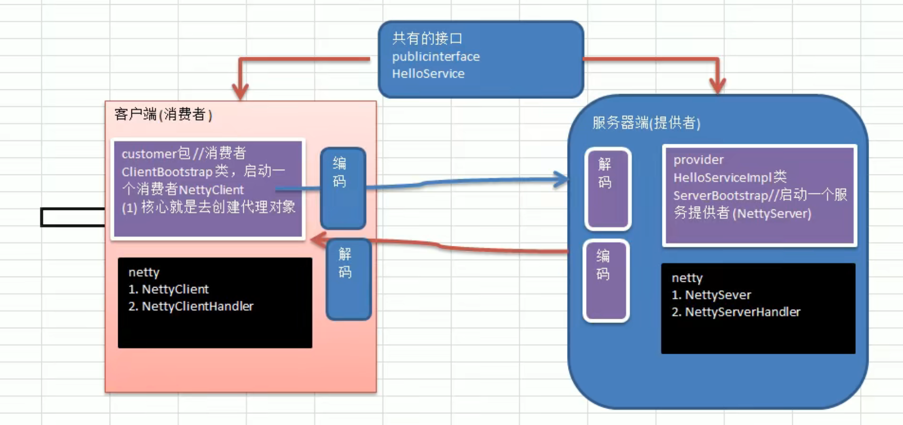

##  1. Netty简介

1. Netty是一个异步的，基于事件驱动的网络应用框架。用于开发高性能的，高可靠性的网络应用程序。Netty本质上是一个NIO框架。

   

2. Netty组织结构

   

3. Netty有3,4,5三个大版本，其中最新的5版本由于出现了重大bug，就不维护了，现在一直在维护的是4这个大版本，所以推荐使用4这个大版本

## 2. IO模型

**java共支持三种网络IO模型：BIO,NIO,AIO**

### 2.1 BIO

1. 同步阻塞（传统的阻塞型IO）

2. 服务器实现方式是一个连接一个线程处理，即客户端发起连接请求时，服务端就需要新建一个线程去处理

3. 如果这个连接不做任何事会造成不必要的线程开销

4. BIO适用于连接数目较少且固定的情况，这种方式对服务器资源要求较高（一个连接一个线程），jdk1.4之前唯一的选择，但程序简单易理解

   

#### 2.1.1 JAVA BIO

**java BIO就是传统的java IO编程**，相关的类和接口在**java.io**包里面，在java bio编程里面可以使用**线程池技术**实现多客户端连接，提高性能，但是并不能解决BIO本身的瓶颈。

#### 2.1.2 JAVA BIO实例 

> **简单流程**

1. 服务端启动一个ServerSocket
2. 客户端启动socket对服务器进行通讯，默认情况下服务器端需要对每一个客户端建立一个线程与之通信
3. 客户端发出请求后，先咨询服务器是否有线程响应，如果没有则会等待或者被拒绝
4. 如果有相应，客户端会等待服务器端返回结果（也就是请求结束）才会继续执行任务

```java
public class Server {
    public static void main(String[] args) throws IOException {
        //利用JDK自带的线程池
        ExecutorService threadPool = Executors.newCachedThreadPool();
        //创建ServerSocket
        ServerSocket serverSocket = new ServerSocket(9090);
        System.out.println("start server success.");
        while (true) {
            System.out.println("Current thread id is " + Thread.currentThread().getId() + ", Current thread name is " + Thread.currentThread().getName());
            //监听，等待客户端连接, accept方法是阻塞型方法，没有连接时，会阻塞在这里
            System.out.println("server wait for connect from client.");
            Socket socket = serverSocket.accept();
            System.out.println("a client connected.");
            threadPool.execute(() -> {
                handler(socket);
            });
        }
    }

    public static void handler(Socket socket) {
        try {
            System.out.println("Current thread id is " + Thread.currentThread().getId() + ", Current thread name is " + Thread.currentThread().getName());
            byte[] bytes = new byte[1024];
            //通过socket获取输入流
            InputStream inputStream = socket.getInputStream();
            //循环的读取客户端发送的数据
            while (true) {
                System.out.println("Current thread id is " + Thread.currentThread().getId() + ", Current thread name is " + Thread.currentThread().getName());
                System.out.println("server wait for data from client.");
                //readCount表示读取到的字节数，如果没有读取到数据返回-1
                //read方法也是阻塞的，如果管道没有数据，线程会阻塞在这里
                int readCount = inputStream.read(bytes);
                if (readCount != -1) {
                    System.out.println("The data get from client: " + new String(bytes, 0, readCount, StandardCharsets.ISO_8859_1));
                } else {
                    break;
                }
            }
        } catch (IOException e) {
            e.printStackTrace();
        } finally {
            System.out.println("close the connect to client.");
            try {
                socket.close();
            } catch (IOException e) {
                e.printStackTrace();
            }
        }
    }
}
```

### 2.2 NIO

1. 同步非阻塞

2. 服务器实现方式是一个线程处理多个请求（连接），即客户端发起的连接请求都会注册到IO多路复用器上，IO多路复用器轮询到连接有IO请求就处理

3. 适用于连接数目多且连接比较短（轻操作）的情况，程序编写较复杂，**jdk1.4支持**

   

#### 2.2.1 JAVA NIO

* JAVA NIO相关的类都放在java.nio及其子包里面，并且对java.io包里面很多的类进行了重写

* NIO里面有三大核心组件，**channel，buffer，selector**

* **JAVA 的NIO使用的是reactor模式**，当有事件触发时，服务端得到通知就进行相应的处理

* NIO是面向缓冲区或者是面向块编程的，数据会被读取到一个稍后处理的缓冲区，需要时可以在缓冲区里前后移动，增加了处理过程中的灵活性，可以提供非阻塞式的高伸缩性网络

* JAVA NIO非阻塞模式，使一个线程从某通道发送请求或读取数据，但是它只能得到目前可用的数据，如果没有数据可用，就什么都不会获取，而不是保持线程处于阻塞的状态，所以直到数据变得可读取之前，该线程可以继续做其它事情。非阻塞写也是如此，一个线程请求写入数据到通道，，不需要等待数据完全写入，这个线程可以处理其它事情

  

  

#### 2.2.2 JAVA NIO与BIO区别

1. BIO以流的方式处理数据，而NIO以块的方式处理数据，块IO的效率要比流IO高很多
2. BIO基于字节流和字符流进行操作，而NIO基于Channel和Buffer进行操作，数据总是从通道读取到缓冲区，或者从缓冲区写道通道里面，Selector用于监听多个通道的事件，，比如连接请求，数据到达，因此使用单个线程就可以监听多个客户端的请求连接。

#### 2.2.3 JAVA NIO三大核心组件的关系


1. 每个channel都对应一个buffer
2. 每个thread对应一个selector，一个selector对应多个channel（连接）
3. selector切换到哪个channel是由event（事件）决定的
4. buffer就是一个内存块，底层实现是数组
5. 数据的读取和写入都是通过buffer完成的，BIO中读取和写入都是通过输入输出流来完成，BIO中不能双向操作，但是NIO中通过buffer是可以双向操作的，通过flip()函数切换
6. channel也是双向的，可以返回底层操作系统的情况。Linux系统底层的通道也是双向的

### 2.3 AIO

1. 异步非阻塞，可以看作是NIO2.0，是NIO的升级
2. AIO引入异步通道的概念，**采用Proactor模式**，简化程序的编写，只会有效的请求才会启动线程
3. 它的特点是先由操作系统预处理完成后才会通知服务器端程序去启动线程处理请求
4. 适用于连接数目多且连接长（重操作）的情况，充分调用操作系统参与并发操作，程序较复杂，**jdk1.7支持**
5. 目前还没有广泛使用

### 2.4 NIO BIO AIO对比

|          |   BIO    |          NIO           |    AIO     |
| :------: | :------: | :--------------------: | :--------: |
|  IO模型  | 同步阻塞 | 同步非阻塞（多路复用） | 异步非阻塞 |
| 编程难度 |   简单   |          复杂          |    复杂    |
|  可靠性  |    差    |           好           |     好     |
|  吞吐量  |    低    |           高           |     高     |

## 3. Buffer

* buffer本质上是一个可读写数据的内存块，可以理解成是一个容器对象（含数组）。缓冲区对象内置了一些机制，能够跟踪和记录缓冲区的状态变化情况。channel提供从文件或者网络里面读取数据的通道，但是读取和写入数据都必须经由buffer。

### 3.1 Buffer类

**在JAVA BIO中Buffer是一个顶层父类，它是一个抽象类**


### 3.2 ByteBuffer


**ByteBuffer支持类型化的put和get，也就是说buffer里面put了什么类型的数据，在get的时候就应该使用什么类型数据的获取方法去获取数据，否则可能会抛出BufferUnderflowException，注意只是可能，有的情况取数据并不会抛出这个异常**

### 3.3 只读Buffer

**可以将一个普通Buffer转为只读Buffer**，例如HeapByteBuffer转为只读Buffer之后类型就变成HeapByteBufferR

```java
buffer.asReadOnlyBuffer();
//只读buffer如果放数据会抛出ReadOnlyBufferException
```

### 3.4 MappedByteBuffer

**这个buffer可以让文件直接在堆外内存进行修改，操作系统不需要再拷贝一次，而如何同步到文件由NIO来完成**

```java
public class MappedByteBufferDemo {
    public static void main(String[] args) throws IOException {
        RandomAccessFile file = new RandomAccessFile("target.txt", "rw");
        FileChannel channel = file.getChannel();
        /**
         *  param 1 映射模式
         *  param 2 开始映射位置
         *  param 3 映射的数据大小
         */
        MappedByteBuffer mappedByteBuffer = channel.map(FileChannel.MapMode.READ_WRITE, 0, 5);
        mappedByteBuffer.put(0, (byte) 'h');
        file.close();
    }
}
```

### 3.5 文件的分散和聚集

* 将数据写入到Buffer时可以可以采用Buffer数组，依次写入Buffer           Scattering
* 从Buffer读取数据时，可以采用Buffer数组依次读取               Gathering

```java
public class ScatteringAndGatheringDemo {
    public static void main(String[] args) throws IOException {
        ServerSocketChannel serverSocketChannel = ServerSocketChannel.open();
        InetSocketAddress socketAddress = new InetSocketAddress(9090);
        serverSocketChannel.socket().bind(socketAddress);
        //声明一个ByteBuffer数组
        ByteBuffer[] byteBuffers = new ByteBuffer[2];
        byteBuffers[0] = ByteBuffer.allocate(5);
        byteBuffers[1] = ByteBuffer.allocate(3);

        //等待客户端连接
        SocketChannel socketChannel = serverSocketChannel.accept();
        //假设从客户端接受8个字节的数据
        int messageLength = 8;
        //循环读取
        while (true) {
            int byteRead = 0;
            while (byteRead < messageLength) {
                //传进去一个byteBuffer数组，内部知道数据怎么放进每一个byteBuffer里面
                long readCount = socketChannel.read(byteBuffers);
                byteRead += readCount;
                System.out.println("byteRead = " + byteRead);
                Arrays.asList(byteBuffers).stream().map(byteBuffer -> "position = " + byteBuffer.position() + ", limit = " + byteBuffer.limit()).forEach(System.out::println);
            }
            Arrays.asList(byteBuffers).forEach(byteBuffer -> byteBuffer.flip());


            //将数据读出显示到客户端
            int byteWrite = 0;
            while (byteWrite < messageLength){
                long writeCount = socketChannel.write(byteBuffers);
                byteWrite += writeCount;
            }
            Arrays.asList(byteBuffers).forEach(byteBuffer -> byteBuffer.clear());
            System.out.println("byteRead = " + byteRead + ", byteWrite = " + byteWrite);
        }
    }
}
```

## 4. Channel

1. NIO的通道类似于流，但是有些区别
   1. **通道可以同时进行读写，**但是流只能读或者只能写
   2. 通道可以实现异步读写数据
   3. 通道可以从缓冲区读取数据，也可以写数据到缓冲区
2. BIO中stream是单向的，例如FileInputStream对象只能进行读取数据的操作
3. Channel在JAVA NIO中是一个接口，常用的实现类有**FileChannel,DatagramChannel,ServerSocketChannel,SocketChannel**
4. FileChannel用于文件的数据读写，DatagramChannel用于UDP数据的读写，ServerSocketChannel和SocketChannel用于TCP数据的读写

### 4.1 FileChannel


#### 4.1.1 数据写入文件

```java
public class FileChannelApplication {
    public static void main(String[] args) throws IOException {
        String targetMessage = "Hello WDY";
        FileOutputStream fileOutputStream = new FileOutputStream("./target.txt");
        FileChannel channel = fileOutputStream.getChannel();
        ByteBuffer byteBuffer = ByteBuffer.allocate(15);
        //将要写入的数据放到buffer中
        byteBuffer.put(targetMessage.getBytes());
        //将buffer由写通道变为读通道
        byteBuffer.flip();
        //将byteBuffer里面的数据写入到channel中
        channel.write(byteBuffer);

       fileOutputStream.close();
    }
}
```

#### 4.1.2 读取文件数据

```java
public class FileChannelApplication {
    public static void main(String[] args) throws IOException {
        File file = new File("./target.txt");
        FileInputStream fileInputStream = new FileInputStream(file);
        FileChannel channel = fileInputStream.getChannel();
        ByteBuffer byteBuffer = ByteBuffer.allocate((int) file.length());
        //将通道的数据读到buffer里面
        channel.read(byteBuffer);
        System.out.println(new String(byteBuffer.array()));
        fileInputStream.close();
    }
}
```

#### 4.1.3 数据复制

```java
public class FileChannelApplication {
    public static void main(String[] args) throws IOException {
        File file = new File("./target.txt");
        FileInputStream fileInputStream = new FileInputStream(file);
        File newFile = new File("./newTarget.txt");
        FileOutputStream fileOutputStream = new FileOutputStream(newFile);
//        ByteBuffer byteBuffer = ByteBuffer.allocate((int) file.length());
//        fileInputStream.getChannel().write(byteBuffer);
//        fileOutputStream.getChannel().read(byteBuffer);
        ByteBuffer byteBuffer = ByteBuffer.allocate(5);
        //循环读取文件
        while (true) {
            //记住这里每次读取数据之前需要清空数据，实际上是将一些标志位复位
            byteBuffer.clear();
            int read = fileInputStream.getChannel().read(byteBuffer);
            if (read == -1) {
                break;
            }
            byteBuffer.flip();
            fileOutputStream.getChannel().write(byteBuffer);
        }
        fileInputStream.close();
        fileOutputStream.close();
    }
}
```

#### 4.1.4 文件拷贝

```java
public class FileChannelApplication {
    public static void main(String[] args) throws IOException {
        File file = new File("./test.jpg");
        FileInputStream fileInputStream = new FileInputStream(file);
        File newFile = new File("./newTest.png");
        FileOutputStream fileOutputStream = new FileOutputStream(newFile);
        fileOutputStream.getChannel().transferFrom(fileInputStream.getChannel(), 0, fileInputStream.getChannel().size());
        fileInputStream.close();
        fileOutputStream.close();
    }
}
```
### 4.2 ServerSocketChannel

**ServerSocketChannel负责在服务端监听新的客户端Socket连接**

> 常用方法：

1. open() 得到一个ServerSocketChannel通道
2. bind() 设置服务器提供服务的端口
3. configureBlocking() 设置阻塞或非阻塞模式
4. accept() 接受一个连接，返回代表这个连接的通道对象
5. register() 注册一个选择器并设置监听事件

### 4.3 SocketChannel

SocketChannel，网络IO通道，负责进行读写操作，NIO把缓冲区的数据写入通道，或者·把通道里的数据读到缓冲区

> 常用方法：

1. open() 得到一个SocketChannel通道
2. configureBlocking() 设置阻塞或非阻塞模式
3. connect() 连接服务器
4. finishConnect() 如果使用connect()方法连接失败，接下来就需要通过该方法完成连接操作
5. write() 往通道里面写数据
6. read() 从通道里面读数据
7. register(Selector s, int ops, Object att) 注册一个选择器并设置监听事件，最后一个参数可以设置共享数据，一般是buffer，可以通过SelectionKey.attachment()方法拿到这个attachment，因为每一个SelectionKey都是和channel对应的
8. close() 关闭通道

## 5. Selector

* Selector能够**检测多个注册的通道上是否有事件发生**（多个channel以事件的方式可以注册到同一个channel上），如果有事件发生，便获取事件然后针对每个事件进行对应的处理。这样就可以实现只用一个线程去管理多个通道，也就是管理多个连接和请求。
* **只有在连接/通道真正有读写事件发生时，才会进行读写**，就大大减少了系统开销
* 因为可以单线程管理多个连接，避免了多线程上下文切换造成的额外开销
* **Netty的NioEventLoop聚合了Selector**，可以同时处理成百上千个连接
* 当线程从某客户端socket通道进行读写数据时，若没有数据可用时，该线程可以进行其它任务
* 线程通常将非阻塞IO的空闲时间用于在其它通道上执行IO操作

### 5.1 Selector类

**Selector类是一个抽象类**

常用方法：

1. open() 得到一个选择器对象
2. select(long timeout) 监控所有注册的通道，当其中有IO操作可以进行时，将通道对应的selectionKey加入到内部集合中并返回，参数用来设置超时时间
   1. select() 阻塞
   2. select(long time) 指定阻塞多长时间，在这时间之后返回
   3. wakeup() 唤醒selector
   4. selectNow() 不阻塞，立马返回
3. selectedKeys() 从内部集合中得到所有的selectionKey

### 5.2 NIO非阻塞网络编程原理

1. 当客户端连接时，会通过ServerSocketChannel得到SocketChannel，
2. 将SocketChannel注册到Selector上，使用register()方法，一个Selector上可以注册多个SocketChannel
3. 注册后返回一个SelectionKey，会和该Selector关联（集合）
4. Selector进行监听，使用select()方法，返回有事件发生的通道的个数
5. 进一步得到各SelectionKey，再通过SelectionKey反向获取SocketChannel，使用channel()方法
6. 然后根据得到的channel完成业务处理

```java
public class NIOServer {
    public static void main(String[] args) throws IOException {
        //1.创建ServerSocketChannel
        ServerSocketChannel serverSocketChannel = ServerSocketChannel.open();
        //2.创建Selector实例
        Selector selector = Selector.open();
        //3.绑定一个端口，在服务器端进行监听
        serverSocketChannel.socket().bind(new InetSocketAddress(9090));
        //4.设置为非阻塞模式
        serverSocketChannel.configureBlocking(false);
        //5.把ServerSocketChannel注册到Selector，ServerSocketChannel关心的事件是OP_ACCEPT，也就是接收连接的事件
        serverSocketChannel.register(selector, SelectionKey.OP_ACCEPT);
        //6.循环等待客户端连接
        while (true) {
            //等待1s，看是否有注册的事件发生，这里指的是SelectionKey.OP_ACCEPT事件
            if (selector.select(1000) == 0) {
                System.out.println("服务器等待了1s, 没有客户端建立连接.");
                continue;
            }
            //如果不为0，表示已经获取到关注的事件，则获取相关的SelectionKey集合，然后再通过这个集合反向获取channel
            Set<SelectionKey> selectionKeys = selector.selectedKeys();
            //遍历selectionKeys集合
            Iterator<SelectionKey> iterator = selectionKeys.iterator();
            while (iterator.hasNext()) {
                //获取到selectionKeys
                SelectionKey selectionKey = iterator.next();
                //判断selectionKeys的类型
                if (selectionKey.isAcceptable()) {
                    //如果是OP_ACCEPT则表示有新的客户端连接，accept方法是阻塞的
                    SocketChannel socketChannel = serverSocketChannel.accept();
                    System.out.println("客户端连接成功，生成一个socketChannel， socketChannel hashcode = " + socketChannel.hashCode());
                    //注意这里要将socketChannel设置为非阻塞模式，否则当有客户端连接时会抛出IllegalBlockingModeException
                    socketChannel.configureBlocking(false);
                    //将当前socketChannel注册到Selector上，关注事件为OP_READ，同时给socketChannel关联一个buffer
                    socketChannel.register(selector, SelectionKey.OP_READ, ByteBuffer.allocate(1024));
                } else if (selectionKey.isConnectable()) {

                } else if (selectionKey.isReadable()) {
                    //通过key反向获取相应的channel
                    SocketChannel socketChannel = (SocketChannel) selectionKey.channel();
                    //获取该channel关联的buffer
                    ByteBuffer byteBuffer = (ByteBuffer) selectionKey.attachment();
                    socketChannel.read(byteBuffer);
                    System.out.println("receive data from client, the data is " + new String(byteBuffer.array()) + ".");
                } else if (selectionKey.isWritable()) {

                } else {

                }
                //手动从集合中移除当前的selectionKey，防止重复操作
                iterator.remove();
            }
        }
    }
}
```

```java
public class NIOClient {
    public static void main(String[] args) throws IOException {
        //新建一个网络通道
        SocketChannel socketChannel = SocketChannel.open();
        //设置非阻塞
        socketChannel.configureBlocking(false);
        //提供服务器的ip和端口
        InetSocketAddress socketAddress = new InetSocketAddress("127.0.0.1", 9090);
        //连接服务
        /*if (socketChannel.connect(socketAddress)) {
            //连接成功，发送数据
            String sendMessage = "Hello server, my name is client.";
            //将一个字节数组转为ByteBuffer，之前都是通过allocate方法手动分配一个指定大小的ByteBuffer
            ByteBuffer byteBuffer = ByteBuffer.wrap(sendMessage.getBytes());
            //发生数据，也就是将数据写入到channel里面
            socketChannel.write(byteBuffer);
        } else {
            //连接服务失败
            while (!socketChannel.finishConnect()) {
                System.out.println("因为连接需要时间，客户端不会阻塞，可以做其它工作.");
            }
        }*/
        if (!socketChannel.connect(socketAddress)) {
            //连接服务失败
            while (!socketChannel.finishConnect()) {
                System.out.println("因为连接需要时间，客户端不会阻塞，可以做其它工作.");
            }

        }
        //连接成功，发送数据
        String sendMessage = "Hello server, my name is client.";
        //将一个字节数组转为ByteBuffer，之前都是通过allocate方法手动分配一个指定大小的ByteBuffer
        ByteBuffer byteBuffer = ByteBuffer.wrap(sendMessage.getBytes());
        //发生数据，也就是将数据写入到channel里面
        socketChannel.write(byteBuffer);
        System.in.read();
    }
}
```

### 5.3 SelectionKey

> **SelectionKey表示Selector和网络通道的注册关系**，共四种

1. OP_ACCEPT 表示有新的网络连接可以accept ，值为 1<<4=16
2. OP_READ 代表读操作，值为1<<0 =1
3. OP_WRITE 代表写操作，值为1<<2=4
4. OP_CONNECT 表示连接已经建立，值为1<<3=8

> **常用方法**

1. selector() 得到与之关联的Selector对象
2. channel() 得到与之关联的通道
3. attachment() 得到与之关联的共享数据，一般是buffer
4. interestOps() 设置或改变监听的事件
5. isAcceptable() 是否可以accept
6. isWritable() 是否可写
7. isReadable() 是否可读

## 6. 零拷贝

1. 零拷贝是网络编程的关键，和网络IO性能的优化关系密切
2. 在JAVA程序中，常用的零拷贝技术有**mmap（内存映射）和sendFile**
3. **零拷贝不是指不需要拷贝，它指的是从操作系统角度看不需要CPU参与拷贝**
4. 零拷贝是从操作系统角度看的，零拷贝实现了在内核空间里面，没有数据是重复的，只有内核缓冲区里面有一份数据
5. 零拷贝不仅带来了更少的数据复制，还带来：减少了用户态和内核态之间的切换，更少的CPU缓存伪共享和无CPU校验和计算

**mmap和sendFile对比**

1. mmap适合小数据量读写，sendFile适合大文件读写
2. mmap需要四次内核态和用户态的切换，3次文件拷贝，sendFile需要三次上下文切换，最少两次数据拷贝
3. sendFile可以利用DMA方式，减少CPU拷贝，mmap则不能（必须从内核拷贝到Socket缓冲区）

## 7. 线程模型

目前存在的线程模型有

1. 传统阻塞IO服务模型

   

   > **特点**：

   * 采用阻塞IO模式获取输入的数据
   * 每个连接都需要独立的线程完成数据的输入，业务处理和数据返回

   > **缺点**：

   * 当并发数很大时，就需要创建很多线程去处理，占用较多资源
   * 连接创建后，如果当前线程没有数据可读就会阻塞在read操作上，造成线程资源的浪费

2. Reactor模式

   根据Reactor的数量和处理资源池线程的数量不同，有下面三种形式

   1. 单Reactor单线程
   2. 单Reactor多线程
   3. 主从Reactor多线程

**Netty的线程模型就是主要基于改进的主从Reactor多线程模型，主从Reactor里面有多个Reactor**

## 8. Reactor模式

> Reactor模式针对传统阻塞型线程模型的两大缺点给出了解决方案：

1. IO复用：多个连接共用一个阻塞对象，应用程序只需在一个阻塞对象上等待即可，无需阻塞等待所有连接，当某个连接有新的数据可以处理时，操作系统会通知应用程序，线程从阻塞状态返回，开始进行业务处理
2. 线程池复用线程资源：不必再为每个连接创建线程，将连接完成后的业务处理任务分配给线程执行，一个线程可以处理多个连接的业务


1. Reactor模式，一个或多个输入同时传递给ServiceHandler，基于事件驱动
2. 服务端处理传入的多个请求，并将它们分发到相应的线程进行处理，因此Reactor模式也叫Dispatcher模式
3. Reactor模式采用IO复用，主要体现在ServiceHandler那里的处理

> **Reactor模式核心组成：**

1. Reactor：Reactor在一个单独的线程中运行，负责监听和分发事件，分发给适当的处理程序来对IO事件做出响应
2. Handler：处理程序执行IO事件要完成的实际事件，负责实际操作的一个角色，Reactor通过调度适当的处理程序来响应IO事件，处理程序执行非阻塞操作

### 8.1 单Reactor单线程


1. select是前面IO复用模型介绍的标准网络编程API，可以实现应用程序通过一个阻塞对象监听多路连接请求
2. Reactor对象通过select监听客户端请求事件，收到事件后通过Dispatcher进行分发
3. 如果是建立连接的请求，则由Accept通过accept处理来连接请求，然后创建一个handler对象去处理连接完成后的后续业务处理工作
4. 如果不是建立连接的事件，则Reactor会分发调用连接对应的handler来响应
5. handler会完成read->业务处理->send的完整业务流程

> **优点**：

1. 模型简单，没有多线程，多进程之间的通信以及竞争等问题

> **缺点**：

1. 只有一个线程，效率低，无法发挥CPU性能，handler在处理某个连接的业务时，整个进程无法处理其它连接的业务请求
2. 可靠性低，如果线程意外终止，或者进入死循环，会导致整个系统不能处理外部事件

> **使用场景**：

客户端的数量有限，业务处理快速，等待的事件可以很快得到响应，

### 8.2 单Reactor多线程


1. Reactor对象通过select监听客户端请求事件，收到事件后通过Dispatcher进行分发
2. 如果是建立连接的请求，则由Accept通过accept处理来连接请求，然后创建一个handler对象去处理连接完成后的后续业务处理工作
3. 如果不是建立连接的事件，则Reactor会分发调用连接对应的handler来响应
4. handler只负责响应事件，并不做具体的处理，通过read读取数据之后，会分发给后面worker线程池里面的某个worker线程去处理真正的业务请求
5. worker线程池会分配独立线程去处理业务请求，并将结果返回给handler
6. handler收到响应之后会将结果通过send返回给client

> **优点**：

1. 可以充分利用CPU多核性能

> **缺点**：

1. 多线程数据共享和访问比较复杂
2. 虽然使用了多线程，但是多线程只是用在了具体的业务处理里面，在Reactor分发请求给handler那里还是单线程，如果请求很多，这里依然会因为单线程出现性能瓶颈

**适用场景**：

### 8.3 主从Reactor


1. **一个Reactor主线程可以对应多个Reactor子线程**，只是图中画了一个而已
2. Reactor主线程MainReactor对象通过select监听连接事件，收到事件之后，通过acceptor处理连接请求
3. 当Acceptor处理连接事件后，MainReactor将连接分配给SubReactor
4. SubReactor将连接加入到连接队列进行监听，并创建handler进行各种事件处理
5. 当有新事件发生时，SubReactor就会调用对应的handler处理
6. handler通过read读取数据，分发给后面的worker线程进行处理
7. worker线程池分配独立的worker线程进行业务处理，并返回结果
8. handler收到响应的结果后，再通过send将结果返回给client

> **优点**：

1. 父线程与子线程的职责明确，父线程只需接收新连接，子线程完成后续的业务处理
2. 父线程与子线程的数据交互简单，Reactor主线程只需把新连接传给子线程，子线程无需返回数据

> **缺点**：

1. 编程复杂度高

> **应用场景**：

1. Nginx使用的是主从Reactor多进程模型

2. Memcached使用的是主从Reactor多线程模型

3. Netty使用的是改进的主从Reactor多线程模型

### 8.4 Netty线程模型


1. Netty抽象出两组线程池，这两个线程组都是无限循环
   1. BossGroup专门负责接收客户端的连接
   2. WorkerGroup 专门负责网络的IO
   3. BossGroup和WorkerGroup 的类型都是NioEventLoopGroup
   4. BossGroup和WorkerGroup含有的子线程(NioEventLoop)个数默认是CPU核数*2，这里的核数指的是几核几线程中的几线程，当事件来临时，这些子线程的任务分配是通过轮询的方式来的，即一个一个被分配执行任务，一遍完了再回头重新开始分配
2. NioEventLoopGroup相当于一个事件循环组，这个循环组里面有多个事件循环(NioEventLoop)，每一个事件循环就是NioEventLoop，每个NioEventLoop可以看作是一个线程
3. NioEventLoop表示一个不断循环的执行处理任务的线程，每个NioEventLoop都有一个Selector，用于监听绑定在其上的Socket网络通讯
4. 一个Selector上可以注册监听多个NioChannel，每个NioChannel只会绑定在一个NioEventLoop上，每个NioChannel都绑定有一个自己的ChannelPipeline
5. NioEventLoopGroup可以有多个线程，即可以含有多个NioEventLoop
6. BossGroup模块每个NioEventLoop循环执行的步骤分为3步
   1. 轮询accept事件
   2. 处理accept事件，与client建立连接，生成NioSocketChannel，并将其注册到WorkerGroup模块NioEventLoop上的Selector
   3. 处理任务队列的任务，即RunAllTasks
7. WorkerGroup模块每个NioEventLoop循环执行的步骤分为3步
   1. 轮询read，write事件
   2. 处理io事件，在对应的NioSocketChannel里面处理
   3. 处理任务队列的任务，即RunAllTasks
8. WorkerGroup模块每个NioEventLoop处理业务时，会使用Pipeline（在Netty中用双向链表实现），Pipeline中包含了channel，即通过Pipeline可以获得channel，同时Pipeline中包含了很多处理器handler
9. channel中也包含了Pipeline，也可以通过channel获取Pipeline，这两者是互相包含的关系

### 8.5 taskQueue自定义任务

**每个NioEventLoop不仅有一个Selector，还有一个任务队列taskQueue，用于异步执行事件任务**

> 任务队列中的task有三种典型的应用场景：

1. 用户程序自定义的普通任务

   将任务提交到taskQueue队列中

   ```java
   ctx.channel().eventLoop().execute(() -> {
       try {
           //在这里模拟耗时操作
           Thread.sleep(10 * 1000);
           ctx.writeAndFlush(Unpooled.copiedBuffer("异步：hello 客户端，我是服务端....", CharsetUtil.UTF_8));
       } catch (InterruptedException e) {
           e.printStackTrace();
       }
   });
   ```

2. 用户自定义定时任务

   将任务提交到scheduleTaskQueue队列中

   ```java
   //自定义定时任务
   ctx.channel().eventLoop().schedule(() -> {
       try {
           //在这里模拟耗时操作
           Thread.sleep(10 * 1000);
           ctx.writeAndFlush(Unpooled.copiedBuffer("定时异步：hello 客户端，我是服务端....", CharsetUtil.UTF_8));
       } catch (InterruptedException e) {
           e.printStackTrace();
       }
   }, 2, TimeUnit.SECONDS);
   ```

3. 非当前Reactor线程调用channel的各种方法，例如在推送系统的任务线程里面，根据用户的标识，找到对应的channel引用，然后调用write方法向用户推送消息。这种操作就会把write任务提交到taskQueue里面异步消费

### 8.6 异步模型

1. 当一个异步过程调用发出之后，调用者不能立即得到结果，，实际处理这个调用的组件在完成后，通过状态，通知和回调来通知调用者
2. **Netty的NIO操作是异步的，包括bind，write，connect等操作会简单的返回一个ChannelFuture对象**
3. Netty中调用者不能立即得到结果，而是通过**Future-Listen机制**，用户可以方便地主动获取或者通过通知机制获得IO操作结果
4. **Netty的异步模型是基于jdk的future和callback基础之上的**
5. ChannelFuture是一个接口，我们可以添加监听器，，当监听的事件发生时，就会通知到监听器


1. 上图中上面的流程是出站，下面是入站
2. Netty中拦截操作和转换出入站数据只需要提供callback和future即可

#### 8.6.1 Future-Listen机制

1. 当Future对象刚创建的时候，处于非完成状态，调用者可以通过返回的ChannleFuture对象来获取操作执行的状态，还可以注册监听函数来执行完成后的操作
2. 常见操作
   1. 通过isDone来判断当前操作是否完成
   2. 通过isSuccess来判断已完成的当前操作是否成功执行
   3. 通过getCause来获取已完成的当前操作失败的原因
   4. 通过isCancelled来判断已完成的当前操作是否已取消
   5. **通过addListener来注册监听器**，当操作已完成(isDone方法返回完成)，将会通知指定的监听器，如果Future对象已完成，则会通知指定的监听器

```java
channelFuture.addListener((ChannelFutureListener) future -> {
                    if (finalChannelFuture.isSuccess()){
                        System.out.println("服务端监听9090端口成功....");
                    }else{
                        System.out.println("服务端监听9090端口失败, 原因是" + finalChannelFuture.cause() + "......");
                    }
                });
```

## 9. Netty核心模块

### 9.1 BootStrap和ServerBootStrap

一个netty应用通常由一个BootStrap开始，**主要作用是配置整个Netty程序**，串联各个组件，**Netty中BootStrap是客户端的启动引导类，ServerBootStrap是服务端的启动引导类**

> 常见方法：

1. ServerBootstrap group(EventLoopGroup parentGroup, EventLoopGroup childGroup)

   该方法用于服务端，用来设置两个EventLoopGroup 

2. B group(EventLoopGroup group)

   该方法用于客户端，用来设置一个EventLoopGroup 

3. B channel(Class<? extends C> channelClass)

   该方法用来设置服务端的通道实现

4. <T> B option(ChannelOption<T> option, T value)

   用来给ServerChannel添加配置

5. <T> ServerBootstrap childOption(ChannelOption<T> childOption, T value)

   用来给接收到的通道添加配置

6. ServerBootstrap childHandler(ChannelHandler childHandler)

   该方法用来设置业务处理类（自定义的handler），该方法是给WorkerGroup加handler

7. B handler(ChannelHandler handler)

   注意和上面childHandler区分，两个传递的参数都是ChannelHandler ，该方法是给BossGroup加handler

8. ChannelFuture bind(int inetPort)

   该方法用于服务端，用来设置提供服务的端口

9. ChannelFuture connect(String inetHost, int inetPort)

   该方法用于客户端，用来连接服务器

### 9.2 Future和ChannelFuture

Netty中所有的IO操作都是异步的，不能立刻得知消息是否被正确处理，但是可以等他执行完成或者注册一个监听器，具体就是通过Futrue和ChannelFuture，它们可以注册监听器，当操作成功或者失败时会自动触发监听的事件

>常见方法

1. Channel channel()

   返回当前正在进行IO操作的通道

2. ChannelFuture sync()

   等待异步操作执行完毕。因为Netty中的操作都是异步的，所以通过这个方法可以实现阻塞等待异步操作执行完毕，实现同步的效果

### 9.3 Channel

1. Netty网络通信的组件，能够用于执行网络IO的操作

2. 通过Channel可以获得当前网络连接的通道的状态

3. 通过Channel可以获得网络连接的配置参数（例如缓冲区的大小等）

4. Channel提供异步的网络IO操作（例如建立连接，绑定端口，读写等），异步调用意味着任何IO操作都是立即返回的，但是不能立刻拿到操作的结果，不保证在调用结束时所执行的IO操作已完成

5. 调用立即返回一个ChannelFuture实例，通过注册监听器到ChannelFuture上，可以实现在IO操作执行完成后将状态回调通知调用方

6. 支持关联IO操作与对应的处理程序

7. 不同协议，不同阻塞类型的连接都有不同类型的channel与之对应

   > 常用channel类型

   1. NioSocketChannel 异步的客户端TCP socket连接
   2. NioServerSocketChannel 异步的服务端TCP socket连接
   3. NioDatagramChannel 异步的UDP连接
   4. NioSctpChannel 异步的客户端Sctp连接
   5. NioSctpServerChannel 异步的服务端Sctp连接

### 9.4 Selector

1. Netty基于Selector对象实现IO多路复用，通过Selector一个线程可以监听多个连接的channel事件
2. 当向一个Selector中注册channel后，Selector内部的机制就可以自动不断查询这些注册的channel是否有已就绪的IO事件

### 9.5 ChannelHandler及其实现类

1. ChannelHandler是一个接口，处理IO事件或者拦截IO操作，并将其转发到其ChannelPipeline（业务处理链）中的下一个处理程序
2. ChannelHandler本身没有提供很多方法，在使用时优先选择其实现子类

> ChannelHandler及其实现类


3. ChannelPipeline提供了ChannelHandler链的容器
4. 自定义一个Handler需要去继承ChannelInBoundHandlerAdapter(入站)或者ChannelOutboundHandlerAdapter(出站)，然后通过重写方法实现业务逻辑，具体方法见类的源码。其实去继承它们的子类效果更好，例如SimpleChannelInboundHandler，子类可以指定泛型，这样在处理消息的时候就不需要消息的类型转换了。

### 9.6 Pipeline和ChannelPipeline

1. ChannelPipeline是一个handler的集合，他负责处理和拦截出站和入站的事件，相当于一个贯穿Netty的链

2. ChannelPipeline实现了一种高级形式的拦截过滤器模式，使用户可以完全控制事件的处理方式，以及Channel中各个ChannelHandler如何交互

3. 在Netty中，每个channel都有且仅有一个ChannelPipeline与之对应，而ChannelPipeline中又维护了一个由ChannelHandlerContext组成的双向链表，并且每个ChannelHandlerContext中又关联着一个ChannelHandler

4. 入站事件和出站事件在一个双向链表中，入站事件会从链表head往后传递到最后一个入站的handler，出站事件会从链表tail往前传递到第一个出站的handler，两种类型的handler互不干扰

   

   > 常用方法

   1. ChannelPipeline addFirst(ChannelHandler... handlers)

      把一个业务处理类handler添加到链中的第一个位置

   2. ChannelPipeline addLast(ChannelHandler... handlers)

      把一个业务处理类handler添加到链中的最后一个位置

### 9.7 ChannelHandlerContext

1. 保存channel相关的所有上下文信息，同时关联一个ChannelHandler对象
2. ChannelHandlerContext绑定了对应的channel和pipeline，方便对ChannelHandler进行调用

> 常用方法

1. close() 关闭通道

2. flush() 刷新

3. writeAndFlush() 将数据写到ChannelPipeline中当前ChanneHandler的下一个ChannelHandler开始处理（出站）。**该方法是异步** 

   **writeAndFlush可以调用ChannelHandlerContext的，也可以调用channel的 。主要区别就是前者是从当前handler流转到head节点，而后者则送从tail节点到head** 

### 9.8 ChannelOption

**Netty在创建channel实例之后，一般都需要设置ChannelOption参数**

> 常用参数

1. ChannelOption.SO_BACKLOG

   对应TCP协议listen函数中的backlog参数，用来初始化服务器可连接队列大小。服务端处理客户端连接请求是顺序处理的，所以同一时间只能处理一个客户端连接，多个客户端来的时候，服务端将不能处理的客户端连接请求放在队列里面等待处理，**backlog参数指定了队列的大小**

2. ChannelOption.SO_KEEPALIVE

   一直保持连接活动状态，也就是保持tcp长连接

### 9.9 EventLoopGroup和NioEventLoopGroup

1. EventLoopGroup是一组EventLoop的抽象，Netty为了利用多核CPU资源，一般会有多个EventLoop工作，每个EventLoop维护着一个Selector实例，也就是说每个EventLoop对应一个线程
2. EventLoopGroup提供next方法，可以从EventLoopGroup组里面按照指定的规则获取一个EventLoop来执行任务
3. 在Netty服务器端编程中一般都需要提供两个EventLoopGroup，BossGroup和WorkerGroup
4. 通常一个服务端口即一个ServerSocketChannel对应一个Selector和一个EventLoop线程。BossGroup负责接受客户端的连接并且将SocketChannel交给WorkerGroup来进行IO处理


> 常用方法

1. NioEventLoopGroup()  构造方法，创建一个group
2. shutdownGracefully()  断开连接，关闭线程

### 9.10 Unpooled

**这是Netty提供的一个专门用于操作缓冲区的工具类**

> 常用方法

1. Unpooled.buffer(int) 创建指定大小的buffer
2. Unpooled.copiedBuffer() 可以通过给定的数据和数据编码格式返回一个buffer

> ByteBuf

1. ByteBuf和java nio里面的ByteBuffer类似，底层也维护了一个数组array

2. ByteBuf在操作过程中不需要使用flip进行翻转

3. 底层维护了readerindex和writerindex两个变量，解决了flip反转的问题

4. 通过readerindex、writerindex和capacity将buffer分成了三个部分

   

> > 常用方法

1. writeByte() 往buffer里面写入数据
2. capacity() 获取buffer的长度，也就是底层数组的长度
3. getByte(int) 获取buffer指定位置的元素，这种方法读取数据，readerindex不会改变
4. readByte() 这个方法可以实现依次获取buffer里面的数据，不用指定位置，这种方法获取数据过程中readerIndex会变化的
5. array() 获取底层数组
6. hasArray()  返回buffer底层有没有字节数组，也就是有没有数据，这个返回为true，才能放心调用array方法
7. readerIndex() 返回readerindex
8. writerIndex() 返回writerindex
9. arrayOffset() 返回底层数组的偏移量
10. getCharSequence() 获取buffer执行范围的元素，类似string类的subString

### 9.11 编解码器

1. 在网络应用程序里面，数据在网络中的传输都是二进制，在发送数据时就需要编码，接收数据时就需要解码

   

2. Netty内置了一些编解码器，编码器本质上是一个ChannelHandler，解码对应入站，编码对应出站，可以把它们理解成实现了特定功能的handler

   1. StringEncoder和StringDecoder
   2. ObjectEncoder和ObjectDecoder

3. 当你通过Netty发送或者接收一个消息时，就会发生一次数据转换，入站消息会被解码，从字节转换为另一种格式（例如java对象），如果是出站消息，数据就会被编码成字节

4. Netty内置了一系列编解码器，它们都实现了ChannelInBoundHandler或者ChannelOutBoundHandler接口，在这些类中channleRead方法已经被重写。以入站为例，对于每个从入站channel读取的消息，channleRead方法会被调用，随后它将调用由已知编码器所提供的decode方法进行解码，并将已经解码的字节转发给ChannelPipeline中的下一个ChannelInBoundHandler

5. 在一个ChannelPipeline中同时加入编解码器是不影响的，因为解码器是InBound，编码器是OutBound，这两个编码器不可能同时都调用，调用哪个是根据出站还是入站判断的

> Netty内置编解码器的缺点

**我们在网络中传输Java对象的时候，可以使用Netty自带的ObjectEncoder和ObjectDecoder编解码器，但是它们底层是基于Java序列化的，Java序列化不仅效率低而且序列化的结果占用空间也大，而且无法实现跨语言使用**

#### 9.11.1 常用解码器

> 解码器ReplayingDecoder

1. abstract class ReplayingDecoder<S> extends ByteToMessageDecoder
2. ReplayingDecoder扩展了ByteToMessageDecoder，使用这个类，不必再调用ByteBuf的readableBytes方法，也就是不需要判断数据是否足够读取了，ReplayingDecoder内部会帮我们进行处理和判断
3. 泛型S指定了用户状态管理的类型，如果指定为Void表示不需要状态管理
4. 并不是所有的ByteBuf的操作都支持，如果调用了一个不被支持的方法会抛出一个异常
5. ReplayingDecoder在某些情况下的速度要慢于ByteToMessageDecoder，例如在网络缓慢并且消息格式复杂时，消息会被拆成多个碎片，速度变慢

```java
public class MyByteToLongDecoder extends ByteToMessageDecoder {
    /**
     * decode函数会根据接收数据的大小决定被调用几次
     * 直到没有数据被加入到list里面或者是ByteBuf里面没有更多的可读字节为止，
     *如果List<Object> out不为空，就会将list的内容传递给下一个ChannelInBoundHandler处理，因此ChannelInBoundHandler里面的方法也会被调用多次
     * @param ctx 上下文
     * @param in  入站的数据
     * @param out 将解码后的数据传给下一个handler
     * @throws Exception
     */
    @Override
    protected void decode(ChannelHandlerContext ctx, ByteBuf in, List<Object> out) throws Exception {
        //java里面long占8个字节，所以只有当缓冲区的字节数大于等于8时才去解码
        if (in.readableBytes() >= 8) {
            out.add(in.readLong());
        }
    }
}
```

```java
class MyByteToLongDecoder extends ReplayingDecoder<Void>{
    @Override
    protected void decode(ChannelHandlerContext ctx, ByteBuf in, List<Object> out) throws Exception {
        out.add(in.readLong());
    }
}
```

> LineBasedFrameDecoder

**它使用行尾控制字符（\n或者\r\n）作为分隔符来解析数据**

> DelimiterBasedFrameDecoder

**使用自定义的字符作为消息的分隔符**

> HttpObjectDecoder

解析HTTP数据

> LengthFieldBasedFrameDecoder

通过指定长度来标识整包信息，这样就可以自动的处理粘包问题


#### 9.11.2 常用编码器


#### 9.11.3 Google Protobuf

1. Protobuf是一种轻便高效的结构化数据存储格式，可以用于结构化数据串行化(序列化)，**适合用来做数据存储或者是RPC**
2. 是以message的形式管理数据的
3. protobuf对应的编解码器是ProtobufEncoder和ProtobufDecoder(解码器需要指定解码的数据类型)
4. 使用protobuf编译器能自动生成代码，它是将类的定义使用.proto文件进行描述，idea有编写proto文件的插件，可以语法高亮
5. 通过protoc.exe编译器编译.proto文件自动生成java文件


5. protobuf有三个大版本，2，3，4，4版本已经废弃，早就不维护了，2大版本太老，所以现在主流使用3大版本，版本信息可以在maven中央仓库查看

```protobuf
syntax = "proto3";  //版本
option java_outer_classname = "StudentPoJo";   //生成的外部类名，同时也是文件名
message Student {   //会在StudentPoJo外部类里面生成一个Student内部类，它才是真正发送的对象
  //id和name是Student类的数学，int32和string是protobuf里面的类型（为了跨平台，只有在编译之后才会生成具体语言的数据类型），不是java的，1和2不是属性的值，它们是属性的序号
  int32 id = 1;
  string name = 2;
}
```

```protobuf
syntax = "proto3";  //版本
option optimize_for = SPEED; //加快解析
option java_package = "com.wdy.multiprotobuf";
option java_outer_classname = "MyDataInfo";

//protobuf可以使用message管理其它message
message MultiMessage {
  //定义一个枚举类型
  enum DataType{
    StudentType = 0;   //在proto3里面要求enum的序号从0开始
    WorkerType = 1;
  }

  //用data_type来标识传的是哪一个枚举类型
  DataType dateType = 1;

  //表示每次枚举类型最多只能出现其中的一个，节省空间
  oneof dataBody{
    Student student = 2;
    Worker worker = 3;
  }
}

message Student {
  int32 id = 1;
  string name = 2;
}

message Worker{
  string name = 1;
  int32 age = 2;
}
```

### 9.12 入站与出站机制

**ChannelHandler充当了处理入站和出站数据的逻辑容器**

1. 以客户端程序为例，如果事件的运动方向是从客户端到服务端，那么这些事件为出站，出站事件中的数据会通过Pipeline中的一系列ChannelOutBoundHandler，并被这些Handler处理，反之为入站
2. 当你通过Netty发送或者接收一个消息时，就会发生一次数据转换，入站消息会被解码，从字节转换为另一种格式（例如java对象），如果是出站消息，数据就会被编码成字节
3. 以入站为例，对于每个从入站channel读取的消息，ChannelInBoundHandler的channelRead的方法会被调用，随后会调用由解码器提供的decode方法进行解码，并将已解码的字节转发给ChannelPipeline中的下一个ChannelInBoundHandler

### 9.13 心跳机制

> IdleStateHandler

1. **IdleStateHandler是netty提供的一个处理空闲状态的处理器**，在通道没有读写事件的时候，也就是空闲的时候会触发
2. 当IdleStateEvent触发之后，就会传递给channel的下一个handler去处理，通过调用下一个handler的userEventTriggered，在该方法里面处理IdleStateEvent

构造器参数：

1. observeOutput – whether or not the consumption of bytes should be taken into consideration when assessing write idleness. The default is false. 可选。
2. readerIdleTime – an IdleStateEvent whose state is IdleState.READER_IDLE will be triggered when no read was performed for the specified period of time. Specify 0 to disable. 表示多长时间没有读，就会发送一个心跳检测包检测是否连接
3. writerIdleTime – an IdleStateEvent whose state is IdleState.WRITER_IDLE will be triggered when no write was performed for the specified period of time. Specify 0 to disable.  表示多长时间没有写，就会发送一个心跳检测包检测是否连接
4. allIdleTime – an IdleStateEvent whose state is IdleState.ALL_IDLE will be triggered when neither read nor write was performed for the specified period of time. Specify 0 to disable.  表示多长时间没有读写，就会发送一个心跳检测包检测是否连接
5. unit – the TimeUnit of readerIdleTime, writeIdleTime, and allIdleTime 可选。 时间单位

## 10. WebSocket

1. WebSocket的数据传输是以帧的形式，netty中封装成了WebSocketFrame，它有六个子类

   

2. **WebSocketServerProtocolHandler的核心功能是将http协议升级为ws协议**，这个可以在浏览器看出，http的状态码是101，切换请求协议

   

   ```java
   pipeline.addLast(new WebSocketServerProtocolHandler("/hello"));
   ```

   ```javascript
   socket = new WebSocket("ws://127.0.0.1:8080/hello")
   ```

## 11. TCP粘包和拆包

**在TCP连接中，发送端为了更有效地将多个数据包发送给接收端，采用了Nagle优化算法，将多次间隔较小且数据量小的数据包合并成一个大的数据块，然后进行封包。这样做虽然提高了效率，但是给接收端区分数据包增加了难度。因为面向流的通信是无消息保护边界的。**

>解决办法

1. 自定义协议+编解码器

## 12. RPC

1. RPC（Remote Procedure Call）远程过程调用。远程过程调用可以实现一台计算机上的应用程序去调用另一台计算机上应用程序提供的服务，它们之间的调用就像是在本地调用一样。
2. **它本质上不是一种通讯协议，把它看成是一种思想，一种框架更合适**
3. **RPC使用一般包括通信协议和序列化协议两个**
4. 通讯协议可以使用TCP（dubbo）、HTTP（SpringCloud）,HTTP2(grpc)等，序列化协议(或者说消息格式)，可以采用JSON或者是protobuf等
5. 服务器端业务之间的调用，**重效率时就可以考虑tcp或者udp的通讯协议(http协议冗余数据占比多，可达70%)，消息格式选protobuf**，这个rpc就类似dubbo 


6. **在RPC里面需要注意，ClientStub是一个代理对象，它负责与服务提供方进行交互，但是ServerStub不是一个代理对象，它是直接调用服务提供方的服务**

### 12.1 常用RPC框架

1. **Dubbo 阿里，现在归apache管了，底层使用的是Netty作为网络通讯框架**
2. Spring Cloud  Spring家族
3. Thrift    facebook，现在归Apache管了
4. gRPC   Google

### 12.2 RPC调用流程

1. 服务消费方（client）调用以本地调用方式调用服务；
2. client stub 接收到调用后负责将方法、参数等组装成能够进行网络传输的消息体；这就是所谓的marshalling。
3. client stub 找到服务地址，并将消息发送到服务端；这个过程可能是面向连接或无连接的。
4. server stub 收到消息后进行解码；也叫 unmarshalling。
5. server stub 根据解码结果调用本地的服务；
6. 本地服务执行并将结果返回给 server stub ；
7. server stub 将返回结果打包成消息并发送至消费方；
8. client stub 接收到消息，并进行解码；
9. 服务消费方得到最终结果。并且返回值被设置在本地进程的堆栈中

### 12.3 案例-Netty实现Dubbo RPC


