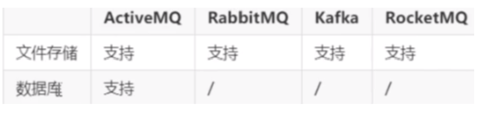

# 1. 中间件

> 什么是中间件

由于方法和体系的不成熟，以及企业业务的市场需求的不断变化，一个企业可能同时运行着多个不同的业务系统，这些系统可能基于不同的操作系统、不同的数据库、异构的网络环境。现在的问题是，如何把这些信息系统结合成一个有机地协同工作的整体，真正实现企业跨平台、分布式应用。中间件便是解决之道，它用自己的复杂换取了企业应用的简单。

**中间件（Middleware）是处于操作系统和应用程序之间的软件，也有人认为它应该属于操作系统中的一部分。人们在使用中间件时，往往是一组中间件集成在一起，构成一个平台（包括开发平台和运行平台），但在这组中间件中必须要有一个通信中间件，即中间件+平台+通信，这个定义也限定了只有用于分布式系统中才能称为中间件，同时还可以把它与支撑软件和使用软件区分开来**

>  为什么需要使用消息中间件

具体地说，中间件屏蔽了底层操作系统的复杂性，使程序开发人员面对一个简单而统一的开发环境，减少程序设计的复杂性，将注意力集中在自己的业务上，不必再为程序在不同系统软件上的移植而重复工作，从而大大减少了技术上的负担，中间件带给应用系统的，不只是开发的简便、开发周期的缩短，也减少了系统的维护、运行和管理的工作量，还减少了计算机总体费用的投入。

> 中间件特点

为解决分布异构问题，人们提出了中间件（middleware)的概念。中间件时位于平台（硬件和操作系统）和应用之间的通用服务，如下图所示，这些服务具有标准的程序接口和协议。针对不同的操作系统和硬件平台，它们可以有符合接口的协议规范的多种实现。

由于标准接口对于可移植性和标准协议对于互操作性的重要性，中间件已成为许多标准化工作的主要部分。对于应用软件开发，中间件远比操作系统和网络服务更为重要，中间件提供的程序接口定义了一个相对稳定的高层应用环境，不管底层的计算机硬件和系统软件怎样更新换代，只要将中间件升级更新，并保持中间件对外的接口定义不变，应用软件几乎不需任何修改，从而保护了企业在应用软件开发和维护中的重大投资。

> 中间件常用分类

> > 负载均衡中间件

1. Nginx
2. LVS
3. KeepAlive
4. CDN

> > 缓存中间件

1. Redis
2. MemCache

> > 数据库中间件

1. MyCat
2. ShardingJdbc

> > 消息中间件

1. **ActiveMQ**
2. **RabbitMQ**
3. **Kafka**
4. **RocketM**

> **消息中间件的本质及设计**

它是一种接受数据、接受请求、存储数据、发送数据等功能的技术服务

MQ消息队列：负责数据的传接受，存储和传递，所以性能要高于普通服务和技术

> > 消息中间件的核心组成部分

1. 消息的协议
2. 消息的持久化机制
3. 消息的分发策略
4. 消息的高可用，高可靠
5. 消息的容错机制

>  消息队列协议

**协议**是指：

计算机底层操作系统和应用程序通讯时共同遵守的一组约定，只有遵循共同的约定和规范，系统和底层操作系统之间才能相互交流
和一般的网络应用程序的不同它主要负责数据的接受和传递，所以性能比较的高
协议对数据格式和计算机之间交换数据都必须严格遵守规范
**网络协议的三要素**

1. 语法：语法是用户数据与控制信息的结构与格式，以及数据出现的顺序
2. 语义：语义是解释控制信息每个部分的意义，它规定了需要发出何种控制信息，以及完成的动作与做出什么样的响应
3. 时序：时序是对事件发生顺序的详细说明

比如我 MQ发送一个信息，是以什么数据格式发送到队列中，然后每个部分的含义是什么，发送完毕以后的执行的动作，以及消费者消费消息的动作，消费完毕的相应结构和反馈是什么，然后按照对应的执行顺序进行处理。如果你还是不理解：大家每天都在接触的 http请求协议：

语法：http规定了请求报文和响应报文的格式
语义：客户端主动发起请求称之为请求（这是一种定义，同时你发起的是 post/get请求）
时序：一个请求对应一个响应（一定先有请求在有响应，这个是时序）
**而消息中间件采用的并不是 http协议，常见的消息中间件协议有有：OpenWire、AMQP、MQTT、Kafka，OpenMessage协议**

> > 为什么消息中间件不直接使用 http协议

1. 因为 http请求报文头和响应报文头是比较复杂的，包含了Cookie，数据的加密解密，窗台吗，响应码等附加的功能，但是对于一个消息而言，我们并不需要这么复杂，也没有这个必要性，它其实就是负责数据传递，存储，分发就行，一定要追求的是高性能。尽量简洁，快速
2. http在实际的交互过程中，一个请求到响应都很有可能会中断，中断以后就不会执行持久化，就会造成请求的丢失。这样就不利于消息中间件的业务场景，因为消息中间件可能是一个长期的获取信息的过程，出现问题和故障要对数据或消息执行持久化等，目的是为了保证消息和数据的高可靠和稳健的运行

> > > AMQP协议

AMQP：（全称：Advanced Message Queuing Protocol）是高级消息队列协议。由摩根大通集团联合其他公司共同设计。是一个提供统一消息服务的应用层标准高级消息队列协议，是应用层协议的一个开放标准，为面向消息的中间件设计。基于此协议的客户端与消息中间件可传递消息，并不受客户端/中间件不同产品，不同的开发语言等条件的限制。Erlang中的实现有 RabbitMQ等

特性：

1. 分布式事务支持
2. 消息的持久化支持
3. 高性能和高可靠的消息处理优势

> > > MQTT协议

MQTT协议（Message Queueing Telemetry Transport）消息队列是 IBM开放的及时通讯协议，物联网系统架构中的重要组成部分

特点：

1. 轻量
2. 结构简单
3. 传输快，不支持事务
4. 没有持久化设计

应用场景：

1. 适用于计算能力有限
2. 低带宽
3. 网络不稳定的场景

> > > OpenMessage协议

是近几年由阿里、雅虎和滴滴出行、Stremalio等公司共同参与创立的分布式信息中间件、流处理等领域的应用开发标准

特点：

1. 结构简单
2. 解析速度快
3. 支持事务和持久化设计

> > > Kafka协议

Kafka是基于 TCP/IP的二进制协议。消息内部是 通过长度来分割，由一些基本数据类型组成

特点：

1. 结构简单
2. 解析速度快
3. 无事务支持
4. 有持久化设计

> > 小结

协议：实在 tcp/ip协议基础之上构建的一种约定俗称的规范和机制、它的主要目的可以让客户端（应用程序 java，go）进行沟通和通讯。并且这种写一下规范必须具有持久性，高可用，高可靠的性能


>  消息队列持久化

> > 持久化

简单来说就是将数据存入磁盘，而不是存在内存中随服务器重启断开而消失，使数据能够永久保存

> > 常见的持久化方式\



> 消息的分发策略

MQ消息 队列有如下几个角色

1. 生产者
2. 存储消息

3. 消费者

那么生产者生成消息以后，MQ进行存储，消费者是如何获取消息的呢？一般获取数据的方式无外乎推（push）或者拉（pull）两种方式，典型的 git就有推拉机制，我们发送的 http请求就是一种典型的拉取数据库数据返回的过程。而消息队列 MQ是一种推送的过程，而这些推机制会使用到很多的业务场景也有很多对应推机制策略

> > 消息分发策略的机制和对比


> 消息队列高可用和高可靠

> > 什么是高可用机制

所谓高可用：是指产品在规定的条件和规定的时刻或时间内处于可执行规定功能状态的能力

当业务量增加时，请求也过大，一台消息中间件服务器的会触及硬件（CPU，内存，磁盘）的极限，一台消息服务器你已经无法满足业务的需求，所以消息中间件必须支持集群部署，来达到高可用的目的

1. 集群模式1 - Master-slave主从共享数据的部署方式


​					解说：生产者将消费发送到 Master节点，所有的都连接这个消息队列共享这块数据区域，Master节点负责写入，一旦 					Master挂掉，slave节点继续服务。从而形成高可用

2. 集群模式2 - Master-slave主从同步部署方式


​				解释：这种模式写入消息同样在 Master主节点上，但是主节点会同步数据到 slave节点形成副本，和 zookeeper或者 redis主从				机制很雷同。这样可以达到负载均衡的效果，如果消费者有多个这样就可以去不同的节点进行消费，以为消息的拷贝和同步会占				用很大的带宽和网络资源。在后去的 rabbitmq中会有使用

3. 集群模式3 - 多主集群同步部署模式


​				解释：和上面的区别不是特别的大，但是它的写入可以往任意节点去写入

4. 集群模式4 - 多主集群转发部署模式


​				解释：如果你插入的数据是 broker-1中国，元数据信息会存储数据的相关描述和记录存放的位置（队列）。它会对描述信息也				就是元数据信息进行同步，如果消费者在 broker-2中进行消费，发现自己节点没有对应的信息，可以从对应的元数据信息中去				查询，然后返回对应的消息信息，场景：比如买火车票或者黄牛买演唱会门票，比如第一个黄牛有顾客说要买的演唱会门票，但				是没有但是他回去联系其他的黄牛询问，如果有就返回

5. 集群模式5 Master-slave与 Broker-cluster组合的方案


​				解释：实现多主多从的热备机制来完成消息的高可用以及数据的热备机制，在生产规模达到一定的阶段的时候，这种使用的频率比较高

> 什么是高可靠机制

​			所谓高可靠是指：系统可以无故障低持续运行，比如一个系统突然崩溃，报错，异常等等并不影响线上业务的正常运行，出错的几率极低，就称之为：高可靠

>  **如何保证中间件消息的可靠性呢，可以从两个方面考虑**：

1. 消息的传输：通过协议来保证系统间数据解析的正确性
2. 消息的存储区可靠：通过持久化来保证消息的可靠性


# 2. RabbitMQ

## 2.1 rabbitMQ安装

> **安装环境是Centos7**

1. 由于rabbitMQ是由Erlang语言开发，所以要先安装Erlang开发环境，下载不要去官网下载，推荐去[这里](https://www.erlang-solutions.com/downloads)下载rpm包，同时需要注意Erlang和rabbitMQ的版本对于关系，可以去rabbitMQ官网查询，安装完成之后可以使用`erl -v`命令查看版本信息
2. 安装插件socat，安装rabbitMQ时需要
3. 安装rabbitMQ，也推荐下载rpm包下载，不推荐直接使用yum源安装，如果用yum安装，安装命令是`yum install rabbitmq-server`
4. 安装完成之后，系统就有rabbitmq-server服务了，可以使用systemctl来进行相关操作，默认启动端口是5672

> docker安装rabbitMQ

1. 获取rabbitMQ镜像

   ```bash
   docker pull rabbitmq:management
   ```

2. 创建并运行容器

   ```bash
   docker run -di --name=名字 -p 15672:15672 rabbitmq:management
   # 如果以上面这种方式启动，启动成功之后需要进入到容器里设置用户名和密码，比较麻烦，所以推荐使用下面这种方式
   docker run -di --name=名字 -e RABBITMQ_DEFAULT_USER=用户名 -e RABBITMQ_DEFAULT_PASS=密码 -p 15672：15672 rabbitmq:management
   ```

## 2.2 rabbitMQ的图形化管理界面

默认情况下，rabbitMQ是没有安装web图形界面管理工具的，使用命令`rabbitmq-plugins enable rabbitmq_management`

这个管理端需要登陆才可以进行操作，有一个默认的用户名和密码，都是`guest`，默认web端口是`15672`，但是这个用户只能在本机进行登陆，如果使用的是远程服务器，登陆会报错。


> 新建自己的用户

1. 新建用户

   ```bash
   rabbitmqctl add_user 账号 密码
   ```

2. 分配权限

   ```bash
   rabbitmqctl set_user_tags 用户名 权限
   权限级别：
   1. administrator 最高权限，可以对rabbitmq进行管理
   2. monitoring 监控者，登陆控制台，查看所有信息
   3. policymaker 策略制定者，登陆控制台，指定策略
   4. management 普通管理员，登陆控制台
   5. none 不能访问management plugin
   ```

   

3. 添加资源权限

   ```bash
   rabbitmqctl set_permissions -p 路径 账号 权限
   例如
   rabbitmqctl set_permissions -p / admin ".*" ".*" ".*"
   ```

    ```bash
   # 其它常用命令
   rabbitmqctl change_password 用户名 密码 修改密码
   rabbitmqctl delete_user 用户名 删除用户
   rabbitmqctl list_users 查看所有用户
    ```

## 2.3 AMQP

全称：Advanced Message Queuing Protocol 是高级消息队列协议

> AMQP生产者流转流程


> AMQP消费者流转流程


> 为什么RabbitMQ是基于channel的，而不是基于连接的

连接是短链接，channel是长连接，在大量信息的交换过程中，如果是基于连接的，那么过程中必然会有很多次的建立连接，这不但费时，还是对服务器资源的一种浪费和消耗。

## 2.4 rabbitMQ的架构


1. Server：又称为Broker(图上单词写错了)，接收客户端的连接，实现AMQP实体服务
2. Connection：连接，应用程序与broker的网络连接 tcp，三次握手，四次分手
3. Channel：通道，几乎所有的操作都在channel中完成，channel是进行消息读写的通道，客户端可以建立多个通道，每个channel代表一个会话任务
4. Message：消息，服务器和客户端之间传递的数据，由Properties和Body组成，Properties是对消息的修饰，例如消息的优先级，延迟等特性，还有如果交换机是headers类型，那么携带的参数就是放在Properties里面，通过这个参数来判断消息转给哪个队列，Body就是消息的内容
5. Virtual Host：虚拟主机，虚拟地址，用于进行逻辑隔离，最上层的消息路由，一个虚拟主机路由可由若干个Exchange和Queue，同一个虚拟主机里面不能有相同名字的Exchange
6. Exchange：交换机，**接收消息**，**根据路由键发送消息到绑定的队列**，但是它不具备消息存储的能力，**在rabbitmq里面不会存在没有交换机的Queue，即使你没有设置，也会有一个默认的交换机**。
7. Bindings：Exchange和Queue之间的虚拟连接，binding中可以保护多个routing key
8. **Routing key**：是一个路由规则，虚拟机可以用它来确定如何路由一个特定消息
9. Queue：也称为Message Queue，保存消息，并转发给消费者


> 运行流程


## 2.5 rabbitMQ支持的消息模式

> Simple


这种模式虽然看起来消费者和生产者是直接和队列进行的交互，没有交换机，其实并不是，任何一个信息交换的流程中必然都有交换机的参与，我们虽然没有设置交换机，但是**rabbitMQ里面有一个默认的交换机**。这种模式需要注意，**默认的交换机是direct类型的**，和路由模式的交换机是一样的，所以**发送消息的时候是需要指定一个Routing key，默认的Routing key就是消息队列的名字**。

`The default exchange is implicitly bound to every queue, with a routing key equal to the queue name. It is not possible to explicitly bind to, or unbind from the default exchange. It also cannot be deleted.`

> Work Queues


> Publish/Subscribe


这种模式需要我们显示的定义一个交换机，而且交换机的类型必须是`fanout`，所以订阅发布模式也叫作fanout模式，然后这个交换机和相应的队列进行绑定，所以可以看出生产者生产的消息是发送给交换机，然后由交换机发送给队列，最后再由队列传递给消费者，这种模式下，交换机收到的消息会发送给和它绑定的每一个队列。

> Routing


这种模式看起来和发布订阅模式差不多，但是显示定义的交换机的类型必须是`direct`，而且带了一个路由的功能。在交换机和队列进行绑定的时候，可以指定一个`Routing key`，然后在交换机发送消息的时候也带上一个`Routing key`，这时候指定Routing key的队列就会收到消息。

> Topic


Topic模式和Routing模式差不多，但是它的实现方式是有区别的，首先它的交换机类型必须是`topic`，然后`Routing key`是一种支持类似正则表达式的写法。在交换机和队列进行绑定的时候Routing key写成自己想要的正则表达式，然后交换机在发送消息的时候，指定完整的Routing key，在发送消息给队列的时候，就会进行匹配看发送给哪一个队列。

```
* (star) can substitute for exactly one word.
# (hash) can substitute for zero or more words.

这种模式写Routing key的时候，一般写成层级模式，例如com.wdy.model
以.分割的内容叫一级，例如com,wdy,model都是一级
*在Routing key里面表示必须匹配一级，
#在Routing key里面可以不匹配，也可以匹配多级
```

> RPC


一般不用，要用去官网查询

> Publisher Confirms

新出来的，一般不用，可以去官网查看

> Headers

这种模式在官网上没有列出，但是在rabbitMQ的web管理界面上添加交换机的时候是有的，这种模式和Topic模式有点类似，都是带了一个消息路由的功能，就是说哪个队列会接受交换机的消息，不同的是，这种模式是通过在消息的Properties部分加上指定的参数。例如x=1,y=2之类的，当队列和交换机绑定的时候指定的Property和消息的Property对应的话就接受到消息。

## 2.6 Work模式

> 轮询模式(Round-Robin)

该模式接收消息是当有多个消费者接入时，消息的分配模式是一个消费者轮流分配一条，直至消息消费完成。简单就是**一个消费者消费一条，按均分配**。


> 公平分发

根据消费者的能力进行分发，处理快的分发的多，处理慢的分发的少，**能者多劳**，这种模式必须手动设置应答，也就是设置手动ack，也就是设置autoAck=false。


## 2.7 过期时间TTL

TTL表示可以对消息设置预期的时间，在这个时间之内都可以被消费者接收获取，过了设置的时间，消息将会被自动删除

> 设置方法

1. 对队列设置TTL属性

   ```bash
   # 队列中的所有消息都有相同的过期时间
   # 属性名为x-message-ttl
   ```

2. 对具体消息设置TTL属性

**如果上面两种方法同时使用，则消息的过期时间以上面两者中较小的为准，过期的消息称为`dead message`将会被放到死信队列里面，消费者将无法消费**

## 2.8 死信队列DLX

DLX全称是Dead-Letter-Exchange，可以称为死信交换机。当一个消息在队列中变成死信(Dead Message)之后，它能被重新发送到另一个交换机中，这个交换机就是DLX，绑定DLX的队列就叫作死信队列。

>消息变成死信的原因

1. 消息被拒绝
2. 消息过期
3. 队列达到最大长度

DLX也是一个正常的交换机，和一般的交换机没有什么区别。当一个队列存在死信消息的时候，rabbitMq会自动将这个消息转发到DLX上，然后再由DLX发送到绑定的死信队列上。要想使用死信队列，只需在定义队列的时候设置参数`x-dead-letter-exchange`指定死信交换机即可，同时如果死信交换机的类型是需要routing key的时候，也需要设置`x-dead-letter-routing-key`参数，指定死信消息的routing key，没有设置也没有关系，会使用原始的消息的routing key。


## 2.9 内存磁盘监控

当内存的使用值超过配置的阈值或者磁盘剩余空间低于配置的阈值的时候，rabbitMQ会暂时阻塞客户端的连接，当然也就不会接收客户端传来的消息。

> 内存控制

1. 通过命令修改

    ```
    rabbitmqctl set_vm_memory_high_watermark <fraction>   设置一个相对值，一般是0.4-0.7之间
    rabbitmqctl set_vm_memory_high_watermark absolute <value>   设置一个绝对值，固定大小
    fraction/value为内存阈值，默认值是0.4/2GB。代表含义是当内存的使用量超过40%/2GB的时候，就会产生警告，并且阻塞客户端的所有连接，两个选择一种方法设置即可，一般推荐相对值方法设置。
    ```

2. 通过配置文件修改

   ```
   vm_memory_high_watermark.relative = 0.6
   vm_memory_high_watermark.absolute = 2GB
   ```

> 磁盘控制

设置这个的主要目的是避免因非持久化的消息持续换页而耗尽服务器磁盘空间

1. 通过命令方式修改

   ```
   rabbitmqctl set_disk_free_limit <disk_limit>
   rabbitmqctl set_disk_free_limit memory_limit <fraction>
   
   disk_limit:固定单位，kb,mb,gb。默认大小是50mb，表示当磁盘的空间低于50mb的时候就会阻塞生产者，并且停止内存消息换页到磁盘的过程。
   fraction:相对阈值，建议1.0-2.0，相对于内存大小
   ```

2. 通过配置文件修改

   ```
   disk_free_limit.relative = 3.0
   disk_free_limit.absolute = 50mb
   ```

> 内存换页

* 在某个broker节点因为内存不足阻塞生产者之前，它会将队列中的消息换页到磁盘以释放内存空间，持久化和非持久化的消息都会写入到磁盘，其中持久化的消息在磁盘中本身就有一个副本，所以在转移的过程中，内存中的持久化消息会先被清除掉。

* 默认情况下，内存达到阈值的50%就会进行换页处理

```
vm_memory_high_watermark.relative = 0.4
vm_memory_high_watermark_paging_ratio = 0.7
```

## 2.10 集群搭建


## 2.11 分布式事务


## 2.12 面试题


