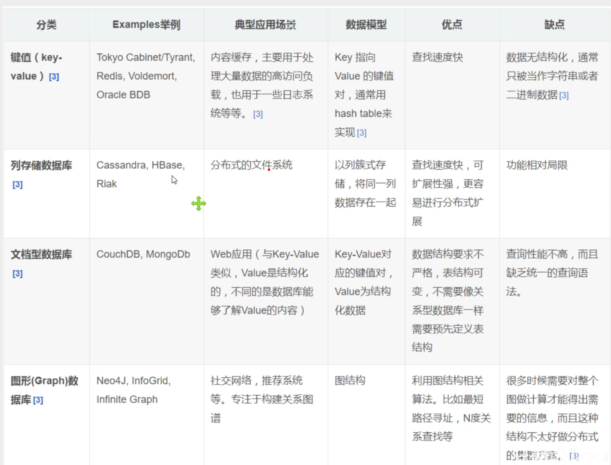
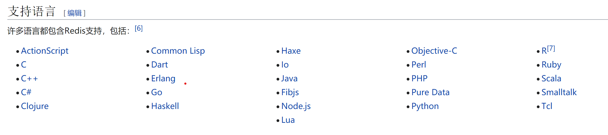
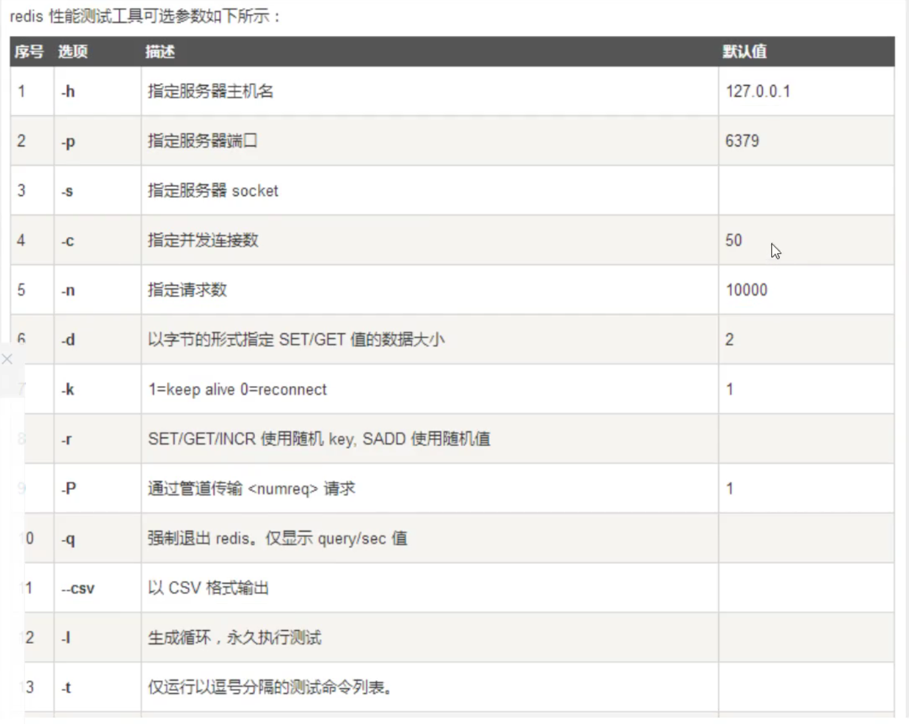
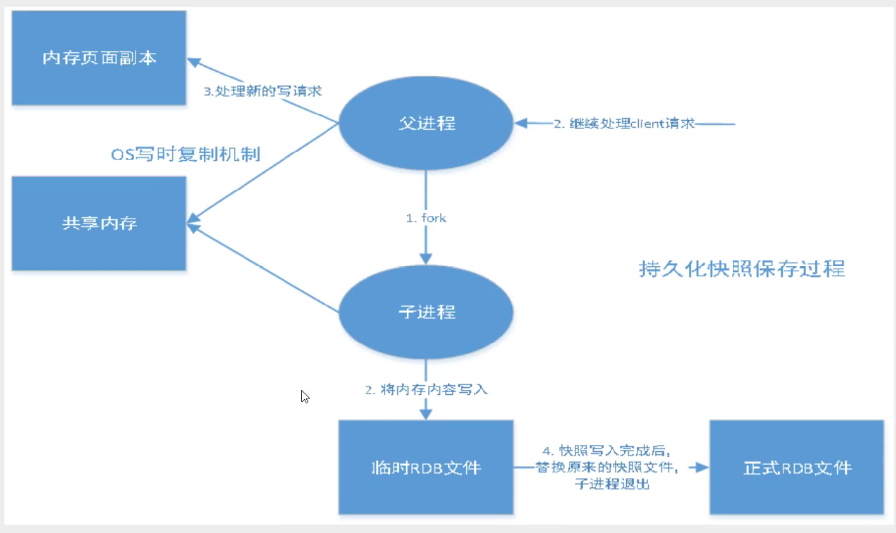
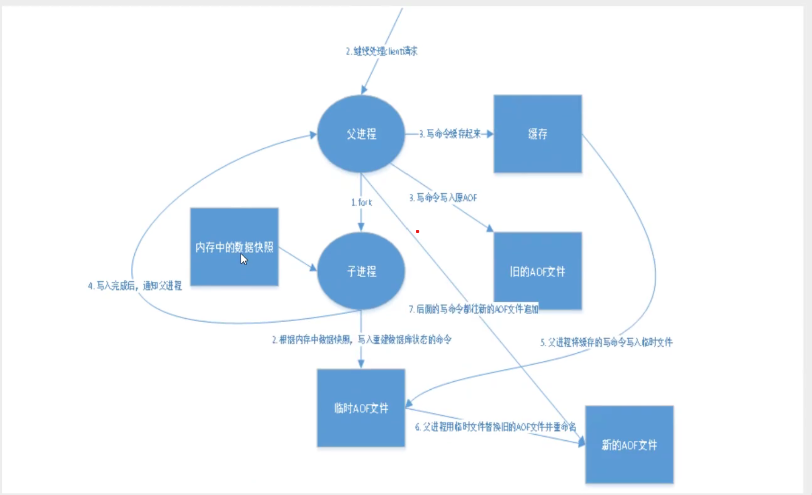
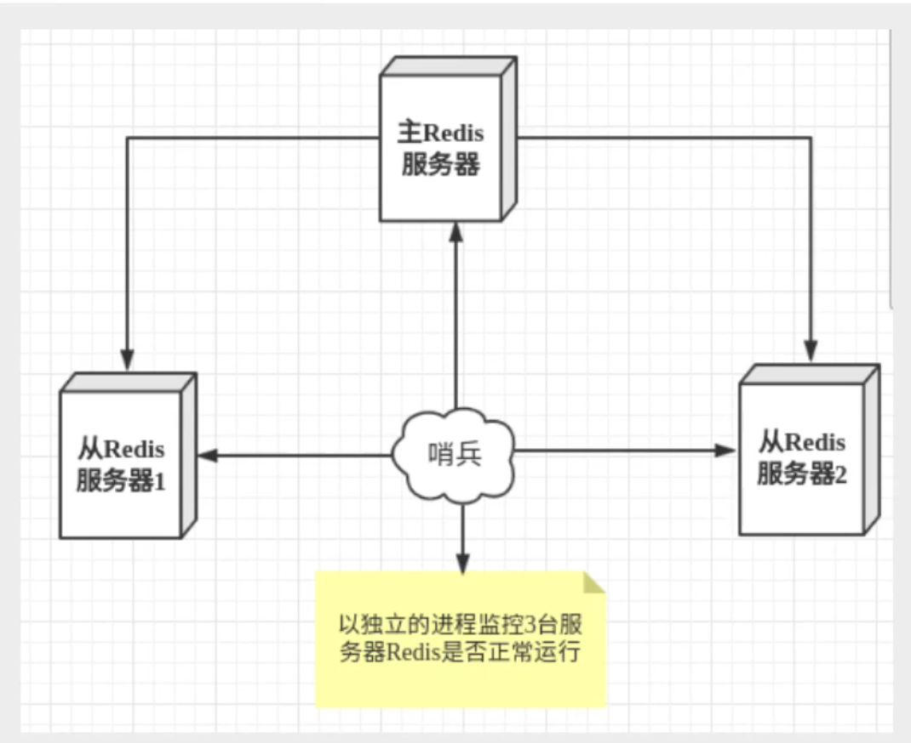
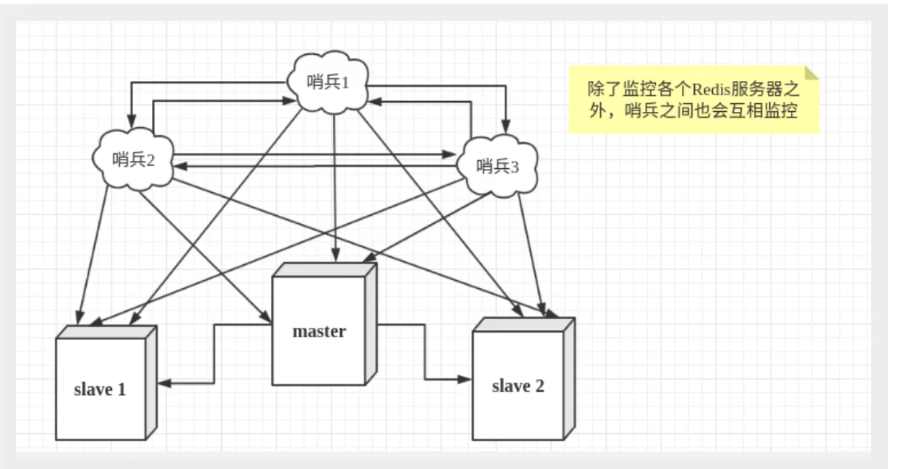
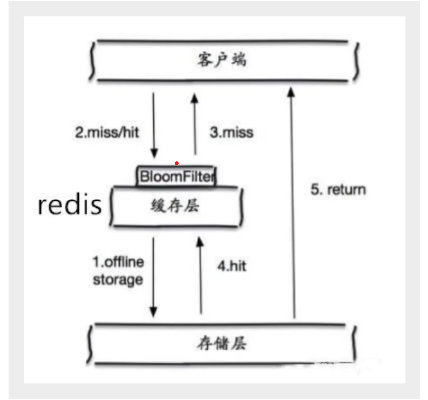
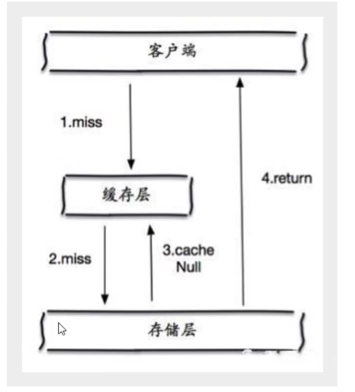
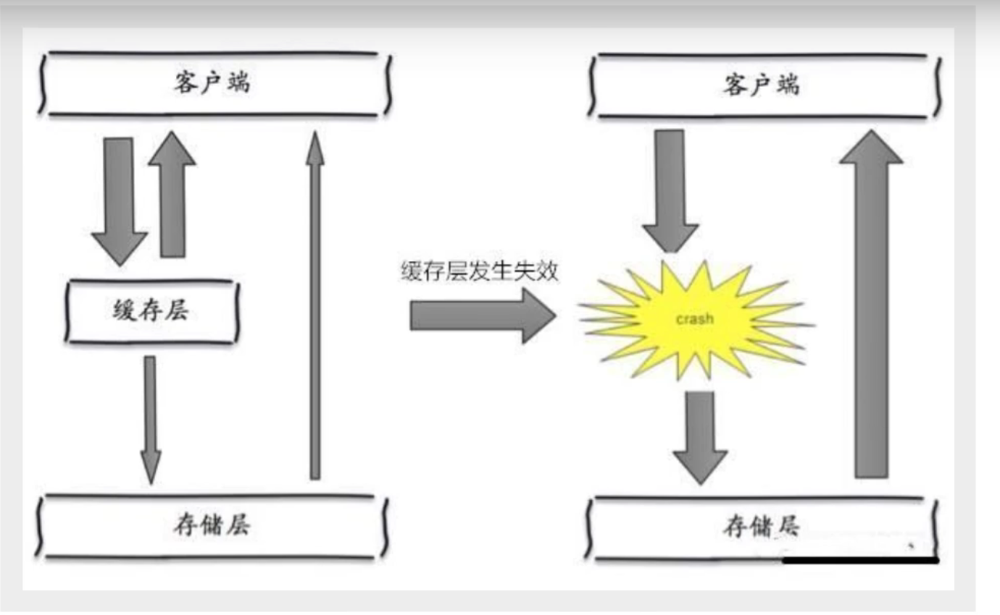

## 1. NOSQL四大分类

### 1.1 KV键值对

* redis

### 1.2 文档型数据库

* MongoDB
* ConthDB

### 1.3 列式数据库

* HBase

### 1.4 图关系数据库

* 里面不是存放的图形，存放的是关系
* Neo4j
* InfoGrid

### 1.5 四大NoSql对比



## 2. Redis

### 2.1 概述

**Redis(Remote Dictionary Server),远程字典服务**

Redis是一种开放源代码（BSD许可）的内存中数据结构存储，用作数据库，缓存和消息代理(消息中间件)。 Redis提供数据结构，例如**字符串（strings），哈希(hashes)，列表(lists)，集合(sets)，有序集合(sorted sets)与范围查询，位图(bitmaps)，超日志(hyperloglogs)，地理空间(geospatial)索引半径查询**。 Redis具有内置的复制(replication)，Lua脚本(LUA scriping)，LRU驱动事件(LUA eviction)，事务(transactions)和不同级别的磁盘持久化(persistence)，并通过Redis 哨兵(Sentinel)和Redis Cluster自动分区提供了高可用性(high availability)。

* redis[所有命令](https://redis.io/commands)

* Redis是一个使用ANSI C编写的开源、支持网络、基于内存、分布式、可选持久性的键值对存储数据库

* 支持的api

  

### 2.2 Linux环境搭建

1. 下载redis压缩包
2. 环境里面需要gcc
3. 在redis解压目录里面执行make
4. make命令执行完之后执行make install
5. redis的默认安装路径/usr/local/bin
6. redis-server 配置文件路径（以指定配置文件启动redis，默认redis不是后台启动，可以在配置文件里面修改）
7. redis-cli -p 6379 启动客户端,进行连接测试
8. 在redis-cli里面使用shutdown命令关闭redis

### 2.3 性能测试

**redis-benchmark**



```shell
redis-benchmark -h localhost -p 6379 -c 100 -n 10000 # 示例
```

### 2.4 基础知识

1. redis默认有16个数据库，默认使用第0个，可通过select选择使用第几个，使用DBSIZE命令可以查看数据库大小

   ```shell
   set key-name key-value 设置一个key并赋值
   EXISTS key-name 判断一个key是否存在
   move key-name 1 移除指定的key
   get key-name 查看一个key的值
   EXPIRE key-name seconds 设置一个key的失效时间(s)
   ttl key-name 查看指定key的剩余时间
   type key-name 查看指定key的类型
   keys * 查看数据库的所有key
   flushdb 清空当前数据库的所有key
   FLUSHKEY 清空所有数据库的所有key
   ```

2. redis是单线程的
   * redis基于内存进行操作
   * CPU不是redis的瓶颈，内存的大小和网络的带宽才是
   * 多线程存在CPU上下文切换，所以效率并不一定比单线程要高，而且redis的数据都在内存上，所以使用单线程的效率会更好

### 2.5 五大基础数据类型

#### 2.5.1 Strings

```shell
APPEND key-name key-value 在原本存在的key的value上追加value，如果key不存在,作用就相当于setkey
STRLEN key-name 获取指定key的value的长度
get key-name 获取指定key的值
GETRANGE key-name start end # 这个key的值是一个字符串，效果就是字符串的截取，索引支持负数
SETRANGE key-name start value # 从start位置开始以value替换

# 设定一个key自增或自减，例如网站的浏览量
set view 0
incr view # 效果是view = view + 1
decr view # 效果是view = view - 1
incr view 10 # 效果是view = view + 10
decr view 10 # 效果是view = view - 10

setex key-name seconds key-value   设置值的时候同时设置过期时间
setnx key-name key-value 不存在时设置(在分布式锁中常常使用),如果存在直接设置失败

mset 同时设置多个值
mget 同时获取多个值
msetnx 这是一个原子操作,多个要么一起成功，一起失败

getset 先get再set，如果不存在值，则返回nil，如果存在值，获取原来的值，并设置新的值

# 怎么存储一个对象，示例
set user:1 {name:zs, age:10}
set user:2 {name:ls, age:8}

mset user:1:name zs user:1:age 10
mset user:2:name ls user:2:age 8
```

#### 2.5.2 List

```shell
LPUSH list-name value 将一个值或多个值，插入到列表头部（左边）
LRANGE list-name start end 输出指定位置的值
RPUSH list-name value 将一个值或多个值，插入到列表尾部（右边）
LPOP list-name 移除List中第一个元素
RPOP list-name 移除List中最后一个元素
LINDEX list-name index 通知指定索引获取list中的值
LLEN list-name 获取List的长度
LREM list-name number value 移除list中指定个数的指定值
LTRIM list-name start end 通过指定索引截取list的部分值
RPOPLPUSH list-name list-name2 将一个list的最后一个元素移除，并加入到另一个列表的第一个元素
LSET list-name index value 将一个list指定索引的值替换为指定的值,值存在就会更新，不存在就报错
LINSERT list-name before(after) list-value value 将一个值插入到列表的某个值的前面(后面)
```

#### 2.5.3 Set

`Set中的值是不能重复的,而且set是无序的`

```shell
SADD set-name value 将值插入到set中
SMEMBERS set-name 查看set中的所有元素
SISMEMBER set-name set-value 查看一个值是否在set里面
SCARD set-name 获取set中元素的个数
SREM set-name set-value 移除set中的指定元素
SRANDMEMBER set-name number 随机从set里抽取指定个数的元素，默认是一，可以不写
SMOVE set-name set-name2 value 将一个set中的元素移到另一个set中
SDIFF set-name set-name2 两个set的差集
SINTER set-name set-name2 两个set的交集
SUNION set-name set-name2 两个set的并集
```

#### 2.5.4 Hash

**Hash一般用于存储对象，String一般用于存储字符串**

```shell
HSET hash-name key value 设置值
HGET hash-name key 获取值
HMSET hash-name key1 value1 key2 value2 可以设置多个值
HMGET hash-name key1 key2 获取多个值
HGETALL hash-name 获取全部数据
HDEL hash-name key 删除指定数据
HLEN hash-name 获取hash中的数据个数
HEXISTS hash-name key 判断一个字段是否存在
HKEYS hash-name 获取所有key
HVALS hash-name 获取所有values
HINCRBY hash-name key number key对应的value加一,也就是自增操作
HSETNX hash-name key value 如果存在则可以设置
```

#### 2.5.5 Zset

在set的基础上增加了一个值,**可以基于这个值实现排序**

```shell
ZADD zset-name score(一个数值) value 添加一个值,可以接多个
ZRANGE zset-name start end
ZRANGEBYSCORE zset-name min(-inf表示负无穷) max(+inf表示正无穷) WITHSCORES 按照score来从小到大排序(这个命令在redis6.2.0开始已被废弃，推荐使用ZRANGE命令)
ZREVRANGE zset-name min max 这个是从大到小排序
ZREM zset-name zset-value 移除指定的值
ZCARD zset-name 查看zset里面有多少元素
ZREVRANGE zset-name min max 这个是从大到小排序
ZCOUNT zset-name start end 获取指定score范围内的数据
```

### 2.6 三种特殊数据类型

#### 2.6.1 geospatial

```shell
GEOADD geo-name 纬度 经度 城市名 添加一个城市的经纬度，可以接多个
GEOPOS geo-name 城市名 获取一个城市的经纬度，可以接多个
GEODIST geo-name 城市名1 城市名2 距离单位(m,km,mi英里,ft英尺)   获取指定两个城市之间的距离(指定单位)
GEORADIUS geo-name 经度 纬度 距离 (WITHDIST，设置是否显示距离) (WITHCOORD，设置是否显示经纬度 (COUNT number，显示指定数目) 找出离指定位置(以经纬度给出)指定距离的城市
GEORADIUSBYMEMBER geo-name 城市名 距离 找出离指定城市指定距离的城市
GEOHASH geo-name 城市名(可接多个)  将城市的位置也就是经纬度以geohash的方式表示出来(11个字符的字符串)
```

**GEO的底层是一个zset，所以zset的操作在geo上也可以使用**

#### 2.6.2 Hyperloglog

Redis Hyperloglog 基数(不重复的元素)统计的算法。它占用的内存大小是固定的，2^64个不同的元素，所以只需要12kb的大小。

```bash
PFADD Hyperloglog-name  元素(可接多个)   添加元素
PFCOUNT Hyperloglog-name 查看元素个数
PFMERGE Hyperloglog-name3 Hyperloglog-name1 Hyperloglog-name2  合并Hyperloglog-name1和Hyperloglog-name2到Hyperloglog-name3
```

**如果允许容错，则可以使用Hyperloglog ，如果不允许容错，可以使用set或者自己的数据结构**

#### 2.6.3 BitMaps

```shell
SETBIT bm-name key value 添加一个值
GETBIT bm-name key 查看某个key的value
BITCOUNT bm-name 统计这个BitMaps的value和
```

### 2.7 事务

Redis事务的本质是一组命令的集合，这些命令在被序列化之后会顺序执行

一次性，顺序性，排它性

**所有的命令在入队的时候并不会被执行，只会在执行的阶段才会执行**

**Redis中单条命令是保证原子性的，但是事务不保证原子性**

事务执行步骤

1. 开启事务(MULTI)
2. 命令入队
3. 执行命令(EXEC)

```shell
>multi
>....命令
>exec
```

* **DISCARD命令用来取消事务，因为命令只有在执行阶段才会被执行，所以当事务取消的时候在队列中的命令是不会被执行的**

* **在队列中的命令如果某些存在语法错误，在入队的时候因为没有执行所以无法察觉，但是在执行阶段会报错，但是那些语法正确的命令依然可以执行并得到结果**。所以说在Redis里面单条命令是保证原子性的，但是事务是不保证原子性的.

### 2.8 监控(WATCH)

1. 悲观锁，认为什么时候都会出错，无论做什么都会加锁
2. 乐观锁，认为什么时候都不会出问题，所以不会上锁。更新数据的时候去判断一下，在此期间是否有人修改过这个数据

**在数据库里面乐观锁比较的是version**，先是获取version，然后在更新数据的时候比较version

**在Redis里面乐观锁的实现是通过watch**

* 在一个事务执行之前，如果给一个变量加过监控（WATCH），如果在这个期间数据发生过改动，那么在执行事务的时候将会失败
* 解决办法是先解锁(UNWATCH)，然后在加锁

```shell
watch 变量
unwatch 这个后面不用加变量
```

### 2.9 SpringBoot整合Redis

SpringBoot操作数据都在SpringData里面

**在SpringBoot2版本之后，之前使用的Jedis现在已经不用了，改用Lettuce**

Jedis：采用的是直连，多个线程操作的话是不安全的，解决办法就是使用Jedis Pool连接池，像BIO模式

Lettuce：采用的是Netty，实例可以在多个线程里面共享，不存在线程不安全的情况，可以减少线程数据，像NIO模式

`具体整合代码不展示`

### 2.10 配置文件

除了直接读取和修改配置文件来修改配置之外，还可以通过命令来实现

```shell
config get 配置名
condig set 配置名 值
save 保存配置并生效
```

**配置文件修改之后使用save命令，相当于重新读取了配置文件，可以使配置文件立即生效**

1. 单位(Units)

   单位不区分大小写

2. 包含(Include)

3. 模块(Modules)

4. 网络(Network)
   * bind 绑定Ip
   * protected-mode 保护模式
   * port 端口
   
5. 通用(General)
   * daemonize 守护进程
   * pidfile 如果以守护进程运行，就需要指定一个pidfile
   * loglevel 日志等级
   * logfile 日志文件路径
   * databases 数据库数量
   * always-show-logo 是否总是显示Logo

6. 快照(Snapshotting)

   * 持久化，在规定的时间内执行了多少次操作，则会持久化到文件rdb.aof

     ​	save 900 1 表示如果在900s内，至少有一个key进行了修改，就进行持久化操作

   * stop-writes-on-bgsave-error 持久化过程出错，redis是否继续工作

   * rdbcompression 是否压缩rdb文件
   * rdbchecksum 保存rdb的时候是否进行错误校验
   * dbfilename rdb保存在哪个文件
   * dir  rdb文件保存的目录

7. 复制(Replication)

   在配置Redis集群的时候会用到

8. 安全(Security)

   可以在这里设置Redis的密码

   ```shell
   >config get requirepass   查看是否需要密码
   >config set requirepass   设置密码
   设置完密码之后操作都需要验证
   >auth 密码    进行密码验证
   验证完之后就可以正常执行命令
   ```

9. 客户端(Clients)

   * maxclients 最大客户端连接数

10. 内存(Memory)

    * maxmemory 可用最大内存

    * maxmemory-policy 内存达到最大时的处理策略

       LRU means Least Recently Used

       LFU means Least Frequently Used

      * volatile-lfu 随机删除LFU算法的key
      * allkeys-lru 删除LRU算法的key
      * volatile-lru 随机删除LRU算法的key

      * allkeys-lfu 删除LFU算法的key
      * volatile-random 随机删除即将过期的key
      * allkeys-random 随机删除所有的key
      * volatile-ttl 删除即将过期的
      * noeviction 永不过期，返回错误

11. aof模式(APPEND ONLY MODE)

    ```shell
    appendonly 默认是不开启的，因为默认使用的是rdb持久化
    appendfilename 持久化文件的名称
    
    # appendfsync always 每次修改都会同步
    appendfsync everysec 每秒同步一下
    # appendfsync no 不执行sync,这个时候操作系统会自动同步数据
    ```

### 2.11 Redis持久化

#### 2.11.1 RDB(Redis DataBase)



在指定的时间间隔内，将内存中的数据集快照写入磁盘，也就是SnapShot快照，它恢复时是直接将快照文件读到内存中

Redis会**单独创建(fork)一个进程来进行持久化**，会先将数据写入到一个临时文件中，待持久化过程都结束了，再用这个临时文件替换上次持久化好的文件。整个过程中，**主进程是不进行任何IO操作的**。这就确保了极高的性能。如果需要进行大规模数据的恢复，且对于数据恢复的完整性不是很敏感，那么**RDB方式要比AOF方式更加的高效**。RDB的缺点是最后一次持久化后的数据可能丢失。Redis默认的就是RDB，一般情况下不需要修改这个配置。**RDB保存的文件是dump.rdb**

> 触发机制

1. 配置文件里面save的规则满足了，就会触发rdb规则

2. 执行flushall命令也会触发

3. 退出redis也会触发

   上述几种情况都会自动生成dump.rdb文件

> 如何恢复rdb文件

* 只需将rdb文件放到redis的启动目录即可，redis启动的时候会自动检查是否存在rdb文件

1. 优点
   * 适合大规模的数据恢复
   * 对数据的完整性要求不高

2. 缺点
   * 需要一定的时间间隔进行操作，如果redis意外宕机，那么最后一次修改的数据就没了
   * fork进程的时候会占用一定的内存空间

#### 2.11.2 AOF(Append Only File)

将我们所有的**写命令**都记录下来，恢复的时候就把这个文件里面的命令**重新执行**一遍



以日志的形式记录Redis执行过的**所有写命令（读操作不记录）**，文件只可以追加内容，不可以自己改写文件，redis启动的时候会读取该文件并且重新构建数据，也就是说在redis启动的时候会根据日志文件的内容将写命令从头到尾执行一遍以完成数据重建。

**AOF保存在appendonly.aof文件**

* 当aof文件有错误时，redis是启动不成功的
* redis-check-aof 工具可以检查aof文件正确性   参数为--fix可以修复错误

> 文件重写规则

aof文件默认就是无限追加的，如果aof文件太大，超过一定数量，默认是64m，redis就会fork一个进程来重写aof文件。

1. 优点
   * 每一次修改都同步，文件的完整性会更好
   * 每秒同步一次，可能会丢失一秒的数据
   * 从不同步，效率最高
2. 缺点
   * 相对于数据文件来说，aof远远大于rdb，修复的速度也比rdb慢
   * aof运行效率也比rdb慢

> 拓展

1. 如果redis只做缓存，只希望数据在服务器运行的时候存在，就可以完全不用持久化
2. 如果同时开启了两种持久化方式
   * redis启动的时候会先加载aof文件来恢复数据，因为在通常情况下AOF文件保存的数据集要比RDB文件保存的更完整
   * RDB的数据不实时，同时使用两者时服务器启动时也只会找AOF文件，但是不建议只使用AOF，因为RDB更适合用于备份数据库（AOF在不断变化，不好备份）

3. 性能建议
   * 因为RDB文件只用作后备用途，建议只在slave上持久RDB文件，而且只要15min(900s)备份一次即可，也就是只保留save 900 1 这个规则就行了
   * AOF最坏的情况也只会丢失不超过两秒数据，但是代价是带来了持续的IO，同时AOF rewrite最后将rewrite过程中产生的新数据写到新文件造成的阻塞几乎是不可避免的。所以在硬盘条件允许的情况下，应该尽量减少rewrite的次数，所以默认的64m太小
   * 如果没有开启AOF，仅靠master-slave repllcation实现高可用也可以，还能省掉很多IO操作，也减少了rewrite产生的波动。但是如果master和slave同时挂掉，会丢失很多数据，在启动的时候也要比较master和slave中的RDB文件，载入较新的文件

### 2.12 发布订阅

redis发布订阅是一种消息通信模式

```shell
PSUBSCRIBE pattern 订阅一个或多个符合给定模式的频道
PUBSUB 查看订阅和发布系统状态
PUBLISH 将消息发送到指定的频道
PUNSUBSCRIBE 退订所有给定模式的通道
SUBSCRIBE channel 订阅一个或多个给定频道的消息
UNSUBSCRIBE channel 退订给定的频道
```

```shell
#订阅端
SUBSCRIBE wdy
等待接收发布端的消息

#服务端
PUBLISH wdy hello,client
执行完之后，订阅端就会收到消息
```

> 扩展

1. redis是使用c语言实现的，发布订阅的源码在pubsub.c文件里面
2. 使用SUBSCRIBE订阅某频道之后，redis-server维护了一个字典，字典的键就是一个个channel，而字典的值就是链表，链表里保存了所有订阅端，SUBSCRIBE这个命令其实就是将订阅端加入到链表里面
3. 使用PUBLISH向订阅者发送消息，redis-server会使用给定频道作为键，在它所维护的channel字典中查找保存了所有客户端的链表，遍历这个链表，然后将消息发送出。
4. redis只能实现一些简单的发布和订阅操作，还是推荐使用消息中间件(MQ)来实现

### 2.13 主从复制

主从复制就是将一台redis服务器的数据复制到其它服务器上，前者称为主节点(Master/Leader)，后者成为从节点(Slave/follower)，**数据的复制是单向的，只能从主节点向从节点复制**。Master以写为主，Slave以读为主

默认情况下，每台redis服务器都是主节点

**一个主节点可以有多个从节点，但是一个从节点只能有一个主节点**

> 作用

1. 数据冗余：主从复制实现了数据的热备份，是持久化之外的一种数据冗余方式
2. 故障恢复：当主节点出现问题时，可以由从节点提供服务，实现快速的故障恢复，实际上是一种服务的冗余
3. 负载均衡：在主从复制的基础上，配合读写分离，可以由主节点提供写服务，由从节点提供读服务，分担服务器负载，可以提高并发量
4. 高可用(集群)基石：主从复制是哨兵模式和集群实现的基础，


```shell
>info replication 查看当前节点的信息
```

### 2.14 集群配置

搭建集群不一定要很多台机器，在一台机器上也是可以模拟的。

1. 配置文件复制几份
2. 每一个配置文件里面修改端口，pid，log文件名，dump.rdb文件名，只要保证每台机器不一样即可

**没有配置主从的时候，每一台都是主节点**

> 使用命令配置主从

```shell
SLAVEOF 节点地址  配置自己从属于哪台节点，也就是把自己变成从节点
SLAVEOF no one 可以解除自己的从属关系，把自己重新变成主节点
info replication查看节点role值已变成slave
```

**使用命令配置主从是暂时的**

> 使用配置文件配置主从

**在配置文件里面修改replicaof值**

> 拓展

1. 主机可以读写，但是**从机只能读**
2. 主机断开连接，从机依旧连接到主机。如果主机后面回来了，从机依旧可以获取到主机写的信息

> 复制原理

1. Slave启动成功之后会向主节点发送一个sync同步命令

2. Master接到命令，启动后台的存盘进程，同时收集所有接收到的用于修改数据集的命令，在后台进程执行完毕之后，master将传送整个数据文件到slave，并完成一次完全同步

   * 全量复制

     slave在接收到master传送的数据文件后，将其存盘并加载到内存

   * 增量复制

     Master继续将新的所有搜集到的修改命令依次传给slave，然后完成同步

3. 但是只要是重新连接到master，一次完全同步(全量复制)将被自动执行

### 2.15 哨兵模式

哨兵模式就是redis集群高可用的解决办法，当一个master节点挂了，哨兵会自动将一个slave节点变成master节点。虽然说也可以手动操作，但是费力不讨好，还容易出错。

1. redis提供了哨兵的命令
2. 哨兵是一个独立的进程
3. 原理是哨兵通过发送命令，等待redis服务器响应，从而监控多个运行的redis实例



**这里的哨兵有两个作用**

1. 通过发送命令，让redis服务器返回运行的状态，包括主服务器和从服务器
2. 当哨兵监测到master宕机，会自动将slave节点转为master节点，然后通过发布订阅模式告诉其它节点，修改配置文件，切换主机

**一个哨兵容易出现问题，所以要多个哨兵监控节点，同时哨兵之间还会互相监控**



假设主服务器宕机，哨兵一先检测到这个结果，系统不会马上进行failover过程，仅仅是哨兵一主观的认为主服务器不可用，这个现象称为**主观下线**。当后面的哨兵也监测到主服务器不可用，并且数量达到一定值时，那么哨兵就会进行一次投票，投票的结果由一个哨兵发起，进行failover(故障转移)操作。切换成功之后，就会通过订阅发布模式，让各个哨兵把自己监控的从服务器实现切换主机，这个过程称为**客观下线**


启用哨兵的步骤：

1. 配置哨兵配置文件sentinel.conf，没有可以新建

   ```shell
   sentinel monitor 起个名字 host port 1
   # 后面这个1，表示当主机挂掉之后，会进行投票将哪一个slave节点转为master
   ```

2. 启动哨兵

   ```shell
   redis-sentinel 配置文件路径
   ```

> 原则

1. 在哨兵模式下，当主节点挂掉之后，**要等待一段时间**，哨兵会自动选举一个从节点变成主节点
2. 如果之前的主节点回来了，**它只能变成从节点**，这是哨兵模式的原则

> 优缺点

优点：

1. 基于主从复制，所以主从复制优点它全有
2. 主从可以切换，故障可以转移

缺点：

1. redis不好在线扩容，
2. 实现哨兵模式配置麻烦

> 哨兵模式的全部配置

```shell
# Example sentinel.conf  
  
# 哨兵sentinel实例运行的端口 默认26379  
port 26379  
  
# 哨兵sentinel的工作目录  
dir /tmp  
  
# 哨兵sentinel监控的redis主节点的 ip port   
# master-name  可以自己命名的主节点名字 只能由字母A-z、数字0-9 、这三个字符".-_"组成。  
# quorum 当这些quorum个数sentinel哨兵认为master主节点失联 那么这时 客观上认为主节点失联了  
# sentinel monitor <master-name> <ip> <redis-port> <quorum>  
  sentinel monitor mymaster 127.0.0.1 6379 2  
  
# 当在Redis实例中开启了requirepass foobared 授权密码 这样所有连接Redis实例的客户端都要提供密码  
# 设置哨兵sentinel 连接主从的密码 注意必须为主从设置一样的验证密码  
# sentinel auth-pass <master-name> <password>  
sentinel auth-pass mymaster MySUPER--secret-0123passw0rd  
  
  
# 指定多少毫秒之后 主节点没有应答哨兵sentinel 此时 哨兵主观上认为主节点下线 默认30秒  
# sentinel down-after-milliseconds <master-name> <milliseconds>  
sentinel down-after-milliseconds mymaster 30000  
  
# 这个配置项指定了在发生failover主备切换时最多可以有多少个slave同时对新的master进行 同步，  
这个数字越小，完成failover所需的时间就越长，  
但是如果这个数字越大，就意味着越 多的slave因为replication而不可用。  
可以通过将这个值设为 1 来保证每次只有一个slave 处于不能处理命令请求的状态。  
# sentinel parallel-syncs <master-name> <numslaves>  
sentinel parallel-syncs mymaster 1  
  
  
  
# 故障转移的超时时间 failover-timeout 可以用在以下这些方面：   
#1. 同一个sentinel对同一个master两次failover之间的间隔时间。  
#2. 当一个slave从一个错误的master那里同步数据开始计算时间。直到slave被纠正为向正确的master那里同步数据时。  
#3.当想要取消一个正在进行的failover所需要的时间。    
#4.当进行failover时，配置所有slaves指向新的master所需的最大时间。不过，即使过了这个超时，slaves依然会被正确配置为指向master，但是就不按parallel-syncs所配置的规则来了  
# 默认三分钟  
# sentinel failover-timeout <master-name> <milliseconds>  
sentinel failover-timeout mymaster 180000  
  
# SCRIPTS EXECUTION  
  
#配置当某一事件发生时所需要执行的脚本，可以通过脚本来通知管理员，例如当系统运行不正常时发邮件通知相关人员。  
#对于脚本的运行结果有以下规则：  
#若脚本执行后返回1，那么该脚本稍后将会被再次执行，重复次数目前默认为10  
#若脚本执行后返回2，或者比2更高的一个返回值，脚本将不会重复执行。  
#如果脚本在执行过程中由于收到系统中断信号被终止了，则同返回值为1时的行为相同。  
#一个脚本的最大执行时间为60s，如果超过这个时间，脚本将会被一个SIGKILL信号终止，之后重新执行。  
  
#通知型脚本:当sentinel有任何警告级别的事件发生时（比如说redis实例的主观失效和客观失效等等），将会去调用这个脚本，  
这时这个脚本应该通过邮件，SMS等方式去通知系统管理员关于系统不正常运行的信息。调用该脚本时，将传给脚本两个参数，  
一个是事件的类型，  
一个是事件的描述。  
如果sentinel.conf配置文件中配置了这个脚本路径，那么必须保证这个脚本存在于这个路径，并且是可执行的，否则sentinel无法正常启动成功。  
#通知脚本  
# sentinel notification-script <master-name> <script-path>  
  sentinel notification-script mymaster /var/redis/notify.sh  
  
# 客户端重新配置主节点参数脚本  
# 当一个master由于failover而发生改变时，这个脚本将会被调用，通知相关的客户端关于master地址已经发生改变的信息。  
# 以下参数将会在调用脚本时传给脚本:  
# <master-name> <role> <state> <from-ip> <from-port> <to-ip> <to-port>  
# 目前<state>总是“failover”,  
# <role>是“leader”或者“observer”中的一个。   
# 参数 from-ip, from-port, to-ip, to-port是用来和旧的master和新的master(即旧的slave)通信的  
# 这个脚本应该是通用的，能被多次调用，不是针对性的。  
# sentinel client-reconfig-script <master-name> <script-path>  
sentinel client-reconfig-script mymaster /var/redis/reconfig.sh  
```

### 2.16 缓存穿透和雪崩

缓存的使用虽然提高了效率，但是如果对数据的一致性要求较高，则不能使用缓存。

> 缓存穿透

概念：如果用户要查询一个数据，首先应该向redis的缓存去查询，单数如果redis的缓存没有，则会去持久层数据库去发起请求，如果数据库也没有，就会查询失败。如果这时服务器涌入大量的这样的请求，会给数据库造成很大压力，这就是缓存穿透。

> > 解决方案

1. **布隆过滤器**

   布隆过滤器是一种数据结构，对所有可能查询的参数以hash的方式存储，在控制层先进行校验，不符合则丢弃，从而避免对底层存储系统的压力。



2. **缓存空对象**

   当缓存不命中后，即使去数据库查询返回的是空对象，也在redis里面加入空对象缓存，同时设置一个过期时间，在这个时间段内，如果再访问这个数据就直接从缓存里面拿，从而减轻后台存储系统的压力

   

   这种方式的问题：

   * 如果空值可以被存储起来，那么redis就需要很大的空间去存储空值
   * 即使对空值设置了过期时间，还是会对缓存层和持久层造成一定的数据不一致性问题，

> 缓存击穿

概念：redis中的一个key非常热点，大量请求对这个key进行访问，某一个时刻，这个缓存失效，这些大量的请求就会同时去请求数据库，这个现象称为缓存穿透

> > 解决方案

1. 设置热点数据永不过期

   设置热点key虽然可以使得缓存不会被击穿，但是如果数据长时间不清理，会使redis的数据溢出，超过最大存储量

2. 加分布式锁

   使用分布式锁，达到的目的是每一个时刻只有一个线程获取分布式锁的权限，然后去后台查询数据，其它线程等待即可，也就是将高并发的压力转移到了分布式锁上，这种解决方案对分布式锁的要求较高

> 缓存雪崩

概念：在某一个时间段，redis的缓存大量失效，或者是redis宕机



> > 解决方案

1. redis高可用

   搭建redis集群，防止宕机现象发生

2. 限流降级

   在缓存失效之后，通过加锁或者是加队列来控制访问量

3. 数据预热

   在项目部署之前，把可能大量访问的数据手动加入到缓存里面，同时设置不同的过期时间，避免缓存同一时刻大量失效