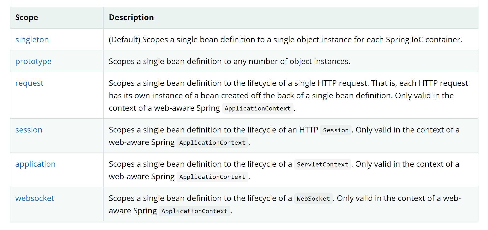
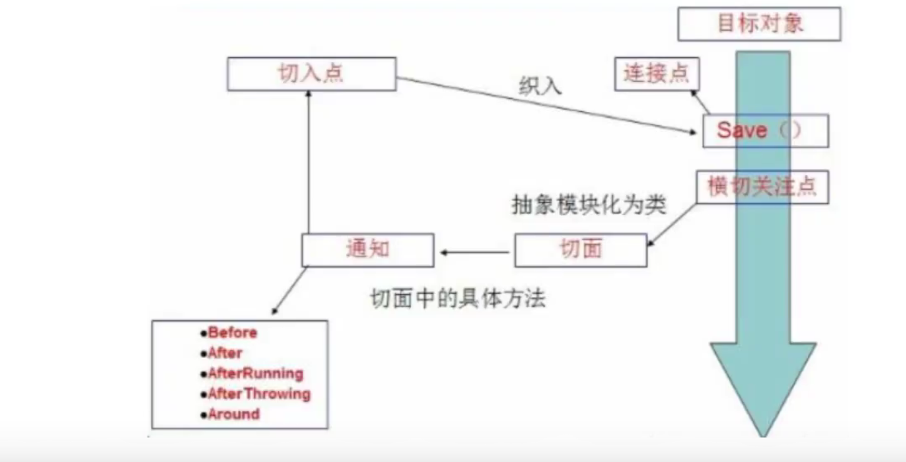
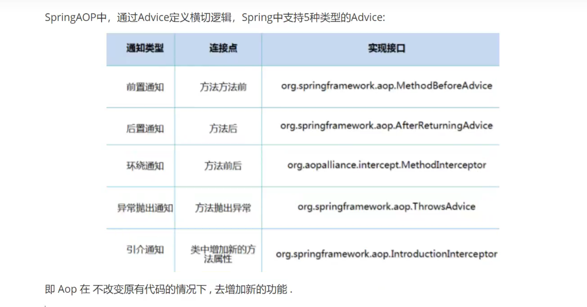

# Spring

## 1. Ioc创建对象的方式

1. 默认使用无参构造函数创建对象

   ```xml
   <bean id="user1" class="com.wdy.model.User"></bean>
   ```

2. 如果使用有参构造函数

   1. 下标赋值

      ```xml
      <bean id="user2" class="com.wdy.model.User">
          <constructor-arg index="0" value="wdy"></constructor-arg>
      </bean>
      ```

   2. 类型

      ```xml
      <bean id="user3" class="com.wdy.model.User">
          <constructor-arg type="java.lang.String" value="wdy"></constructor-arg>
      </bean>
      ```

   3. 名称

      ```xml
      <bean id="user4" class="com.wdy.model.User">
          <constructor-arg name="name" value="wdy"></constructor-arg>
      </bean>
      ```

总结：在配置文件加载的时候，容器中的对象就已经初始化了，也就是已经创建好了,但是可以设置懒初始化，`https://docs.spring.io/spring-framework/docs/current/reference/html/core.html#beans-factory-lazy-init`

## 2. Spring配置

1. 别名

   ```xml
   <alias name="user1" alias="user"></alias>
   ```

2. import

   这个标签一般用于团队开发，例如整个项目里面就导入了一个配置文件，但是每个人开发的模块使用的配置文件名字都不同，这个时候我们只需在导入的配置文件里面使用这个标签引入其它人的配置文件即可，**这个标签只能用于导入Spring的配置文件**，但有时我们要在spring的配置文件中**导入数据库的db.properties的配置文件**，可能要用到**<context:property-placeholder location="db.properties"/>**

   ```xml
   <import resource="beans2.xml"></import>
   ```

3. bean

   ```xml
   <!--    bean标签属性详解
       id是bean的唯一标识
       class对应全限定类名
       name也是别名的作用,而且可以取多个别名,而且分隔符任意都行
   -->
   <bean id="user5" class="com.wdy.model.User" name="user6 user7,user8;user9"></bean>
   ```

## 3. 依赖注入

### bean对象的创建依赖容器，bean对象中的所有属性，由容器来注入

1. 构造器注入

   见第一部分创建对象的方式

2. Set方式注入

   ```xml
   <bean id="address" class="com.wdy.model.Address"></bean>
   <bean id="user" class="com.wdy.model.User">
   	<!--        普通值注入-->
       <property name="name" value="wdy"></property>
       <!--        bean注入-->
       <property name="address" ref="address"></property>
       <!--        数组注入-->
       <property name="books">
           <array>
               <!--                这里一样,普通值用value,引用值用ref-->
               <value>1</value>
               <value>2</value>
           </array>
       </property>
       <!--        list注入-->
       <property name="hobbies">
           <list>
               <value>3</value>
               <value>4</value>
           </list>
       </property>
       <!--        map注入-->
       <property name="card">
           <map>
               <entry key="1" value="2"></entry>
               <entry key="3" value="4"></entry>
           </map>
       </property>
       <!--        set注入-->
       <property name="games">
           <set>
               <value>1</value>
               <value>2</value>
           </set>
       </property>
       <!--        null注入-->
       <property name="married">
           <null></null>
       </property>
       <!--        properties注入-->
       <property name="info">
           <props>
               <prop key="1">2</prop>
               <prop key="3">4</prop>
           </props>
       </property>
   </bean>
   ```

3. 拓展方式注入

   1. p标签

      导入schema

      ```xml
      xmlns:p="http://www.springframework.org/schema/p"
      ```

      直接注入属性的值,只能通过属性名

      ```xml
      <bean id="user2" class="com.wdy.model.User" p:name="wdy"></bean>
      ```

      

   2. c标签

      导入schema

      ```xml
      xmlns:c="http://www.springframework.org/schema/c"
      ```

      通过构造器注入属性的值，可以通过属性名，也可以使用属性的索引

      ```xml
      <bean id="user3" class="com.wdy.model.User" c:_0="wdy" c:married="no"></bean>
      ```

## 4. bean的作用域



1. 单例模式（Spring默认模式）:每次从容器里面获取的对象都是同一个

   ```xml
   <bean id="user2" class="com.wdy.model.User" p:name="wdy" scope="singleton"></bean>
   ```

2. 原型模式:每次从容器里面获取的对象都不一样

   ```xml
   <bean id="user3" class="com.wdy.model.User" c:_0="wdy" c:married="no" scope="prototype"></bean>
   ```

3. 其它几个只在web开发里面使用

## 5. bean的自动装配

自动装配是Spring中满足bean依赖的一种方式，Spring会在上下文中自动寻找，并自动给bean装配属性

下面是Spring中装配的三种方式

1. 在XML中显示的配置

2. 在Java中显示配置

3. 隐式的自动装配

   1. byName，通过这种方式的bean id要唯一

      ```xml
      <bean id="dog" class="com.wdy.model.Dog"></bean>
      <bean id="cat" class="com.wdy.model.Cat"></bean>
      <!--    byName: 设置为这个值,会自动在容器上下文中寻找,和自己的set方法后面的值对应的bean id-->
      <bean id="people" class="com.wdy.model.People" autowire="byName">
          <property name="name" value="wdy"></property>
      </bean>
      ```

   2. byType，通过这种方式，这种类型的bean只能有一个

      ```xml
      <bean id="dog" class="com.wdy.model.Dog"></bean>
      <bean id="cat" class="com.wdy.model.Cat"></bean>
      <!--    byType: 设置为这个值,会自动在容器上下文中寻找,和自己对象类型相同的bean-->
      <bean id="people" class="com.wdy.model.People" autowire="byType">
          <property name="name" value="wdy"></property>
      </bean>
      ```

## 6. 使用注解实现自动装配

jdk从1.5版本支持注解，Spring从2.5版本支持注解

使用步骤：

1. 导入schema,

2. 开启注解支持

   ```xml
   <?xml version="1.0" encoding="UTF-8"?>
   <beans xmlns="http://www.springframework.org/schema/beans"
          xmlns:xsi="http://www.w3.org/2001/XMLSchema-instance"
          xmlns:context="http://www.springframework.org/schema/context"
          xsi:schemaLocation="http://www.springframework.org/schema/beans
           https://www.springframework.org/schema/beans/spring-beans.xsd
           http://www.springframework.org/schema/context
           https://www.springframework.org/schema/context/spring-context.xsd">
   <!--    开启注解支持-->
       <context:annotation-config/>
   </beans>
   ```

### 常用注解

1. @AutoWired Spring注解 这个注解虽然功能上不如`Resource`注解强，但是一般还是常用这个
   * 可以在属性上使用，也可以在set方法上使用，通过`byType`的方式去找
   * 使用这个注解不用再编写set方法了，前提是这个属性在spring的容器中存在，且名称符合`byName`方式
   * 这个注解有一个参数`@AutoWired(required = false)`,如果设置属性为false，说明这个属性的值可以为null，否则不允许为null，这样的设置等同于在属性上面加了一个`@Nullable`注解，加了这个注解说明这个属性值可以为null
   * 如果装配环境比较复杂，可以配合`@Qualifier(value="")`注解指定一个值去注入。
2. @Resource Java注解
   * 这个注解会先通过`byName`的方式去找，找不到再通过`byType`的方式去找
   
   * 可以指定参数`@Resource(name = "")`指定一个确定的bean id去注入
   
     ```java
   @Autowired
     @Nullable
   @Qualifier(value = "dog")
     private Dog dog;
   @Resource(name = "cat")
     private Cat cat;
     ```
   ```xml
   <?xml version="1.0" encoding="UTF-8"?>
   <beans xmlns="http://www.springframework.org/schema/beans"
          xmlns:xsi="http://www.w3.org/2001/XMLSchema-instance"
          xmlns:context="http://www.springframework.org/schema/context"
          xsi:schemaLocation="http://www.springframework.org/schema/beans
                              https://www.springframework.org/schema/beans/spring-beans.xsd
                              http://www.springframework.org/schema/context
                              https://www.springframework.org/schema/context/spring-context.xsd">
   
       <!--    开启注解支持-->
       <context:annotation-config/>
       <bean id="people" class="com.wdy.model.People"></bean>
       <bean id="cat" class="com.wdy.model.Cat"></bean>
       <bean id="dog" class="com.wdy.model.Dog"></bean>
   </beans>
   ```
   
     #### 二者比较：
   
     * 两者都可以写在字段和setter方法上。两者如果都写在字段上，那么就不需要再写setter方法
     
     * `@Autowired`为Spring提供的注解，需要导入包`org.springframework.beans.factory.annotation.Autowired`只按照`byType`注入
     
     * `@Autowired`注解是按照类型`（byType）`装配依赖对象，默认情况下它要求依赖对象必须存在，如果允许`null`值，可以设置它的required属性为false。如果我们想使用按照名称`（byName）`来装配，可以结合`@Qualifier`注解一起使用。(通过类型匹配找到多个candidate,在没有`@Qualifier、@Primary`注解的情况下，会使用对象名作为最后的`fallback`匹配)
     
     * `@Resource`默认按照`ByName`自动注入，由J2EE提供，需要导入包`javax.annotation.Resource`。`@Resource`有两个重要的属性：`name和type`，而`Spring将@Resource注解的name属性解析为bean的名字`，而`type属性则解析为bean的类型`。所以，如果使用name属性，则使用byName的自动注入策略，而使用type属性时则使用byType自动注入策略。如果既不制定name也不制定type属性，这时将通过`反射机制`使用byName自动注入策略
     
     * @Resource装配顺序：
     
       ①如果同时指定了name和type，则从Spring上下文中找到唯一匹配的bean进行装配，找不到则抛出异常
     
       ②如果指定了name，则从上下文中查找名称（id）匹配的bean进行装配，找不到则抛出异常
     
       ③如果指定了type，则从上下文中找到类似匹配的唯一bean进行装配，找不到或是找到多个，都会抛出异常
     
       ④如果既没有指定name，又没有指定type，则自动按照byName方式进行装配；如果没有匹配，则回退为一个原始类型进行匹配，如果匹配则自动装配
     
       @Resource的作用相当于@Autowired，只不过@Autowired按照byType自动注入

## 7. 使用注解开发

1. bean的装配和属性的注入

   ```java
   @Component   //这个注解相当于<bean id="user" class="com.wdy.model.User" scope="singleton"></bean>
   @Scope("singleton")
   public class User {
       @Value("wdy")  //这个注解相当于<property name="name" value="wdy"></property>
       private String name;
   
       public String getName() {
           return name;
       }
   }
   ```

   ```xml
   <?xml version="1.0" encoding="UTF-8"?>
   <beans xmlns="http://www.springframework.org/schema/beans"
          xmlns:xsi="http://www.w3.org/2001/XMLSchema-instance"
          xmlns:context="http://www.springframework.org/schema/context"
          xsi:schemaLocation="http://www.springframework.org/schema/beans
           https://www.springframework.org/schema/beans/spring-beans.xsd
           http://www.springframework.org/schema/context
           https://www.springframework.org/schema/context/spring-context.xsd">
   
       <!--    开启注解支持-->
       <context:annotation-config/>
       <!--    指定扫描指定目录-->
       <context:component-scan base-package="com.wdy"/>
   </beans>
   ```

2. 衍生的注解

   在web开发里面，按照mvc架构，`@Component`注解在每一层都有一个对应的注解，但这四个注解功能都是一样的

   * dao-----------@Repository
   * service-------@Service
   * controller---@Controller

   ### 总结

   1. XML相对注解而言，更加万能，适用于任何场合，维护也更加简便，而注解不是自己的类则使用不了注解

   2. 一般用XML来管理Bean，用注解来属性注入。

   3. 使用注解的时候一定要加上声明

      ```XML
      <!--    开启注解支持-->
      <context:annotation-config/>
      <!--    指定扫描指定目录-->
      <context:component-scan base-package="com.wdy"/>
      ```

## 8. 完全使用Java来配置Spring

顾名思义，就是不使用XML来配置了，将配置完全交给Java

JavaConfig是Spring的一个子项目，但在Spring4之后成为了一个核心功能

1. 配置类

   ```java
   //这个类也会被Spring容器托管，打开Configuration源码会发现其实它自己也是一个Component
   //@Configuration代表这个类是一个配置类，作用相当于之前的beans.xml
   @Configuration
   @ComponentScan("com.wdy.model")   //配置包扫描
   @Import(Config2.class)   //导入一个其它配置类，因为在测试类里面我们只用了这个类，所以其它配置类要一起导到这个类里面
   public class Config1 {
   
       //注册一个bean,这个方法的名字相当于之前bean标签的id属性
       //这个方法的返回值相当于之前bean标签的class属性
       @Bean
       public User getUser(){
           return new User();
       }
   }
   ```

2. 实体类

   ```java
   @Component
   public class User {
       private String name;
   
       public String getName() {
           return name;
       }
   
       @Value("wdy")
       public void setName(String name) {
           this.name = name;
       }
   }
   ```

3. 测试类

   ```java
   public class MyTest {
       @Test
       public void test(){
           ApplicationContext context = new AnnotationConfigApplicationContext(Config1.class);
           User user = context.getBean("getUser", User.class);
           System.out.println(user.getName());
       }
   }
   ```

## 9. 代理模式

### 9.1. 静态代理

角色分析

1. 抽象角色：一般使用抽象类或者是接口

   ```java
   public interface CommonService {
       void rent();
   }
   ```

2. 真实角色：被代理的角色

   ```java
   public class Host implements CommonService{
       @Override
       public void rent() {
           System.out.println("有房出租");
       }
   }
   ```

3. 代理角色：代理真实的角色，而且一般会做一些附属操作

   ```java
   public class Proxy implements CommonService{
       private Host host;
   
       public void setHost(Host host){
           this.host = host;
       }
   
       @Override
       public void rent() {
           System.out.println("中介");
           this.host.rent();
       }
   }
   ```

4. 客户：访问代理角色的人

   ```java
   public static void main(String[] args) {
       Proxy proxy = new Proxy();
       proxy.setHost(new Host());
       proxy.rent();
   }
   ```

**静态代理缺点**：一个真实角色就会产生一个代理角色，会导致代理的代码越来越复杂

### 9.2. 动态代理

1. 动态代理和静态代理角色一样

   ```java
   public interface Rent {
       void rent();
   }
   ```

   ```java
   public class ProxyInvocationHandler implements InvocationHandler {
       private Rent rent;
   
       public void setRent(Rent rent){
           this.rent = rent;
       }
   
       public Object getProxy(){
           return Proxy.newProxyInstance(this.getClass().getClassLoader(), this.rent.getClass().getInterfaces(), this);
       }
   
   
       @Override
       public Object invoke(Object proxy, Method method, Object[] args) throws Throwable {
           return method.invoke(rent, args);
       }
   }
   ```

   ```java
   public class Host implements Rent {
       @Override
       public void rent() {
           System.out.println("有房出租");
       }
   }
   ```

   ```java
   public class Customer {
       public static void main(String[] args) {
           Host host = new Host();
           ProxyInvocationHandler proxyInvocationHandler = new ProxyInvocationHandler();
           proxyInvocationHandler.setRent(host);
           ((Rent)proxyInvocationHandler.getProxy()).rent();
       }
   }
   ```

2. 动态代理的代理类是动态生成的，不是我们直接写好的

3. 动态代理分为两大类

   1. 基于接口的-----jdk动态代理

      常用两个类：

      1. Proxy---------实现代理
      2. InvocationHandler-----------调用处理程序

   2. 基于类-----------cglib

   3. 现在又出现了基于java字节码的实现-------javasist

   **动态代理的好处**：

   1. 一个动态代理类代理的是一个接口，一般就是对应的业务
   2. 一个动态代理类可以代理多个类，只要这些类实现了同一接口即可。

## 10. AOP

AOP：面向切面编程，通过预编译方式和运行期动态代理实现程序功能统一维护的一种技术。AOP是OOP的延续，是函数式编程的一种衍生范型。利用AOP可以实现业务逻辑的各个部分相互隔离，从而更好地降低耦合度

**需要导入maven依赖**

```xml
<dependency>
    <groupId>org.aspectj</groupId>
    <artifactId>aspectjweaver</artifactId>
    <version>1.9.5</version>
</dependency>
```


### 10.1. Spring中的AOP

`这种方式主要是通过Spring提供的接口实现`

提供声明式事务，允许用户自定义切面

* 横切关注点：跨越应用程序多个模块的的方法或功能。也就是与业务逻辑无关，但是需要我们关注的部分，如日志，安全，缓存，事务等。
* 切面（Aspect）：横切关注点被模块化的特殊对象，所以它是一个类
* 通知（Advice）：切面必须要完成的工作，所以它是类中的一个方法
* 目标（Target）：被通知的对象
* 代理（Proxy）：向目标对象应用通知之后创建的对象
* 切入点（PointCut）：切面通知执行“地点”的定义
* 连接点（JoinPoint）：与切入点匹配的执行点





**实现过程（使用spring的Api接口）**

1. 前置通知和后置通知

   ```java
   public class BeforeLog implements MethodBeforeAdvice {
       @Override
       //method：要执行的目标对象的方法，Objects：参数，o是目标对象
       public void before(Method method, Object[] args, Object target) throws Throwable {
           System.out.println(target.getClass().getName()+"的"+method.getName()+"执行了!");
       }
   }
   ```

   ```java
   public class AfterLog implements AfterReturningAdvice {
       @Override
       //returnValue是返回值
       public void afterReturning(Object returnValue, Method method, Object[] args, Object target) throws Throwable {
           System.out.println(target.getClass().getName()+"的"+method.getName()+"执行了!"+"返回值是"+returnValue);
       }
   }
   ```

2. 接口和类

   ```java
   public interface UserService {
       void delete();
       void query();
       void update();
       void add();
   }
   ```

   ```java
   public class UserServiceImpl implements UserService{
       @Override
       public void delete() {
   
       }
   
       @Override
       public void query() {
   
       }
   
       @Override
       public void update() {
   
       }
   
       @Override
       public void add() {
   
       }
   }
   ```

3. 配置

   **注意expression的使用方法，execution(`方法的返回值类型(*代表任意类型)`   `指定类的全限定类名(*代表任意匹配,.表示当前包下面，如果是..表示这个包以及这个包下面的子包)`.`方法名(*代表任意方法)``(方法参数(..表示任意参数))`**

   ```xml
   <?xml version="1.0" encoding="UTF-8"?>
   <beans xmlns="http://www.springframework.org/schema/beans"
          xmlns:xsi="http://www.w3.org/2001/XMLSchema-instance"
          xmlns:aop="http://www.springframework.org/schema/aop"
          xsi:schemaLocation="http://www.springframework.org/schema/beans http://www.springframework.org/schema/beans/spring-beans.xsd
          http://www.springframework.org/schema/aop http://www.springframework.org/schema/aop/spring-aop.xsd">
   
       <bean id="userService" class="com.wdy.service.impl.UserServiceImpl"></bean>
       <bean id="beforeLog" class="com.wdy.log.BeforeLog"></bean>
       <bean id="afterLog" class="com.wdy.log.AfterLog"></bean>
       <aop:config>
   <!--        切入点，expression表达式，execution(要执行的位置)-->
           <aop:pointcut id="cutPoint" expression="execution(* com.wdy.service.impl.*.*(..))"/>
           <aop:advisor advice-ref="beforeLog" pointcut-ref="cutPoint"/>
           <aop:advisor advice-ref="afterLog" pointcut-ref="cutPoint"/>
       </aop:config>
   
   </beans>
   ```

   

4. 测试

   ```java
   public class MyTest {
       @Test
       public void test(){
           ApplicationContext context = new ClassPathXmlApplicationContext("beans.xml");
           //这里必须写接口，因为动态代理代理的是接口
           UserService userService = (UserService) context.getBean("userService");
           userService.add();
           userService.update();
       }
   }
   ```

### 10.2 自定义实现AOP

`这种方式主要是切面的定义`

1. 自定义切面

   ```java
   public class CustomPointCut {
       public void before(){
           System.out.println("执行之前");
       }
       public void after(){
           System.out.println("方法执行后");
       }
   }
   ```

2. 接口和类与10.1一样

3. 配置

   ```xml
   <?xml version="1.0" encoding="UTF-8"?>
   <beans xmlns="http://www.springframework.org/schema/beans"
          xmlns:xsi="http://www.w3.org/2001/XMLSchema-instance"
          xmlns:aop="http://www.springframework.org/schema/aop"
          xsi:schemaLocation="http://www.springframework.org/schema/beans http://www.springframework.org/schema/beans/spring-beans.xsd
          http://www.springframework.org/schema/aop http://www.springframework.org/schema/aop/spring-aop.xsd">
       <bean id="customPointCut" class="com.wdy.aop.CustomPointCut"/>
       <bean id="userService" class="com.wdy.service.impl.UserServiceImpl"></bean>
       <aop:config>
   <!--        自定义切面-->
           <aop:aspect ref="customPointCut">
               <aop:pointcut id="pointCut" expression="execution(* com.wdy.service.impl.UserServiceImpl.*(..))"/>
               <aop:before method="before" pointcut-ref="pointCut"/>
               <aop:after method="after" pointcut-ref="pointCut"/>
           </aop:aspect>
       </aop:config>
   </beans>
   ```

4. 测试与10.1一样

### 10.3 使用注解实现AOP

基于纯注解

1. 切面

   ```java
   @Component
   @Aspect
   public class CustomPointCut {
   
       /**
        * 要注意以下既有环绕又有before还有after时执行的顺序
        */
   
       @Before(value = "execution(* com.wdy.service.impl.UserServiceImpl.*(..))")
       public void before(){
           System.out.println("执行之前");
       }
       @After(value = "execution(* com.wdy.service.impl.UserServiceImpl.*(..))")
       public void after(){
           System.out.println("方法执行后");
       }
   
       //在环绕增强中，可以给定一个参数，代表我们要获取处理切入的点
       @Around(value = "execution(* com.wdy.service.impl.UserServiceImpl.*(..))")
       public void around(ProceedingJoinPoint pdj) throws Throwable {
           System.out.println("环绕前");
           //例如获取签名
           System.out.println(pdj.getSignature());
           Object proceed = pdj.proceed();
   
           System.out.println("环绕后");
           System.out.println(proceed);
       }
   }
   ```

2. 接口和类与10.1一样

3. 配置

   ```xml
   <?xml version="1.0" encoding="UTF-8"?>
   <beans xmlns="http://www.springframework.org/schema/beans"
          xmlns:xsi="http://www.w3.org/2001/XMLSchema-instance"
          xmlns:aop="http://www.springframework.org/schema/aop"
          xmlns:context="http://www.springframework.org/schema/context"
          xsi:schemaLocation="http://www.springframework.org/schema/beans http://www.springframework.org/schema/beans/spring-beans.xsd
          http://www.springframework.org/schema/aop http://www.springframework.org/schema/aop/spring-aop.xsd
          http://www.springframework.org/schema/context http://www.springframework.org/schema/context/spring-context.xsd">
   <!--   配置注解开启-->
   <!--    proxy-target-class这个参数值默认是false，也就是Spring使用的是jdk实现的动态代理是基于接口的
       如果设置为true，那么Spring会基于类实现动态代理，也就是cglib-->
       <aop:aspectj-autoproxy proxy-target-class="false"/>
       <context:annotation-config />
       <context:component-scan base-package="com.wdy"/>
   
   </beans>
   ```

4. 测试类

   ```java
   @Test
   public void test(){
       ApplicationContext context = new ClassPathXmlApplicationContext("beans.xml");
       UserService userService = (UserService) context.getBean("userServiceImpl");
       userService.add();
   }
   ```

## 11. Spring与Mybatis整合

### 11.1 Mybatis-Spring介绍

[官方网站](https://mybatis.org/spring/zh/index.html)

**MyBatis-Spring 会帮助你将 MyBatis 代码无缝地整合到 Spring 中。它将允许 MyBatis 参与到 Spring 的事务管理之中，创建映射器 mapper 和 `SqlSession` 并注入到 bean 中，以及将 Mybatis 的异常转换为 Spring 的 `DataAccessException`。 最终，可以做到应用代码不依赖于 MyBatis，Spring 或 MyBatis-Spring。**

| MyBatis-Spring | MyBatis | Spring Framework | Spring Batch | Java    |
| :------------- | :------ | :--------------- | :----------- | :------ |
| **2.0**        | 3.5+    | 5.0+             | 4.0+         | Java 8+ |
| **1.3**        | 3.4+    | 3.2.2+           | 2.1+         | Java 6+ |


要和 Spring 一起使用 MyBatis，需要在 Spring 应用上下文中定义**至少两样东西**：一个 SqlSessionFactory 和至少一个数据映射器类。

在 MyBatis-Spring 中，可**使用SqlSessionFactoryBean来创建 SqlSessionFactory**。要配置这个工厂 bean，只需要把下面代码放在 Spring 的 XML 配置文件中：

```xml
<bean id="sqlSessionFactory" class="org.mybatis.spring.SqlSessionFactoryBean">
 <property name="dataSource" ref="dataSource" />
</bean>
```

注意：SqlSessionFactory**需要一个 DataSource（数据源）**。这可以是任意的 DataSource，只需要和配置其它 Spring 数据库连接一样配置它就可以了。

在基础的 MyBatis 用法中，是通过 SqlSessionFactoryBuilder 来创建 SqlSessionFactory 的。而在 MyBatis-Spring 中，则使用 SqlSessionFactoryBean 来创建。

在 MyBatis 中，你可以使用 SqlSessionFactory 来创建 SqlSession。一旦你获得一个 session 之后，你可以使用它来执行映射了的语句，提交或回滚连接，最后，当不再需要它的时候，你可以关闭 session。

**SqlSessionFactory有一个唯一的必要属性：用于 JDBC 的 DataSource**。这可以是任意的 DataSource 对象，它的配置方法和其它 Spring 数据库连接是一样的。

一个常用的属性是 configLocation，它用来指定 MyBatis 的 XML 配置文件路径。它在需要修改 MyBatis 的基础配置非常有用。通常，基础配置指的是 < settings> 或 < typeAliases>元素。

需要注意的是，这个配置文件并不需要是一个完整的 MyBatis 配置。确切地说，任何环境配置（<environments>），数据源（<DataSource>）和 MyBatis 的事务管理器（<transactionManager>）都会被忽略。SqlSessionFactoryBean 会创建它自有的 MyBatis 环境配置（Environment），并按要求设置自定义环境的值。

**SqlSessionTemplate 是 MyBatis-Spring 的核心**。作为 SqlSession 的一个实现，这意味着可以使用它无缝代替你代码中已经在使用的 SqlSession。

模板可以参与到 Spring 的事务管理中，并且由于其是线程安全的，可以供多个映射器类使用，你应该总是用 SqlSessionTemplate 来替换 MyBatis 默认的 DefaultSqlSession 实现。在同一应用程序中的不同类之间混杂使用可能会引起数据一致性的问题。

可以**使用 SqlSessionFactory 作为构造方法的参数来创建 SqlSessionTemplate 对象**。

```xml
<bean id="sqlSession" class="org.mybatis.spring.SqlSessionTemplate">
 <constructor-arg index="0" ref="sqlSessionFactory" />
</bean>
```

现在，这个 bean 就可以直接注入到你的 MAPPER bean 中了。你需要在你的 bean 中添加一个 SqlSession 属性，就像下面这样：

```java
public class UserMapperImpl implements UserMapper {

 private SqlSession sqlSession;

 public void setSqlSession(SqlSession sqlSession) {
   this.sqlSession = sqlSession;
}

 public User getUser(String userId) {
   return sqlSession.getMapper...;
}
}
```

按下面这样，注入 SqlSessionTemplate：

```xml
<bean id="userDao" class="org.mybatis.spring.sample.dao.UserDaoImpl">
 <property name="sqlSession" ref="sqlSession" />
</bean>
```

### 11.2 整合方式一

1、引入Spring配置文件beans.xml

```xml
<?xml version="1.0" encoding="UTF-8"?>
<beans xmlns="http://www.springframework.org/schema/beans"
      xmlns:xsi="http://www.w3.org/2001/XMLSchema-instance"
      xsi:schemaLocation="http://www.springframework.org/schema/beans
       http://www.springframework.org/schema/beans/spring-beans.xsd">
```

2、配置数据源替换mybaits的数据源

```xml
<!--    引入数据库的配置文件-->
<context:property-placeholder location="db.properties"/>

<!--使用spring的数据源去替代mybatis的数据源，也可以使用第三方的c3p0,dbcp,druid等-->
<bean id="dataSource" class="org.springframework.jdbc.datasource.DriverManagerDataSource">
    <property name="driverClassName" value="${driver}"/>
    <property name="url" value="${url}"/>
    <!--        这里有一个奇怪的问题，就是如果配置文件里面设置的是username这个属性名，最后配置文件拿到的值是这个系统的用户名-->
<!--        对我来说就是HotRockit而不是设置的root，所以为了避免冲突就换了一个属性名-->
    <property name="username" value="${name}"/>
    <property name="password" value="${password}"/>
</bean>
```

3、配置SqlSessionFactory，关联MyBatis

```xml
<!--    生成sqlSessionFactory-->
<bean id="sqlSessionFactory" class="org.mybatis.spring.SqlSessionFactoryBean">
<!--        配置数据源-->
<property name="dataSource" ref="dataSource" />
<!--        绑定mybatis配置文件-->
<property name="configLocation" value="classpath:mybatis-config.xml"/>
<property name="mapperLocations" value="classpath:com/wdy/mapper/UserMapper.xml"/>
</bean>
```

4、注册sqlSessionTemplate，关联sqlSessionFactory；

```xml
<!--注册sqlSessionTemplate , 关联sqlSessionFactory-->
<bean id="sqlSession" class="org.mybatis.spring.SqlSessionTemplate">
   <!--利用构造器注入-->
   <constructor-arg index="0" ref="sqlSessionFactory"/>
</bean>
```

5、增加Mapper接口的实现类；私有化sqlSessionTemplate

```java
public class UserMapperImpl implements UserMapper {

    private SqlSessionTemplate sqlSessionTemplate;

    public void setSqlSessionTemplate(SqlSessionTemplate sqlSessionTemplate) {
        this.sqlSessionTemplate = sqlSessionTemplate;
    }

    @Override
    public List<User> getUser() {
        UserMapper userMapper = sqlSessionTemplate.getMapper(UserMapper.class);
        return userMapper.getUser();
    }
}
```

6、注册bean实现

```xml
<!--    注册bean-->
<bean id="userMapper" class="com.wdy.mapper.UserMapperImpl">
<property name="sqlSessionTemplate" ref="sqlSession"/>
</bean>
```

7、测试

```java
public class MyTest {
    @Test
    public void test(){
        ApplicationContext context = new ClassPathXmlApplicationContext("beans.xml");
        UserMapper userMapper = (UserMapper) context.getBean("userMapper");
        for(User user:userMapper.getUser()){
            System.out.println(user);
        }
    }
}
```

### 11.3 整合方式二

`Mybatis-Spring1.2.3版以上的才有这个`

**SqlSessionDaoSupport继承DaoSupport类 , 直接利用 getSqlSession() 或者getSqlSessionTemplate()获得 ,这两个方法返回的都是this.sqlSessionTemplate, 然后直接注入SqlSessionFactory . 比起方式1 , 不需要管理SqlSessionTemplate , 而且对事务的支持更加友好 . 可跟踪源码查看**

1、将我们上面写的UserMapperImpl修改一下

```java
public class UserMapperImpl2 extends SqlSessionDaoSupport implements UserMapper {
    @Override
    public List<User> getUser() {
        return getSqlSession().getMapper(UserMapper.class).getUser();
    }
}
```

2、修改bean的配置

```xml
<!--    第二种方法-->
<bean id="userMapper2" class="com.wdy.mapper.UserMapperImpl2"/>
```

3、测试

```java
public class MyTest {
    @Test
    public void test02(){
        ApplicationContext context = new ClassPathXmlApplicationContext("beans.xml");
        UserMapper userMapper = (UserMapper) context.getBean("userMapper2");
        for(User user:userMapper.getUser()){
            System.out.println(user);
        }
    }
}
```

**总结 : 整合到spring以后可以完全不要mybatis的配置文件，除了这些方式可以实现整合之外，还可以使用注解来实现**

## 12. 事务管理

### 12.1 数据库事务

* **涉及到数据的一致性问题**

* 事务就是把一系列的动作当成一个独立的工作单元，这些动作**要么全部完成，要么全部不起作用**

**事务四个属性ACID**

1. 原子性（atomicity）

   - 事务是原子性操作，由一系列动作组成，事务的原子性确保动作要么全部完成，要么完全不起作用
2. 一致性（consistency）

   * 一旦所有事务动作完成，事务就要被提交。数据和资源处于一种满足业务规则的一致性状态中

1. 隔离性（isolation）

   * 可能多个事务会同时处理相同的数据，因此每个事务都应该与其他事务隔离开来，防止数据损坏

4. 持久性（durability）

   * 事务一旦完成，无论系统发生什么错误，结果都不会受到影响。通常情况下，事务的结果被写到持久化存储器中

### 12.2 Spring事务管理

Spring在不同的事务管理API之上**定义了一个抽象层**，使得开发人员不必了解底层的事务管理API就可以使用Spring的事务管理机制。Spring支持**编程式事务管理和声明式的事务管理**

1. **编程式事务管理**
   - 将事务管理代码嵌到业务方法中来控制事务的提交和回滚
   - 缺点：必须在每个事务操作业务逻辑中包含额外的事务管理代码

2. **声明式事务管理**
   * 一般情况下比编程式事务好用
   * 将事务管理代码从业务方法中分离出来，以声明的方式来实现事务管理
   
   * 将事务管理作为横切关注点，通过**aop方法模块化**。Spring中通过**Spring AOP框架**支持声明式事务管理

**使用Spring管理事务，注意头文件的约束导入 : tx**

```xml
xmlns:tx="http://www.springframework.org/schema/tx"

http://www.springframework.org/schema/tx
http://www.springframework.org/schema/tx/spring-tx.xsd">
```

**事务管理器**

- 无论使用Spring的哪种事务管理策略（编程式或者声明式）事务管理器都是必须的。
- 就是 Spring的核心事务管理抽象，管理封装了一组独立于技术的方法

**JDBC事务**

```xml
<bean id="transactionManager" class="org.springframework.jdbc.datasource.DataSourceTransactionManager">
       <property name="dataSource" ref="dataSource" />
</bean>
```

**配置好事务管理器后我们需要去配置事务的通知**

```xml
<!--配置事务通知-->
<tx:advice id="txAdvice" transaction-manager="transactionManager">
   <tx:attributes>
       <!--配置哪些方法使用什么样的事务,配置事务的传播特性-->
       <tx:method name="add" propagation="REQUIRED"/>
       <tx:method name="delete" propagation="REQUIRED"/>
       <tx:method name="update" propagation="REQUIRED"/>
       <tx:method name="search*" propagation="REQUIRED"/>
       <tx:method name="get" read-only="true"/>
       <tx:method name="*" propagation="REQUIRED"/>
   </tx:attributes>
</tx:advice>
```

**spring事务传播特性：**

事务传播行为就是多个事务方法相互调用时，事务如何在这些方法间传播。spring支持7种事务传播行为：

- propagation_requierd：如果当前没有事务，就新建一个事务，如果已存在一个事务中，加入到这个事务中，这是最常见的选择。
- propagation_supports：支持当前事务，如果没有当前事务，就以非事务方法执行。
- propagation_mandatory：使用当前事务，如果没有当前事务，就抛出异常。
- propagation_required_new：新建事务，如果当前存在事务，把当前事务挂起。
- propagation_not_supported：以非事务方式执行操作，如果当前存在事务，就把当前事务挂起。
- propagation_never：以非事务方式执行操作，如果当前事务存在则抛出异常。
- propagation_nested：如果当前存在事务，则在嵌套事务内执行。如果当前没有事务，则执行与propagation_required类似的操作

**Spring 默认的事务传播行为是 PROPAGATION_REQUIRED，它适合于绝大多数的情况**

假设 ServiveX#methodX() 都工作在事务环境下（即都被 Spring 事务增强了），假设程序中存在如下的调用链：Service1#method1()->Service2#method2()->Service3#method3()，那么这 3 个服务类的 3 个方法通过 Spring 的事务传播机制都工作在同一个事务中。

就好比，我们刚才的几个方法存在调用，所以会被放在一组事务当中！

**配置AOP**

导入aop的头文件！

```xml
<!--配置aop织入事务-->
<aop:config>
   <aop:pointcut id="txPointcut" expression="execution(* com.kuang.dao.*.*(..))"/>
   <aop:advisor advice-ref="txAdvice" pointcut-ref="txPointcut"/>
</aop:config>
```

**进行测试**

删掉刚才插入的数据，再次测试！

```java
//事务测试
@Test
public void test03(){
        ApplicationContext context = new ClassPathXmlApplicationContext("beans.xml");
        UserMapper userMapper = (UserMapper) context.getBean("userMapper2");
        for(User user:userMapper.getUser()){
        System.out.println(user);
    }
}
```


