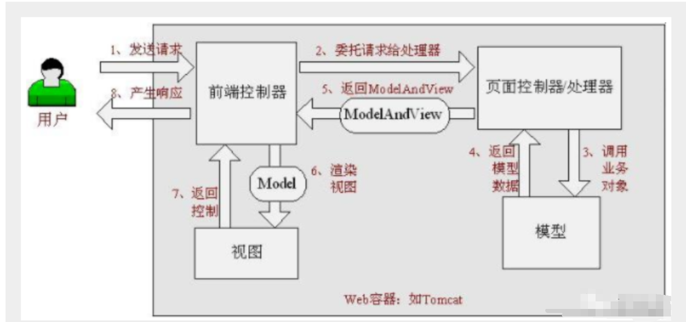
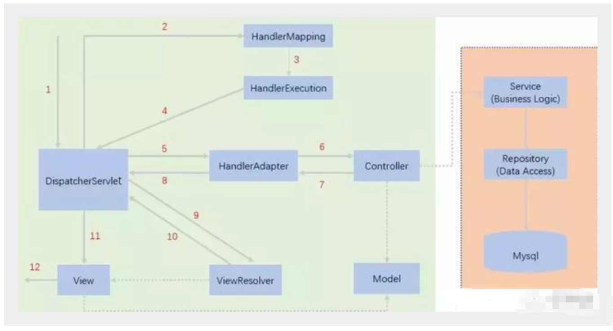

## 中心控制器

**SpringMVC围绕DispatcherServlet设计，DispatcherServlet的作用是将请求分发到不同的处理器。Spring MVC框架像许多其他MVC框架一样, 以请求为驱动 , 围绕一个中心Servlet分派请求及提供其他功能，DispatcherServlet是一个实际的Servlet (它继承自HttpServlet 基类)**


1. SpringMVC的原理

   `当发起请求时被前置的控制器拦截到请求，根据请求参数生成代理请求，找到请求对应的实际控制器，控制器处理请求，创建数据模型，访问数据库，将模型响应给中心控制器，控制器使用模型与视图渲染视图结果，将结果返回给中心控制器，再将结果返回给请求者`

   

2. SpringMVC执行原理



`上图中实线表示SpringMVC框架提供的实现，虚线代表需要用户自己实现的部分`

## SpringMVC详细执行流程

​	我们假设请求的url为 : http://localhost:8080/SpringMVC/hello

​	如上url拆分成三部分：

​	http://localhost:8080服务器域名

​	SpringMVC部署在服务器上的web站点

​	hello表示控制器

​	通过分析，如上url表示为：请求位于服务器localhost:8080上的SpringMVC站点的hello控制器。

1. DispatcherServlet表示前置控制器，是整个SpringMVC的控制中心。用户发出请求，DispatcherServlet接收请求并拦截请求
2. HandlerMapping为处理器映射。DispatcherServlet调用HandlerMapping,HandlerMapping根据请求url查找Handler。
3. HandlerExecution表示具体的Handler,其主要作用是根据url查找控制器，如上url被查找控制器为：hello。
4. HandlerExecution将解析后的信息传递给DispatcherServlet,如解析控制器映射等。
5. HandlerAdapter表示处理器适配器，其按照特定的规则去执行Handler。
6. Handler让具体的Controller执行。
7. Controller将具体的执行信息返回给HandlerAdapter,如ModelAndView。
8. HandlerAdapter将视图逻辑名或模型传递给DispatcherServlet。
9. DispatcherServlet调用视图解析器(ViewResolver)来解析HandlerAdapter传递的逻辑视图名。
   1. 视图解析器(ViewResolver)获取DispatcherServlet给它的ModelAndView数据。
   2. 解析ModelAndView数据
   3. 进行视图名称拼接，得到真实的视图
   4. 将数据绑定到视图上
10. 视图解析器将解析的逻辑视图名传给DispatcherServlet。
11. DispatcherServlet根据视图解析器解析的视图结果，调用具体的视图。
12. 最终视图呈现给用户。

## 不使用注解的SpringMVC

1. web.xml配置

   ```xml
   <?xml version="1.0" encoding="UTF-8"?>
   <web-app xmlns="http://xmlns.jcp.org/xml/ns/javaee"
            xmlns:xsi="http://www.w3.org/2001/XMLSchema-instance"
            xsi:schemaLocation="http://xmlns.jcp.org/xml/ns/javaee http://xmlns.jcp.org/xml/ns/javaee/web-app_4_0.xsd"
            version="4.0">
       <servlet>
           <servlet-name>dispatcherServlet</servlet-name>
           <servlet-class>org.springframework.web.servlet.DispatcherServlet</servlet-class>
   <!--        DispatcherServlet要绑定到SpringMVC也就是Spring的配置文件里面-->
           <init-param>
               <param-name>contextConfigLocation</param-name>
               <param-value>classpath:springMVC.xml</param-value>
           </init-param>
   <!--        启动级别,设置为1表示随系统一起启动-->
           <load-on-startup>1</load-on-startup>
       </servlet>
   <!--    在SpringMVC中要注意，/表示只匹配所有请求，但不包括匹配jsp页面，/*既匹配所有请求，也匹配jsp页面-->
       <servlet-mapping>
           <servlet-name>dispatcherServlet</servlet-name>
           <url-pattern>/</url-pattern>
       </servlet-mapping>
   </web-app>
   ```

2. springMVC配置

   ```xml
   <?xml version="1.0" encoding="UTF-8"?>
   <beans xmlns="http://www.springframework.org/schema/beans"
          xmlns:xsi="http://www.w3.org/2001/XMLSchema-instance"
          xsi:schemaLocation="http://www.springframework.org/schema/beans
          http://www.springframework.org/schema/beans/spring-beans.xsd">
       
       <!--其实下面的处理器映射器和处理器适配器不配置也可以正常访问，这里配置只是为了更好的理解执行过程-->
   <!--    处理器映射器，下面使用的这个映射器是根据bean的名字去查找的controller-->
       <bean class="org.springframework.web.servlet.handler.BeanNameUrlHandlerMapping"/>
   <!--    处理器适配器-->
       <bean class="org.springframework.web.servlet.mvc.SimpleControllerHandlerAdapter"/>
   
   <!--    视图解析器-->
       <bean class="org.springframework.web.servlet.view.InternalResourceViewResolver">
   <!--        前缀-->
           <property name="prefix" value="/WEB-INF/jsp/"/>
   <!--        后缀-->
           <property name="suffix" value=".jsp"/>
       </bean>
   
   <!--    因为我们前端发送的是/hello请求，所以这里bean的名字也是这个，这是由于上面配置的处理器映射器的特性决定的-->
       <bean id="/hello" class="com.wdy.controller.HelloController"/>
   
   </beans>
   ```

3. controller

   ```java
   public class HelloController implements Controller {
       @Override
       public ModelAndView handleRequest(HttpServletRequest request, HttpServletResponse response) throws Exception {
           ModelAndView mv = new ModelAndView();
           mv.addObject("msg", "hello SpringMVC");
           mv.setViewName("test");
           return mv;
       }
   }
   ```

## 使用注解的SpringMVC

1. web.xml配置一样

2. springMVC配置

   ```xml
   <?xml version="1.0" encoding="UTF-8"?>
   <beans xmlns="http://www.springframework.org/schema/beans"
          xmlns:xsi="http://www.w3.org/2001/XMLSchema-instance"
          xmlns:context="http://www.springframework.org/schema/context"
          xmlns:mvc="http://www.springframework.org/schema/mvc"
          xsi:schemaLocation="http://www.springframework.org/schema/beans
          http://www.springframework.org/schema/beans/spring-beans.xsd
          http://www.springframework.org/schema/context
          https://www.springframework.org/schema/context/spring-context.xsd
          http://www.springframework.org/schema/mvc
          https://www.springframework.org/schema/mvc/spring-mvc.xsd">
   
       <!-- 自动扫描包，让指定包下的注解生效,由IOC容器统一管理 -->
       <context:component-scan base-package="com.wdy.controller"/>
       <!-- 让Spring MVC不处理静态资源 -->
       <mvc:default-servlet-handler />
       <!--
       支持mvc注解驱动
           在spring中一般采用@RequestMapping注解来完成映射关系
           要想使@RequestMapping注解生效
           必须向上下文中注册DefaultAnnotationHandlerMapping
           和一个AnnotationMethodHandlerAdapter实例
           这两个实例分别在类级别和方法级别处理。
           而annotation-driven配置帮助我们自动完成上述两个实例的注入。
        -->
       <mvc:annotation-driven />
   
       <!-- 视图解析器 -->
       <bean class="org.springframework.web.servlet.view.InternalResourceViewResolver"
             id="internalResourceViewResolver">
           <!-- 前缀 -->
           <property name="prefix" value="/WEB-INF/jsp/" />
           <!-- 后缀 -->
           <property name="suffix" value=".jsp" />
       </bean>
   
   </beans>
   ```

3. controller

   ```java
   @Controller
   public class HelloController {
       @RequestMapping("/test")
       public String hello(Model model){
           model.addAttribute("msg", "hello springMVC annotation");
           //返回值会被视图解析器解析
           return "test";
       }
   }
   ```

### 总结

1. 在视图解析器中我们把所有的视图都存放在/WEB-INF/目录下，这样可以保证视图安全，因为这个目录下的文件，客户端不能直接访问。

2. @Controller是为了让Spring IOC容器初始化时自动扫描到

3. @RequestMapping是为了映射请求路径，这个注解在类与方法上都能使用

4. 由于Maven可能存在资源过滤的问题，有时要将配置完善(这是由于maven约定大于配置，我们自己写的配置文件可能无法被导出)

   ```xml
   
   <build>
      <resources>
          <resource>
              <directory>src/main/java</directory>
              <includes>
                  <include>**/*.properties</include>
                  <include>**/*.xml</include>
              </includes>
              <filtering>false</filtering>
          </resource>
          <resource>
              <directory>src/main/resources</directory>
              <includes>
                  <include>**/*.properties</include>
                  <include>**/*.xml</include>
              </includes>
              <filtering>false</filtering>
          </resource>
      </resources>
   </build>
   ```

5. 可能遇到的问题：访问出现404，排查步骤

   1. 查看控制台输出，看一下是不是缺少了什么jar包。
   2. 如果jar包存在，显示无法输出，就在IDEA的项目发布中，添加lib依赖！
   3. 重启Tomcat 即可解决！

6. 使用springMVC必须配置的三大件

   通常，我们只需要**手动配置视图解析器**，而**处理器映射器**和**处理器适配器**只需要开启**注解驱动**即可，而省去了大段的xml配置

## RestFul

**Restful就是一个资源定位及资源操作的风格。不是标准也不是协议，只是一种风格。基于这个风格设计的软件可以更简洁，更有层次，更易于实现缓存等机制**

1. 在Spring MVC中可以使用  @PathVariable 注解，让方法参数的值对应绑定到一个URI模板变量上

   ```java
   @Controller
   public class RestFulController {
      //映射访问路径
      @RequestMapping("/commit/{p1}/{p2}")
      public String index(@PathVariable int p1, @PathVariable int p2, Model model){
          
          int result = p1+p2;
          //Spring MVC会自动实例化一个Model对象用于向视图中传值
          model.addAttribute("msg", "结果："+result);
          //返回视图位置
          return "test";
     }
   }
   ```

   `使用路径变量的好处:`

   - 使路径变得更加简洁；
   - 获得参数更加方便，框架会自动进行类型转换。
   - 通过路径变量的类型可以约束访问参数，如果类型不一样，则访问不到对应的请求方法，如这里访问是的路径是/commit/1/a，则路径与方法不匹配，而不会是参数转换失败。

2. 使用method属性指定请求类型

   ```java
   //指定只能接受POST请求
   @RequestMapping(value = "/hello",method = {RequestMethod.POST})
   public String index2(Model model){
      model.addAttribute("msg", "hello!");
      return "test";
   }
   ```

3. 总结

   * Spring MVC 的 @RequestMapping 注解能够处理 HTTP 请求的方法, 比如 GET, PUT, POST, DELETE 以及 PATCH

   * **所有的地址栏请求默认都会是 HTTP GET 类型的**

   * 方法级别的注解变体有如下几个：组合注解，例如@GetMapping它所扮演的是 @RequestMapping(method =RequestMethod.GET) 的一个快捷方式

     ```java
     @GetMapping
     @PostMapping
     @PutMapping
     @DeleteMapping
     @PatchMapping
     ```

## 结果跳转方式

### ModelAndView

设置ModelAndView对象 , 根据view的名称 , 和视图解析器跳到指定的页面

```java
public class ControllerTest1 implements Controller {

   public ModelAndView handleRequest(HttpServletRequest httpServletRequest, HttpServletResponse httpServletResponse) throws Exception {
       //返回一个模型视图对象
       ModelAndView mv = new ModelAndView();
       mv.addObject("msg","ControllerTest1");
       mv.setViewName("test");
       return mv;
  }
}
```

### ServletAPI

通过设置ServletAPI , 不需要视图解析器 

1、通过HttpServletResponse进行输出

2、通过HttpServletResponse实现重定向

3、通过HttpServletResponse实现转发

```java
@Controller
public class ResultGo {

   @RequestMapping("/result/t1")
   public void test1(HttpServletRequest req, HttpServletResponse rsp) throws IOException {
       rsp.getWriter().println("Hello,Spring BY servlet API");
  }

   @RequestMapping("/result/t2")
   public void test2(HttpServletRequest req, HttpServletResponse rsp) throws IOException {
       rsp.sendRedirect("/index.jsp");
  }

   @RequestMapping("/result/t3")
   public void test3(HttpServletRequest req, HttpServletResponse rsp) throws Exception {
       //转发
       req.setAttribute("msg","/result/t3");
       req.getRequestDispatcher("/WEB-INF/jsp/test.jsp").forward(req,rsp);
  }
}
```

### SpringMVC

1. **通过SpringMVC来实现转发和重定向 - 无需视图解析器**

```java
@Controller
public class ResultSpringMVC {
   @RequestMapping("/rsm/t1")
   public String test1(){
       //转发
       return "/index.jsp";
  }

   @RequestMapping("/rsm/t2")
   public String test2(){
       //转发二
       return "forward:/index.jsp";
  }

   @RequestMapping("/rsm/t3")
   public String test3(){
       //重定向
       return "redirect:/index.jsp";
  }
}
```

2. **通过SpringMVC来实现转发和重定向 - 有视图解析器**

   重定向 , 不需要视图解析器 , 本质就是重新请求一个新地方嘛 , 所以注意路径问题。可以重定向到另外一个请求实现 

   ```java
   @Controller
   public class ResultSpringMVC2 {
      @RequestMapping("/rsm2/t1")
      public String test1(){
          //转发
          return "test";
     }
   
      @RequestMapping("/rsm2/t2")
      public String test2(){
          //重定向
          return "redirect:/index.jsp";
          //return "redirect:hello.do"; //hello.do为另一个请求/
     }
   
   }
   ```

## 数据处理

### 处理提交数据

1. **提交的域名称和处理方法的参数名一致**

   提交数据 : http://localhost:8080/hello?name=wdy

   ```java
   @RequestMapping("/hello")
   public String hello(String name){
      System.out.println(name);
      return "hello";
   }
   ```

2. **提交的域名称和处理方法的参数名不一致**

   提交数据 : http://localhost:8080/hello?username=wdy

   ```java
   //@RequestParam("username") : username提交的域的名称 .
   @RequestMapping("/hello")
   public String hello(@RequestParam("username") String name){
      System.out.println(name);
      return "hello";
   }
   ```

3. **提交的是一个对象**

   要求提交的表单域和对象的属性名一致  , 参数使用对象即可

   * 实体类

     ```java
     public class User {
        private int id;
        private String name;
        private int age;
        //构造
        //get/set
        //tostring()
     }
     ```

   * 提交数据 : http://localhost:8080/mvc04/user?name=wdy&id=1&age=15

   * 处理方法

     ```java
     @RequestMapping("/user")
     public String user(User user){   //对象会自动封装
        System.out.println(user);
        return "hello";
     }
     ```

     **说明：如果使用对象的话，前端传递的参数名和对象名必须一致，否则就是null**

### 数据显示到前端

1. **通过ModelAndView**

   ```java
   public class ControllerTest1 implements Controller {
   
      public ModelAndView handleRequest(HttpServletRequest httpServletRequest, HttpServletResponse httpServletResponse) throws Exception {
          //返回一个模型视图对象
          ModelAndView mv = new ModelAndView();
          mv.addObject("msg","ControllerTest1");
          mv.setViewName("test");
          return mv;
     }
   }
   ```

2. **通过ModelMap**

   ```java
   @RequestMapping("/hello")
   public String hello(@RequestParam("username") String name, ModelMap model){
      //封装要显示到视图中的数据
      //相当于req.setAttribute("name",name);
      model.addAttribute("name",name);
      System.out.println(name);
      return "hello";
   }
   ```

3. **通过Model**

   ```java
   @RequestMapping("/ct2/hello")
   public String hello(@RequestParam("username") String name, Model model){
      //封装要显示到视图中的数据
      //相当于req.setAttribute("name",name);
      model.addAttribute("msg",name);
      System.out.println(name);
      return "test";
   }
   ```

   总结：

   ```
   Model 只有寥寥几个方法只适合用于储存数据，简化了新手对于Model对象的操作和理解；
   
   ModelMap 继承了 LinkedMap ，除了实现了自身的一些方法，同样的继承 LinkedMap 的方法和特性；
   
   ModelAndView 可以在储存数据的同时，可以进行设置返回的逻辑视图，进行控制展示层的跳转。
   ```

## 乱码问题

SpringMVC提供了一个过滤器 , 可以在web.xml中配置

```xml
<filter>
   <filter-name>encoding</filter-name>
   <filter-class>org.springframework.web.filter.CharacterEncodingFilter</filter-class>
   <init-param>
       <param-name>encoding</param-name>
       <param-value>utf-8</param-value>
   </init-param>
</filter>
<filter-mapping>
   <filter-name>encoding</filter-name>
   <url-pattern>/*</url-pattern>
</filter-mapping>
```

**有些极端情况下.这个过滤器对get的支持不好**

上述Spring过滤器不足的解决办法:

1. 修改tomcat配置文件 ：设置编码

   ```xml
   <Connector URIEncoding="utf-8" port="8080" protocol="HTTP/1.1"
             connectionTimeout="20000"
             redirectPort="8443" />
   ```

2. 自定义过滤器

   ```java
   /**
   * 解决get和post请求 全部乱码的过滤器
   */
   public class GenericEncodingFilter implements Filter {
   
      @Override
      public void destroy() {
     }
   
      @Override
      public void doFilter(ServletRequest request, ServletResponse response, FilterChain chain) throws IOException, ServletException {
          //处理response的字符编码
          HttpServletResponse myResponse=(HttpServletResponse) response;
          myResponse.setContentType("text/html;charset=UTF-8");
   
          // 转型为与协议相关对象
          HttpServletRequest httpServletRequest = (HttpServletRequest) request;
          // 对request包装增强
          HttpServletRequest myrequest = new MyRequest(httpServletRequest);
          chain.doFilter(myrequest, response);
     }
   
      @Override
      public void init(FilterConfig filterConfig) throws ServletException {
     }
   
   }
   
   //自定义request对象，HttpServletRequest的包装类
   class MyRequest extends HttpServletRequestWrapper {
   
      private HttpServletRequest request;
      //是否编码的标记
      private boolean hasEncode;
      //定义一个可以传入HttpServletRequest对象的构造函数，以便对其进行装饰
      public MyRequest(HttpServletRequest request) {
          super(request);// super必须写
          this.request = request;
     }
   
      // 对需要增强方法 进行覆盖
      @Override
      public Map getParameterMap() {
          // 先获得请求方式
          String method = request.getMethod();
          if (method.equalsIgnoreCase("post")) {
              // post请求
              try {
                  // 处理post乱码
                  request.setCharacterEncoding("utf-8");
                  return request.getParameterMap();
             } catch (UnsupportedEncodingException e) {
                  e.printStackTrace();
             }
         } else if (method.equalsIgnoreCase("get")) {
              // get请求
              Map<String, String[]> parameterMap = request.getParameterMap();
              if (!hasEncode) { // 确保get手动编码逻辑只运行一次
                  for (String parameterName : parameterMap.keySet()) {
                      String[] values = parameterMap.get(parameterName);
                      if (values != null) {
                          for (int i = 0; i < values.length; i++) {
                              try {
                                  // 处理get乱码
                                  values[i] = new String(values[i]
                                         .getBytes("ISO-8859-1"), "utf-8");
                             } catch (UnsupportedEncodingException e) {
                                  e.printStackTrace();
                             }
                         }
                     }
                 }
                  hasEncode = true;
             }
              return parameterMap;
         }
          return super.getParameterMap();
     }
   
      //取一个值
      @Override
      public String getParameter(String name) {
          Map<String, String[]> parameterMap = getParameterMap();
          String[] values = parameterMap.get(name);
          if (values == null) {
              return null;
         }
          return values[0]; // 取回参数的第一个值
     }
   
      //取所有值
      @Override
      public String[] getParameterValues(String name) {
          Map<String, String[]> parameterMap = getParameterMap();
          String[] values = parameterMap.get(name);
          return values;
     }
   }
   ```

   **自定义完了，记得在web.xml中配置这个过滤器**

## JSON

### 介绍

1. JSON(JavaScript Object Notation, JS 对象标记) 是一种轻量级的数据交换格式

2. 采用完全独立于编程语言的**文本格式**来存储和表示数据

3. JSON 是 JavaScript 对象的字符串表示法，它使用文本表示一个 JS 对象的信息，本质是一个字符串

   ```javascript
   var obj = {a: 'Hello', b: 'World'}; //这是一个对象，注意键名也是可以使用引号包裹的
   var json = '{"a": "Hello", "b": "World"}'; //这是一个 JSON 字符串，本质是一个字符串
   ```

### JSON 和 JavaScript 对象互转

要实现从JSON字符串转换为JavaScript 对象，使用 JSON.parse() 方法：

```javascript
var obj = JSON.parse('{"a": "Hello", "b": "World"}');
//结果是 {a: 'Hello', b: 'World'}
```

要实现从JavaScript 对象转换为JSON字符串，使用 JSON.stringify() 方法：

```javascript
var json = JSON.stringify({a: 'Hello', b: 'World'});
//结果是 '{"a": "Hello", "b": "World"}'
```

```html
<!DOCTYPE html>
<html lang="en">
<head>
   <meta charset="UTF-8">
   <title>JSON_wdy</title>
</head>
<body>

<script type="text/javascript">
   //编写一个js的对象
   var user = {
       name:"wdy",
       age:3,
       sex:"男"
  };
   //将js对象转换成json字符串
   var str = JSON.stringify(user);
   console.log(str);
   
   //将json字符串转换为js对象
   var user2 = JSON.parse(str);
   console.log(user2.age,user2.name,user2.sex);
</script>
</body>
</html>
```

### Controller返回JSON数据

#### @Response注解

1. 概念

​    注解 @ResponseBody，**使用在控制层（controller）的方法上**

2. **作用**

​    作用：将方法的返回值，**以特定的格式写入到response的body区域**，进而将数据返回给客户端。

​    当方法上面没有写ResponseBody,底层会将方法的返回值封装为ModelAndView对象。

​    如果返回值是字符串，那么直接将字符串写到客户端；如果是一个对象，会将对象转化为json串，然后写到客户端。

3. 注意编码

​    如果返回对象,按utf-8编码。**如果返回String，默认按iso8859-1编码，页面可能出现乱码**。因此在注解中我们可以手动修改编码格式，例如@RequestMapping(value="/cat/query",produces="text/html;charset=utf-8")，前面是请求的路径，后面是编码格式。

4. 原理

​    控制层方法的返回值是如何转化为json格式的字符串的？其实是**通过HttpMessageConverter中的方法实现的**，它本是一个接口，在其实现类完成转换。如果是bean对象，会调用对象的getXXX（）方法获取属性值并且以键值对的形式进行封装，进而转化为json串。如果是map集合，采用get(key)方式获取value值，然后进行封装。

#### @RestController注解

在Spring中@RestController的作用**等同于@Controller + @ResponseBody**


**测试代码**

1. web.xml和SpringMVC配置文件与之前配置一样

2. 实体类

   ```java
   //需要导入lombok
   @Data
   @AllArgsConstructor
   @NoArgsConstructor
   public class User {
   
      private String name;
      private int age;
      private String sex;
      
   }
   ```

3. Controller

   `这里我们需要两个东西，一个是@ResponseBody，一个是ObjectMapper对象(这个类Jackson包里面的,所以要导入Jackson依赖)`

   ```java
   @Controller
   public class UserController {
   
      @RequestMapping("/json1")
      @ResponseBody
      public String json1() throws JsonProcessingException {
          //创建一个jackson的对象映射器，用来解析数据
          ObjectMapper mapper = new ObjectMapper();
          //创建一个对象
          User user = new User("wdy", 3, "男");
          //将对象解析成为json格式,这个方法还可以将Java中的集合很好的处理
          String str = mapper.writeValueAsString(user);
          //由于@ResponseBody注解，这里会将str转成json格式返回；十分方便
          return str;
     }
   
   }
   ```

4. 如果返回的内容里面有中文，需要将编码转为UTF8编码，否则会出现乱码

   ```java
   //produces:指定响应体返回类型和编码
   @RequestMapping(value = "/json1",produces = "application/json;charset=utf-8")
   ```

## 代码优化

### 乱码统一解决

前面解决json乱码比较麻烦，如果`项目中有许多请求则每一个@RequestMapping都要添加`，可以通过Spring配置统一指定，这样就不用每次都去处理了！我们可以在springmvc的配置文件上添加一段消息StringHttpMessageConverter转换配置！

```xml
<mvc:annotation-driven>
   <mvc:message-converters register-defaults="true">
       <bean class="org.springframework.http.converter.StringHttpMessageConverter">
           <constructor-arg value="UTF-8"/>
       </bean>
       <bean class="org.springframework.http.converter.json.MappingJackson2HttpMessageConverter">
           <property name="objectMapper">
               <bean class="org.springframework.http.converter.json.Jackson2ObjectMapperFactoryBean">
                   <property name="failOnEmptyBeans" value="false"/>
               </bean>
           </property>
       </bean>
   </mvc:message-converters>
</mvc:annotation-driven>
```

### 返回json字符串统一解决

**在类上直接使用 @RestController ，这样子，里面所有的方法都只会返回 json 字符串了，不用再每一个都添加@ResponseBody ！**

```java
@RestController
public class UserController {

   //produces:指定响应体返回类型和编码
   @RequestMapping(value = "/json1")
   public String json1() throws JsonProcessingException {
       //创建一个jackson的对象映射器，用来解析数据
       ObjectMapper mapper = new ObjectMapper();
       //创建一个对象
       User user = new User("秦疆1号", 3, "男");
       //将对象解析成为json格式
       String str = mapper.writeValueAsString(user);
       return str;
  }
}
```

### 输出集合对象

**和之前处理一样,mapper.writeValueAsString方法可以很好的处理Java的集合对象**

### 输出时间对象

```java
@RequestMapping("/json3")
public String json3() throws JsonProcessingException {

   ObjectMapper mapper = new ObjectMapper();

   //创建时间一个对象，java.util.Date
   Date date = new Date();
   //将对象解析成为json格式
   String str = mapper.writeValueAsString(date);
   return str;
}
```

* 默认日期格式会变成一个数字，是1970年1月1日到当前日期的毫秒数
* Jackson 默认是会把时间转成timestamps形式

**解决方案：取消timestamps形式 ， 自定义时间格式**

```java
@RequestMapping("/json4")
public String json4() throws JsonProcessingException {

   ObjectMapper mapper = new ObjectMapper();

   //不使用时间戳的方式
   mapper.configure(SerializationFeature.WRITE_DATES_AS_TIMESTAMPS, false);
   //自定义日期格式对象
   SimpleDateFormat sdf = new SimpleDateFormat("yyyy-MM-dd HH:mm:ss");
   //指定日期格式
   mapper.setDateFormat(sdf);

   Date date = new Date();
   String str = mapper.writeValueAsString(date);

   return str;
}
```

### FastJson(补充使用）

`fastjson.jar是阿里开发的一款专门用于Java开发的包，可以方便的实现json对象与JavaBean对象的转换，实现JavaBean对象与json字符串的转换，实现json对象与json字符串的转换。`

```java
public class FastJsonDemo {
   public static void main(String[] args) {
       //创建对象
       User user1 = new User("wdy1", 3, "男");
       User user2 = new User("wdy2", 3, "男");
       User user3 = new User("wdy3", 3, "男");
       User user4 = new User("wdy4", 3, "男");
       List<User> list = new ArrayList<User>();
       list.add(user1);
       list.add(user2);
       list.add(user3);
       list.add(user4);
       System.out.println("*******Java对象 转 JSON字符串*******");
       String str1 = JSON.toJSONString(list);
       System.out.println("JSON.toJSONString(list)==>"+str1);
       String str2 = JSON.toJSONString(user1);
       System.out.println("JSON.toJSONString(user1)==>"+str2);

       System.out.println("\n****** JSON字符串 转 Java对象*******");
       User jp_user1=JSON.parseObject(str2,User.class);
       System.out.println("JSON.parseObject(str2,User.class)==>"+jp_user1);

       System.out.println("\n****** Java对象 转 JSON对象 ******");
       JSONObject jsonObject1 = (JSONObject) JSON.toJSON(user2);
       System.out.println("(JSONObject) JSON.toJSON(user2)==>"+jsonObject1.getString("name"));

       System.out.println("\n****** JSON对象 转 Java对象 ******");
       User to_java_user = JSON.toJavaObject(jsonObject1, User.class);
       System.out.println("JSON.toJavaObject(jsonObject1, User.class)==>"+to_java_user);
  }
}
```

## SSM整合

**详情见整合项目ssm-integration**


## Ajax

### ${pageContext.request.contextPath}

${pageContext.request.contextPath}是**JSP取得绝对路径的方法**，等价于<%=request.getContextPath()%>。也就是取出部署的应用程序名或者是当前的项目名称。
 比如我的项目名称是demo1在浏览器中输入为http://localhost:8080/demo1/a.jsp,${pageContext.request.contextPath}或`<%=request.getContextPath()%>`取出来的就是/demo1,而"/"代表的含义就是 [http://localhost:8080](https://link.jianshu.com?t=http://localhost:8080) 故有时候项目中这样写 ${pageContext.request.contextPath}/a.jsp

### jQuery.ajax

**Ajax的核心是XMLHttpRequest对象(XHR)**。XHR为向服务器发送请求和解析服务器响应提供了接口。能够以异步方式从服务器获取新数据。

```
jQuery.ajax(...)
      部分参数：
            url：请求地址
            type：请求方式，GET、POST（1.9.0之后用method）
        headers：请求头
            data：要发送的数据
    contentType：即将发送信息至服务器的内容编码类型(默认: "application/x-www-form-urlencoded; charset=UTF-8")
          async：是否异步
        timeout：设置请求超时时间（毫秒）
      beforeSend：发送请求前执行的函数(全局)
        complete：完成之后执行的回调函数(全局)
        success：成功之后执行的回调函数(全局)
          error：失败之后执行的回调函数(全局)
        accepts：通过请求头发送给服务器，告诉服务器当前客户端可接受的数据类型
        dataType：将服务器端返回的数据转换成指定类型
          "xml": 将服务器端返回的内容转换成xml格式
          "text": 将服务器端返回的内容转换成普通文本格式
          "html": 将服务器端返回的内容转换成普通文本格式，在插入DOM中时，如果包含JavaScript标签，则会尝试去执行。
        "script": 尝试将返回值当作JavaScript去执行，然后再将服务器端返回的内容转换成普通文本格式
          "json": 将服务器端返回的内容转换成相应的JavaScript对象
        "jsonp": JSONP 格式使用 JSONP 形式调用函数时，如 "myurl?callback=?" jQuery 将自动替换 ? 为正确的函数名，以执行		回调函数
```

1. 例子

   ```html
   <%@ page contentType="text/html;charset=UTF-8" language="java" %>
   <html>
    <head>
      <title>$Title$</title>
     <%--<script src="https://code.jquery.com/jquery-3.1.1.min.js"></script>--%>
      <script src="${pageContext.request.contextPath}/statics/js/jquery-3.1.1.min.js"></script>
      <script>
          function a1(){
              $.post({
                  url:"${pageContext.request.contextPath}/a1",
                  data:{'name':$("#txtName").val()},
                  success:function (data,status) {
                      alert(data);
                      alert(status);
                 }
             });
         }
      </script>
    </head>
    <body>
   
   <%--onblur：失去焦点触发事件--%>
   用户名:<input type="text" id="txtName" onblur="a1()"/>
   
    </body>
   </html>
   ```

2. 例子2

   ```html
   <%@ page contentType="text/html;charset=UTF-8" language="java" %>
   <html>
   <head>
      <title>Title</title>
   </head>
   <body>
   <input type="button" id="btn" value="获取数据"/>
   <table width="80%" align="center">
      <tr>
          <td>姓名</td>
          <td>年龄</td>
          <td>性别</td>
      </tr>
      <tbody id="content">
      </tbody>
   </table>
   
   <script src="${pageContext.request.contextPath}/statics/js/jquery-3.1.1.min.js"></script>
   <script>
   
      $(function () {
          $("#btn").click(function () {
              $.post("${pageContext.request.contextPath}/a2",function (data) {
                  console.log(data)
                  var html="";
                  for (var i = 0; i <data.length ; i++) {
                      html+= "<tr>" +
                          "<td>" + data[i].name + "</td>" +
                          "<td>" + data[i].age + "</td>" +
                          "<td>" + data[i].sex + "</td>" +
                          "</tr>"
                 }
                  $("#content").html(html);
             });
         })
     })
   </script>
   </body>
   </html>
   ```

3. 例子三

   ```html
   <%@ page contentType="text/html;charset=UTF-8" language="java" %>
   <html>
   <head>
      <title>ajax</title>
      <script src="${pageContext.request.contextPath}/statics/js/jquery-3.1.1.min.js"></script>
      <script>
   
          function a1(){
              $.post({
                  url:"${pageContext.request.contextPath}/a3",
                  data:{'name':$("#name").val()},
                  success:function (data) {
                      if (data.toString()=='OK'){
                          $("#userInfo").css("color","green");
                     }else {
                          $("#userInfo").css("color","red");
                     }
                      $("#userInfo").html(data);
                 }
             });
         }
          function a2(){
              $.post({
                  url:"${pageContext.request.contextPath}/a3",
                  data:{'pwd':$("#pwd").val()},
                  success:function (data) {
                      if (data.toString()=='OK'){
                          $("#pwdInfo").css("color","green");
                     }else {
                          $("#pwdInfo").css("color","red");
                     }
                      $("#pwdInfo").html(data);
                 }
             });
         }
   
      </script>
   </head>
   <body>
   <p>
     用户名:<input type="text" id="name" onblur="a1()"/>
      <span id="userInfo"></span>
   </p>
   <p>
     密码:<input type="text" id="pwd" onblur="a2()"/>
      <span id="pwdInfo"></span>
   </p>
   </body>
   </html>
   ```


## 拦截器

* SpringMVC的处理器拦截器类似于**Servlet开发中的过滤器Filter**,用于对处理器进行预处理和后处理。开发者可以自己定义一些拦截器来实现特定的功能
* 拦截器是**AOP思想**的具体应用

**过滤器**

- servlet规范中的一部分，任何java web工程都可以使用
- 在url-pattern中配置了/*之后，可以对所有要访问的资源进行拦截

**拦截器** 

- 拦截器是SpringMVC框架自己的，只有使用了SpringMVC框架的工程才能使用
- 拦截器**只会拦截访问的控制器方法**， 如果访问的是jsp/html/css/image/js等静态资源是不会进行拦截的

### 自定义拦截器

**想要自定义拦截器，必须实现 HandlerInterceptor 接口**

1. 编写拦截器

    ```java
    public class MyInterceptor implements HandlerInterceptor {

       //在请求处理的方法之前执行
       //如果返回true执行下一个拦截器
       //如果返回false就不执行下一个拦截器
       public boolean preHandle(HttpServletRequest httpServletRequest, HttpServletResponse httpServletResponse, Object o) throws Exception {
           System.out.println("------------处理前------------");
           return true;
      }

       //在请求处理方法执行之后执行
       public void postHandle(HttpServletRequest httpServletRequest, HttpServletResponse httpServletResponse, Object o, ModelAndView modelAndView) throws Exception {
           System.out.println("------------处理后------------");
      }

       //在dispatcherServlet处理后执行,做清理工作.
       public void afterCompletion(HttpServletRequest httpServletRequest, HttpServletResponse httpServletResponse, Object o, Exception e) throws Exception {
           System.out.println("------------清理------------");
      }
    }
    ```

2. 在springmvc的配置文件中配置拦截器

   ```xml
   <!--关于拦截器的配置-->
   <mvc:interceptors>
      <mvc:interceptor>
          <!--/** 包括路径及其子路径-->
          <!--/admin/* 拦截的是/admin/add等等这种 , /admin/add/user不会被拦截-->
          <!--/admin/** 拦截的是/admin/下的所有-->
          <mvc:mapping path="/**"/>
          <!--bean配置的就是拦截器-->
          <bean class="com.wdy.interceptor.MyInterceptor"/>
      </mvc:interceptor>
   </mvc:interceptors>
   ```

   

## 文件上传下载

* **如果想使用Spring的文件上传功能，则需要在上下文中配置MultipartResolver**

* **前端表单要求**：为了能上传文件，必须将表单的method设置为POST，并将enctype设置为multipart/form-data。只有在这样的情况下，浏览器才会把用户选择的文件以二进制数据发送给服务器

  ```html
  <form action="" enctype="multipart/form-data" method="post">
     <input type="file" name="file"/>
     <input type="submit">
  </form>
  ```

* **对表单中的 enctype 属性做个详细的说明：**

  - application/x-www=form-urlencoded：默认方式，只处理表单域中的 value 属性值，采用这种编码方式的表单会将表单域中的值处理成 URL 编码方式。
  - multipart/form-data：这种编码方式会以二进制流的方式来处理表单数据，这种编码方式会把文件域指定文件的内容也封装到请求参数中，不会对字符编码。
  - text/plain：除了把空格转换为 "+" 号外，其他字符都不做编码处理，这种方式适用直接通过表单发送邮件。

一旦设置了enctype为multipart/form-data，浏览器即会采用二进制流的方式来处理表单数据，而对于文件上传的处理则涉及在服务器端解析原始的HTTP响应。在2003年，Apache Software Foundation发布了**开源的Commons FileUpload组件**，其很快成为Servlet/JSP程序员上传文件的最佳选择。

- Servlet3.0规范已经提供方法来处理文件上传，但这种上传需要在Servlet中完成。
- 而Spring MVC则提供了更简单的封装。
- Spring MVC为文件上传提供了直接的支持，这种支持是用**即插即用的MultipartResolver**实现的。
- **Spring MVC使用Apache Commons FileUpload技术实现了一个MultipartResolver实现类**
- CommonsMultipartResolver。因此，SpringMVC的文件上传还需要**依赖Apache Commons FileUpload的组件**。

### 文件上传

1、导入文件上传的jar包，commons-fileupload ， Maven会自动帮我们导入他的依赖包 commons-io包；

```xml
<!--文件上传-->
<dependency>
   <groupId>commons-fileupload</groupId>
   <artifactId>commons-fileupload</artifactId>
   <version>1.3.3</version>
</dependency>
<!--servlet-api导入高版本的-->
<dependency>
   <groupId>javax.servlet</groupId>
   <artifactId>javax.servlet-api</artifactId>
   <version>4.0.1</version>
</dependency>
```

2、配置bean：multipartResolver

【**注意！！！这个bena的id必须为：multipartResolver ， 否则上传文件会报400的错误**】

```xml
<!--文件上传配置-->
<bean id="multipartResolver"  class="org.springframework.web.multipart.commons.CommonsMultipartResolver">
   <!-- 请求的编码格式，必须和jSP的pageEncoding属性一致，以便正确读取表单的内容，默认为ISO-8859-1 -->
   <property name="defaultEncoding" value="utf-8"/>
   <!-- 上传文件大小上限，单位为字节（10485760=10M） -->
   <property name="maxUploadSize" value="10485760"/>
   <property name="maxInMemorySize" value="40960"/>
</bean>
```

CommonsMultipartFile 的 常用方法：

- **String getOriginalFilename()：获取上传文件的原名**
- **InputStream getInputStream()：获取文件流**
- **void transferTo(File dest)：将上传文件保存到一个目录文件中**

3、编写前端页面

```html
<form action="/upload" enctype="multipart/form-data" method="post">
 <input type="file" name="file"/>
 <input type="submit" value="upload">
</form>
```

4、Controller

```java
@Controller
public class FileController {
   //@RequestParam("file") 将name=file控件得到的文件封装成CommonsMultipartFile 对象
   //批量上传CommonsMultipartFile则为数组即可
   @RequestMapping("/upload")
   public String fileUpload(@RequestParam("file") CommonsMultipartFile file , HttpServletRequest request) throws IOException {

       //获取文件名 : file.getOriginalFilename();
       String uploadFileName = file.getOriginalFilename();

       //如果文件名为空，直接回到首页！
       if ("".equals(uploadFileName)){
           return "redirect:/index.jsp";
      }
       System.out.println("上传文件名 : "+uploadFileName);

       //上传路径保存设置
       String path = request.getServletContext().getRealPath("/upload");
       //如果路径不存在，创建一个
       File realPath = new File(path);
       if (!realPath.exists()){
           realPath.mkdir();
      }
       System.out.println("上传文件保存地址："+realPath);

       InputStream is = file.getInputStream(); //文件输入流
       OutputStream os = new FileOutputStream(new File(realPath,uploadFileName)); //文件输出流

       //读取写出
       int len=0;
       byte[] buffer = new byte[1024];
       while ((len=is.read(buffer))!=-1){
           os.write(buffer,0,len);
           os.flush();
      }
       os.close();
       is.close();
       return "redirect:/index.jsp";
  }
}
```
#### 采用file.Transto 来保存上传的文件

* 编写Controller

    ```java
    /*
    * 采用file.Transto 来保存上传的文件
    */
    @RequestMapping("/upload2")
    public String  fileUpload2(@RequestParam("file") CommonsMultipartFile file, HttpServletRequest request) throws IOException {

       //上传路径保存设置
       String path = request.getServletContext().getRealPath("/upload");
       File realPath = new File(path);
       if (!realPath.exists()){
           realPath.mkdir();
      }
       //上传文件地址
       System.out.println("上传文件保存地址："+realPath);

       //通过CommonsMultipartFile的方法直接写文件（注意这个时候）
       file.transferTo(new File(realPath +"/"+ file.getOriginalFilename()));

       return "redirect:/index.jsp";
    }
    ```

### 文件下载

1. 设置 response 响应头

2. 读取文件 -- InputStream

3. 写出文件 -- OutputStream

4. 执行操作

5. 关闭流 （先开后关）

```java
@RequestMapping(value="/download")
public String downloads(HttpServletResponse response ,HttpServletRequest request) throws Exception{
   //要下载的图片地址
   String  path = request.getServletContext().getRealPath("/upload");
   String  fileName = "基础语法.jpg";

   //1、设置response 响应头
   response.reset(); //设置页面不缓存,清空buffer
   response.setCharacterEncoding("UTF-8"); //字符编码
   response.setContentType("multipart/form-data"); //二进制传输数据
   //设置响应头
   response.setHeader("Content-Disposition",
           "attachment;fileName="+URLEncoder.encode(fileName, "UTF-8"));

   File file = new File(path,fileName);
   //2、 读取文件--输入流
   InputStream input=new FileInputStream(file);
   //3、 写出文件--输出流
   OutputStream out = response.getOutputStream();

   byte[] buff =new byte[1024];
   int index=0;
   //4、执行 写出操作
   while((index= input.read(buff))!= -1){
       out.write(buff, 0, index);
       out.flush();
  }
   out.close();
   input.close();
   return null;
}
```


