## 1. SpringBoot简介

SpringBoot2和SpringBoot1有很大不同，从源码和架构上都做了改变。**SpringBoot2是基于Spring5开发的，而Spring5是基于jdk8开发的**，所以引入了jdk8的很多新特性。

### 1.1 Spring5新特性

1. 响应式编程

   

2. 内部源码设计改进，主要是利用了jdk8的新特性（例如**接口默认实现**）

### 1.2 SpringBoot优点

- Create stand-alone Spring applications

- - 创建独立Spring应用

- Embed Tomcat, Jetty or Undertow directly (no need to deploy WAR files)

- - 内嵌web服务器

- Provide opinionated 'starter' dependencies to simplify your build configuration

- - 自动starter依赖，简化构建配置

- Automatically configure Spring and 3rd party libraries whenever possible

- - 自动配置Spring以及第三方功能

- Provide production-ready features such as metrics, health checks, and externalized configuration

- - 提供生产级别的监控、健康检查及外部化配置

- Absolutely no code generation and no requirement for XML configuration

- - 无代码生成、无需编写XML

### 1.3 SpringBoot缺点

* 人称版本帝，迭代快，需要时刻关注变化

* 封装太深，内部原理复杂，不容易精通

### 1.4 微服务

[论文地址](https://martinfowler.com/microservices/)

* 微服务是一种架构风格

- 一个应用拆分为一组小型服务

- 每个服务运行在自己的进程内，也就是可独立部署和升级

- 服务之间使用轻量级HTTP交互

- 服务围绕业务功能拆分

- 可以由全自动部署机制独立部署

- 去中心化，服务自治。服务可以使用不同的语言、不同的存储技术

### 1.5 分布式

**分布式的困难**

- 远程调用

- 服务发现

- 负载均衡

- 服务容错

- 配置管理

- 服务监控

- 链路追踪

- 日志管理

- 任务调度

- 等

  **解决方案**

  `SpringBoot + SpringCloud`

### 1.6 云原生

原生应用如何上云。 Cloud Native

**上云的困难**

- 服务自愈
- 弹性伸缩
- 服务隔离
- 自动化部署
- 灰度发布
- 流量治理
- 等

## 2. 手动创建SpringBoot工程

1. 不使用maven模板创建maven工程

2. 引入依赖

   ```xml
   <parent>
       <groupId>org.springframework.boot</groupId>
       <artifactId>spring-boot-starter-parent</artifactId>
       <version>2.3.4.RELEASE</version>
   </parent>
   ```

3. 创建主程序

   ```java
   /**
    * 主程序类
    * @SpringBootApplication：这是一个SpringBoot应用
    */
   @SpringBootApplication
   public class MainApplication {
   
       public static void main(String[] args) {
           SpringApplication.run(MainApplication.class,args);
       }
   }
   ```

4. 编写其它代码

5. 直接运行主程序Main方法

6. 配置文件application.properties或者application.yaml

7. 简化部署

   ```xml
   <build>
       <plugins>
           <plugin>
               <groupId>org.springframework.boot</groupId>
               <artifactId>spring-boot-maven-plugin</artifactId>
           </plugin>
       </plugins>
   </build>
   ```

   **把项目打成jar包，直接在目标服务器执行即可**
   
   ```xml
   <dependency>
       <groupId>org.springframework.boot</groupId>
       <artifactId>spring-boot-devtools</artifactId>
       <optional>true</optional>
   </dependency>
   ```
   
   这个是SpringBoot**自带的的不完全热部署插件**，代码改动之后依然需要**手动重新build项目**，更改才会生效。
   
   SpringBoot官方**推荐使用idea插件Jrebel(付费)**来实现完全热部署

## 3. 自动配置原理

### 3.1 依赖管理

1. 依赖引入

   ```xml
   引入父项目（依赖）
   <parent>
       <groupId>org.springframework.boot</groupId>
       <artifactId>spring-boot-starter-parent</artifactId>
       <version>2.3.4.RELEASE</version>
   </parent>
   
   spring-boot-starter-parent的父项目，这个项目几乎声明了所有开发中常用的依赖的版本号,自动版本仲裁机制
   <parent>
       <groupId>org.springframework.boot</groupId>
       <artifactId>spring-boot-dependencies</artifactId>
       <version>2.3.4.RELEASE</version>
   </parent>
   ```

2. 开发导入starter场景启动器

   ```
   1、SpringBoot里面有很多 spring-boot-starter-* ： *就表示某种场景
   2、只要引入starter，这个场景的所有常规需要的依赖我们都自动引入
   3、SpringBoot所有支持的场景
   https://docs.spring.io/spring-boot/docs/current/reference/html/using-spring-boot.html#using-boot-starter
   4、见到的  *-spring-boot-starter： 是第三方为我们提供的简化开发的场景启动器。
   5、所有场景启动器最底层的依赖
   <dependency>
     <groupId>org.springframework.boot</groupId>
     <artifactId>spring-boot-starter</artifactId>
     <version>2.3.4.RELEASE</version>
     <scope>compile</scope>
   </dependency>
   ```

3. 无需关注版本号，自动版本仲裁

   ```
   1、引入依赖默认都可以不写版本
   2、引入非版本仲裁的jar，要写版本号。
   ```

4. 可以修改默认版本号

   ```
   1、查看spring-boot-dependencies里面规定当前依赖的版本 用的 key。
   2、在当前项目里面重写配置
   <properties>
   	<mysql.version>5.1.43</mysql.version>
   </properties>
   ```

### 3.2 自动配置

- 自动配好Tomcat

  - 引入Tomcat依赖。
  - 配置Tomcat

    ```
    <dependency>
        <groupId>org.springframework.boot</groupId>
        <artifactId>spring-boot-starter-tomcat</artifactId>
        <version>2.3.4.RELEASE</version>
        <scope>compile</scope>
    </dependency>
    ```

- 自动配好SpringMVC

  - 引入SpringMVC全套组件
  - 自动配好SpringMVC常用组件（功能）

- 自动配好Web常见功能，如：字符编码问题

   - SpringBoot帮我们配置好了所有web开发的常见场景

- 默认的包结构

  - **主程序所在包及其下面的所有子包**里面的组件都会被默认扫描进来
  - 无需以前的包扫描配置
  - 想要**改变扫描路径**，@SpringBootApplication(scanBasePackages=**"指定路径"**)
或者@ComponentScan 指定扫描路径

```
@SpringBootApplication
等同于
@SpringBootConfiguration
@EnableAutoConfiguration
@ComponentScan("主程序所在的包")
```

- 各种配置拥有默认值

  - 默认配置最终都是映射到某个类上，如：MultipartProperties
  - 配置文件的值最终会绑定每个类上，这个类会在容器中创建对象

- 按需加载所有自动配置项

  - 非常多的starter
  - 引入了哪些场景这个场景的自动配置才会开启
  - SpringBoot所有的自动配置功能都在 spring-boot-autoconfigure 包里面
  

### 3.3 容器功能

#### 3.3.1 组件添加

##### @Configuration注解

```java
/**
 * 1、配置类里面使用@Bean标注在方法上给容器注册组件，默认也是单实例的
 * 2、配置类本身也是组件
 * 3、配置类的作用就相当于之前的配置文件
 * 4、proxyBeanMethods：代理bean的方法
 *      Full(proxyBeanMethods = true)、【保证每个@Bean方法被调用多少次返回的组件都是单实例的】
 *      Lite(proxyBeanMethods = false)【每个@Bean方法被调用多少次返回的组件都是新创建的】
 *      组件依赖必须使用Full模式默认。其他默认是Lite模式
 *
 *设置proxyBeanMethods=true,会发现最后从Spring容器中拿到的MyConfig对象是cglib动态代理对象，而不是一个普通对象
 *但是如果值设置为false，最后拿到的就是一个普通对象
 *
 *最佳实战
 *	配置类组件之间无依赖关系用Lite模式加速容器启动过程，减少判断
 *	配置类组件之间有依赖关系，方法会被调用得到之前单实例组件，用Full模式
 *
 */
@Configuration(proxyBeanMethods = false) //告诉SpringBoot这是一个配置类 == 配置文件
public class MyConfig {
    /**
     * Full:外部无论对配置类中的这个组件注册方法调用多少次获取的都是之前注册容器中的单实例对象
     * @return
     */
    @Bean //给容器中添加组件。以方法名作为组件的id。返回类型就是组件类型。返回的值，就是组件在容器中的实例
    public User user01(){
        User zhangsan = new User("zhangsan", 18);
        //user组件依赖了Pet组件
        zhangsan.setPet(tomcatPet());
        return zhangsan;
    }

    @Bean("tom")
    public Pet tomcatPet(){
        return new Pet("tomcat");
    }
}


@SpringBootConfiguration
@EnableAutoConfiguration
@ComponentScan("com.wdy.boot")
public class MainApplication {

    public static void main(String[] args) {
        //1、返回我们IOC容器
        ConfigurableApplicationContext run = SpringApplication.run(MainApplication.class, args);

        //2、查看容器里面的组件
        String[] names = run.getBeanDefinitionNames();
        for (String name : names) {
            System.out.println(name);
        }

        //3、从容器中获取组件
        Pet tom01 = run.getBean("tom", Pet.class);
        Pet tom02 = run.getBean("tom", Pet.class);
        System.out.println("组件："+(tom01 == tom02));


        //4、com.atguigu.boot.config.MyConfig$$EnhancerBySpringCGLIB$$51f1e1ca@1654a892
        MyConfig bean = run.getBean(MyConfig.class);
        System.out.println(bean);

        //如果@Configuration(proxyBeanMethods = true)代理对象调用方法。SpringBoot总会检查这个组件是否在容器中有。
        //保持组件单实例
        User user = bean.user01();
        User user1 = bean.user01();
        System.out.println(user == user1);

        User user01 = run.getBean("user01", User.class);
        Pet tom = run.getBean("tom", Pet.class);

        System.out.println("用户的宠物："+(user01.getPet() == tom));
    }
}
```

##### @Bean、@Component、@Controller、@Service、@Repository

​		**给@Bean标注的方法传入了对象参数，这个参数的值就会从容器中找**

​        **之前见过**

##### @ComponentScan、@Import

```java
 * 4、@Import({User.class, DBHelper.class})
 *      给容器中自动创建出这两个类型的组件、默认组件的名字就是全限定类名
 */
@Import({User.class, DBHelper.class})
@Configuration(proxyBeanMethods = false) //告诉SpringBoot这是一个配置类 == 配置文件
public class MyConfig {
}
```

##### @Conditional注解


**条件装配：满足Conditional指定的条件，则进行组件注入，可以放在类上，也可以放在方法上**

```java
@Configuration(proxyBeanMethods = false) //告诉SpringBoot这是一个配置类 == 配置文件
//@ConditionalOnBean(name = "tom")
@ConditionalOnMissingBean(name = "tom")
public class MyConfig {
    /**
     * Full:外部无论对配置类中的这个组件注册方法调用多少次获取的都是之前注册容器中的单实例对象
     * @return
     */

    @Bean //给容器中添加组件。以方法名作为组件的id。返回类型就是组件类型。返回的值，就是组件在容器中的实例
    public User user01(){
        User zhangsan = new User("zhangsan", 18);
        //user组件依赖了Pet组件
        zhangsan.setPet(tomcatPet());
        return zhangsan;
    }

    @Bean("tom22")
    public Pet tomcatPet(){
        return new Pet("tomcat");
    }
}

public static void main(String[] args) {
    //1、返回我们IOC容器
    ConfigurableApplicationContext run = SpringApplication.run(MainApplication.class, args);

    //2、查看容器里面的组件
    String[] names = run.getBeanDefinitionNames();
    for (String name : names) {
        System.out.println(name);
    }

    boolean tom = run.containsBean("tom");
    System.out.println("容器中Tom组件："+tom);

    boolean user01 = run.containsBean("user01");
    System.out.println("容器中user01组件："+user01);

    boolean tom22 = run.containsBean("tom22");
    System.out.println("容器中tom22组件："+tom22);
}
```

#### 3.3.2 原生配置文件引入@ImportResource

Spring的配置文件applicationContext.xml在SpringBoot中是没有效果的，SpringBoot不认识这个配置文件，但是如果我们之前在配置文件里面注入了很多bean，现在又不想用SpringBoot提供的方法重新注入，可以使用这个注解导入

```java
@ImportResource("classpath:applicationContext.xml")
public class MyConfig {}
```

#### 3.3.3 配置绑定@ConfigurationProperties

1. 使用Java读取到properties文件中的内容，并且把它封装到JavaBean中

   ```java
   public class getProperties {
        public static void main(String[] args) throws FileNotFoundException, IOException {
            Properties pps = new Properties();
            pps.load(new FileInputStream("a.properties"));
            Enumeration enum1 = pps.propertyNames();//得到配置文件的名字
            while(enum1.hasMoreElements()) {
                String strKey = (String) enum1.nextElement();
                String strValue = pps.getProperty(strKey);
                System.out.println(strKey + "=" + strValue);
                //封装到JavaBean
            }
        }
    }
   ```

2. 使用SpringBoot的方法

   **使用这种方式的时候，数据必须放在SpringBoot的配置文件application.properties中**

   ```properties
   mycar.brand=BYD
   mycar.price=100000
   ```

   **只有在容器中的组件，才会拥有SpringBoot提供的强大功能，所以前提是这个Bean在Spring容器中**

   * 方式一 @Component + @ConfigurationProperties

     **这种方式有局限性，例如我们要引入一个第三方Jar包里面的类，我们不可能实现利用@Component注解将类注入到容器中**

     ```java
     @Component
     @ConfigurationProperties(prefix = "mycar")
     @Data
     public class Car {
         private String brand;
         private Integer price;
     }
     ```

   * 方式二 @EnableConfigurationProperties + @ConfigurationProperties

     ```java
     @EnableConfigurationProperties(Car.class) //这个注解随便加在哪个类上面，它通过注解后面传的参数指定为哪个类开启配置绑定功能
     //这个注解有两个作用
         //1、开启Car配置绑定功能
         //2、把这个Car这个组件自动注册到容器中
     public class MyConfig {
     }
     ```

### 3.4 自动配置原理

#### 3.4.1 引导加载自动配置类

* 主程序类注解@SpringBootApplication，点进去除了元注解还剩三个注解

  * @SpringBootConfiguration

    * @Configuration发现这个一个配置类

  * @EnableAutoConfiguration

    * @AutoConfigurationPackage

      * @Import(AutoConfigurationPackages.Registrar.class)

        * 导入了一个Registrar组件到容器中，可以查看Registrar的源码，发现内部利用Registrar给容器中导入一系列组件（将MainApplication 所在包下的所有组件导入进来）

          ```java
          @Override
          public void registerBeanDefinitions(AnnotationMetadata metadata, BeanDefinitionRegistry registry) {
              register(registry, new PackageImports(metadata).getPackageNames()这里拿到的就是.toArray(new String[0]));
          }
          //new PackageImports(metadata).getPackageNames()这里拿到的就是MainApplication 所在包
          ```

    * @Import(AutoConfigurationImportSelector.class)

      * 导入AutoConfigurationImportSelector组件到容器中

          ```
          1、利用getAutoConfigurationEntry(annotationMetadata);给容器中批量导入一些组件
          2、调用List<String> configurations = getCandidateConfigurations(annotationMetadata, attributes)获取到所有需要导入到容器中的配置类
          	configurations的size=127
          3、利用工厂加载  Map<String, List<String>> loadSpringFactories(@Nullable ClassLoader classLoader)；得到所有的组件
          4、从META-INF/spring.factories位置来加载一个文件。
              默认扫描我们当前系统里面所有META-INF/spring.factories位置的文件
              spring-boot-autoconfigure-2.3.4.RELEASE.jar包里面也有META-INF/spring.factories
          spring.factories文件里面写死了spring-boot一启动就要给容器中加载的所有配置类
          ```
    
  * @ComponentScan(excludeFilters = { @Filter(type = FilterType.CUSTOM, classes = TypeExcludeFilter.class),
        @Filter(type = FilterType.CUSTOM, classes = AutoConfigurationExcludeFilter.class) })
  
    * 指定扫描哪些组件
    * 后面接的参数Specifies which types are not eligible for component scanning
    * FilterType.CUSTOM表示**实现了TypeFilter接口**的类型

#### 3.4.2 按需开启自动配置项

```
虽然127个场景的所有自动配置启动的时候默认全部加载。名字一般为xxxxAutoConfiguration
但是进入源码发现这些配置类都是按照条件装配规则（都有@Conditional类似注解），最终会按需配置
```

#### 3.4.3 修改默认配置

```java
@Bean
@ConditionalOnBean(MultipartResolver.class)  //容器中有这个类型组件
@ConditionalOnMissingBean(name = DispatcherServlet.MULTIPART_RESOLVER_BEAN_NAME) //容器中没有这个名字的multipartResolver 组件 
public MultipartResolver multipartResolver(MultipartResolver resolver) {
    //给@Bean标注的方法传入了对象参数，这个参数的值就会从容器中找。
    //SpringMVC multipartResolver。防止有些用户配置的文件上传解析器不符合规范
    // Detect if the user has created a MultipartResolver but named it incorrectly
    return resolver;
}
//给容器中加入了文件上传解析器；
//之前在学习SpringMVC的时候如果要使用到MultipartResolver组件，注册的id也就是名称必须是multipartResolver，如果不是这个即使注册了也不会生效。在SpringBoot中对这个操作进行了优化，如果发现用户注册了这个bean，但是命名不规范，通过这个方法就可以将multipartResolver组件重新注册到容器中，并且名字为multipartResolver。
```

**SpringBoot默认会在底层配好所有的组件。但是如果用户自己配置了以用户的优先**，配置如下

```java
@Bean
@ConditionalOnMissingBean
public CharacterEncodingFilter characterEncodingFilter() {
}
```

#### 3.4.4 自动配置总结

- SpringBoot**先加载所有的自动配置类**  xxxxxAutoConfiguration
- 每个自动配置类按照条件进行生效，默认都会绑定配置文件指定的值。xxxxProperties里面拿。xxxProperties和配置文件进行了绑定
- 生效的配置类就会给容器中装配很多组件
- 只要容器中有这些组件，相当于这些功能就有了
- 定制化配置

  - 用户直接自己@Bean替换底层的组件
  - 用户去看这个组件是获取的配置文件什么值就去修改。

**xxxxxAutoConfiguration ---> 组件  --->** **xxxxProperties里面拿值  ----> application.properties**

#### 3.4.5 最佳实践

- 引入场景依赖

  - https://docs.spring.io/spring-boot/docs/current/reference/html/using-spring-boot.html#using-boot-starter

- 查看自动配置了哪些（选做）

  - 自己分析，引入场景对应的自动配置一般都生效了
  - application.properties配置文件中设置debug=true开启自动配置报告。Negative（不生效）\Positive（生效）

- 是否需要修改

  - 参照文档修改配置项

    * https://docs.spring.io/spring-boot/docs/current/reference/html/appendix-application-properties.html#common-application-properties

     - 自己分析。xxxxProperties绑定了配置文件的哪些。

  - 自定义加入或者替换组件

    * @Bean、@Component。。。

  * 自定义器  **XXXXXCustomizer**

  - 等

## 4. 配置文件

### 4.1 文件类型

* properties
* yaml或yml

### 4.2 yaml

#### 4.2.1 简介

YAML 是 "YAML Ain't Markup Language"（YAML 不是一种标记语言）的递归缩写。在开发的这种语言时，YAML 的意思其实是："Yet Another Markup Language"（仍是一种标记语言）。 

**非常适合用来做以数据为中心的配置文件**

#### 4.2.2 基本语法

- key: value；k:和v之间必须有空格

- 大小写敏感

- 使用缩进表示层级关系

- 缩进不允许使用tab，只允许空格

- 缩进的空格数不重要，只要相同层级的元素左对齐即可

- '#'表示注释

- 字符串无需加引号，如果要加，''与""表示字符串内容 会被 转义/不转义

#### 4.2.3 数据类型

1. 字面量：单个的、不可再分的值。date、boolean、string、number、null

   ```properties
   k: v
   ```

2. 对象：键值对的集合。map、hash、set、object 

   ```properties
   行内写法：  k: {k1:v1,k2:v2,k3:v3}
   #或
   k: 
     k1: v1
     k2: v2
     k3: v3
   ```

3. 数组：一组按次序排列的值。array、list、queue

   ```properties
   行内写法：  k: [v1,v2,v3]
   #或者
   k:
    - v1
    - v2
    - v3
   ```

#### 4.2.4 示例

```java
@Data
public class Person {
    
    private String userName;
    private Boolean boss;
    private Date birth;
    private Integer age;
    private Pet pet;
    private String[] interests;
    private List<String> animal;
    private Map<String, Object> score;
    private Set<Double> salarys;
    private Map<String, List<Pet>> allPets;
}

@Data
public class Pet {
    private String name;
    private Double weight;
}
```

```properties
# yaml表示以上对象
# 在yaml中字符串不用加引号，但是如果加了，也不会报错，但是要注意单引号与双引号的区别。例如在字符串中有转义字符
#双引号不会转义，单引号会转义，例如\n用单引号包裹输出还是\n，但是用双引号会输出换行符

person:
  userName: zhangsan
  boss: false
  birth: 2019/12/12 20:12:33
  age: 18
  pet: 
    name: tomcat
    weight: 23.4
  interests: [篮球,游泳]
  animal: 
    - jerry
    - mario
  score:
    english: 
      first: 30
      second: 40
      third: 50
    math: [131,140,148]
    chinese: {first: 128,second: 136}
  salarys: [3999,4999.98,5999.99]
  allPets:
    sick:
      - {name: tom}
      - {name: jerry,weight: 47}
    health: [{name: mario,weight: 47}]
```

#### 4.2.5 配置提示

**自定义的类和配置文件绑定时一般没有提示，可以引入插件添加提示**

```xml
<dependency>
    <groupId>org.springframework.boot</groupId>
    <artifactId>spring-boot-configuration-processor</artifactId>
    <optional>true</optional>
</dependency>
其实导入上面那个插件就可以了，但是在打包的时候，这个插件是没用的，为了减小打包文件的大小，所以在打包的时候排除掉
<build>
    <plugins>
        <plugin>
            <groupId>org.springframework.boot</groupId>
            <artifactId>spring-boot-maven-plugin</artifactId>
            <configuration>
                <excludes>
                    <exclude>
                        <groupId>org.springframework.boot</groupId>
                        <artifactId>spring-boot-configuration-processor</artifactId>
                    </exclude>
                </excludes>
            </configuration>
        </plugin>
    </plugins>
</build>
```

## 5. WEB开发

### 5.1 SpringMVC自动配置概览

Spring Boot provides auto-configuration for Spring MVC that **works well with most applications.(大多场景我们都无需自定义配置)**

The auto-configuration adds the following features on top of Spring’s defaults:

- Inclusion of `ContentNegotiatingViewResolver` and `BeanNameViewResolver` beans.
  * 内容协商视图解析器和BeanName视图解析器

- Support for serving static resources, including support for WebJars (covered [later in this document](https://docs.spring.io/spring-boot/docs/current/reference/html/spring-boot-features.html#boot-features-spring-mvc-static-content))).
  * 静态资源（包括webjars）

- Automatic registration of `Converter`, `GenericConverter`, and `Formatter` beans.
  * 自动注册 `Converter，GenericConverter，Formatter `

- Support for `HttpMessageConverters` (covered [later in this document](https://docs.spring.io/spring-boot/docs/current/reference/html/spring-boot-features.html#boot-features-spring-mvc-message-converters)).
  * 支持 `HttpMessageConverters` （后来我们配合内容协商理解原理）

- Automatic registration of `MessageCodesResolver` (covered [later in this document](https://docs.spring.io/spring-boot/docs/current/reference/html/spring-boot-features.html#boot-features-spring-message-codes)).
  * 自动注册 `MessageCodesResolver` （国际化用）

- Static `index.html` support.
  * 静态index.html 页支持

- Custom `Favicon` support (covered [later in this document](https://docs.spring.io/spring-boot/docs/current/reference/html/spring-boot-features.html#boot-features-spring-mvc-favicon)).
  * 自定义 `Favicon`  

- Automatic use of a `ConfigurableWebBindingInitializer` bean (covered [later in this document](https://docs.spring.io/spring-boot/docs/current/reference/html/spring-boot-features.html#boot-features-spring-mvc-web-binding-initializer)).
  * 自动使用 `ConfigurableWebBindingInitializer` ，（DataBinder负责将请求数据绑定到JavaBean上）


> If you want to keep those Spring Boot MVC customizations and make more [MVC customizations](https://docs.spring.io/spring/docs/5.2.9.RELEASE/spring-framework-reference/web.html#mvc) (interceptors, formatters, view controllers, and other features), you can add your own `@Configuration` class of type `WebMvcConfigurer` but **without** `@EnableWebMvc`.
>
> **不用@EnableWebMvc注解。使用** **`@Configuration`** **+** **`WebMvcConfigurer`** **自定义规则**

```java
//WebMvcConfigurer是一个接口
@Bean
public WebMvcConfigurer webMvcConfigurer(){
    return new WebMvcConfigurer() {
        //想要定制什么功能就直接重写什么方法
    }
}

除了上面这种方式，也可以像下面一样
@configuration
public class MyWebMvcConfigurer implements WebMvcConfigurer{
    //想要定制什么功能就直接重写什么方法
}
```


> If you want to provide custom instances of `RequestMappingHandlerMapping`, `RequestMappingHandlerAdapter`, or `ExceptionHandlerExceptionResolver`, and still keep the Spring Boot MVC customizations, you can declare a bean of type `WebMvcRegistrations` and use it to provide custom instances of those components.
>
> **声明** **`WebMvcRegistrations`** **改变默认底层组件**


> If you want to take complete control of Spring MVC, you can add your own `@Configuration` annotated with `@EnableWebMvc`, or alternatively add your own `@Configuration`-annotated `DelegatingWebMvcConfiguration` as described in the Javadoc of `@EnableWebMvc`.
>
> **使用** **`@EnableWebMvc+@Configuration+DelegatingWebMvcConfiguration 全面接管SpringMVC`**

### 5.2 静态资源

#### 5.2.1 静态资源访问

1. 默认静态资源目录

   只要静态资源放在类路径下： called `/static` (or `/public` or `/resources` or `/META-INF/resources`

   访问 ： 当前项目根路径/ + 静态资源名 

   原理： 静态映射/**。

   **请求进来，先去找Controller看能不能处理。不能处理的所有请求又都交给静态资源处理器。静态资源也找不到则响应404页面**

   

   改变默认的静态资源路径

   ```yaml
   spring:
     mvc:
       static-path-pattern: /res/**
   
     resources:
       static-locations: [classpath:/haha/]
   ```

   

2. 静态资源访问前缀

   **默认无前缀**

   ```yaml
   spring:
     mvc:
       static-path-pattern: /res/**
   ```

   当前项目 + static-path-pattern + 静态资源名 = 静态资源文件夹下找

3. webjar

   自动映射 /[webjars](http://localhost:8080/webjars/jquery/3.5.1/jquery.js)/**

   https://www.webjars.org/

   ```xml
   <dependency>
       <groupId>org.webjars</groupId>
       <artifactId>jquery</artifactId>
       <version>3.5.1</version>
   </dependency>
   ```

   访问地址：[http://localhost:8080/webjars/**jquery/3.5.1/jquery.js**](http://localhost:8080/webjars/jquery/3.5.1/jquery.js)  后面地址要按照依赖里面的包路径

#### 5.2.2 欢迎页支持

- 静态资源路径下  index.html

  * 可以配置静态资源路径

  - 但是不可以配置静态资源的访问前缀。否则导致 index.html不能被默认访问


```yaml
spring:
#  mvc:
#    static-path-pattern: /res/**   这个会导致welcome page功能失效

  resources:
    static-locations: [classpath:/haha/]
```

- controller能处理/index

#### 5.2.3 自定义Favicon

favicon.ico 放在静态资源目录下即可。

```yaml
spring:
#  mvc:
#    static-path-pattern: /res/**   这个会导致 Favicon 功能失效
```

### 5.3 静态资源配置原理

- SpringBoot启动默认加载  xxxAutoConfiguration 类（自动配置类）

- SpringMVC功能的自动配置类 WebMvcAutoConfiguration，生效

```java
@Configuration(proxyBeanMethods = false)
@ConditionalOnWebApplication(type = Type.SERVLET)
@ConditionalOnClass({ Servlet.class, DispatcherServlet.class, WebMvcConfigurer.class })
@ConditionalOnMissingBean(WebMvcConfigurationSupport.class)
@AutoConfigureOrder(Ordered.HIGHEST_PRECEDENCE + 10)
@AutoConfigureAfter({ DispatcherServletAutoConfiguration.class, TaskExecutionAutoConfiguration.class,
        ValidationAutoConfiguration.class })
public class WebMvcAutoConfiguration {}
```

- 给容器中配了以下内容

```java
@Configuration(proxyBeanMethods = false)
@Import(EnableWebMvcConfiguration.class)
@EnableConfigurationProperties({ WebMvcProperties.class, ResourceProperties.class })
@Order(0)
public static class WebMvcAutoConfigurationAdapter implements WebMvcConfigurer {}
```

- 配置文件的相关属性和xxx进行了绑定。WebMvcProperties==**spring.mvc**、ResourceProperties==**spring.resources**

1. #### 配置类只有一个有参构造器

   ```java
       //有参构造器所有参数的值都会从容器中确定
   //ResourceProperties resourceProperties；获取和spring.resources绑定的所有的值的对象
   //WebMvcProperties mvcProperties 获取和spring.mvc绑定的所有的值的对象
   //ListableBeanFactory beanFactory Spring的beanFactory
   //HttpMessageConverters 找到所有的HttpMessageConverters
   //ResourceHandlerRegistrationCustomizer 找到 资源处理器的自定义器。=========
   //DispatcherServletPath  
   //ServletRegistrationBean   给应用注册Servlet、Filter....
       public WebMvcAutoConfigurationAdapter(ResourceProperties resourceProperties, WebMvcProperties mvcProperties,
                   ListableBeanFactory beanFactory, ObjectProvider<HttpMessageConverters> messageConvertersProvider,
                   ObjectProvider<ResourceHandlerRegistrationCustomizer> resourceHandlerRegistrationCustomizerProvider,
                   ObjectProvider<DispatcherServletPath> dispatcherServletPath,
                   ObjectProvider<ServletRegistrationBean<?>> servletRegistrations) {
               this.resourceProperties = resourceProperties;
               this.mvcProperties = mvcProperties;
               this.beanFactory = beanFactory;
               this.messageConvertersProvider = messageConvertersProvider;
               this.resourceHandlerRegistrationCustomizer = resourceHandlerRegistrationCustomizerProvider.getIfAvailable();
               this.dispatcherServletPath = dispatcherServletPath;
               this.servletRegistrations = servletRegistrations;
           }
   ```

2. #### 资源处理的默认规则

```java
@Override
public void addResourceHandlers(ResourceHandlerRegistry registry) {
    if (!this.resourceProperties.isAddMappings()) {
        logger.debug("Default resource handling disabled");
        return;
    }
    Duration cachePeriod = this.resourceProperties.getCache().getPeriod();
    CacheControl cacheControl = this.resourceProperties.getCache().getCachecontrol().toHttpCacheControl();
    //webjars的规则
    if (!registry.hasMappingForPattern("/webjars/**")) {
        customizeResourceHandlerRegistration(registry.addResourceHandler("/webjars/**")
                                             .addResourceLocations("classpath:/META-INF/resources/webjars/")
                                             .setCachePeriod(getSeconds(cachePeriod)).setCacheControl(cacheControl));
    }

    //
    String staticPathPattern = this.mvcProperties.getStaticPathPattern();
    if (!registry.hasMappingForPattern(staticPathPattern)) {
        customizeResourceHandlerRegistration(registry.addResourceHandler(staticPathPattern)
                                             .addResourceLocations(getResourceLocations(this.resourceProperties.getStaticLocations()))
                                             .setCachePeriod(getSeconds(cachePeriod)).setCacheControl(cacheControl));
    }
}
```

```yaml
spring:
#  mvc:
#    static-path-pattern: /res/**

  resources:
    add-mappings: false   禁用所有静态资源规则
```

```java
@ConfigurationProperties(prefix = "spring.resources", ignoreUnknownFields = false)
public class ResourceProperties {

    private static final String[] CLASSPATH_RESOURCE_LOCATIONS = { "classpath:/META-INF/resources/",
            "classpath:/resources/", "classpath:/static/", "classpath:/public/" };

    /**
     * Locations of static resources. Defaults to classpath:[/META-INF/resources/,
     * /resources/, /static/, /public/].
     */
    private String[] staticLocations = CLASSPATH_RESOURCE_LOCATIONS;
```

3. #### 欢迎页的处理规则

   ```java
   HandlerMapping：处理器映射。保存了每一个Handler能处理哪些请求。  
   
       @Bean
       public WelcomePageHandlerMapping welcomePageHandlerMapping(ApplicationContext applicationContext,
                                                                  FormattingConversionService mvcConversionService, ResourceUrlProvider mvcResourceUrlProvider) {
       WelcomePageHandlerMapping welcomePageHandlerMapping = new WelcomePageHandlerMapping(
           new TemplateAvailabilityProviders(applicationContext), applicationContext, getWelcomePage(),
           this.mvcProperties.getStaticPathPattern());
       welcomePageHandlerMapping.setInterceptors(getInterceptors(mvcConversionService, mvcResourceUrlProvider));
       welcomePageHandlerMapping.setCorsConfigurations(getCorsConfigurations());
       return welcomePageHandlerMapping;
   }
   
   WelcomePageHandlerMapping(TemplateAvailabilityProviders templateAvailabilityProviders,
                             ApplicationContext applicationContext, Optional<Resource> welcomePage, String staticPathPattern) {
       if (welcomePage.isPresent() && "/**".equals(staticPathPattern)) {
           //要用欢迎页功能，必须是/**
           logger.info("Adding welcome page: " + welcomePage.get());
           setRootViewName("forward:index.html");
       }
       else if (welcomeTemplateExists(templateAvailabilityProviders, applicationContext)) {
           // 调用Controller  /index
           logger.info("Adding welcome page template: index");
           setRootViewName("index");
       }
   }
   ```

### 5.4 请求参数处理

#### 5.4.1 rest使用与原理

* @xxxMapping,例如@PostMapping,GetMapping,DeleteMapping,PutMapping等

- Rest风格支持（*使用**HTTP**请求方式动词来表示对资源的操作*）

  * *以前：**/getUser*  *获取用户*   */deleteUser* *删除用户*   */editUser*  *修改用户*    */saveUser* *保存用户*

  - *现在： /user*   *GET-**获取用户*   *DELETE-**删除用户*   *PUT-**修改用户*    *POST-**保存用户*
  - **核心Filter；HiddenHttpMethodFilter**
    - 用法： 表单method=post，隐藏域 _method=put，也就是在表单里面我们不能直接设置请求的方式，因为html表单只支持get和post两种请求方式，是实现不了restful风格的，所以如果是get和post请求我们就直接设置就行，但是如果是html表单不支持的请求方式，例如delete，我们就需要显示设置请求方式为post，同时设置一个隐藏域，参数名是自己设置的参数名，默认是 _method=put，然后值设置为真正的请求方式，这个参数会传到服务器，在服务器上包装成真正的请求格式。
    - SpringBoot中手动开启

  * 扩展：如何把_method 这个名字换成我们自己喜欢的

 ```java
  @RequestMapping(value = "/user",method = RequestMethod.GET)
  public String getUser(){
      return "GET-张三";
  }
  
  @RequestMapping(value = "/user",method = RequestMethod.POST)
  public String saveUser(){
      return "POST-张三";
  }
  
  
  @RequestMapping(value = "/user",method = RequestMethod.PUT)
  public String putUser(){
      return "PUT-张三";
  }
  
  @RequestMapping(value = "/user",method = RequestMethod.DELETE)
  public String deleteUser(){
      return "DELETE-张三";
  }
  
  ##################################################################
  //SpringBoot内部自动实现部分
  @Bean
  @ConditionalOnMissingBean(HiddenHttpMethodFilter.class)
  @ConditionalOnProperty(prefix = "spring.mvc.hiddenmethod.filter", name = "enabled", matchIfMissing = false)
  public OrderedHiddenHttpMethodFilter hiddenHttpMethodFilter() {
      return new OrderedHiddenHttpMethodFilter();
  }
  #####################################################################
  
  
  //自定义filter，如何把_method 这个名字换成我们自己喜欢的
  @Bean
  public HiddenHttpMethodFilter hiddenHttpMethodFilter(){
      HiddenHttpMethodFilter methodFilter = new HiddenHttpMethodFilter();
      methodFilter.setMethodParam("_m");
      return methodFilter;
  }
 ```

Rest原理（**表单提交要使用REST的时候**）

* 表单提交会带上**_method=PUT**

- **请求过来被**HiddenHttpMethodFilter拦截
  * 请求是否正常，并且是POST
    * 获取到**_method**的值。
    * 兼容以下请求；**PUT**.**DELETE**.**PATCH**
    * **原生request（post），包装模式requesWrapper重写了getMethod方法，返回的是传入的值。**
    * **过滤器链放行的时候用wrapper。以后的方法调用getMethod是调用requesWrapper的**


**Rest使用客户端工具，**

* 如PostMan直接发送Put、delete等方式请求，无需Filter。

```yaml
  spring:
    mvc:
      hiddenmethod:
        filter:
          enabled: true   #开启页面表单的Rest功能
```

#### 5.4.2 请求映射原理


**SpringMVC功能分析都从 org.springframework.web.servlet.DispatcherServlet-》doDispatch（）**

```java
protected void doDispatch(HttpServletRequest request, HttpServletResponse response) throws Exception {
        HttpServletRequest processedRequest = request;
        HandlerExecutionChain mappedHandler = null;
        boolean multipartRequestParsed = false;

        WebAsyncManager asyncManager = WebAsyncUtils.getAsyncManager(request);

        try {
            ModelAndView mv = null;
            Exception dispatchException = null;

            try {
                processedRequest = checkMultipart(request);
                multipartRequestParsed = (processedRequest != request);

                // 找到当前请求使用哪个Handler（Controller的方法）处理
                mappedHandler = getHandler(processedRequest);
                
                //HandlerMapping：处理器映射。/xxx->>xxxx
```


**RequestMappingHandlerMapping：保存了所有@RequestMapping 和handler的映射规则**


所有的请求映射都在HandlerMapping中。

- SpringBoot自动配置欢迎页的 WelcomePageHandlerMapping 。访问 /能访问到index.html；
- SpringBoot自动配置了默认 的 RequestMappingHandlerMapping
- 请求进来，挨个尝试所有的HandlerMapping看是否有请求信息。

  * 如果有就找到这个请求对应的handler

  - 如果没有就是下一个 HandlerMapping

- 我们需要一些自定义的映射处理，我们也可以自己给容器中放**HandlerMapping**。自定义 **HandlerMapping**

```java
protected HandlerExecutionChain getHandler(HttpServletRequest request) throws Exception {
    if (this.handlerMappings != null) {
        for (HandlerMapping mapping : this.handlerMappings) {
            HandlerExecutionChain handler = mapping.getHandler(request);
            if (handler != null) {
                return handler;
            }
        }
    }
    return null;
}
```

#### 5.4.3 普通参数与基本注解

##### 5.4.3.1 注解使用

@PathVariable、@RequestHeader、@ModelAttribute、@RequestParam、@MatrixVariable、@CookieValue、@RequestBody

@RequestAttribute

```java
@RestController
public class ParameterTestController {


    //当@PathVariable注解标注在map上时，这个map的key和value类型必须是string类型，同时请求路径中的参数将会被自动封装到该map里面，这样就避免了当参数过多，需要在函数的参数里面写大量的参数了
    //  car/2/owner/zhangsan
    @GetMapping("/car/{id}/owner/{username}")
    public Map<String,Object> getCar(@PathVariable("id") Integer id,
                                     @PathVariable("username") String name,
                                     //下面这个注解等效于上面两个注解，上面两个参数会被封装到这个map里面
                                     @PathVariable Map<String,String> pv,
                                     //获取指定请求信息
                                     @RequestHeader("User-Agent") String userAgent
                                     //将请求信息全部封装到header里面
                                     @RequestHeader Map<String,String> header,
                                     //@RequestParam注解通常用来获取get请求的参数，也就是请求的格式为..../user?name=www&age=10 这种形式的请求
                                     @RequestParam("age") Integer age,
                                     @RequestParam("inters") List<String> inters,
                                     @RequestParam Map<String,String> params,
                                     //拿指定的cookie信息
                                     @CookieValue("_ga") String _ga,
                                     //将所有的cookie信息封装到cookie对象里面
                                     @CookieValue Cookie cookie){


        Map<String,Object> map = new HashMap<>();

//        map.put("id",id);
//        map.put("name",name);
//        map.put("pv",pv);
//        map.put("userAgent",userAgent);
//        map.put("headers",header);
        map.put("age",age);
        map.put("inters",inters);
        map.put("params",params);
        map.put("_ga",_ga);
        System.out.println(cookie.getName()+"===>"+cookie.getValue());
        return map;
    }


    @PostMapping("/save")
    //@RequestBody用于获取请求体,注意只有Post请求才有请求体
    public Map postMethod(@RequestBody String content){
        Map<String,Object> map = new HashMap<>();
        map.put("content",content);
        return map;
    }

    //在页面开发里面，如果cookie被禁用了，那么怎么获取到session里面的内容呢
    //由于客户端和服务器进行会话都有一个sessionId,在两者进行通信的时候这个sessionId一般都放在cookie里面。通过这个cookie就可以拿到sessionId，再用这个sessionId就可以拿到对应的session，也就可以拿到存在session里面的数据
    //如果cookie被禁用了，那么这个sessionId就可以利用矩阵变量的形式存在请求路径里面(/abc;jsessionid=xxx)，为什么不把这个变量以及值利用类似get的方式(abc?jsessonid=xxx)存在请求路径呢？这是为了和get请求区别开
    //1、语法： 请求路径：/cars/sell;low=34;brand=byd,audi,yd
    //2、SpringBoot默认是禁用了矩阵变量的功能
    //      手动开启：原理。对于路径的处理。在WebMvcAutoConfiguration类里面有一个静态内部类WebMvcAutoConfigurationAdapter（这个类实现了WebMvcConfigurer接口）然后重写了configurePathMatch方法，这个方法主要使用UrlPathHelper类进行解析，这个类里面有一个属性removeSemicolonContent，默认为true，也就是默认解析的时候是把分号的内容给移除了，所以我们要重写。
    // removeSemicolonContent（移除分号内容）支持矩阵变量的
    //3、矩阵变量必须有url路径变量才能被解析
    @GetMapping("/cars/{path}")
    public Map carsSell(@MatrixVariable("low") Integer low,
                        @MatrixVariable("brand") List<String> brand,
                        @PathVariable("path") String path){
        Map<String,Object> map = new HashMap<>();

        map.put("low",low);
        map.put("brand",brand);
        map.put("path",path);
        return map;
    }

    // /boss/1;age=20/2;age=10
    //当路径中有重名矩阵变量的时候，可以指定是哪一个路径变量中的矩阵变量
    @GetMapping("/boss/{bossId}/{empId}")
    public Map boss(@MatrixVariable(value = "age",pathVar = "bossId") Integer bossAge,
                    @MatrixVariable(value = "age",pathVar = "empId") Integer empAge){
        Map<String,Object> map = new HashMap<>();

        map.put("bossAge",bossAge);
        map.put("empAge",empAge);
        return map;

    }
}
```

```java
//怎么样开启矩阵变量的功能
@Configuration
public class MyWebMvcConfig {
    //对于开启矩阵变量的功能有两种方式

    //2.直接在容器中注入组件
    @Bean
    public WebMvcConfigurer webMvcConfigurer(){
        return new WebMvcConfigurer() {
            @Override
            public void configurePathMatch(PathMatchConfigurer configurer) {
                UrlPathHelper urlPathHelper = new UrlPathHelper();
                urlPathHelper.setRemoveSemicolonContent(false);
                configurer.setUrlPathHelper(urlPathHelper);
            }
        };
    }
}

//1.由于是在configurePathMatch方法里面实现路径解析，所以可以实现WebMvcConfigurer接口，然后重写这个方法
/*@Configuration
class MyWebMvcConfig2 implements WebMvcConfigurer {
    @Override
    public void configurePathMatch(PathMatchConfigurer configurer) {
        UrlPathHelper urlPathHelper = new UrlPathHelper();
        urlPathHelper.setRemoveSemicolonContent(false);
        configurer.setUrlPathHelper(urlPathHelper);
    }
}*/
```

```java
// @RequestAttribute用来获取request请求域中的信息，这个注解等效于request.getAttribute函数
@Controller
public class RequestAttributeTest {
    @RequestMapping("/goPage")
    public String goPage(HttpServletRequest request) {
        //在请求域中设置数据
        request.setAttribute("msg", "hello");
        //设置转发到下一个页面
        return "forward:toPage";
    }

    @RequestMapping("/toPage")
    @ResponseBody
    //这个页面是通过转发触发的，获取上一个请求的请求域中的信息有两种方法
    //1.通过 @RequestAttribute注解直接获取请求域中的指定消息
    //2.因为是请求转发，所以归根到底两个还是同一个请求，可以直接在HttpServletRequest对象里面获取
    public String toPage(@RequestAttribute String msg, HttpServletRequest request) {
        System.out.println(msg);
        return (String) request.getAttribute("msg");
    }
}
```

##### 5.4.3.2 Servlet API

WebRequest、ServletRequest、MultipartRequest、 HttpSession、javax.servlet.http.PushBuilder、Principal、InputStream、Reader、HttpMethod、Locale、TimeZone、ZoneId

**ServletRequestMethodArgumentResolver 可以解析以上的参数**，其它的参数可以自己打断点调试找到对应的参数解析器

```java
@Override
public boolean supportsParameter(MethodParameter parameter) {
    Class<?> paramType = parameter.getParameterType();
    return (WebRequest.class.isAssignableFrom(paramType) ||
            ServletRequest.class.isAssignableFrom(paramType) ||
            MultipartRequest.class.isAssignableFrom(paramType) ||
            HttpSession.class.isAssignableFrom(paramType) ||
            (pushBuilder != null && pushBuilder.isAssignableFrom(paramType)) ||
            Principal.class.isAssignableFrom(paramType) ||
            InputStream.class.isAssignableFrom(paramType) ||
            Reader.class.isAssignableFrom(paramType) ||
            HttpMethod.class == paramType ||
            Locale.class == paramType ||
            TimeZone.class == paramType ||
            ZoneId.class == paramType);
}
```

##### 5.4.3.3 复杂参数

**Map**、**Model（map、model里面的数据会被放在request的请求域中  相当于request.setAttribute效果，所以当在一个请求处理函数的参数model和map里面放入参数的话，然后将这个请求转发，在下一个请求里面是可能拿到上一个请求的model和map里面的值的）、**Errors/BindingResult、**RedirectAttributes（ 重定向携带数据）**、**ServletResponse（response）**、SessionStatus、UriComponentsBuilder、ServletUriComponentsBuilder

```java
public class RequestAttributeTest {
    @RequestMapping("/goPage")
    public String goPage(Model model, Map<String, Object> map, HttpServletRequest request) {
        request.setAttribute("msg", "hello");
        model.addAttribute("model", "hello model");
        map.put("map", "hello map");
        //设置转发到下一个页面
        return "forward:toPage";
    }

    @RequestMapping("/toPage")
    @ResponseBody
    public String toPage(HttpServletRequest request) {
        //在这里会发现上面的请求我们是在model和map里面设置的数据，在转发的请求里面我们在request里面竟然拿到了属性值
        //这就说明了model和map里面的数据是放在request请求域里面的
        return (String) request.getAttribute("msg") + request.getAttribute("model") + request.getAttribute("map");
    }

}
```

```java
Map<String,Object> map,  Model model, HttpServletRequest request 都是可以给request域中放数据
```

调试发现在解析map参数的时候使用的参数解析器是MapMethodProcessor。这个参数解析器解析参数返回的值是mavContainer.getModel()，这个getModel方法返回值类型是ModelMap，实际返回值是类中的变量defaultModel，这个变量的类型实际是BindingAwareModelMap，BindingAwareModelMap是ModelMap的子类。BindingAwareModelMap 是Model 也是Map。解析model参数调用的解析器是ModelMethodProcessor，这个参数解析器解析参数返回值一样是mavContainer.getModel()，所以可以发现在springboot里面解析map参数和model参数的原理是一样的，虽然参数解析器不同，但是实际处理过程是一样的。


所以map参数和model参数经过参数解析器解析之后拿到的值都是一个BindingAwareModelMap 


> 为什么model和map里面的数据最后进了request域

**在exposeModelAsRequestAttributes方法里面将每一个model里面的数据放入到request里面的**

```java
在invokeAndHandle方法里面调用了this.returnValueHandlers.handleReturnValue来解析返回值，进到里面又调用了handler.handleReturnValue方法，在这个方法里面拿到了返回值里面的视图的名称。然后我们再回到invokeHandlerMethod方法里面，发现这个方法的返回值是getModelAndView(mavContainer, modelFactory, webRequest)，进到getModelAndView方法里面，调用了modelFactory.updateModel方法，进到updateModel方法里面调用了container.getDefaultModel()方法获取到了之前利用参数解析器解析出来的参数值，见上图。在updateModel方法里面又调用了updateBindingResult方法进行数据绑定。我们再到getModelAndView方法里面，发现把mavContainer又封装成了ModleAndView。
    
到了这里DispatchServlet类里面的doDispatch方法里面的ha.handle方法才算真正执行完。到了下面又执行applyDefaultViewName（设置默认视图）和mappedHandler.applyPostHandle（处理拦截器）方法。下面又执行了processDispatchResult方法，这个方法用于处理派发结果，在这个方法里面调用了
    if (mv != null && !mv.wasCleared()) {
			render(mv, request, response);
			if (errorView) {
				WebUtils.clearErrorRequestAttributes(request);
			}
		}
这个render方法，在这个方法里面又调用了resolveViewName方法，进去之后，发现又调用了viewResolver.resolveViewName方法进行解析，解析完之后再回到render方法，利用resolveViewName方法返回的view对象调用render方法，在view对象的render方法里面调用了createMergedOutputModel方法，进到createMergedOutputModel方法里面，
    Map<String, Object> mergedModel = new LinkedHashMap<>(size);
		mergedModel.putAll(this.staticAttributes);
		if (pathVars != null) {
			mergedModel.putAll(pathVars);
		}
		if (model != null) {
			mergedModel.putAll(model);
		}
发现把model（数据）放进了mergedModel，也就是一个LinkedHashMap中。回到render方法里又调用了renderMergedOutputModel方法，进到方法里面第一行调用了exposeModelAsRequestAttributes方法，进到方法里面，发现通过遍历将model里面的每一个数据放入到了request请求域中。
```

```java
// getModelAndView源码
private ModelAndView getModelAndView(ModelAndViewContainer mavContainer,
                                     ModelFactory modelFactory, NativeWebRequest webRequest) throws Exception {

    modelFactory.updateModel(webRequest, mavContainer);
    if (mavContainer.isRequestHandled()) {
        return null;
    }
    ModelMap model = mavContainer.getModel();
    ModelAndView mav = new ModelAndView(mavContainer.getViewName(), model, mavContainer.getStatus());
    if (!mavContainer.isViewReference()) {
        mav.setView((View) mavContainer.getView());
    }
    if (model instanceof RedirectAttributes) {
        Map<String, ?> flashAttributes = ((RedirectAttributes) model).getFlashAttributes();
        HttpServletRequest request = webRequest.getNativeRequest(HttpServletRequest.class);
        if (request != null) {
            RequestContextUtils.getOutputFlashMap(request).putAll(flashAttributes);
        }
    }
    return mav;
}
```

##### 5.4.3.4 自定义对象参数

**ServletModelAttributeMethodProcessor  这个参数处理器支持**

可以自动类型转换与格式化，可以级联封装

```java
@Data
public class Person {
    private String userName;
    private Integer age;
    private Date birth;
    private Pet pet; 
}

@Data
public class Pet {
    private String name;
    private String age;
}

@PostMapping("/saveUser")
@ResponseBody
public User saveUser(User user){
    return user;
}
```

* **是否为简单类型**，在判断调用哪个参数解析器的时候用到

  ```java
  public static boolean isSimpleValueType(Class<?> type) {
          return (Void.class != type && void.class != type &&
                  (ClassUtils.isPrimitiveOrWrapper(type) ||
                  Enum.class.isAssignableFrom(type) ||
                  CharSequence.class.isAssignableFrom(type) ||
                  Number.class.isAssignableFrom(type) ||
                  Date.class.isAssignableFrom(type) ||
                  Temporal.class.isAssignableFrom(type) ||
                  URI.class == type ||
                  URL.class == type ||
                  Locale.class == type ||
                  Class.class == type));
      }
  ```

  ```java
  在ModelAttributeMethodProcessor处理器里面调用resolveArgument方法首先判断有没有ModelAttribute注解，如果有注解，在里面调用了mavContainer.setBinding方法来进行参数绑定
  ModelAttribute ann = parameter.getParameterAnnotation(ModelAttribute.class);
  if (ann != null) {
      mavContainer.setBinding(name, ann.binding());
  }
  如果没有先判断mavContainer里面有没有这个数据，如果有了就直接拿到，如果没有就自己处理
  if (mavContainer.containsAttribute(name)) {
          attribute = mavContainer.getModel().get(name);
      }
  else {
      // Create attribute instance
      try {
          attribute = createAttribute(name, parameter, binderFactory, webRequest);
      }
  在源码里面可以看到调用了createAttribute方法创建了一个空的对象，在这里是没有初始化的user对象,由于这里只是创建了空对象，数据还没有绑定，下面是数据绑定的源码
      if (bindingResult == null) {
  			// Bean property binding and validation;
  			// skipped in case of binding failure on construction.
  			WebDataBinder binder = binderFactory.createBinder(webRequest, attribute, name);
  			if (binder.getTarget() != null) {
  				if (!mavContainer.isBindingDisabled(name)) {
  					bindRequestParameters(binder, webRequest);
  				}
  				validateIfApplicable(binder, parameter);
  				if (binder.getBindingResult().hasErrors() && isBindExceptionRequired(binder, parameter)) {
  					throw new BindException(binder.getBindingResult());
  				}
  			}
  			// Value type adaptation, also covering java.util.Optional
  			if (!parameter.getParameterType().isInstance(attribute)) {
  				attribute = binder.convertIfNecessary(binder.getTarget(), parameter.getParameterType(), parameter);
  			}
  			bindingResult = binder.getBindingResult();
  		}
  首先通过binderFactory.createBinder方法创建web数据绑定器，在这个数据绑定器里面有很多的转换器(Converter)，这是因为在数据传输的过程中使用的是http协议，在http协议中所有数据都是文本，也就是string类型，所以我们需要把string类型转换成指定的类型。然后调用了bindRequestParameters方法，进去之后又调用servletBinder.bind方法。。。。。。里面调用了很多层方法，就不一一看了，总的就是后面利用反射的技术进行数据的绑定。
  进去很多层之后发现在AbstractNestablePropertyAccessor类里面processLocalProperty方法里面调用了convertForProperty方法进行的数据格式转换
      valueToApply = convertForProperty(
  							tokens.canonicalName, oldValue, originalValue, ph.toTypeDescriptor());
   进入convertForProperty方法调用convertIfNecessary方法，在convertIfNecessary方法里面调用this.typeConverterDelegate.convertIfNecessary方法，进去之后调用conversionService.canConvert方法判断是否能转换，如果能则调用convert方法进行转换，在convert方法里面调用getConverter找到可用的converter。
  ```

  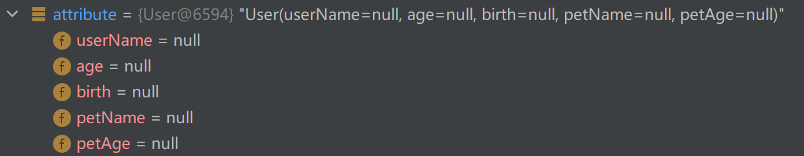

  

  **WebDataBinder :web数据绑定器，将请求参数的值绑定到指定的JavaBean里面**

  **WebDataBinder 利用它里面的 Converters 将请求数据转成指定的数据类型。再次封装到JavaBean中**

  **GenericConversionService类，这个类是转换过程中的核心类：在设置每一个值的时候，找到它里面的所有converter可以将这个数据类型（request带来参数的字符串）转换到指定的类型的那一个converter**

  

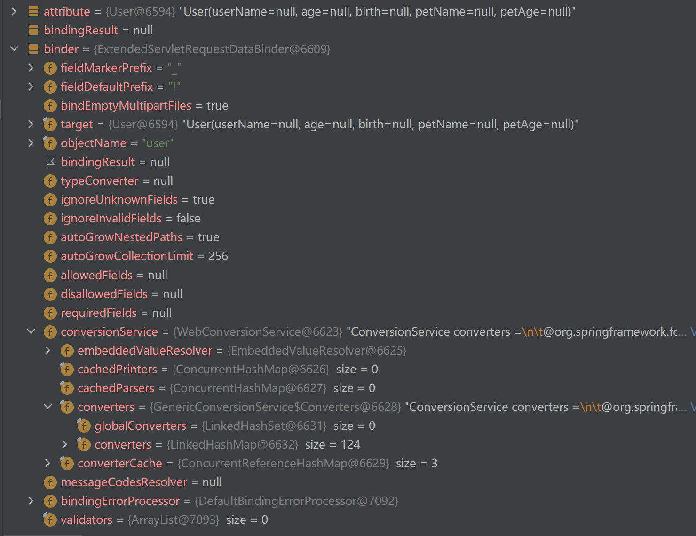

```
从上图中可以看出，在web数据绑定器里面有conversionService，它里面有converters，在它里面可以看见springboot里面自带了124个converters，如果我们后期自定义自己的converters，会发现数量会变多。
```


未来我们可以给WebDataBinder里面放自己的Converter；

**private static final class** StringToNumber<T **extends** Number> **implements** Converter<String, T>


> 自定义 Converter

当前端传过来的数据利用springboot自带的124个转换器都无法转换的时候，我们就需要自定义转换器。

```java
 //1、WebMvcConfigurer定制化SpringMVC的功能
    @Bean
    public WebMvcConfigurer webMvcConfigurer(){
        return new WebMvcConfigurer() {
            @Override
            public void configurePathMatch(PathMatchConfigurer configurer) {
                UrlPathHelper urlPathHelper = new UrlPathHelper();
                // 不移除；后面的内容。矩阵变量功能就可以生效
                urlPathHelper.setRemoveSemicolonContent(false);
                configurer.setUrlPathHelper(urlPathHelper);
            }

            @Override
            public void addFormatters(FormatterRegistry registry) {
                registry.addConverter(new Converter<String, Pet>() {

                    @Override
                    public Pet convert(String source) {
                        // 啊猫,3
                        if(!StringUtils.isEmpty(source)){
                            Pet pet = new Pet();
                            String[] split = source.split(",");
                            pet.setName(split[0]);
                            pet.setAge(Integer.parseInt(split[1]));
                            return pet;
                        }
                        return null;
                    }
                });
            }
        };
    }
```

### 5.5 参数处理原理

首先在DispatcherServlet类的doDispatch方法中调用getHandler方法从HandlerMapping中找到能处理请求的Handler（Controller.method()），然后再调用getHandlerAdapter方法为当前Handler 找一个适配器 HandlerAdapter

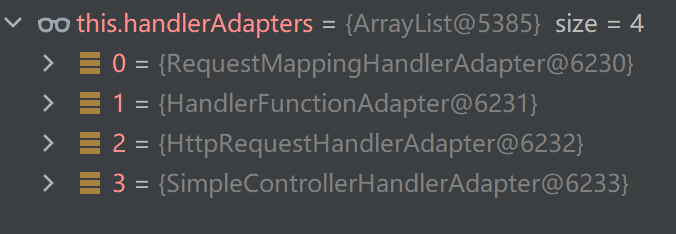

* **RequestMappingHandlerAdapter**这个是我们关注的，它用来处理方法上标注@RequestMapping的请求
* HandlerFunctionAdapter用来支持函数式编程的

最后调用HandlerAdapter的handle方法，在handle这个方法里面又调用了handleInternal方法，在handleInternal方法中有一个重要函数调用，这个函数是invokeHandlerMethod。在这个函数里面调用了一个变量argumentResolvers,查看这个变量的属性值发现大小为26个，通过每一个的变量名可以发现每一个解析器的名字都对应一个注解，所以**springMVC目标方法的参数可以写多少种类型完全取决于这个参数解析器**。


> 参数解析器 HandlerMethodArgumentResolve


* 先用第二个方法判断当前解析器是否支持这种参数解析
* 支持就调用第一个方法解析

> 返回值处理器 HandlerMethodReturnValueHandler

**springMVC目标方法的返回值可以写多少种类型，完全取决于这个返回值处理器**

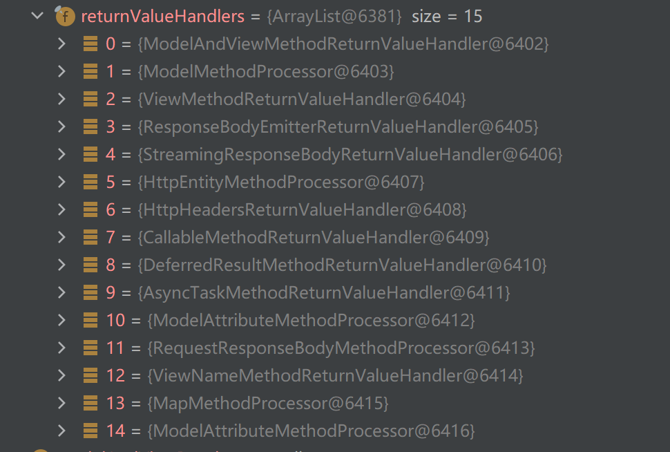

可以发现返回值处理器总共有15个，有些就是我们常用的，例如modelandview，responsebody等


>总结

前面讲了这么多，其实把所有准备工作获取到的内容最后都封装到invocableMethod对象里面了，然后调用这个对象的invokeAndHandle(webRequest, mavContainer)方法才是真正的执行并处理参数解析。

```java
进到invokeAndHandle方法里面，第一行就执行了invokeForRequest方法，如果在它的下一行以及目标方法(也就是controller里面的方法)各打一个断点，放行的话，会发现下一步体跳到了目标方法，并没有跳到它的下一行，说明在invokeForRequest方法里面真正执行了目标方法,也就是controller里面的方法
//ServletInvocableHandlerMethod
Object returnValue = invokeForRequest(webRequest, mavContainer, providedArgs);
在invokeForRequest方法里面调用了getMethodArgumentValues方法获取到了所有的参数值，在getMethodArgumentValues方法里循环每一个参数，然后每一次循环都调用this.resolvers.supportsParameter(在这个方法里面又调用了getArgumentResolver方法，在getArgumentResolver方法里遍历每一个HandlerMethodArgumentResolver看哪一个可以解析，如果可以的话，就将这个参数和对应的解析器加入到缓存里面，所以第一次可能比较慢，需要遍历，后面的话直接从缓存里面拿，就快的多。)判断哪一个参数解析器可以解析当前参数，最后调用this.resolvers.resolveArgument方法，在this.resolvers.resolveArgument方法里面调用resolver.resolveArgument去真正解析参数值。
```

**最后效果是各个参数调用各自 HandlerMethodArgumentResolver 的 resolveArgument 方法即可**解析出参数值

> 目标方法执行完成

当目标方法执行完成之后，会将所有的数据都放在 **ModelAndViewContainer**；包含要去的页面地址View。还包含Model数据

> 处理派发结果

**processDispatchResult**(processedRequest, response, mappedHandler, mv, dispatchException);


### 5.6 数据响应与内容协商

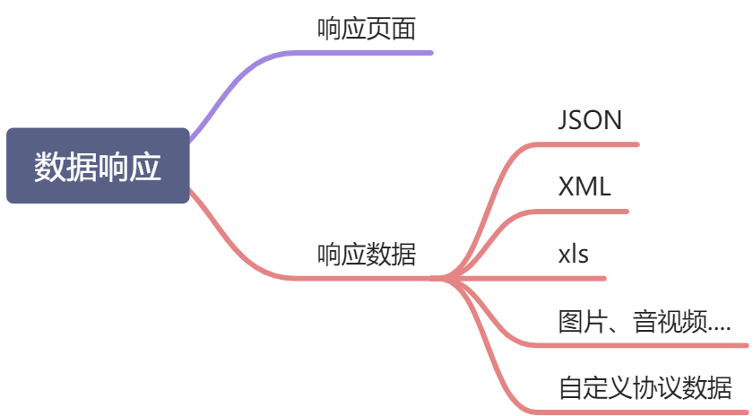

#### 5.6.1 响应JSON

```xml
<dependency>
    <groupId>org.springframework.boot</groupId>
    <artifactId>spring-boot-starter-web</artifactId>
</dependency>
web场景自动引入了json场景,所以如果引入了web场景，就不需要再引入json场景了
```

> 是怎么实现给前端返回json数据的

在下面的方法中

```java
public void invokeAndHandle(ServletWebRequest webRequest, ModelAndViewContainer mavContainer,
      Object... providedArgs) throws Exception {

   Object returnValue = invokeForRequest(webRequest, mavContainer, providedArgs);
   setResponseStatus(webRequest);
```

通过执行invokeForRequest方法获得目标函数返回值之后，接着判断返回值是否为空，而且返回值是不是为字符串，如果是就返回了，如果不是就继续往下执行，

```java
this.returnValueHandlers.handleReturnValue(
					returnValue, getReturnValueType(returnValue), mavContainer, webRequest);
进到handleReturnValue函数里面第一行调用selectHandler方法获取哪个返回值处理器去处理，获取到返回值处理器之后调用handler.handleReturnValue去处理返回值,然后在这个方法里面调用 writeWithMessageConverters(returnValue, returnType, inputMessage, outputMessage)使用消息转换器进行写出操作。进入函数之后首先判断返回值是不是CharSequence类型，然后判断是不是资源类型。如果都不是，那么要获取浏览器可以接受什么返回值以及服务器可以提供什么返回值
List<MediaType> acceptableTypes = getAcceptableMediaTypes(request);
List<MediaType> producibleTypes = getProducibleMediaTypes(request, valueType, targetType);
拿到上面两个值之后，为了获得mediaTypesToUse，要遍历上面两个值，取到服务器和客户端都可以接收的值存在mediaTypesToUse变量里。
    MediaType.sortBySpecificityAndQuality(mediaTypesToUse);
    for (MediaType mediaType : mediaTypesToUse) {
				if (mediaType.isConcrete()) {
					selectedMediaType = mediaType;
					break;
				}
				else if (mediaType.isPresentIn(ALL_APPLICATION_MEDIA_TYPES)) {
					selectedMediaType = MediaType.APPLICATION_OCTET_STREAM;
					break;
				}
			}
然后遍历mediaTypesToUse，判断里面的类型是不是具体的，然后拿到最佳的具体类型，保存在selectedMediaType里面
拿到了数据返回的格式，我们就要遍历所有的httpmessageconverter看哪一个消息转换器可以处理返回的数据格式(通过调用converter.canWrite方法实现)，遍历之后拿到消息处理器，调用getAdvice().beforeBodyWrite()的方法获取到要返回(也就是要写出的内容)，如果写出的内容不为null，就调用genericConverter.write方法进行内容的写出。对于将JavaBean以json的形式返回给客户端，就是最终用MappingJackson2HttpMessageConverter  把对象转为JSON（利用底层的jackson的objectMapper转换的）
```


1. 返回值处理器判断是否支持这种类型返回值 supportsReturnType

2. 返回值处理器调用 handleReturnValue 进行处理

```java
@Override
	public void handleReturnValue(@Nullable Object returnValue, MethodParameter returnType,
			ModelAndViewContainer mavContainer, NativeWebRequest webRequest) throws Exception {

		HandlerMethodReturnValueHandler handler = selectHandler(returnValue, returnType);
		if (handler == null) {
			throw new IllegalArgumentException("Unknown return value type: " + returnType.getParameterType().getName());
		}
		////handler.handleReturnValue(returnValue, returnType, mavContainer, webRequest);
	}

	@Nullable
	private HandlerMethodReturnValueHandler selectHandler(@Nullable Object value, MethodParameter returnType) {
		boolean isAsyncValue = isAsyncReturnValue(value, returnType);
		for (HandlerMethodReturnValueHandler handler : this.returnValueHandlers) {
			if (isAsyncValue && !(handler instanceof AsyncHandlerMethodReturnValueHandler)) {
				continue;
			}
			////if (handler.supportsReturnType(returnType)) {
				return handler;
			}
		}
		return null;
	}
```

- RequestResponseBodyMethodProcessor 可以处理返回值标了@ResponseBody 注解的。

  - 利用 MessageConverters 进行处理 将数据写为json

    - 内容协商（浏览器默认会以请求头的方式告诉服务器他能接受什么样的内容类型）

      

    - 服务器最终根据自己自身的能力，决定服务器能生产出什么样内容类型的

    - SpringMVC会挨个遍历所有容器底层的 HttpMessageConverter ，看谁能处理？

      - 得到MappingJackson2HttpMessageConverter可以将对象写为json
      - 利用MappingJackson2HttpMessageConverter将对象转为json再写出去

#### 5.6.2 HTTPMessageConverter原理


0 - Byte

1 - String

2 - String

3 - Resource

4 - ResourceRegion

5 - 

```java
static {
		SUPPORTED_CLASSES.add(DOMSource.class);
		SUPPORTED_CLASSES.add(SAXSource.class);
		SUPPORTED_CLASSES.add(StAXSource.class);
		SUPPORTED_CLASSES.add(StreamSource.class);
		SUPPORTED_CLASSES.add(Source.class);
	}
```

**6 -** MultiValueMap

7 - **true** 这个处理器在判断是否支持当前返回数据格式的时候直接就返回true，这也就说明这个处理器是万能的，什么数据都可以处理

**8 - true**

**9 - 支持注解方式xml处理的。**

```java
@Override
	public boolean canRead(Class<?> clazz, @Nullable MediaType mediaType) {
		return (clazz.isAnnotationPresent(XmlRootElement.class) || clazz.isAnnotationPresent(XmlType.class)) &&
				canRead(mediaType);
	}

	@Override
	public boolean canWrite(Class<?> clazz, @Nullable MediaType mediaType) {
		return (AnnotationUtils.findAnnotation(clazz, XmlRootElement.class) != null && canWrite(mediaType));
	}
```

#### 5.6.3 内容协商

内容协商就是根据客户端接收能力不同，返回不同媒体类型的数据

1. 如果要返回xml数据，需要引入依赖

   ```xml
   <dependency>
       <groupId>com.fasterxml.jackson.dataformat</groupId>
       <artifactId>jackson-dataformat-xml</artifactId>
   </dependency>
   ```

2. 客户端想要接受什么类型的返回数据，只需要在发送请求的时候**改变请求头中Accept字段**。Http协议中规定的，告诉服务器本客户端可以接收的数据类型

> 开启基于浏览器参数方式的内容协商功能

为了方便内容协商，开启基于请求参数的内容协商功能，这样就不用手动改变请求头中的Accpet字段了

```yaml
spring:
	mvc:
    	contentnegotiation:
      		favor-parameter: true  #开启请求参数内容协商模式
      
像上面那样配置之后，想要返回什么类型的数据只要像下面这样发起请求即可
http://localhost:8080/test/person?format=json   返回json数据
http://localhost:8080/test/person?format=xml    返回xml数据

```


当我们没有开启基于浏览器参数的内容协商功能时，上图中的strategies只有一个，就是默认的基于请求头的策略**HeaderContentNegotiationStrategy**，当开启之后就会多一个基于参数的策略，**ParameterContentNegotiationStrategy**

可以发现这种策略只支持xml和json的MediaType。通过看源码的执行流程，可以得到以下几点

* **ParameterContentNegotiationStrategy**策略是优先判断的
* 在这个策略里面，首先获取请求的请求参数，也就是format的参数值，这个值存到MediaTypeKey变量里面，然后调用lookupMediaType方法通过这个key获取到真正要返回的数据类型

> 内容协商原理

1. 首先判断是不是资源类型

2. 判断当前响应头里面是不是已经有了确定的MediaType(也就是请求处理完返回的数据在到达这里之前有没有被人处理过，例如拦截器)，如果有的话就直接采用确定的MediaType，如果没有就自己设置处理

3. 获取客户端可以接受的类型(通过获取请求头的Accept字段)，和服务端可以写出的类型

   * **contentNegotiationManager 内容协商管理器 默认使用基于请求头的策略**

     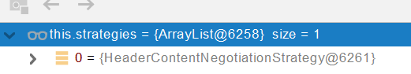

   * **HeaderContentNegotiationStrategy  确定客户端可以接收的内容类型** 

4. 找出客户端和服务端最佳的MediaType

5. 遍历循环当前系统的所有 **MessageConverter**，看谁支持操作这个对象并能写出指定的类型

6. 调用得到的**MessageConverter**进行数据的转化和写出


**导入了jackson处理xml的包，xml的converter就会自动进来**

```java
WebMvcConfigurationSupport
jackson2XmlPresent = ClassUtils.isPresent("com.fasterxml.jackson.dataformat.xml.XmlMapper", classLoader);

if (jackson2XmlPresent) {
            Jackson2ObjectMapperBuilder builder = Jackson2ObjectMapperBuilder.xml();
            if (this.applicationContext != null) {
                builder.applicationContext(this.applicationContext);
            }
            messageConverters.add(new MappingJackson2XmlHttpMessageConverter(builder.build()));
        }
```

> 自定义MessageConverter

怎么样让不同的客户端发起的请求返回的数据格式不同。例如浏览器发起的请求返回格式为xml，app发起的请求返回格式为json。

1. 以往就是写多个controller（也就是requestmapping），一个controller处理浏览器请求返回xml数据，一个处理app请求返回json数据
2. 现在有了自定义MessageConverter，同一个controller就可以实现

```java
/**
 * @author HotRockit
 *
 * MessageConverter其实可读可写，但一般我们用的都是写的功能
 * 例如在请求处理函数里面，参数标注了@requestbody注解，这个时候就需要用到读的功能
 * 将客户端传过来的数据进行数据格式转换
 */
public class MyConverter implements HttpMessageConverter<User> {


    @Override
    public boolean canRead(Class<?> clazz, MediaType mediaType) {
        //这里我们只要可写的功能，所以直接设为false
        return false;
    }

    @Override
    public boolean canWrite(Class<?> clazz, MediaType mediaType) {
        //判单是不是user类型的
       return clazz.isAssignableFrom(User.class);
    }

    @Override
    public List<MediaType> getSupportedMediaTypes() {
        //设置这种转换器支持的MediaType,这里我们自定义
        return MediaType.parseMediaTypes("application/wdy");
    }

    @Override
    public User read(Class<? extends User> clazz, HttpInputMessage inputMessage) throws IOException, HttpMessageNotReadableException {
        return null;
    }

    @Override
    public void write(User user, MediaType contentType, HttpOutputMessage outputMessage) throws IOException, HttpMessageNotWritableException {
        //自定义MediaType数据的写出
        String data = user.getUserName() + user.getBirth();
        outputMessage.getBody().write(data.getBytes());
    }
}
```

```java
@Configuration
public class MyWebMvcConfig {
    @Bean
    public WebMvcConfigurer webMvcConfigurer(){
        return new WebMvcConfigurer() {
            //将自定义的MessageConverter加到SpringMvc中
            @Override
            public void extendMessageConverters(List<HttpMessageConverter<?>> converters) {
                converters.add(new MyConverter());
            }
        };
    }
}
```

**上面这种方式虽然实现了自定义MessageConverter，但是它使用的是HeaderContentNegotiationStrategy，也就是基于请求头的策略，**那么怎么实现基于浏览器请求参数策略下的自定义MessageConverter呢

```java
@Configuration
public class MyWebMvcConfig {
    @Bean
    public WebMvcConfigurer webMvcConfigurer(){
        return new WebMvcConfigurer() {
            //配置内容协商功能
            @Override
            public void configureContentNegotiation(ContentNegotiationConfigurer configurer) {
                //ParameterContentNegotiationStrategy策略默认只支持json和xml类型的MediaType

                //这个configurer.strategies函数要传一个ContentNegotiationStrategy，但是ContentNegotiationStrategy是一个接口
                //不能实例化，所以找一个实现类，我们刚好是采用的基于浏览器请求参数的测类，所以选择ParameterContentNegotiationStrategy
                Map<String, MediaType> map = new HashMap<>();
                map.put("json", MediaType.APPLICATION_JSON);
                map.put("xml", MediaType.APPLICATION_XML);
                //自定义自己的MediaType
                map.put("wdy", MediaType.parseMediaType("application/wdy"));
                ParameterContentNegotiationStrategy parameterContentNegotiationStrategy = new ParameterContentNegotiationStrategy();
                //默认的格式为?format=格式,如果不想要format，换成其它的
//                parameterContentNegotiationStrategy.setParameterName("type");
                configurer.strategies(Arrays.asList(parameterContentNegotiationStrategy));
            }
        };
    }
}
```

**但是这里要注意，我们自定义内容协商管理器的strategies时，只配置了ParameterContentNegotiationStrategy，并没有配置HeaderContentNegotiationStrategy  ，所以我们在解析判断的时候，只能使用ParameterContentNegotiationStrategy**。解决办法就是在内容协商管理器里面再加一个HeaderContentNegotiationStrategy  

但是当我们以HeaderContentNegotiationStrategy方式发起请求的话，利用ParameterContentNegotiationStrategy是解析不出来的，但它最后返回的是`*/*`，也就是客户端可以接收一切类型的数据。然后再拿到服务器支持写出的类型，在确定selectedMediaType时就直接拿到服务器支持写出类型的第一个。也就是说不管客户端发起请求的时候，Accept字段指定什么类型的数据，最后返回的数据格式都是固定的，就是服务器支持写出类型的第一个，一般是权重最高的那个。

### 5.7 视图解析和模板引擎

视图解析：**SpringBoot默认不支持 JSP，需要引入第三方模板引擎技术实现页面渲染**


#### 5.7.1 模板引擎-Thymeleaf

Thymeleaf is a modern server-side Java template engine for both web and standalone environments, capable of processing HTML, XML, JavaScript, CSS and even plain text.

> 基本语法

1. 表达式

| 表达式名字 | 语法   | 用途                               |
| ---------- | ------ | ---------------------------------- |
| 变量取值   | ${...} | 获取请求域、session域、对象等值    |
| 选择变量   | *{...} | 获取上下文对象值                   |
| 消息       | #{...} | 获取国际化等值                     |
| 链接       | @{...} | 生成链接                           |
| 片段表达式 | ~{...} | jsp:include 作用，引入公共页面片段 |

2. 字面量

   文本值: **'one text'** **,** **'Another one!'** **,…**数字: **0** **,** **34** **,** **3.0** **,** **12.3** **,…**布尔值: **true** **,** **false**

   空值: **null**

   变量： one，two，.... 变量不能有空格

3. 文本操作

   字符串拼接: **+**

   变量替换: **|The name is ${name}|** 

4. 数学运算

   运算符: + , - , * , / , %

5. 布尔运算

   运算符:  **and** **,** **or**

   一元运算: **!** **,** **not** 

6. 比较

   比较: **>** **,** **<** **,** **>=** **,** **<=** **(** **gt** **,** **lt** **,** **ge** **,** **le** **)**等式: **==** **,** **!=** **(** **eq** **,** **ne** **)**

7. 条件

   If-then: **(if) ? (then)**

   If-then-else: **(if) ? (then) : (else)**

   Default: (value) **?: (defaultvalue)** 

8. 特殊操作

   无操作： _

> 设置属性值 th:attr

* 设置单个值

```html
<form action="subscribe.html" th:attr="action=@{/subscribe}">
  <fieldset>
    <input type="text" name="email" />
    <input type="submit" value="Subscribe!" th:attr="value=#{subscribe.submit}"/>
  </fieldset>
</form>
```

* 设置多个值

```html

```

* 以上两个的代替写法 th:xxxx

```html
<input type="submit" value="Subscribe!" th:value="#{subscribe.submit}"/>
<form action="subscribe.html" th:action="@{/subscribe}">
```

所有h5兼容的标签写法

https://www.thymeleaf.org/doc/tutorials/3.0/usingthymeleaf.html#setting-value-to-specific-attributes

> 迭代

```html
<tr th:each="prod : ${prods}">
        <td th:text="${prod.name}">Onions</td>
        <td th:text="${prod.price}">2.41</td>
        <td th:text="${prod.inStock}? #{true} : #{false}">yes</td>
</tr>
```

```html
<tr th:each="prod,iterStat : ${prods}" th:class="${iterStat.odd}? 'odd'">
  <td th:text="${prod.name}">Onions</td>
  <td th:text="${prod.price}">2.41</td>
  <td th:text="${prod.inStock}? #{true} : #{false}">yes</td>
</tr>
```

> 条件运算

```html
<a href="comments.html"
th:href="@{/product/comments(prodId=${prod.id})}"
th:if="${not #lists.isEmpty(prod.comments)}">view</a>
```

```html
<div th:switch="${user.role}">
  <p th:case="'admin'">User is an administrator</p>
  <p th:case="#{roles.manager}">User is a manager</p>
  <p th:case="*">User is some other thing</p>
</div>
```

> 属性优先级

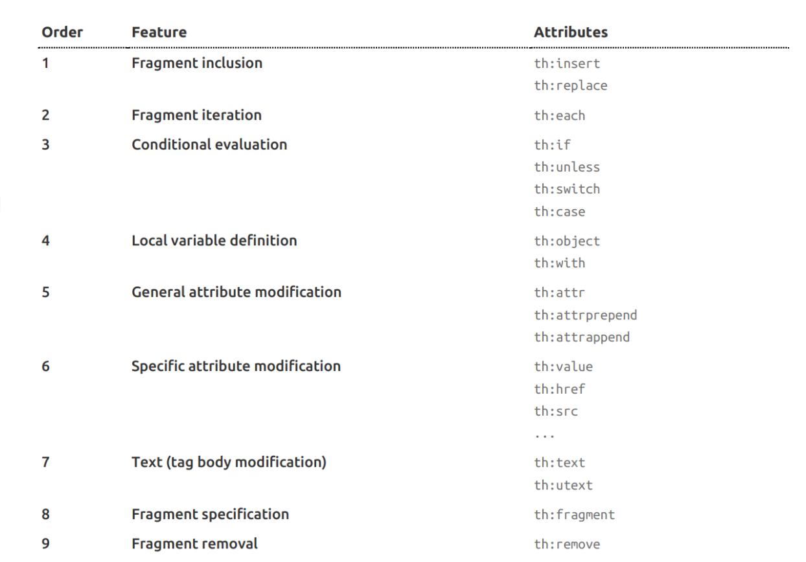

#### 5.7.2 Thymeleaf使用

1. 引入starter

   ```xml
   <dependency>
       <groupId>org.springframework.boot</groupId>
       <artifactId>spring-boot-starter-thymeleaf</artifactId>
   </dependency>
   ```

2. spring-boot自动配置好了

   ```java
   @Configuration(proxyBeanMethods = false)
   @EnableConfigurationProperties(ThymeleafProperties.class)
   @ConditionalOnClass({ TemplateMode.class, SpringTemplateEngine.class })
   @AutoConfigureAfter({ WebMvcAutoConfiguration.class, WebFluxAutoConfiguration.class })
   public class ThymeleafAutoConfiguration { }
   ```

   自动配好的策略

   - 所有thymeleaf的配置值都在 ThymeleafProperties
   - 配置好了 SpringTemplateEngine
   - 配好了ThymeleafViewResolver
   - 我们只需要直接开发页面

   ```java
   public static final String DEFAULT_PREFIX = "classpath:/templates/";
   
   public static final String DEFAULT_SUFFIX = ".html";  //xxx.html
   ```

   #### 3、页面开发

   **一定要在html里面声明xmlns:th="http://www.thymeleaf.org"**

   用thymeleaf开发的页面因为是html，所以可以直接用浏览器打开，只不过页面渲染的值是默认值，如果有后台数据，thymeleaf就会获取数据替换默认的值

   ```html
   # xmlns:th="http://www.thymeleaf.org"这个必须要加
   <!DOCTYPE html>
   <html lang="en" xmlns:th="http://www.thymeleaf.org">
   <head>
       <meta charset="UTF-8">
       <title>Title</title>
   </head>
   <body>
       # 哈哈是默认值，如果msg能取到值，就会用msg里面的值替换哈哈
   <h1 th:text="${msg}">哈哈</h1>
   <h2>
       下面这两种写法作用相同，但是注意区别，${}是真的取出了link的值，然后将href的值设为取出的值
       但是@{}是将@{}里面设置的那个变量替换到href里面，并不是将link的真实值取出，也就是将link当作一个要去的地址来看待
       而且@{}里面支持字符串拼接，例如@{/link},@{/test/link},就算这样写，到时候还是用@{}里面的整个值去替换href
       作用：
       当我们给整个项目添加了一个前置访问路径
       #  servlet:
       #context-path: /hello  给整个项目添加前置访问路径
       使用@{}这种方式时，在替换href里面的数据时会自动帮我们加上前置访问路径，<a href="www.baidu.com" th:href="@{link}">去百度2</a>，会变成<a href="/hello/link">去百度2</a>
       <a href="www.baidu.com" th:href="${link}">去百度</a>  <br/>
       <a href="www.baidu.com" th:href="@{link}">去百度2</a>
   </h2>
   </body>
   </html>
   ```

#### 5.7.3 视图解析原理

1. 目标方法处理的过程中，所有数据都会被放在 **ModelAndViewContainer 里面。包括数据和视图地址**

   通过ViewNameMethodReturnValueHandler这个handler进行处理，这个handler判断返回值是void或者是字符序列。如果是字符序列会转为String，然后将返回值放进mav中

2. **如果目标方法的参数是一个自定义类型对象（从请求参数中确定的），会把他重新放在** **ModelAndViewContainer**
3. **任何目标方法执行完成以后都会返回 ModelAndView（****数据和视图地址****）**
4. **processDispatchResult函数  处理派发结果（页面该如何响应）**
   * **render**(**mv**, request, response); 进行页面渲染逻辑
     * 调用mv.getViewName方法得到viewName，然后利用resolveViewName方法得到 **View** 对象【这个对象定义了页面的渲染逻辑】
       * 在resolveViewName方法里面遍历所有的视图解析器看哪个可以解析viewName得到**View**对象，具体每个视图解析器是怎么判断的看源码就好
       * ContentNegotiationViewResolver 里面也包含了下面所有的视图解析器，内部还是利用下面所有视图解析器得到视图对象，操作和resolveViewName方法类似
       * view.render(mv.getModelInternal(), request, response);  视图对象调用自定义的render进行页面渲染工作

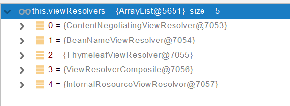


**视图解析：**

* **返回值以 forward: 开始： new InternalResourceView(forwardUrl); -->  转发**、**request.getRequestDispatcher(path).forward(request, response);** 

- **返回值以** **redirect: 开始：** **new RedirectView() --》 render就是重定向** 

- **返回值是普通字符串： new ThymeleafView（）--->** 

  

SpringBoot里面也支持自定义视图解析器+自定义视图，例如要把controller里面返回的数据以excel表格形式导出，我们就要自定义视图解析器，拿到我们想要的view对象，然后调用我们自己编写的render方法，将我们的数据以excel表格的方式导出。

### 5.8 拦截器

#### 5.8.1 拦截器使用

**要自定义拦截器就需要实现HandlerInterceptor接口**

```java
/**
 * 登录检查
 * 1、配置好拦截器要拦截哪些请求
 * 2、把这些配置放在容器中
 */
@Slf4j
public class LoginInterceptor implements HandlerInterceptor {
    /**
     * 目标方法执行之前
     * @param request
     * @param response
     * @param handler
     * @return
     * @throws Exception
     */
    @Override
    public boolean preHandle(HttpServletRequest request, HttpServletResponse response, Object handler) throws Exception {

        String requestURI = request.getRequestURI();
        log.info("preHandle拦截的请求路径是{}",requestURI);

        //登录检查逻辑
        HttpSession session = request.getSession();

        Object loginUser = session.getAttribute("loginUser");

        if(loginUser != null){
            //放行
            return true;
        }

        //拦截住。未登录。跳转到登录页
        request.setAttribute("msg","请先登录");
//        re.sendRedirect("/");
        request.getRequestDispatcher("/").forward(request,response);
        return false;
    }

    /**
     * 目标方法执行完成以后
     * @param request
     * @param response
     * @param handler
     * @param modelAndView
     * @throws Exception
     */
    @Override
    public void postHandle(HttpServletRequest request, HttpServletResponse response, Object handler, ModelAndView modelAndView) throws Exception {
        log.info("postHandle执行{}",modelAndView);
    }

    /**
     * 页面渲染以后
     * @param request
     * @param response
     * @param handler
     * @param ex
     * @throws Exception
     */
    @Override
    public void afterCompletion(HttpServletRequest request, HttpServletResponse response, Object handler, Exception ex) throws Exception {
        log.info("afterCompletion执行异常{}",ex);
    }
}
```

配置拦截器

```java
/**
 * 1、编写一个拦截器实现HandlerInterceptor接口
 * 2、拦截器注册到容器中（实现WebMvcConfigurer的addInterceptors）
 * 3、指定拦截规则【如果是拦截所有，静态资源也会被拦截】
 */
@Configuration
public class AdminWebConfig implements WebMvcConfigurer {

    @Override
    public void addInterceptors(InterceptorRegistry registry) {
        registry.addInterceptor(new LoginInterceptor())
                .addPathPatterns("/**")  //所有请求都被拦截包括静态资源
                .excludePathPatterns("/","/login","/css/**","/fonts/**","/images/**","/js/**"); //放行的请求
    }
}
```

#### 5.8.2 拦截器原理

1. 根据当前请求，找到**HandlerExecutionChain【**可以处理请求的handler以及handler的所有 拦截器】

   ```java
   mappedHandler = getHandler(processedRequest);
   ```

   

2. 先来**顺序执行** 所有拦截器的 preHandle方法

   * 如果当前拦截器prehandler返回为true。则执行下一个拦截器的preHandle
   * 如果当前拦截器返回为false。直接倒序执行所有已经执行了的拦截器的  afterCompletion

   ```java
   if (!mappedHandler.applyPreHandle(processedRequest, response)) {
      return;
   }
   ```

3. **如果任何一个拦截器返回false。直接跳出不执行目标方法**

4. **所有拦截器都返回True。执行目标方法**

5. **倒序执行所有拦截器的postHandle方法**

   ```java
   mappedHandler.applyPostHandle(processedRequest, response, mv);
   ```

6. **前面的步骤有任何异常都会直接倒序触发** afterCompletion

7. 页面成功渲染完成以后，也会倒序触发 afterCompletion

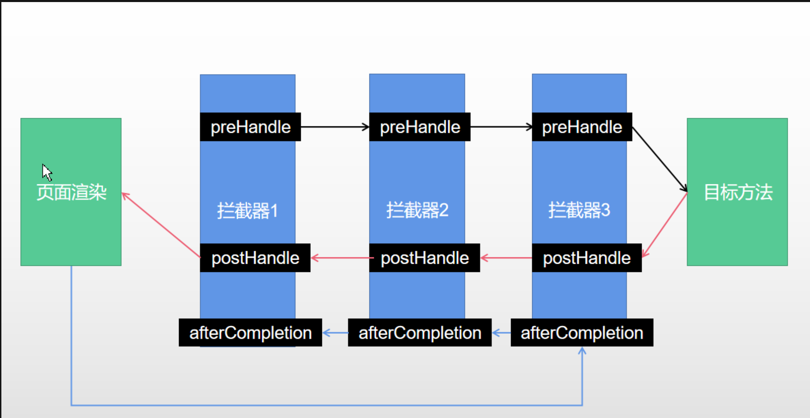

### 5.9 文件上传

#### 5.9.1 文件上传使用

1. 页面表单

   ```html
   <form method="post" action="/upload" enctype="multipart/form-data">
       <input type="file" name="file"><br>  单文件上传 
       <input type="file" name="files" multiple><br>  多文件上传
       <input type="submit" value="提交">
   </form>
   ```

2. 后台处理

   ```java
   /**
     * MultipartFile 自动封装上传过来的文件
     * @return
   */
   @PostMapping("/upload")
   public String upload(@RequestParam("email") String email,
                        @RequestParam("username") String username,
                        @RequestPart("headerImg") MultipartFile headerImg,
                        @RequestPart("photos") MultipartFile[] photos) throws IOException {
   
       log.info("上传的信息：email={}，username={}，headerImg={}，photos={}",
                email,username,headerImg.getSize(),photos.length);
   
       if(!headerImg.isEmpty()){
           //保存到文件服务器，OSS服务器
           String originalFilename = headerImg.getOriginalFilename();
           headerImg.transferTo(new File("H:\\cache\\"+originalFilename));
       }
   
       if(photos.length > 0){
           for (MultipartFile photo : photos) {
               if(!photo.isEmpty()){
                   String originalFilename = photo.getOriginalFilename();
                   photo.transferTo(new File("H:\\cache\\"+originalFilename));
               }
           }
       }
       return "main";
   }
   ```

#### 5.9.2 文件上传原理

```java
MultipartAutoConfiguration自动配置类
MultipartProperties相关属性配置类
下面是默认配置
/**
	* Max file size.
*/
private DataSize maxFileSize = DataSize.ofMegabytes(1);
/**
	* Max request size.
*/
private DataSize maxRequestSize = DataSize.ofMegabytes(10);
有的时候上传文件过大，我们就需要自己配置
```

**文件上传自动配置类-MultipartAutoConfiguration-     MultipartProperties**

- 自动配置好了 **StandardServletMultipartResolver  【文件上传解析器】**

1. **请求进来使用文件上传解析器判断（**isMultipart**）并封装（**resolveMultipart，返回MultipartHttpServletRequest**）文件上传请求**

```java
processedRequest = checkMultipart(request);
```

2. **参数解析器来解析请求中的文件内容封装成MultipartFile**

   

3. **将request中文件信息封装为一个Map；**MultiValueMap<String, MultipartFile>

### 5.10 异常处理

#### 5.10.1 错误处理

> 默认规则

1. 默认情况下，Spring Boot提供`/error`处理所有错误的映射

2. 对于机器客户端，它将生成JSON响应，其中包含错误，HTTP状态和异常消息的详细信息。对于浏览器客户端，响应一个“ whitelabel”错误视图，以HTML格式呈现相同的数据。**如果是自己自定义的页面，那么在页面里面通过模板引擎的语法是可以拿到json的返回值的，例如${message}**

   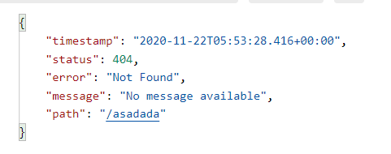

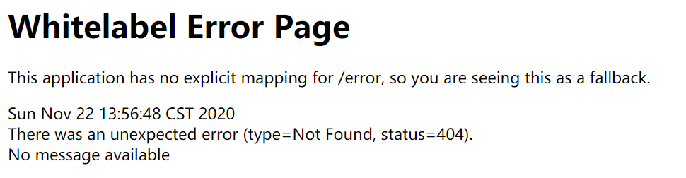

3. **要对其进行自定义**，添加`View`解析为`error`

4. 要完全替换默认行为，可以实现 `ErrorController `并注册该类型的Bean定义，或添加`ErrorAttributes类型的组件`以使用现有机制但替换其内容

5. error/下的4xx，5xx页面会被自动解析

   

> 定制错误处理逻辑

1. 自定义错误页

   * error/404.html  error/5xx.html；有精确的错误状态码页面就匹配精确，没有就找 4xx.html；如果都没有就触发白页

2. @ControllerAdvice+@ExceptionHandler处理全局异常；底层是 **ExceptionHandlerExceptionResolver 支持的**

   **被ExceptionHandle捕获的异常，注意此时的状态码是200**

3. @ResponseStatus+自定义异常 ；底层是 **ResponseStatusExceptionResolver ，把responsestatus注解的信息底层调用** **response.sendError(statusCode, resolvedReason)；tomcat发送的/error**

4. Spring底层的异常，如 参数类型转换异常；**DefaultHandlerExceptionResolver 处理框架底层的异常**

   * response.sendError(HttpServletResponse.**SC_BAD_REQUEST**, ex.getMessage()); 
   * 

5. 自定义实现 HandlerExceptionResolver 处理异常；可以作为默认的全局异常处理规则

6. **ErrorViewResolver**  实现自定义处理异常

   * response.sendError 。error请求就会转给controller

   * 你的异常没有任何人能处理。tomcat底层 response.sendError。error请求就会转给controller

   * **basicErrorController 要去的页面地址是** **ErrorViewResolver**  ；

#### 5.10.2 异常处理原理

* **ErrorMvcAutoConfiguration  自动配置异常处理规则**

- - **容器中的组件：类型：DefaultErrorAttributes ->** **id：errorAttributes**

- - - **public class** **DefaultErrorAttributes** **implements** **ErrorAttributes**, **HandlerExceptionResolver**
    - **DefaultErrorAttributes**：定义错误页面中可以包含哪些数据。

  - 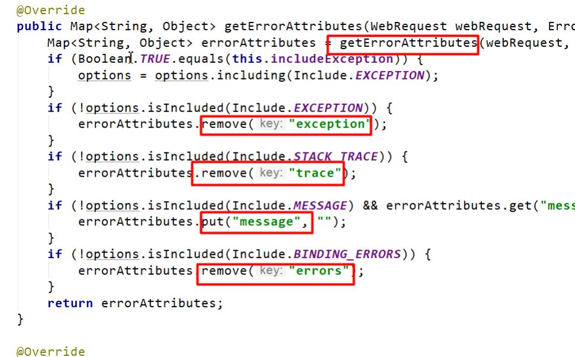

- 

- - **容器中的组件：类型：**BasicErrorController --> id：basicErrorController（json+白页 适配响应）

- - - **处理默认** **/error 路径的请求；页面响应** **new** ModelAndView(**"error"**, model)；
    - **容器中有组件 View**->**id是error**；（响应默认错误页）
    - 容器中放组件 **BeanNameViewResolver（视图解析器）；按照返回的视图名作为组件的id去容器中找View对象。**

- - **容器中的组件：**类型：**DefaultErrorViewResolver -> id：**conventionErrorViewResolver

- - - 如果发生错误，会以HTTP的状态码 作为视图页地址（viewName），找到真正的页面
    - error/404、5xx.html

**如果想要返回页面；就会找error视图【StaticView】。(默认是一个白页)**

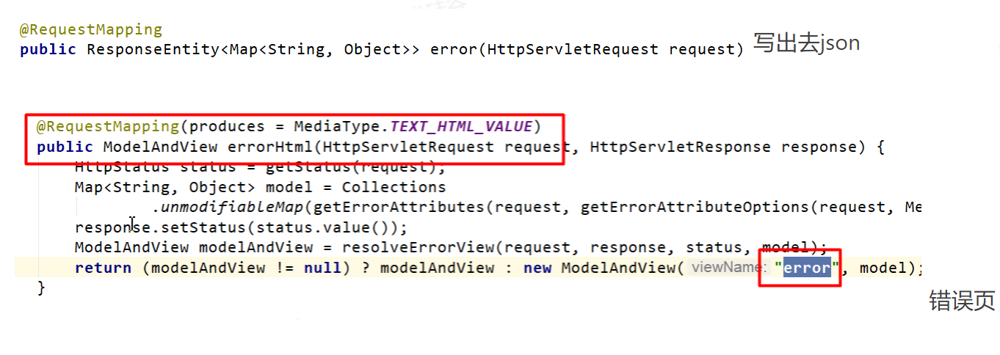

#### 5.10.3 异常处理流程

1. 执行目标方法，目标方法运行期间有任何异常都会被catch、而且标志当前请求结束；并且用 **dispatchException** 

2. 进入视图解析流程（页面渲染？） 

   processDispatchResult(processedRequest, response, mappedHandler, **mv**, **dispatchException**);

3. **mv** = **processHandlerException**；处理handler发生的异常，处理完成返回ModelAndView

   * 遍历所有的 **handlerExceptionResolvers，看谁能处理当前异常【****HandlerExceptionResolver处理器异常解析器****】**
   * 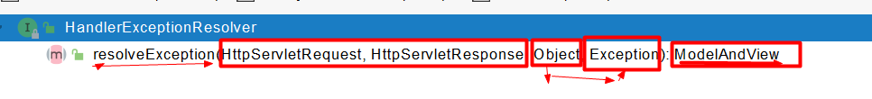

   * **系统默认的异常解析器**

     

     * **DefaultErrorAttributes先来处理异常。把异常信息保存到rrequest域，并且返回null**

     * **默认没有任何人能处理异常，所以异常会被抛出**

       * **如果没有任何人能处理最终底层就会发送 /error 请求。会被底层的BasicErrorController处理**

       * **解析错误视图；遍历所有的**  **ErrorViewResolver  看谁能解析**

         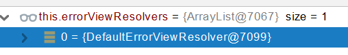

       * **默认的** **DefaultErrorViewResolver ,作用是把响应状态码作为错误页的地址，error/500.html** 

       * **模板引擎最终响应这个页面** **error/500.html**

### 5.11 Web原生组件注入 Servlet、Filter、Listener


### 5.12 嵌入式Servlet容器


### 5.13 定制化原理