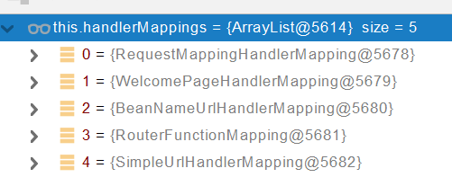
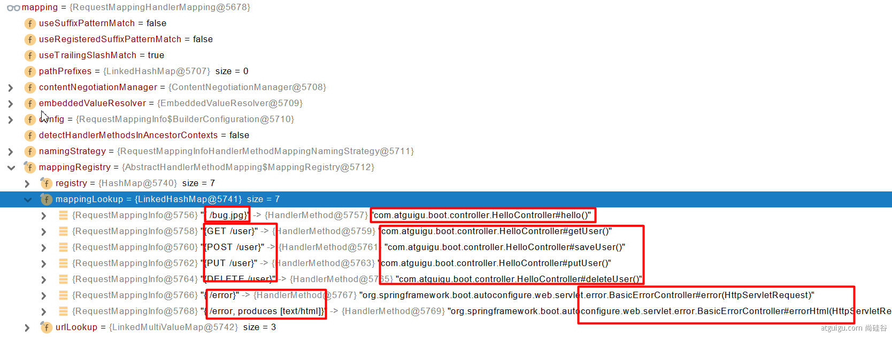
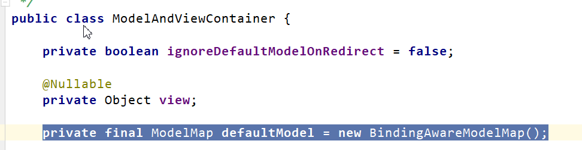
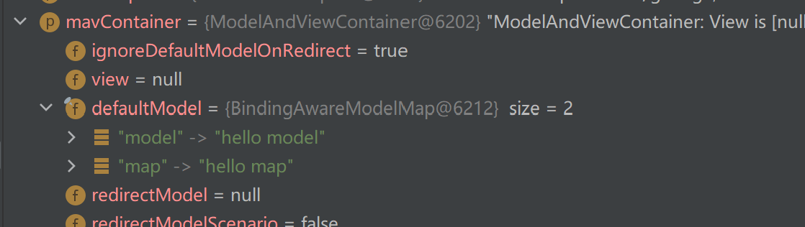

## 1. SpringBoot简介

SpringBoot2和SpringBoot1有很大不同，从源码和架构上都做了改变。**SpringBoot2是基于Spring5开发的，而Spring5是基于jdk8开发的**，所以引入了jdk8的很多新特性。

### 1.1 Spring5新特性

1. 响应式编程

   

2. 内部源码设计改进，主要是利用了jdk8的新特性（例如**接口默认实现**）

### 1.2 SpringBoot优点

- Create stand-alone Spring applications

- - 创建独立Spring应用

- Embed Tomcat, Jetty or Undertow directly (no need to deploy WAR files)

- - 内嵌web服务器

- Provide opinionated 'starter' dependencies to simplify your build configuration

- - 自动starter依赖，简化构建配置

- Automatically configure Spring and 3rd party libraries whenever possible

- - 自动配置Spring以及第三方功能

- Provide production-ready features such as metrics, health checks, and externalized configuration

- - 提供生产级别的监控、健康检查及外部化配置

- Absolutely no code generation and no requirement for XML configuration

- - 无代码生成、无需编写XML

### 1.3 SpringBoot缺点

* 人称版本帝，迭代快，需要时刻关注变化

* 封装太深，内部原理复杂，不容易精通

### 1.4 微服务

[论文地址](https://martinfowler.com/microservices/)

* 微服务是一种架构风格

- 一个应用拆分为一组小型服务

- 每个服务运行在自己的进程内，也就是可独立部署和升级

- 服务之间使用轻量级HTTP交互

- 服务围绕业务功能拆分

- 可以由全自动部署机制独立部署

- 去中心化，服务自治。服务可以使用不同的语言、不同的存储技术

### 1.5 分布式

**分布式的困难**

- 远程调用

- 服务发现

- 负载均衡

- 服务容错

- 配置管理

- 服务监控

- 链路追踪

- 日志管理

- 任务调度

- 等

  **解决方案**

  `SpringBoot + SpringCloud`

### 1.6 云原生

原生应用如何上云。 Cloud Native

**上云的困难**

- 服务自愈
- 弹性伸缩
- 服务隔离
- 自动化部署
- 灰度发布
- 流量治理
- 等

## 2. 手动创建SpringBoot工程

1. 不使用maven模板创建maven工程

2. 引入依赖

   ```xml
   <parent>
       <groupId>org.springframework.boot</groupId>
       <artifactId>spring-boot-starter-parent</artifactId>
       <version>2.3.4.RELEASE</version>
   </parent>
   ```

3. 创建主程序

   ```java
   /**
    * 主程序类
    * @SpringBootApplication：这是一个SpringBoot应用
    */
   @SpringBootApplication
   public class MainApplication {
   
       public static void main(String[] args) {
           SpringApplication.run(MainApplication.class,args);
       }
   }
   ```

4. 编写其它代码

5. 直接运行主程序Main方法

6. 配置文件application.properties或者application.yaml

7. 简化部署

   ```xml
   <build>
       <plugins>
           <plugin>
               <groupId>org.springframework.boot</groupId>
               <artifactId>spring-boot-maven-plugin</artifactId>
           </plugin>
       </plugins>
   </build>
   ```

   **把项目打成jar包，直接在目标服务器执行即可**
   
   ```xml
   <dependency>
       <groupId>org.springframework.boot</groupId>
       <artifactId>spring-boot-devtools</artifactId>
       <optional>true</optional>
   </dependency>
   ```
   
   这个是SpringBoot**自带的的不完全热部署插件**，代码改动之后依然需要**手动重新build项目**，更改才会生效。
   
   SpringBoot官方**推荐使用idea插件Jrebel(付费)**来实现完全热部署

## 3. 自动配置原理

### 3.1 依赖管理

1. 依赖引入

   ```xml
   引入父项目（依赖）
   <parent>
       <groupId>org.springframework.boot</groupId>
       <artifactId>spring-boot-starter-parent</artifactId>
       <version>2.3.4.RELEASE</version>
   </parent>
   
   spring-boot-starter-parent的父项目，这个项目几乎声明了所有开发中常用的依赖的版本号,自动版本仲裁机制
   <parent>
       <groupId>org.springframework.boot</groupId>
       <artifactId>spring-boot-dependencies</artifactId>
       <version>2.3.4.RELEASE</version>
   </parent>
   ```

2. 开发导入starter场景启动器

   ```
   1、SpringBoot里面有很多 spring-boot-starter-* ： *就表示某种场景
   2、只要引入starter，这个场景的所有常规需要的依赖我们都自动引入
   3、SpringBoot所有支持的场景
   https://docs.spring.io/spring-boot/docs/current/reference/html/using-spring-boot.html#using-boot-starter
   4、见到的  *-spring-boot-starter： 是第三方为我们提供的简化开发的场景启动器。
   5、所有场景启动器最底层的依赖
   <dependency>
     <groupId>org.springframework.boot</groupId>
     <artifactId>spring-boot-starter</artifactId>
     <version>2.3.4.RELEASE</version>
     <scope>compile</scope>
   </dependency>
   ```

3. 无需关注版本号，自动版本仲裁

   ```
   1、引入依赖默认都可以不写版本
   2、引入非版本仲裁的jar，要写版本号。
   ```

4. 可以修改默认版本号

   ```
   1、查看spring-boot-dependencies里面规定当前依赖的版本 用的 key。
   2、在当前项目里面重写配置
   <properties>
   	<mysql.version>5.1.43</mysql.version>
   </properties>
   ```

### 3.2 自动配置

- 自动配好Tomcat

  - 引入Tomcat依赖。
  - 配置Tomcat

    ```
    <dependency>
        <groupId>org.springframework.boot</groupId>
        <artifactId>spring-boot-starter-tomcat</artifactId>
        <version>2.3.4.RELEASE</version>
        <scope>compile</scope>
    </dependency>
    ```

- 自动配好SpringMVC

  - 引入SpringMVC全套组件
  - 自动配好SpringMVC常用组件（功能）

- 自动配好Web常见功能，如：字符编码问题

   - SpringBoot帮我们配置好了所有web开发的常见场景

- 默认的包结构

  - **主程序所在包及其下面的所有子包**里面的组件都会被默认扫描进来
  - 无需以前的包扫描配置
  - 想要**改变扫描路径**，@SpringBootApplication(scanBasePackages=**"指定路径"**)
或者@ComponentScan 指定扫描路径

```
@SpringBootApplication
等同于
@SpringBootConfiguration
@EnableAutoConfiguration
@ComponentScan("主程序所在的包")
```

- 各种配置拥有默认值

  - 默认配置最终都是映射到某个类上，如：MultipartProperties
  - 配置文件的值最终会绑定每个类上，这个类会在容器中创建对象

- 按需加载所有自动配置项

  - 非常多的starter
  - 引入了哪些场景这个场景的自动配置才会开启
  - SpringBoot所有的自动配置功能都在 spring-boot-autoconfigure 包里面
  

### 3.3 容器功能

#### 3.3.1 组件添加

##### @Configuration注解

```java
/**
 * 1、配置类里面使用@Bean标注在方法上给容器注册组件，默认也是单实例的
 * 2、配置类本身也是组件
 * 3、配置类的作用就相当于之前的配置文件
 * 4、proxyBeanMethods：代理bean的方法
 *      Full(proxyBeanMethods = true)、【保证每个@Bean方法被调用多少次返回的组件都是单实例的】
 *      Lite(proxyBeanMethods = false)【每个@Bean方法被调用多少次返回的组件都是新创建的】
 *      组件依赖必须使用Full模式默认。其他默认是否Lite模式
 *
 *设置proxyBeanMethods=true,会发现最后从Spring容器中拿到的MyConfig对象是cglib动态代理对象，而不是一个普通对象
 *但是如果值设置为false，最后拿到的就是一个普通对象
 *
 *最佳实战
 *	配置类组件之间无依赖关系用Lite模式加速容器启动过程，减少判断
 *	配置类组件之间有依赖关系，方法会被调用得到之前单实例组件，用Full模式
 *
 */
@Configuration(proxyBeanMethods = false) //告诉SpringBoot这是一个配置类 == 配置文件
public class MyConfig {
    /**
     * Full:外部无论对配置类中的这个组件注册方法调用多少次获取的都是之前注册容器中的单实例对象
     * @return
     */
    @Bean //给容器中添加组件。以方法名作为组件的id。返回类型就是组件类型。返回的值，就是组件在容器中的实例
    public User user01(){
        User zhangsan = new User("zhangsan", 18);
        //user组件依赖了Pet组件
        zhangsan.setPet(tomcatPet());
        return zhangsan;
    }

    @Bean("tom")
    public Pet tomcatPet(){
        return new Pet("tomcat");
    }
}


@SpringBootConfiguration
@EnableAutoConfiguration
@ComponentScan("com.wdy.boot")
public class MainApplication {

    public static void main(String[] args) {
        //1、返回我们IOC容器
        ConfigurableApplicationContext run = SpringApplication.run(MainApplication.class, args);

        //2、查看容器里面的组件
        String[] names = run.getBeanDefinitionNames();
        for (String name : names) {
            System.out.println(name);
        }

        //3、从容器中获取组件
        Pet tom01 = run.getBean("tom", Pet.class);
        Pet tom02 = run.getBean("tom", Pet.class);
        System.out.println("组件："+(tom01 == tom02));


        //4、com.atguigu.boot.config.MyConfig$$EnhancerBySpringCGLIB$$51f1e1ca@1654a892
        MyConfig bean = run.getBean(MyConfig.class);
        System.out.println(bean);

        //如果@Configuration(proxyBeanMethods = true)代理对象调用方法。SpringBoot总会检查这个组件是否在容器中有。
        //保持组件单实例
        User user = bean.user01();
        User user1 = bean.user01();
        System.out.println(user == user1);

        User user01 = run.getBean("user01", User.class);
        Pet tom = run.getBean("tom", Pet.class);

        System.out.println("用户的宠物："+(user01.getPet() == tom));
    }
}
```

##### @Bean、@Component、@Controller、@Service、@Repository

**之前见过**

##### @ComponentScan、@Import

```java
 * 4、@Import({User.class, DBHelper.class})
 *      给容器中自动创建出这两个类型的组件、默认组件的名字就是全限定类名
 */
@Import({User.class, DBHelper.class})
@Configuration(proxyBeanMethods = false) //告诉SpringBoot这是一个配置类 == 配置文件
public class MyConfig {
}
```

##### @Conditional注解


**条件装配：满足Conditional指定的条件，则进行组件注入，可以放在类上，也可以放在方法上**

```java
@Configuration(proxyBeanMethods = false) //告诉SpringBoot这是一个配置类 == 配置文件
//@ConditionalOnBean(name = "tom")
@ConditionalOnMissingBean(name = "tom")
public class MyConfig {
    /**
     * Full:外部无论对配置类中的这个组件注册方法调用多少次获取的都是之前注册容器中的单实例对象
     * @return
     */

    @Bean //给容器中添加组件。以方法名作为组件的id。返回类型就是组件类型。返回的值，就是组件在容器中的实例
    public User user01(){
        User zhangsan = new User("zhangsan", 18);
        //user组件依赖了Pet组件
        zhangsan.setPet(tomcatPet());
        return zhangsan;
    }

    @Bean("tom22")
    public Pet tomcatPet(){
        return new Pet("tomcat");
    }
}

public static void main(String[] args) {
    //1、返回我们IOC容器
    ConfigurableApplicationContext run = SpringApplication.run(MainApplication.class, args);

    //2、查看容器里面的组件
    String[] names = run.getBeanDefinitionNames();
    for (String name : names) {
        System.out.println(name);
    }

    boolean tom = run.containsBean("tom");
    System.out.println("容器中Tom组件："+tom);

    boolean user01 = run.containsBean("user01");
    System.out.println("容器中user01组件："+user01);

    boolean tom22 = run.containsBean("tom22");
    System.out.println("容器中tom22组件："+tom22);
}
```

#### 3.3.2 原生配置文件引入@ImportResource

Spring的配置文件applicationContext.xml在SpringBoot中是没有效果的，SpringBoot不认识这个配置文件，但是如果我们之前在配置文件里面注入了很多bean，现在又不想用SpringBoot提供的方法重新注入，可以使用这个注解导入

```java
@ImportResource("classpath:applicationContext.xml")
public class MyConfig {}
```

#### 3.3.3 配置绑定@ConfigurationProperties

1. 使用Java读取到properties文件中的内容，并且把它封装到JavaBean中

   ```java
   public class getProperties {
        public static void main(String[] args) throws FileNotFoundException, IOException {
            Properties pps = new Properties();
            pps.load(new FileInputStream("a.properties"));
            Enumeration enum1 = pps.propertyNames();//得到配置文件的名字
            while(enum1.hasMoreElements()) {
                String strKey = (String) enum1.nextElement();
                String strValue = pps.getProperty(strKey);
                System.out.println(strKey + "=" + strValue);
                //封装到JavaBean
            }
        }
    }
   ```

2. 使用SpringBoot的方法

   **使用这种方式的时候，数据必须放在SpringBoot的配置文件application.properties中**

   ```properties
   mycar.brand=BYD
   mycar.price=100000
   ```

   **只有在容器中的组件，才会拥有SpringBoot提供的强大功能，所以前提是这个Bean在Spring容器中**

   * 方式一 @Component + @ConfigurationProperties

     **这种方式有局限性，例如我们要引入一个第三方Jar包里面的类，我们不可能实现利用@Component注解将类注入到容器中**

     ```java
     @Component
     @ConfigurationProperties(prefix = "mycar")
     @Data
     public class Car {
         private String brand;
         private Integer price;
     }
     ```

   * 方式二 @EnableConfigurationProperties + @ConfigurationProperties

     ```java
     @EnableConfigurationProperties(Car.class) //这个注解随便加在哪个类上面，它通过注解后面传的参数指定为哪个类开启配置绑定功能
     //这个注解有两个作用
         //1、开启Car配置绑定功能
         //2、把这个Car这个组件自动注册到容器中
     public class MyConfig {
     }
     ```

### 3.4 自动配置原理

#### 3.4.1 引导加载自动配置类

* 主程序类注解@SpringBootApplication，点进去除了元注解还剩三个注解

  * @SpringBootConfiguration

    * @Configuration发现这个一个配置类

  * @EnableAutoConfiguration

    * @AutoConfigurationPackage

      * @Import(AutoConfigurationPackages.Registrar.class)

        * 导入了一个Registrar组件到容器中，可以查看Registrar的源码，发现内部利用Registrar给容器中导入一系列组件（将MainApplication 所在包下的所有组件导入进来）

          ```java
          @Override
          public void registerBeanDefinitions(AnnotationMetadata metadata, BeanDefinitionRegistry registry) {
              register(registry, new PackageImports(metadata).getPackageNames()这里拿到的就是.toArray(new String[0]));
          }
          //new PackageImports(metadata).getPackageNames()这里拿到的就是MainApplication 所在包
          ```

    * @Import(AutoConfigurationImportSelector.class)

      * 导入AutoConfigurationImportSelector组件到容器中

          ```
          1、利用getAutoConfigurationEntry(annotationMetadata);给容器中批量导入一些组件
          2、调用List<String> configurations = getCandidateConfigurations(annotationMetadata, attributes)获取到所有需要导入到容器中的配置类
          	configurations的size=127
          3、利用工厂加载  Map<String, List<String>> loadSpringFactories(@Nullable ClassLoader classLoader)；得到所有的组件
          4、从META-INF/spring.factories位置来加载一个文件。
              默认扫描我们当前系统里面所有META-INF/spring.factories位置的文件
              spring-boot-autoconfigure-2.3.4.RELEASE.jar包里面也有META-INF/spring.factories
          spring.factories文件里面写死了spring-boot一启动就要给容器中加载的所有配置类
          ```
    
  * @ComponentScan(excludeFilters = { @Filter(type = FilterType.CUSTOM, classes = TypeExcludeFilter.class),
        @Filter(type = FilterType.CUSTOM, classes = AutoConfigurationExcludeFilter.class) })
  
    * 指定扫描哪些组件
    * 后面接的参数Specifies which types are not eligible for component scanning
    * FilterType.CUSTOM表示**实现了TypeFilter接口**的类型

#### 3.4.2 按需开启自动配置项

```
虽然127个场景的所有自动配置启动的时候默认全部加载。名字一般为xxxxAutoConfiguration
但是进入源码发现这些配置类都是按照条件装配规则（都有@Conditional注解），最终会按需配置
```

#### 3.4.3 修改默认配置

```java
@Bean
@ConditionalOnBean(MultipartResolver.class)  //容器中有这个类型组件
@ConditionalOnMissingBean(name = DispatcherServlet.MULTIPART_RESOLVER_BEAN_NAME) //容器中没有这个名字的multipartResolver 组件 
public MultipartResolver multipartResolver(MultipartResolver resolver) {
    //给@Bean标注的方法传入了对象参数，这个参数的值就会从容器中找。
    //SpringMVC multipartResolver。防止有些用户配置的文件上传解析器不符合规范
    // Detect if the user has created a MultipartResolver but named it incorrectly
    return resolver;
}
//给容器中加入了文件上传解析器；
//之前在学习SpringMVC的时候如果要使用到MultipartResolver组件，注册的id也就是名称必须是multipartResolver，如果不是这个即使注册了也不会生效。在SpringBoot中对这个操作进行了优化，如果发现用户注册了这个bean，但是命名不规范，通过这个方法就可以将multipartResolver组件重新注册到容器中，并且名字为multipartResolver。
```

**SpringBoot默认会在底层配好所有的组件。但是如果用户自己配置了以用户的优先**，配置如下

```java
@Bean
@ConditionalOnMissingBean
public CharacterEncodingFilter characterEncodingFilter() {
}
```

#### 3.4.4 自动配置总结

- SpringBoot**先加载所有的自动配置类**  xxxxxAutoConfiguration
- 每个自动配置类按照条件进行生效，默认都会绑定配置文件指定的值。xxxxProperties里面拿。xxxProperties和配置文件进行了绑定
- 生效的配置类就会给容器中装配很多组件
- 只要容器中有这些组件，相当于这些功能就有了
- 定制化配置

  - 用户直接自己@Bean替换底层的组件
  - 用户去看这个组件是获取的配置文件什么值就去修改。

**xxxxxAutoConfiguration ---> 组件  --->** **xxxxProperties里面拿值  ----> application.properties**

#### 3.4.5 最佳实践

- 引入场景依赖

  - https://docs.spring.io/spring-boot/docs/current/reference/html/using-spring-boot.html#using-boot-starter

- 查看自动配置了哪些（选做）

  - 自己分析，引入场景对应的自动配置一般都生效了
  - application.properties配置文件中设置debug=true开启自动配置报告。Negative（不生效）\Positive（生效）

- 是否需要修改

  - 参照文档修改配置项

    * https://docs.spring.io/spring-boot/docs/current/reference/html/appendix-application-properties.html#common-application-properties

     - 自己分析。xxxxProperties绑定了配置文件的哪些。

  - 自定义加入或者替换组件

    * @Bean、@Component。。。

  * 自定义器  **XXXXXCustomizer**

  - 等

## 4. 配置文件

### 4.1 文件类型

* properties
* yaml或yml

### 4.2 yaml

#### 4.2.1 简介

YAML 是 "YAML Ain't Markup Language"（YAML 不是一种标记语言）的递归缩写。在开发的这种语言时，YAML 的意思其实是："Yet Another Markup Language"（仍是一种标记语言）。 

**非常适合用来做以数据为中心的配置文件**

#### 4.2.2 基本语法

- key: value；k:和v之间必须有空格

- 大小写敏感

- 使用缩进表示层级关系

- 缩进不允许使用tab，只允许空格

- 缩进的空格数不重要，只要相同层级的元素左对齐即可

- '#'表示注释

- 字符串无需加引号，如果要加，''与""表示字符串内容 会被 转义/不转义

#### 4.2.3 数据类型

1. 字面量：单个的、不可再分的值。date、boolean、string、number、null

   ```properties
   k: v
   ```

2. 对象：键值对的集合。map、hash、set、object 

   ```properties
   行内写法：  k: {k1:v1,k2:v2,k3:v3}
   #或
   k: 
     k1: v1
     k2: v2
     k3: v3
   ```

3. 数组：一组按次序排列的值。array、list、queue

   ```properties
   行内写法：  k: [v1,v2,v3]
   #或者
   k:
    - v1
    - v2
    - v3
   ```

#### 4.2.4 示例

```java
@Data
public class Person {
    
    private String userName;
    private Boolean boss;
    private Date birth;
    private Integer age;
    private Pet pet;
    private String[] interests;
    private List<String> animal;
    private Map<String, Object> score;
    private Set<Double> salarys;
    private Map<String, List<Pet>> allPets;
}

@Data
public class Pet {
    private String name;
    private Double weight;
}
```

```properties
# yaml表示以上对象
# 在yaml中字符串不用加引号，但是如果加了，也不会报错，但是要注意单引号与双引号的区别。例如在字符串中有转义字符
#双引号不会转义，单引号会转义，例如\n用单引号包裹输出还是\n，但是用双引号会输出换行符

person:
  userName: zhangsan
  boss: false
  birth: 2019/12/12 20:12:33
  age: 18
  pet: 
    name: tomcat
    weight: 23.4
  interests: [篮球,游泳]
  animal: 
    - jerry
    - mario
  score:
    english: 
      first: 30
      second: 40
      third: 50
    math: [131,140,148]
    chinese: {first: 128,second: 136}
  salarys: [3999,4999.98,5999.99]
  allPets:
    sick:
      - {name: tom}
      - {name: jerry,weight: 47}
    health: [{name: mario,weight: 47}]
```

#### 4.2.5 配置提示

**自定义的类和配置文件绑定时一般没有提示，可以引入插件添加提示**

```xml
<dependency>
    <groupId>org.springframework.boot</groupId>
    <artifactId>spring-boot-configuration-processor</artifactId>
    <optional>true</optional>
</dependency>
其实导入上面那个插件就可以了，但是在打包的时候，这个插件是没用的，为了减小打包文件的大小，所以在打包的时候排除掉
<build>
    <plugins>
        <plugin>
            <groupId>org.springframework.boot</groupId>
            <artifactId>spring-boot-maven-plugin</artifactId>
            <configuration>
                <excludes>
                    <exclude>
                        <groupId>org.springframework.boot</groupId>
                        <artifactId>spring-boot-configuration-processor</artifactId>
                    </exclude>
                </excludes>
            </configuration>
        </plugin>
    </plugins>
</build>
```

## 5. WEB开发

### 5.1 SpringMVC自动配置概览

Spring Boot provides auto-configuration for Spring MVC that **works well with most applications.(大多场景我们都无需自定义配置)**

The auto-configuration adds the following features on top of Spring’s defaults:

- Inclusion of `ContentNegotiatingViewResolver` and `BeanNameViewResolver` beans.
  * 内容协商视图解析器和BeanName视图解析器

- Support for serving static resources, including support for WebJars (covered [later in this document](https://docs.spring.io/spring-boot/docs/current/reference/html/spring-boot-features.html#boot-features-spring-mvc-static-content))).
  * 静态资源（包括webjars）

- Automatic registration of `Converter`, `GenericConverter`, and `Formatter` beans.
  * 自动注册 `Converter，GenericConverter，Formatter `

- Support for `HttpMessageConverters` (covered [later in this document](https://docs.spring.io/spring-boot/docs/current/reference/html/spring-boot-features.html#boot-features-spring-mvc-message-converters)).
  * 支持 `HttpMessageConverters` （后来我们配合内容协商理解原理）

- Automatic registration of `MessageCodesResolver` (covered [later in this document](https://docs.spring.io/spring-boot/docs/current/reference/html/spring-boot-features.html#boot-features-spring-message-codes)).
  * 自动注册 `MessageCodesResolver` （国际化用）

- Static `index.html` support.
  * 静态index.html 页支持

- Custom `Favicon` support (covered [later in this document](https://docs.spring.io/spring-boot/docs/current/reference/html/spring-boot-features.html#boot-features-spring-mvc-favicon)).
  * 自定义 `Favicon`  

- Automatic use of a `ConfigurableWebBindingInitializer` bean (covered [later in this document](https://docs.spring.io/spring-boot/docs/current/reference/html/spring-boot-features.html#boot-features-spring-mvc-web-binding-initializer)).
  * 自动使用 `ConfigurableWebBindingInitializer` ，（DataBinder负责将请求数据绑定到JavaBean上）


> If you want to keep those Spring Boot MVC customizations and make more [MVC customizations](https://docs.spring.io/spring/docs/5.2.9.RELEASE/spring-framework-reference/web.html#mvc) (interceptors, formatters, view controllers, and other features), you can add your own `@Configuration` class of type `WebMvcConfigurer` but **without** `@EnableWebMvc`.
>
> **不用@EnableWebMvc注解。使用** **`@Configuration`** **+** **`WebMvcConfigurer`** **自定义规则**


> If you want to provide custom instances of `RequestMappingHandlerMapping`, `RequestMappingHandlerAdapter`, or `ExceptionHandlerExceptionResolver`, and still keep the Spring Boot MVC customizations, you can declare a bean of type `WebMvcRegistrations` and use it to provide custom instances of those components.
>
> **声明** **`WebMvcRegistrations`** **改变默认底层组件**


> If you want to take complete control of Spring MVC, you can add your own `@Configuration` annotated with `@EnableWebMvc`, or alternatively add your own `@Configuration`-annotated `DelegatingWebMvcConfiguration` as described in the Javadoc of `@EnableWebMvc`.
>
> **使用** **`@EnableWebMvc+@Configuration+DelegatingWebMvcConfiguration 全面接管SpringMVC`**

### 5.2 静态资源

#### 5.2.1 静态资源访问

1. 默认静态资源目录

   只要静态资源放在类路径下： called `/static` (or `/public` or `/resources` or `/META-INF/resources`

   访问 ： 当前项目根路径/ + 静态资源名 

   原理： 静态映射/**。

   **请求进来，先去找Controller看能不能处理。不能处理的所有请求又都交给静态资源处理器。静态资源也找不到则响应404页面**

   

   改变默认的静态资源路径

   ```yaml
   spring:
     mvc:
       static-path-pattern: /res/**
   
     resources:
       static-locations: [classpath:/haha/]
   ```

   

2. 静态资源访问前缀

   **默认无前缀**

   ```yaml
   spring:
     mvc:
       static-path-pattern: /res/**
   ```

   当前项目 + static-path-pattern + 静态资源名 = 静态资源文件夹下找

3. webjar

   自动映射 /[webjars](http://localhost:8080/webjars/jquery/3.5.1/jquery.js)/**

   https://www.webjars.org/

   ```xml
   <dependency>
       <groupId>org.webjars</groupId>
       <artifactId>jquery</artifactId>
       <version>3.5.1</version>
   </dependency>
   ```

   访问地址：[http://localhost:8080/webjars/**jquery/3.5.1/jquery.js**](http://localhost:8080/webjars/jquery/3.5.1/jquery.js)  后面地址要按照依赖里面的包路径

#### 5.2.2 欢迎页支持

- 静态资源路径下  index.html

  * 可以配置静态资源路径

  - 但是不可以配置静态资源的访问前缀。否则导致 index.html不能被默认访问


```yaml
spring:
#  mvc:
#    static-path-pattern: /res/**   这个会导致welcome page功能失效

  resources:
    static-locations: [classpath:/haha/]
```

- controller能处理/index

#### 5.2.3 自定义Favicon

favicon.ico 放在静态资源目录下即可。

```yaml
spring:
#  mvc:
#    static-path-pattern: /res/**   这个会导致 Favicon 功能失效
```

### 5.3 静态资源配置原理

- SpringBoot启动默认加载  xxxAutoConfiguration 类（自动配置类）

- SpringMVC功能的自动配置类 WebMvcAutoConfiguration，生效

```java
@Configuration(proxyBeanMethods = false)
@ConditionalOnWebApplication(type = Type.SERVLET)
@ConditionalOnClass({ Servlet.class, DispatcherServlet.class, WebMvcConfigurer.class })
@ConditionalOnMissingBean(WebMvcConfigurationSupport.class)
@AutoConfigureOrder(Ordered.HIGHEST_PRECEDENCE + 10)
@AutoConfigureAfter({ DispatcherServletAutoConfiguration.class, TaskExecutionAutoConfiguration.class,
        ValidationAutoConfiguration.class })
public class WebMvcAutoConfiguration {}
```

- 给容器中配了以下内容

```java
@Configuration(proxyBeanMethods = false)
@Import(EnableWebMvcConfiguration.class)
@EnableConfigurationProperties({ WebMvcProperties.class, ResourceProperties.class })
@Order(0)
public static class WebMvcAutoConfigurationAdapter implements WebMvcConfigurer {}
```

- 配置文件的相关属性和xxx进行了绑定。WebMvcProperties==**spring.mvc**、ResourceProperties==**spring.resources**

1. #### 配置类只有一个有参构造器

   ```java
       //有参构造器所有参数的值都会从容器中确定
   //ResourceProperties resourceProperties；获取和spring.resources绑定的所有的值的对象
   //WebMvcProperties mvcProperties 获取和spring.mvc绑定的所有的值的对象
   //ListableBeanFactory beanFactory Spring的beanFactory
   //HttpMessageConverters 找到所有的HttpMessageConverters
   //ResourceHandlerRegistrationCustomizer 找到 资源处理器的自定义器。=========
   //DispatcherServletPath  
   //ServletRegistrationBean   给应用注册Servlet、Filter....
       public WebMvcAutoConfigurationAdapter(ResourceProperties resourceProperties, WebMvcProperties mvcProperties,
                   ListableBeanFactory beanFactory, ObjectProvider<HttpMessageConverters> messageConvertersProvider,
                   ObjectProvider<ResourceHandlerRegistrationCustomizer> resourceHandlerRegistrationCustomizerProvider,
                   ObjectProvider<DispatcherServletPath> dispatcherServletPath,
                   ObjectProvider<ServletRegistrationBean<?>> servletRegistrations) {
               this.resourceProperties = resourceProperties;
               this.mvcProperties = mvcProperties;
               this.beanFactory = beanFactory;
               this.messageConvertersProvider = messageConvertersProvider;
               this.resourceHandlerRegistrationCustomizer = resourceHandlerRegistrationCustomizerProvider.getIfAvailable();
               this.dispatcherServletPath = dispatcherServletPath;
               this.servletRegistrations = servletRegistrations;
           }
   ```

2. #### 资源处理的默认规则

```java
@Override
public void addResourceHandlers(ResourceHandlerRegistry registry) {
    if (!this.resourceProperties.isAddMappings()) {
        logger.debug("Default resource handling disabled");
        return;
    }
    Duration cachePeriod = this.resourceProperties.getCache().getPeriod();
    CacheControl cacheControl = this.resourceProperties.getCache().getCachecontrol().toHttpCacheControl();
    //webjars的规则
    if (!registry.hasMappingForPattern("/webjars/**")) {
        customizeResourceHandlerRegistration(registry.addResourceHandler("/webjars/**")
                                             .addResourceLocations("classpath:/META-INF/resources/webjars/")
                                             .setCachePeriod(getSeconds(cachePeriod)).setCacheControl(cacheControl));
    }

    //
    String staticPathPattern = this.mvcProperties.getStaticPathPattern();
    if (!registry.hasMappingForPattern(staticPathPattern)) {
        customizeResourceHandlerRegistration(registry.addResourceHandler(staticPathPattern)
                                             .addResourceLocations(getResourceLocations(this.resourceProperties.getStaticLocations()))
                                             .setCachePeriod(getSeconds(cachePeriod)).setCacheControl(cacheControl));
    }
}
```

```yaml
spring:
#  mvc:
#    static-path-pattern: /res/**

  resources:
    add-mappings: false   禁用所有静态资源规则
```

```java
@ConfigurationProperties(prefix = "spring.resources", ignoreUnknownFields = false)
public class ResourceProperties {

    private static final String[] CLASSPATH_RESOURCE_LOCATIONS = { "classpath:/META-INF/resources/",
            "classpath:/resources/", "classpath:/static/", "classpath:/public/" };

    /**
     * Locations of static resources. Defaults to classpath:[/META-INF/resources/,
     * /resources/, /static/, /public/].
     */
    private String[] staticLocations = CLASSPATH_RESOURCE_LOCATIONS;
```

3. #### 欢迎页的处理规则

   ```java
   HandlerMapping：处理器映射。保存了每一个Handler能处理哪些请求。  
   
       @Bean
       public WelcomePageHandlerMapping welcomePageHandlerMapping(ApplicationContext applicationContext,
                                                                  FormattingConversionService mvcConversionService, ResourceUrlProvider mvcResourceUrlProvider) {
       WelcomePageHandlerMapping welcomePageHandlerMapping = new WelcomePageHandlerMapping(
           new TemplateAvailabilityProviders(applicationContext), applicationContext, getWelcomePage(),
           this.mvcProperties.getStaticPathPattern());
       welcomePageHandlerMapping.setInterceptors(getInterceptors(mvcConversionService, mvcResourceUrlProvider));
       welcomePageHandlerMapping.setCorsConfigurations(getCorsConfigurations());
       return welcomePageHandlerMapping;
   }
   
   WelcomePageHandlerMapping(TemplateAvailabilityProviders templateAvailabilityProviders,
                             ApplicationContext applicationContext, Optional<Resource> welcomePage, String staticPathPattern) {
       if (welcomePage.isPresent() && "/**".equals(staticPathPattern)) {
           //要用欢迎页功能，必须是/**
           logger.info("Adding welcome page: " + welcomePage.get());
           setRootViewName("forward:index.html");
       }
       else if (welcomeTemplateExists(templateAvailabilityProviders, applicationContext)) {
           // 调用Controller  /index
           logger.info("Adding welcome page template: index");
           setRootViewName("index");
       }
   }
   ```

### 5.4 请求参数处理

#### 5.4.1 rest使用与原理

* @xxxMapping,例如@PostMapping,GetMapping,DeleteMapping,PutMapping等

- Rest风格支持（*使用**HTTP**请求方式动词来表示对资源的操作*）

  * *以前：**/getUser*  *获取用户*   */deleteUser* *删除用户*   */editUser*  *修改用户*    */saveUser* *保存用户*

  - *现在： /user*   *GET-**获取用户*   *DELETE-**删除用户*   *PUT-**修改用户*    *POST-**保存用户*
  - **核心Filter；HiddenHttpMethodFilter**
    - 用法： 表单method=post，隐藏域 _method=put
    - SpringBoot中手动开启

  * 扩展：如何把_method 这个名字换成我们自己喜欢的

 ```java
  @RequestMapping(value = "/user",method = RequestMethod.GET)
  public String getUser(){
      return "GET-张三";
  }
  
  @RequestMapping(value = "/user",method = RequestMethod.POST)
  public String saveUser(){
      return "POST-张三";
  }
  
  
  @RequestMapping(value = "/user",method = RequestMethod.PUT)
  public String putUser(){
      return "PUT-张三";
  }
  
  @RequestMapping(value = "/user",method = RequestMethod.DELETE)
  public String deleteUser(){
      return "DELETE-张三";
  }
  
  ##################################################################
  //SpringBoot内部自动实现部分
  @Bean
  @ConditionalOnMissingBean(HiddenHttpMethodFilter.class)
  @ConditionalOnProperty(prefix = "spring.mvc.hiddenmethod.filter", name = "enabled", matchIfMissing = false)
  public OrderedHiddenHttpMethodFilter hiddenHttpMethodFilter() {
      return new OrderedHiddenHttpMethodFilter();
  }
  #####################################################################
  
  
  //自定义filter，如何把_method 这个名字换成我们自己喜欢的
  @Bean
  public HiddenHttpMethodFilter hiddenHttpMethodFilter(){
      HiddenHttpMethodFilter methodFilter = new HiddenHttpMethodFilter();
      methodFilter.setMethodParam("_m");
      return methodFilter;
  }
 ```

Rest原理（**表单提交要使用REST的时候**）

* 表单提交会带上**_method=PUT**

- **请求过来被**HiddenHttpMethodFilter拦截
  * 请求是否正常，并且是POST
    * 获取到**_method**的值。
    * 兼容以下请求；**PUT**.**DELETE**.**PATCH**
    * **原生request（post），包装模式requesWrapper重写了getMethod方法，返回的是传入的值。**
    * **过滤器链放行的时候用wrapper。以后的方法调用getMethod是调用requesWrapper的**


**Rest使用客户端工具，**

* 如PostMan直接发送Put、delete等方式请求，无需Filter。

```yaml
  spring:
    mvc:
      hiddenmethod:
        filter:
          enabled: true   #开启页面表单的Rest功能
```

#### 5.4.2 请求映射原理


**SpringMVC功能分析都从 org.springframework.web.servlet.DispatcherServlet-》doDispatch（）**

```java
protected void doDispatch(HttpServletRequest request, HttpServletResponse response) throws Exception {
        HttpServletRequest processedRequest = request;
        HandlerExecutionChain mappedHandler = null;
        boolean multipartRequestParsed = false;

        WebAsyncManager asyncManager = WebAsyncUtils.getAsyncManager(request);

        try {
            ModelAndView mv = null;
            Exception dispatchException = null;

            try {
                processedRequest = checkMultipart(request);
                multipartRequestParsed = (processedRequest != request);

                // 找到当前请求使用哪个Handler（Controller的方法）处理
                mappedHandler = getHandler(processedRequest);
                
                //HandlerMapping：处理器映射。/xxx->>xxxx
```



**RequestMappingHandlerMapping：保存了所有@RequestMapping 和handler的映射规则**



所有的请求映射都在HandlerMapping中。

- SpringBoot自动配置欢迎页的 WelcomePageHandlerMapping 。访问 /能访问到index.html；
- SpringBoot自动配置了默认 的 RequestMappingHandlerMapping
- 请求进来，挨个尝试所有的HandlerMapping看是否有请求信息。

  * 如果有就找到这个请求对应的handler

  - 如果没有就是下一个 HandlerMapping

- 我们需要一些自定义的映射处理，我们也可以自己给容器中放**HandlerMapping**。自定义 **HandlerMapping**

```java
protected HandlerExecutionChain getHandler(HttpServletRequest request) throws Exception {
    if (this.handlerMappings != null) {
        for (HandlerMapping mapping : this.handlerMappings) {
            HandlerExecutionChain handler = mapping.getHandler(request);
            if (handler != null) {
                return handler;
            }
        }
    }
    return null;
}
```

#### 5.4.3 普通参数与基本注解

##### 5.4.3.1 注解使用

@PathVariable、@RequestHeader、@ModelAttribute、@RequestParam、@MatrixVariable、@CookieValue、@RequestBody

```java
@RestController
public class ParameterTestController {


    //  car/2/owner/zhangsan
    @GetMapping("/car/{id}/owner/{username}")
    public Map<String,Object> getCar(@PathVariable("id") Integer id,
                                     @PathVariable("username") String name,
                                     @PathVariable Map<String,String> pv,
                                     @RequestHeader("User-Agent") String userAgent,
                                     @RequestHeader Map<String,String> header,
                                     @RequestParam("age") Integer age,
                                     @RequestParam("inters") List<String> inters,
                                     @RequestParam Map<String,String> params,
                                     @CookieValue("_ga") String _ga,
                                     @CookieValue("_ga") Cookie cookie){


        Map<String,Object> map = new HashMap<>();

//        map.put("id",id);
//        map.put("name",name);
//        map.put("pv",pv);
//        map.put("userAgent",userAgent);
//        map.put("headers",header);
        map.put("age",age);
        map.put("inters",inters);
        map.put("params",params);
        map.put("_ga",_ga);
        System.out.println(cookie.getName()+"===>"+cookie.getValue());
        return map;
    }


    @PostMapping("/save")
    public Map postMethod(@RequestBody String content){
        Map<String,Object> map = new HashMap<>();
        map.put("content",content);
        return map;
    }


    //1、语法： 请求路径：/cars/sell;low=34;brand=byd,audi,yd
    //2、SpringBoot默认是禁用了矩阵变量的功能
    //      手动开启：原理。对于路径的处理。UrlPathHelper进行解析。
    //              removeSemicolonContent（移除分号内容）支持矩阵变量的
    //3、矩阵变量必须有url路径变量才能被解析
    @GetMapping("/cars/{path}")
    public Map carsSell(@MatrixVariable("low") Integer low,
                        @MatrixVariable("brand") List<String> brand,
                        @PathVariable("path") String path){
        Map<String,Object> map = new HashMap<>();

        map.put("low",low);
        map.put("brand",brand);
        map.put("path",path);
        return map;
    }

    // /boss/1;age=20/2;age=10

    @GetMapping("/boss/{bossId}/{empId}")
    public Map boss(@MatrixVariable(value = "age",pathVar = "bossId") Integer bossAge,
                    @MatrixVariable(value = "age",pathVar = "empId") Integer empAge){
        Map<String,Object> map = new HashMap<>();

        map.put("bossAge",bossAge);
        map.put("empAge",empAge);
        return map;

    }
}
```

##### 5.4.3.2 Servlet API

WebRequest、ServletRequest、MultipartRequest、 HttpSession、javax.servlet.http.PushBuilder、Principal、InputStream、Reader、HttpMethod、Locale、TimeZone、ZoneId

**ServletRequestMethodArgumentResolver  以上的部分参数**

```java
@Override
public boolean supportsParameter(MethodParameter parameter) {
    Class<?> paramType = parameter.getParameterType();
    return (WebRequest.class.isAssignableFrom(paramType) ||
            ServletRequest.class.isAssignableFrom(paramType) ||
            MultipartRequest.class.isAssignableFrom(paramType) ||
            HttpSession.class.isAssignableFrom(paramType) ||
            (pushBuilder != null && pushBuilder.isAssignableFrom(paramType)) ||
            Principal.class.isAssignableFrom(paramType) ||
            InputStream.class.isAssignableFrom(paramType) ||
            Reader.class.isAssignableFrom(paramType) ||
            HttpMethod.class == paramType ||
            Locale.class == paramType ||
            TimeZone.class == paramType ||
            ZoneId.class == paramType);
}
```

##### 5.4.3.3 复杂参数

**Map**、**Model（map、model里面的数据会被放在request的请求域  request.setAttribute）、**Errors/BindingResult、**RedirectAttributes（ 重定向携带数据）**、**ServletResponse（response）**、SessionStatus、UriComponentsBuilder、ServletUriComponentsBuilder

```java
Map<String,Object> map,  Model model, HttpServletRequest request 都是可以给request域中放数据，
request.getAttribute();
```

**Map、Model类型的参数**，会返回 mavContainer.getModel（）；---> BindingAwareModelMap 是Model 也是Map

**mavContainer**.getModel(); 获取到值的






##### 5.4.3.4 自定义对象参数

可以自动类型转换与格式化，可以级联封装

```java
/**
 *     姓名： <input name="userName"/> <br/>
 *     年龄： <input name="age"/> <br/>
 *     生日： <input name="birth"/> <br/>
 *     宠物姓名：<input name="pet.name"/><br/>
 *     宠物年龄：<input name="pet.age"/>
 */
@Data
public class Person {
    
    private String userName;
    private Integer age;
    private Date birth;
    private Pet pet;
    
}

@Data
public class Pet {

    private String name;
    private String age;

}

result
```

### 5.5 POJO封装

**ServletModelAttributeMethodProcessor**

### 5.6 参数处理原理

HandlerMapping中找到能处理请求的Handler（Controller.method()）

为当前Handler 找一个适配器 HandlerAdapter； **RequestMappingHandlerAdapter**

适配器执行目标方法并确定方法参数的每一个值


