## 1. 注解

### 1.1 注解介绍

1. Annotation从jdk1.5引入的
2. 注解不是程序本身，可以对程序作出解释。但是可以被编译器读取
3. **格式为`@注解名(参数可选)`**
4. 注解可以在类，方法，属性和包上面使用，相当于给它们添加了额外的辅助信息
5. **可以通过反射机制实现对这些元数据的访问**

### 1.2 注解分类

1. 内置注解
   * @Override只能修饰`方法`，表示重写父类的方法
   * @Deprecated表示废弃，不推荐使用，可以在`类方法属性`上使用
   * @SuppressWarnings用来抑制编译时的警告信息，这个注解需要指定参数，例如("all"),("unchecked"),("deprecation")

2. 元注解（meta-annotation）

   **元注解的作用就是负责注解其它注解**

   * **@Target用于描述注解可以在什么地方使用**
   * **@Retention表示需要在什么级别保存该注释信息，用于描述注解的生命周期`source<class<runtime,这个大小关系指的是范围，例如设置在runtime有效，在其它两个也有效，如果设置在class有效，那么在source也有效，如果设置在source有效，那么只在source有效，一般定义在runtime`**
   * @Document说明该注解会被包含在JAVADOC里面
   * Inherited说明子类可以继承父类中的这个注解

3. 自定义注解

   1. 使用@interface来声明一个注解，格式为public @interface 注解名{定义内容}

   2. 定义内容中的每一个方法其实是声明了一个配置参数

   3. `方法的名称就是配置参数的名称`

   4. `返回值类型就是参数的类型`

   5. 可以通过default来设置默认参数

   6. `如果只有一个参数成员，参数名一般为value，这样设置的好处是，在使用注解的时候可以不使用参数名，直接写参数的值就可以了,例如注解@test只有一个参数，如果参数名为value，使用注解的时候直接写成@test(参数值),如果参数名不是value,那么使用注解的时候要写成@test(参数名=参数值)`

   7. 注解元素必须要有值，定义注解时，一般使用空字符串或者是0为默认值

      ```java
      public class MyAnnotation {
          @MyAnnotation1(age = 18, school = {})
          public void test(){
              
          }
      
          //由于参数名为value，所以可以省略
          @MyAnnotation2("wdy")
          public void test2(){
              
          }
      }
      
      //这里没把注解设置成public是因为一个文件里面只能有一个为public
      @Target(value = {ElementType.TYPE, ElementType.METHOD})
      @Retention(value = RetentionPolicy.RUNTIME)
      @interface MyAnnotation1{
          String name() default "";
          int age();
          int id() default -1;
          String[] school();
      }
      
      //由于参数名为value，所以可以省略
      @Target({ElementType.TYPE, ElementType.METHOD})
      @Retention(RetentionPolicy.RUNTIME)
      @interface MyAnnotation2{
          String value();
      }
      ```


## 2. 反射

### 2.1 反射介绍

**Java本身是一门静态语言，但是反射机制使得Java具有一定的动态性，让编程变得更加灵活**

* 反射(Reflection)机制允许程序在执行期间利用反射的API取得任何类的内部信息，并能直接操作任意对象的内部属性和方法
* 加载完类之后，在堆内存的方法区中就产生了一个Class类型的对象（一个类只有一个Class对象），这个对象就包含了整个类的完整结构信息，所以我们可以通过这个对象看到类的结构。
* 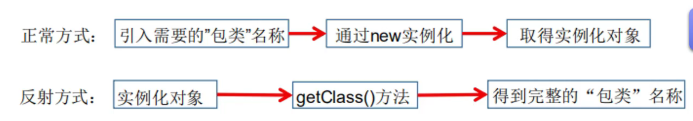

### 2.2 反射功能

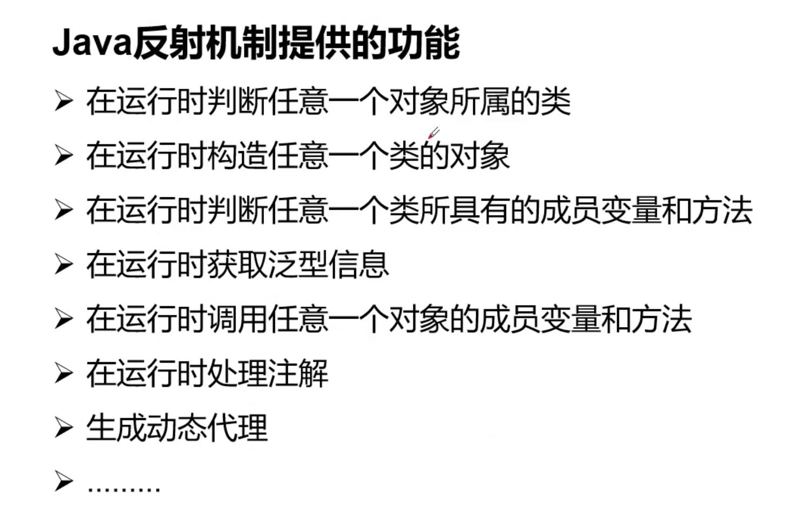

### 2.3 反射优缺点

* 优点：实现动态创建对象和编译，具有很大的灵活性
* 缺点：对性能有影响。使用反射机制基本上是一种解释操作。我们可以告诉JVM我们要做什么，然后JVM帮我们完成，但是这样一般要比直接执行相同的操作要慢一些。

测试代码：

```java
public class MyTest {
    public static void main(String[] args) throws ClassNotFoundException {
        //通过反射获取类的Class对象
        Class c1 = Class.forName("com.wdy.model.User");
        System.out.println(c1);

        //可以发现这三个对象的hashcode是一样的，这也就说明了一个类的Class对象只有一个
        Class c2 = Class.forName("com.wdy.model.User");
        Class c3 = Class.forName("com.wdy.model.User");
        Class c4 = Class.forName("com.wdy.model.User");
        System.out.println(c2.hashCode());
        System.out.println(c3.hashCode());
        System.out.println(c4.hashCode());
    }
}
```

### 2.4 创建Class对象的方式

1. **Class类是一个描述类的类**

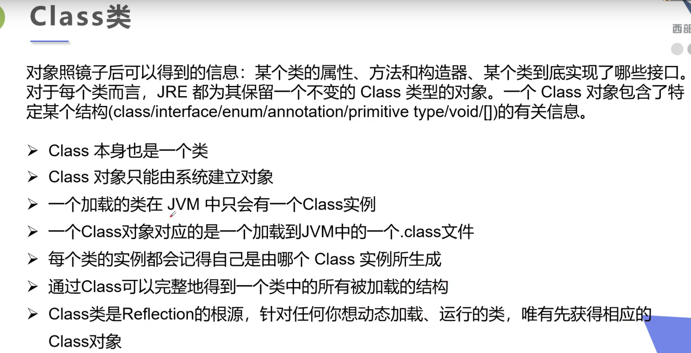

2. **常用方法**

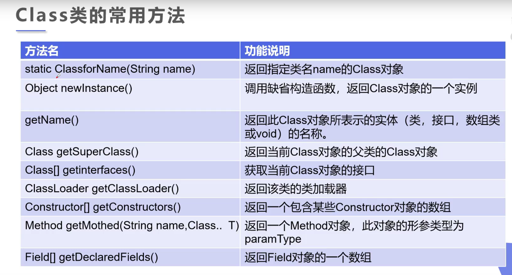

3. **获取Class实例的方法**

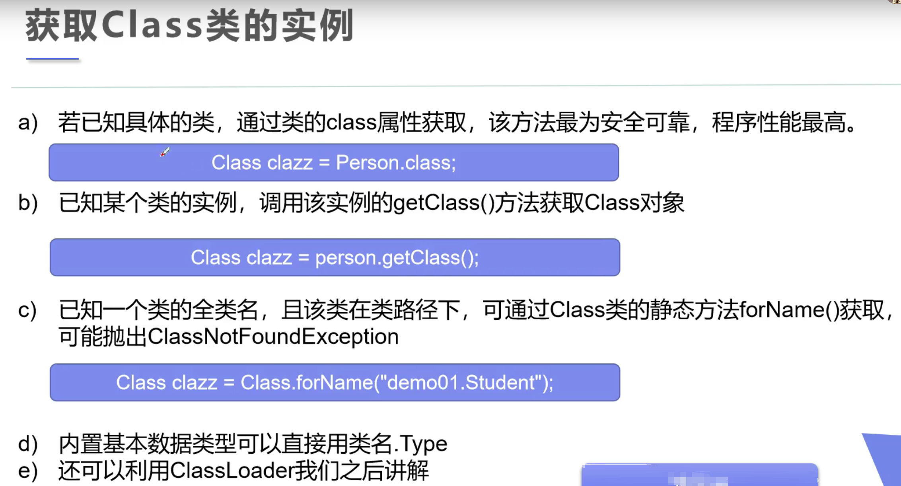

```java
@Test
public void test() throws ClassNotFoundException {
    Person person = new Teacher();
    System.out.println(person.name);

    //方式一,通过对象获得
    Class c1 = person.getClass();
    System.out.println(c1.hashCode());

    //方式二
    Class c2 = Teacher.class;
    System.out.println(c2.hashCode());

    //方式三
    Class c3 = Class.forName("com.wdy.getClasss.Teacher");
    System.out.println(c3.hashCode());

    //方式四，基本内置类型的包装类都有一个TYPE属性
    Class c4 = Integer.TYPE;
    System.out.println(c4.hashCode());
    System.out.println(c4);

    //获取父类的类型
    Class c5 = c1.getSuperclass();
    System.out.println(c5);

    //一个注意事项,这里可以发现只要数组的元素类型和维度是一样的，就是同一个Class对象
    int[] a = new int[10];
    int[] b = new int[100];
    System.out.println(a.getClass().hashCode());
    System.out.println(b.getClass().hashCode());
}
```

4. **哪些类可以有Class对象**

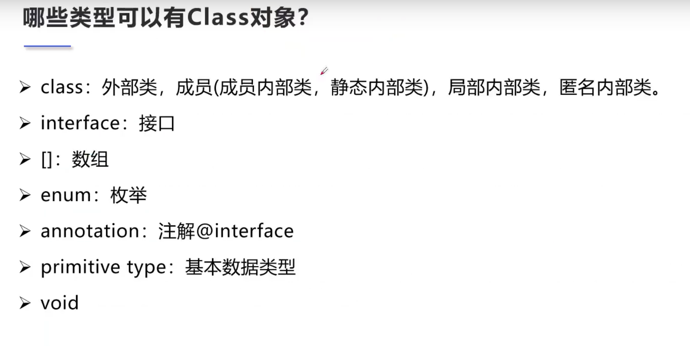

### 2.5 Java内存分析

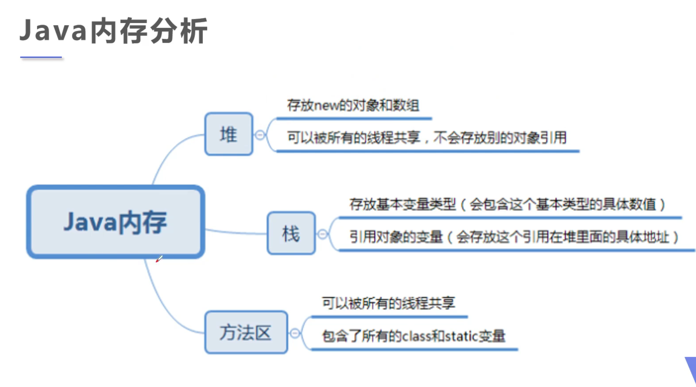

1. 类加载过程

   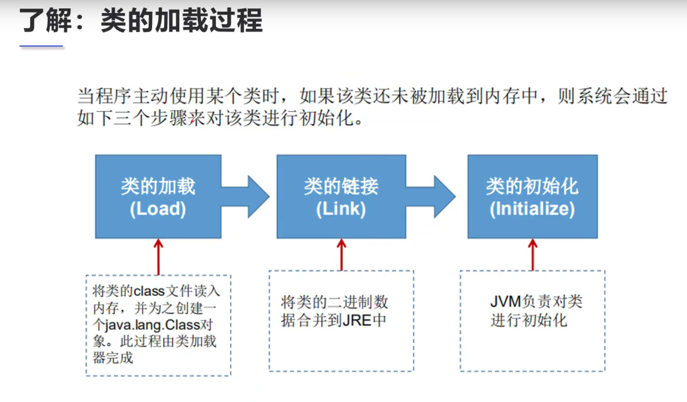

2. 类加载过程详解

   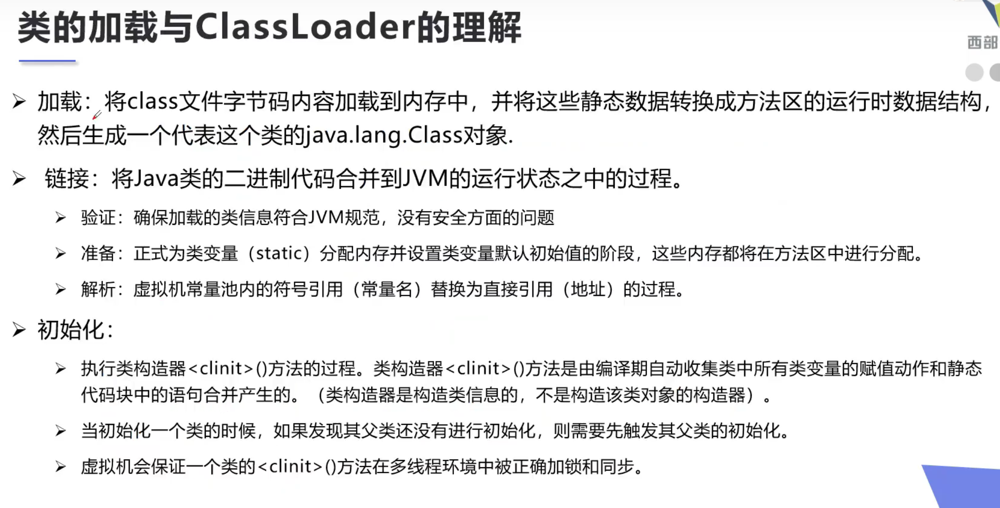

3. 什么时候会发生类的初始化

   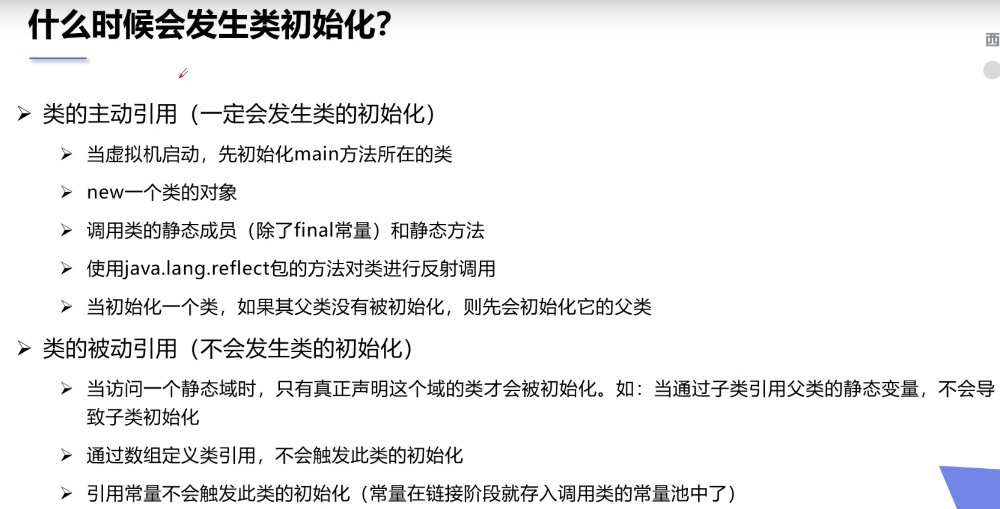

```java
package com.wdy.classinit;

public class ClassInit {
    static {
        System.out.println("main 类加载");
    }

    public static void main(String[] args) throws ClassNotFoundException {
        //类初始化的几种情况
//        new Son();  //会先初始化父类
//        System.out.println(Son.m);
//        Class.forName("com.wdy.classinit.Son");

        //类不会初始化的几种情况
//        System.out.println(Son.b);  //不会初始化Son类
//        Son[] sons = new Son[10];
//        System.out.println(Son.n);
    }
}


class Father{
    static int b = 2;
    static {
        System.out.println("父类加载");
    }
}


class Son extends Father{
    static int m = 1;
    final static int n = 10;
    static {
        System.out.println("子类加载");
    }
}
```

4. 类加载器

   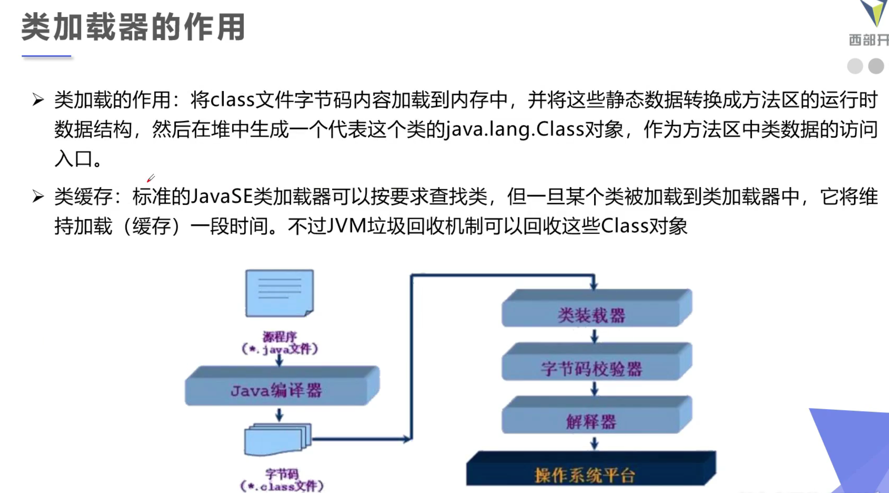

   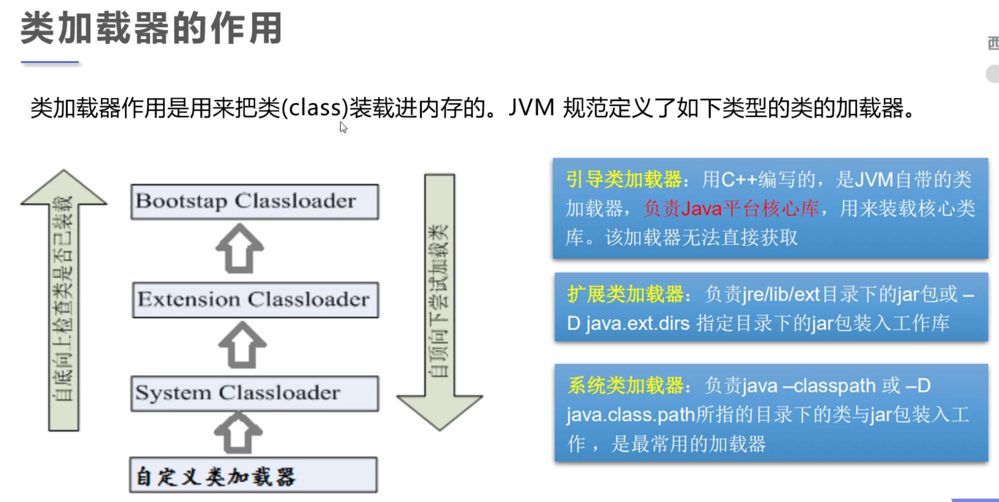

```java
package com.wdy.classloader;


import com.sun.scenario.effect.impl.sw.sse.SSEBlend_SRC_OUTPeer;

public class ClassLoaderUse {
    public static void main(String[] args) throws ClassNotFoundException {
        //获取系统类加载器
        ClassLoader loader1 = ClassLoader.getSystemClassLoader();
        System.out.println(loader1);
        //获取系统类加载器的父类加载器，也就是扩展类加载器
        System.out.println(loader1.getParent());
        //获取扩展类加载器的父类加载器，也就是根加载器,但是是获取不到的
        System.out.println(loader1.getParent().getParent());


        /**
         * 查看某个类是由哪种类加载器加载的
         */
        System.out.println(Class.forName("com.wdy.classloader.ClassLoaderUse").getClassLoader());
        System.out.println(Class.forName("java.lang.Object").getClassLoader());


        //如何获取系统类加载器可以加载的路径
        System.out.println(System.getProperty("java.class.path"));

    }
}
```

**在类的加载中，还有一个双亲委派机制，这个机制的目的是检测安全性。假如你定义了一个类，这个类的全限定类名和jdk自带的冲突了，这个机制可以实现自定义的这个类无效，代码运行时还是使用的是jdk自带的类**

### 2.6 获取类的运行时结构

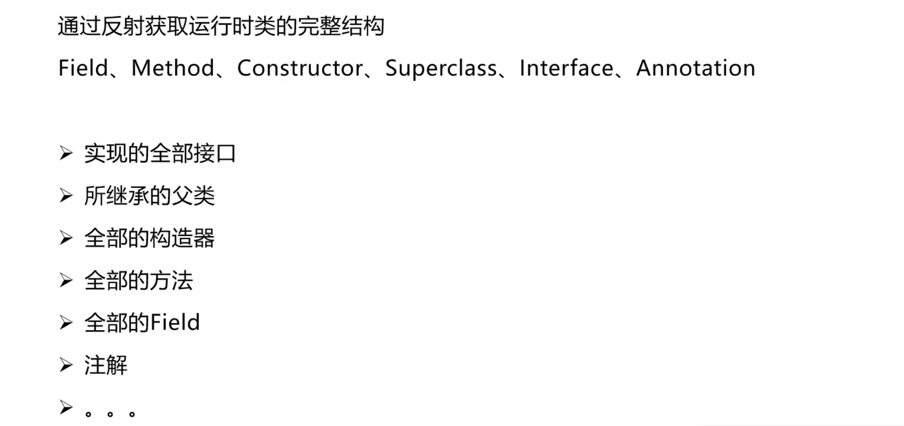

```java
package com.wdy.getclassstructure;

public class ClassStructure {
    public static void main(String[] args) throws ClassNotFoundException, NoSuchFieldException, NoSuchMethodException {
        Class c1 = Class.forName("com.wdy.model.User");
        //获取类的全限定类名
        System.out.println(c1.getName());
        //只获取类名
        System.out.println(c1.getSimpleName());

        //获取类public的属性
        System.out.println(c1.getFields());
        //获取类的所有属性
        System.out.println(c1.getDeclaredFields());
        //获取类的指定属性,只能获取到Public属性
        System.out.println(c1.getField("age"));

        /**
         * 获取类的方法
         */
        //获取本类和父类的public方法
        System.out.println(c1.getFields());
        //只获取本类的所有方法
        System.out.println(c1.getDeclaredFields());
        //获取类的指定方法,只能获取到Public属性
        System.out.println(c1.getMethod("setName", String.class));
        System.out.println(c1.getMethod("getName", null));


        //获取构造器
        System.out.println(c1.getConstructors());
        System.out.println(c1.getDeclaredConstructors());
        System.out.println(c1.getConstructor(String.class, int.class));
    }
}
```

### 2.7 使用反射动态操作对象

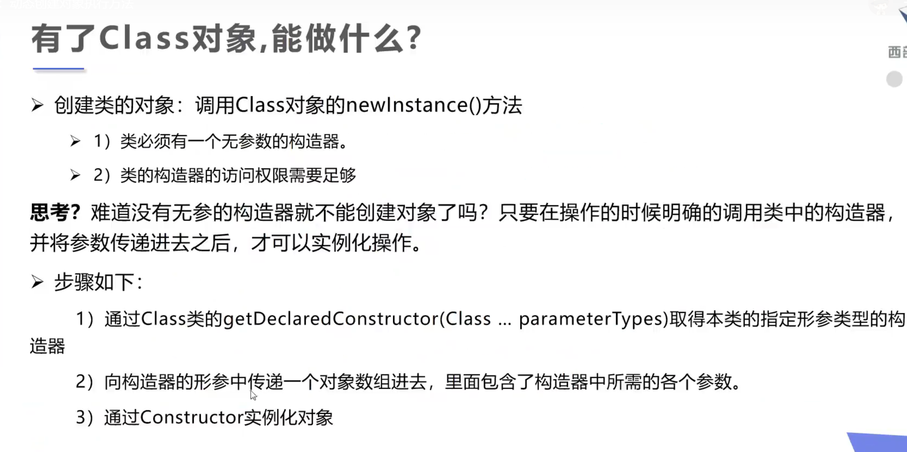

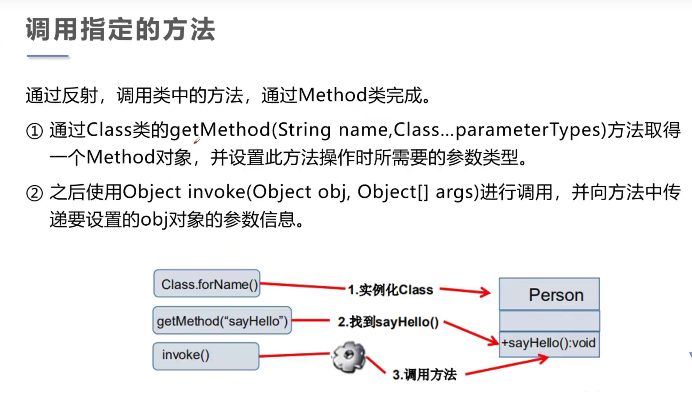

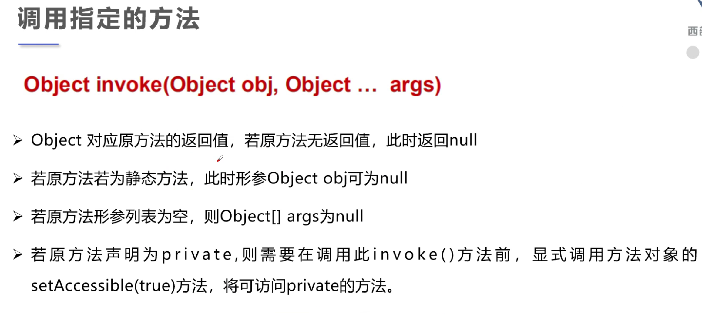

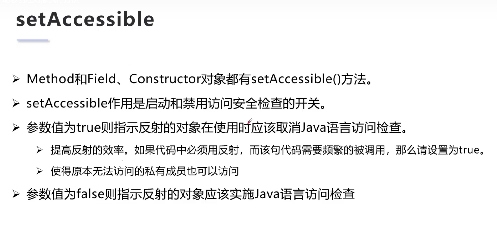

测试代码

```java
public class DynamicCreateObject {
    public static void main(String[] args) throws ClassNotFoundException, IllegalAccessException, InstantiationException, NoSuchMethodException, InvocationTargetException, NoSuchFieldException {
        Class c = Class.forName("com.wdy.model.User");
        //本质上是调用了类的无参构造函数
        User u = (User) c.newInstance();
        System.out.println(u.toString());

        //通过反射指定构造器构造对象
        Constructor constructor = c.getConstructor(String.class, int.class);
        User u2 = (User) constructor.newInstance("wdy", 24);
        System.out.println(u2.toString());

        //通过反射调用某个方法
        Method setName = c.getMethod("setName", String.class);
        //invoke是激活(调用)的意思，第一个参数是一个对象，也就是执行哪个对象的这个方法,第二个参数是方法的参数.
        setName.invoke(u, "wdy");
        System.out.println(u.toString());

        //反射操作属性
        Field field = c.getDeclaredField("name");
        //在这里由于name属性是私有的，我们不能直接操作，所以要关闭权限安全检测field.setAccessible(true)，方法的设置一样
        field.setAccessible(true);
        field.set(u, "hotrockit");
        System.out.println(u.toString());

    }
}
```

### 2.8 反射的性能

测试代码

```java
public class Performance {
    //普通方法
    public static void test01() {
        long start = System.currentTimeMillis();
        User u = new User();
        int i;
        for (i = 0; i < 1000000000; i++) {
            u.getAge();
        }
        long end = System.currentTimeMillis();
        System.out.println("普通耗时"+(end-start));
    }

    //反射关闭权限检测
    public static void test02() throws NoSuchMethodException, InvocationTargetException, IllegalAccessException {
        long start = System.currentTimeMillis();
        User u = new User();
        Method method = u.getClass().getMethod("getAge", null);
        method.setAccessible(true);
        int i;
        for (i = 0; i < 1000000000; i++) {
            method.invoke(u, null);
        }
        long end = System.currentTimeMillis();
        System.out.println("普通耗时"+(end-start));
    }

    //反射使用权限检测
    public static void test03() throws NoSuchMethodException, InvocationTargetException, IllegalAccessException {
        long start = System.currentTimeMillis();
        User u = new User();
        Method method = u.getClass().getMethod("getAge", null);
        method.setAccessible(false);
        int i;
        for (i = 0; i < 1000000000; i++) {
            method.invoke(u, null);
        }
        long end = System.currentTimeMillis();
        System.out.println("普通耗时"+(end-start));
    }

    public static void main(String[] args) throws NoSuchMethodException, IllegalAccessException, InvocationTargetException {
        test01();
        test02();
        test03();
    }
}
```

### 2.9 反射操作泛型(Generic)

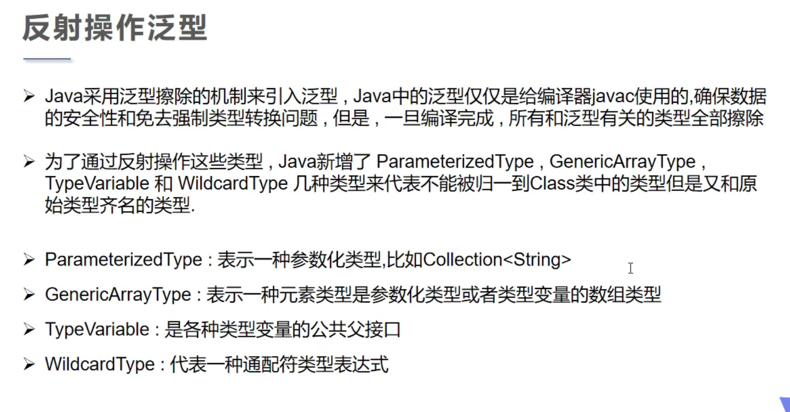

测试代码

```java
public class ReflectionGeneric {
    public void test01(Map<String, User> map, List<User> list) {
        System.out.println("test01");
    }

    public Map<String, User> test02(){
        System.out.println("test02");
        return null;
    }

    public static void main(String[] args) throws NoSuchMethodException {
        Method method = ReflectionGeneric.class.getMethod("test01", Map.class, List.class);
        Type[] genericParameterTypes = method.getGenericParameterTypes();
        for (Type ge : genericParameterTypes){
            //这里只能获取到方法参数的类型，但是获取不到具体的泛型
            System.out.println(ge);
            //获取具体的泛型
            if (ge instanceof ParameterizedType){
                Type[] actualTypeArguments = ((ParameterizedType) ge).getActualTypeArguments();
                for(Type at : actualTypeArguments){
                    System.out.println(at);
                }
            }
        }
    }
}
```

### 2.10 反射操作注解

```java
public class ReflectionAnnotation {
    public static void main(String[] args) throws ClassNotFoundException, NoSuchFieldException {
        Class c = Class.forName("com.wdy.reflectionannotation.Student");
        //这里只是获得了外层的注解，也就是类的注解
        Annotation[] annotations = c.getAnnotations();
        for (Annotation annotation : annotations){
            System.out.println(annotation);
        }
        //获取注解的value值
        TableStudent tableStudent = (TableStudent)c.getAnnotation(TableStudent.class);
        System.out.println(tableStudent.value());

        //获取属性的注解
        Field field = c.getDeclaredField("name");
        FieldStudent fieldAnnotation = field.getAnnotation(FieldStudent.class);
        System.out.println(fieldAnnotation.columnName());
        System.out.println(fieldAnnotation.type());
        System.out.println(fieldAnnotation.length());
    }
}

@TableStudent("student")
class Student{
    @FieldStudent(columnName = "id", type = "int", length = 10)
    private int id;
    @FieldStudent(columnName = "age", type = "int", length = 3)
    private int age;
    @FieldStudent(columnName = "name", type = "varchar", length = 10)
    private String name;

    public Student(){}

    public Student(int id, int age, String name) {
        this.id = id;
        this.age = age;
        this.name = name;
    }

    public int getId() {
        return id;
    }

    public void setId(int id) {
        this.id = id;
    }

    public int getAge() {
        return age;
    }

    public void setAge(int age) {
        this.age = age;
    }

    public String getName() {
        return name;
    }

    public void setName(String name) {
        this.name = name;
    }

    @Override
    public String toString() {
        return "Student{" +
                "id=" + id +
                ", age=" + age +
                ", name='" + name + '\'' +
                '}';
    }
}

@Target(ElementType.TYPE)
@Retention(RetentionPolicy.RUNTIME)
@interface TableStudent{
    String value();
}
@Target(ElementType.FIELD)
@Retention(RetentionPolicy.RUNTIME)
@interface FieldStudent{
    String columnName();
    String type();
    int length();
}
```

